# 074：HTTP请求（第2部分）📡


在本节课中，我们将学习如何使用Python的Requests库来处理HTTP协议。我们将重点介绍GET请求和POST请求，并通过实例演示如何发送请求、处理响应以及理解请求与响应中的关键组成部分。

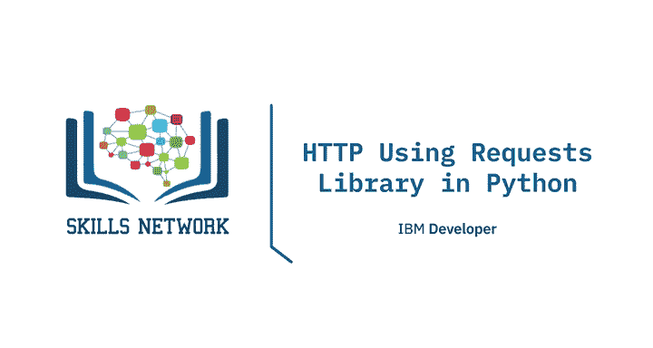

---

## 概述

上一节我们介绍了HTTP协议的基本概念。本节中，我们将深入探讨如何使用Python的Requests库来执行HTTP请求。我们将学习如何发送GET和POST请求，并理解响应对象中的状态码、头部和正文等信息。

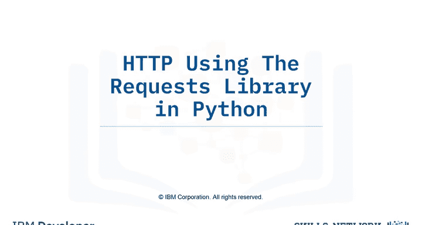

---

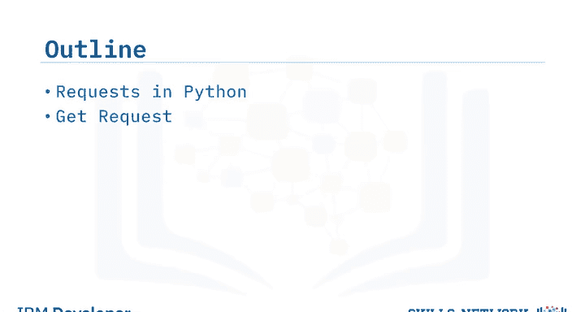

## Python Requests库简介

Requests是Python中一个用于发送HTTP/1.1请求的流行库。它比Python内置的`http.client`和`urllib`等库更易于使用。

我们可以通过以下方式导入该库：

```python
import requests
```

要发送一个GET请求到IBM官网，可以这样做：

```python
r = requests.get('https://www.ibm.com/')
```

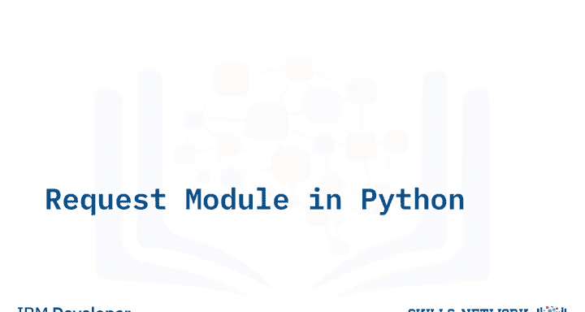

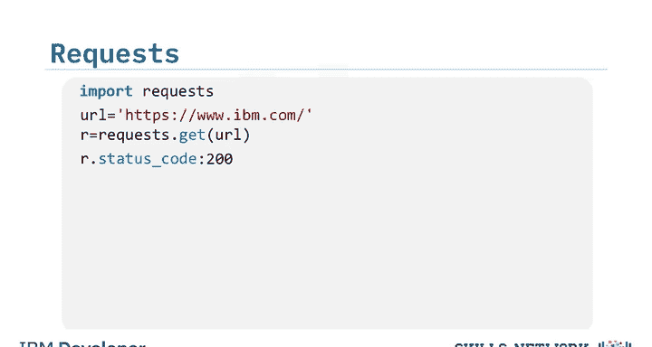

变量`r`是一个响应对象，它包含了请求的相关信息，例如请求的状态。

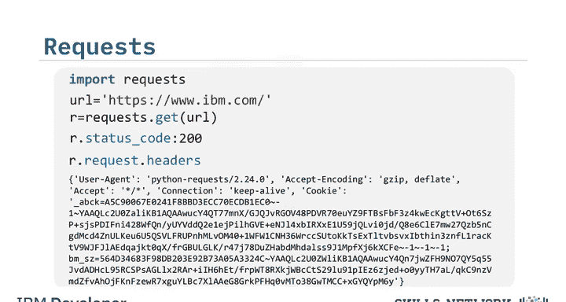

---

## 解析响应对象

我们可以使用`status_code`属性来查看请求的状态码，状态码200表示请求成功。

```python
print(r.status_code)  # 输出: 200
```

以下是响应对象中其他有用的属性和方法：

*   **查看请求头部**：使用`r.request.headers`。
*   **查看请求正文**：对于GET请求，通常没有正文，所以`r.request.body`会返回`None`。
*   **查看响应头部**：使用`r.headers`，它会返回一个包含HTTP响应头部的Python字典。
*   **获取特定头部信息**：例如，使用`r.headers[‘Date’]`获取请求发送的日期，使用`r.headers[‘Content-Type’]`获取响应数据的类型。
*   **检查编码**：使用`r.encoding`。
*   **查看响应正文**：如果`Content-Type`是`text/html`，可以使用`r.text`属性来获取HTML正文内容。

```python
# 查看响应正文的前100个字符
print(r.text[:100])
```

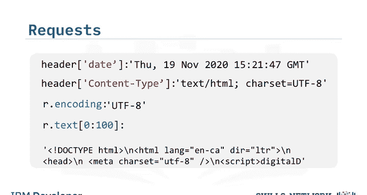

---

## 发送带参数的GET请求

GET方法常用于从API检索数据，我们可以在URL中添加查询字符串来修改查询结果。在实验中，我们将使用`httpbin.org`这个HTTP请求和响应服务。

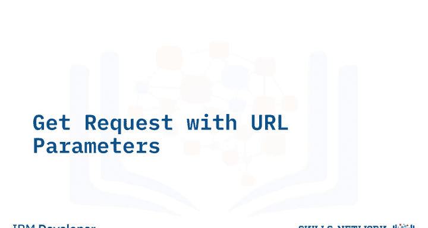

我们向服务器发送GET请求。基础URL加上路径`/get`，表示我们希望执行一个GET操作。

查询字符串是URL的一部分，用于向Web服务器发送额外信息。它以问号`?`开始，后跟一系列参数和值对。

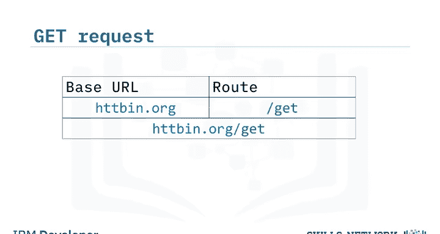

以下是一个查询字符串的示例结构：
`?name=Joseph&id=123`

*   第一个参数名是`name`，值是`Joseph`。
*   第二个参数名是`id`，值是`123`。
*   每个参数名和值之间用等号`=`连接。
*   多组参数之间用`&`符号分隔。

让我们在Python中完成一个示例：

```python
import requests

url = 'https://httpbin.org/get'
payload = {'name': 'Joseph', 'id': '123'}

r = requests.get(url, params=payload)
```

*   我们构建了基础URL，并在末尾附加了`/get`。
*   我们使用字典`payload`来定义查询参数，其中键是参数名，值是参数值。
*   然后，我们将这个字典传递给`get`函数的`params`参数。

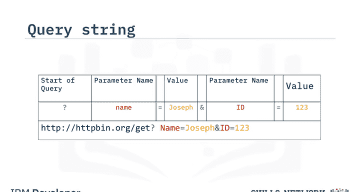

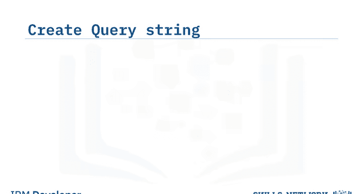

我们可以打印出最终的URL，看到参数已被正确添加：

```python
print(r.url)  # 输出类似: https://httpbin.org/get?name=Joseph&id=123
```

由于信息是通过URL发送的，请求正文`r.request.body`的值为`None`。我们可以查看状态码和响应内容。由于响应内容类型是JSON，我们可以使用`.json()`方法将其解析为Python字典。

```python
print(r.status_code)
data = r.json()
print(data['args'])  # 输出: {'name': 'Joseph', 'id': '123'}
```

---

## 发送POST请求

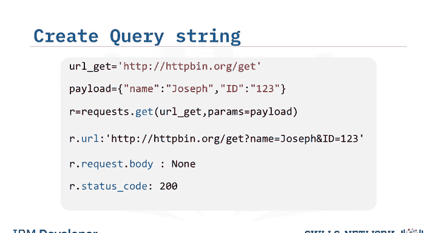

与GET请求类似，POST请求也用于向服务器发送数据。但关键区别在于，POST请求将数据放在请求正文中，而不是URL里。

为了发送POST请求，我们需要将URL的路径改为`/post`。这个端点期望接收数据。

我们使用相同的`payload`字典。要发送POST请求，我们使用`post`函数，并将`payload`字典传递给`data`参数。

```python
import requests

url_post = 'https://httpbin.org/post'
payload = {'name': 'Joseph', 'id': '123'}

r_post = requests.post(url_post, data=payload)
```

---

## 比较GET与POST请求

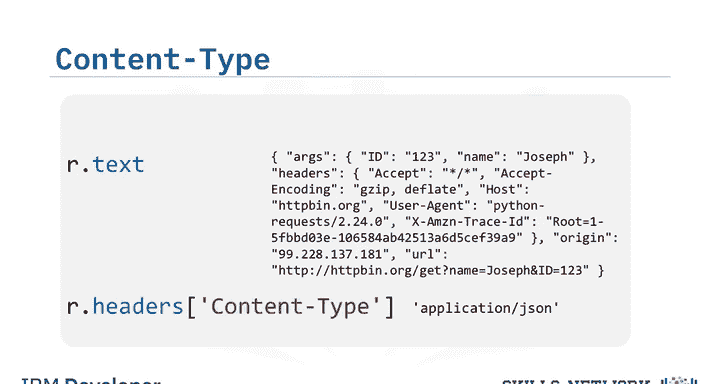

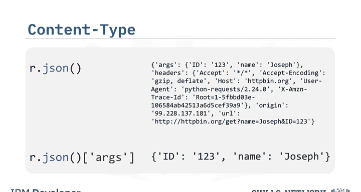

通过比较GET和POST请求的响应对象，我们可以清楚地看到两者的区别：


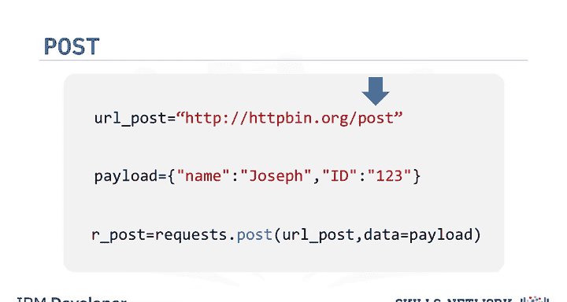

1.  **URL对比**：比较从响应对象中获取的URL属性。
    *   GET请求的URL包含查询字符串：`https://httpbin.org/get?name=Joseph&id=123`
    *   POST请求的URL没有参数：`https://httpbin.org/post`

2.  **请求正文对比**：
    *   GET请求的正文为`None`。
    *   POST请求的正文包含我们发送的数据。

3.  **获取POST请求发送的数据**：在POST请求的JSON响应中，我们可以查看`form`键来获取我们发送的载荷数据。

```python
data_post = r_post.json()
print(data_post['form'])  # 输出: {'name': 'Joseph', 'id': '123'}
```

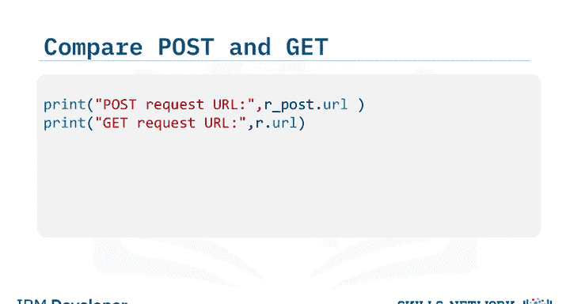

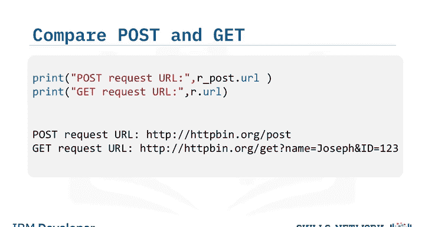

---

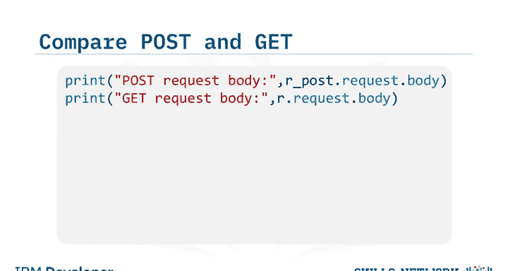

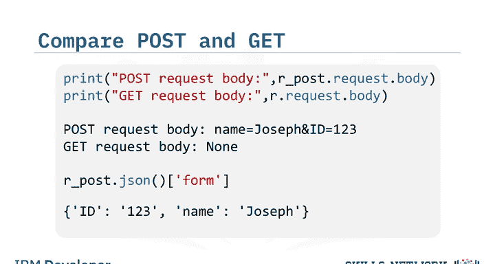

## 总结


本节课中，我们一起学习了如何使用Python的Requests库进行HTTP通信。我们详细介绍了如何发送GET和POST请求，如何添加查询参数，以及如何解析响应对象中的状态码、头部和正文。关键点在于，GET请求通过URL传递参数，而POST请求通过请求正文传递数据。掌握这些基础是进行更高级的API交互和网络编程的重要一步。