# 075：用于网页抓取的HTML 🕸️


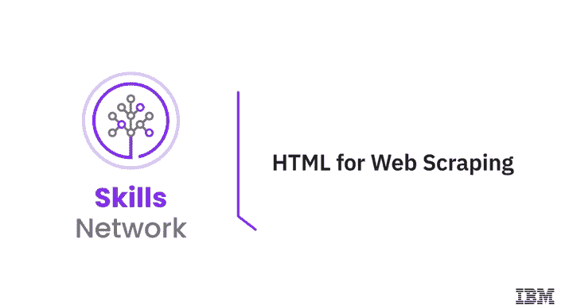

在本节课中，我们将回顾超文本标记语言（HTML），这是进行网页抓取的基础。网页上存在大量有用数据，例如房地产价格和编程问题解决方案。万维网和维基百科是世界信息的宝库。如果你理解了HTML，就可以使用Python来提取这些信息。本节课，你将学习一个基础网页的HTML结构、HTML标签的构成、HTML树状结构，并理解HTML表格。

## HTML基础结构

假设你有一个需求：从一个网页中找出国家篮球联盟球员的姓名和薪水。网页由HTML构成，它包含一系列被尖括号包围的蓝色元素（称为标签）所环绕的文本。这些标签告诉浏览器如何显示内容，而我们需要的数据就在这些文本中。

HTML文档的第一部分包含文档类型声明 `<!DOCTYPE html>`，它声明此文档是一个HTML文档。`<html>` 元素是HTML页面的根元素。`<head>` 元素包含关于HTML页面的元信息。接下来是 `<body>`，这是网页上实际显示的内容，通常也是我们感兴趣的数据所在。

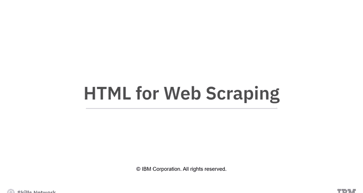

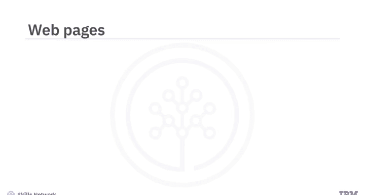

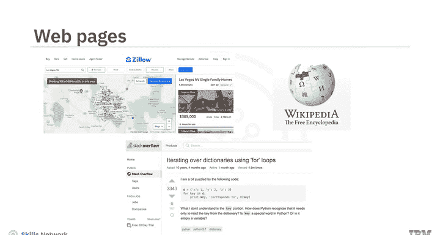

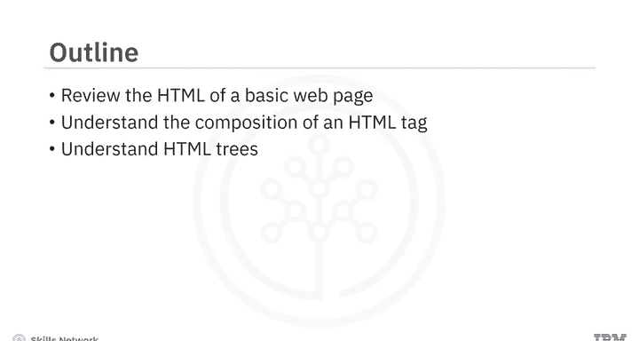

我们看到带有 `<h3>` 标签的元素，这表示三级标题，会使文本变大加粗。这些标签内包含球员的姓名。请注意，数据被包裹在元素中，它以 `<h3>` 开始，以 `</h3>` 结束。此外，还有一个不同的标签 `<p>`，表示段落，其中包含球员的薪水。

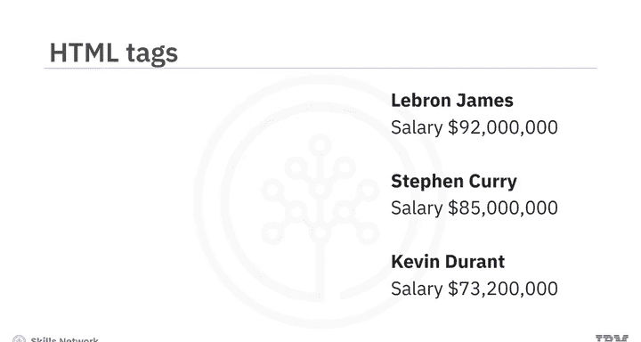

## HTML标签的构成

让我们更仔细地看看HTML标签的构成。以下是一个HTML锚标签的例子：

```html
<a href="https://www.ibm.com">IBM</a>
```

它将显示“IBM”，当你点击它时，会跳转到 `ibm.com`。

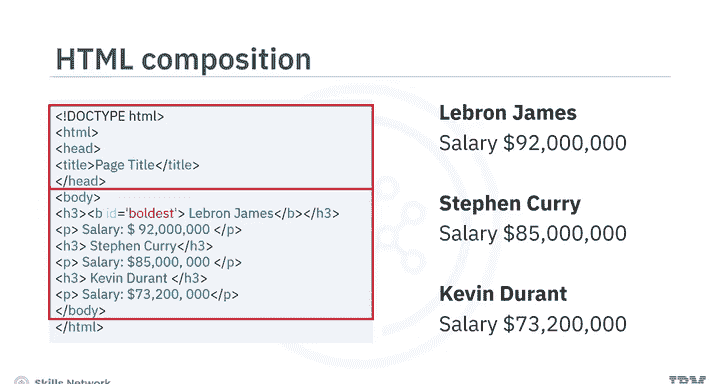

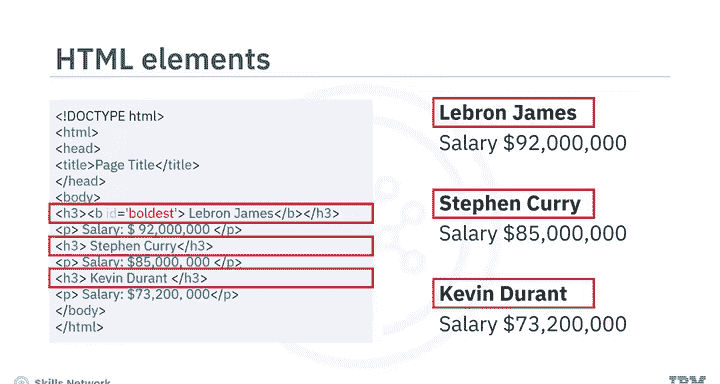

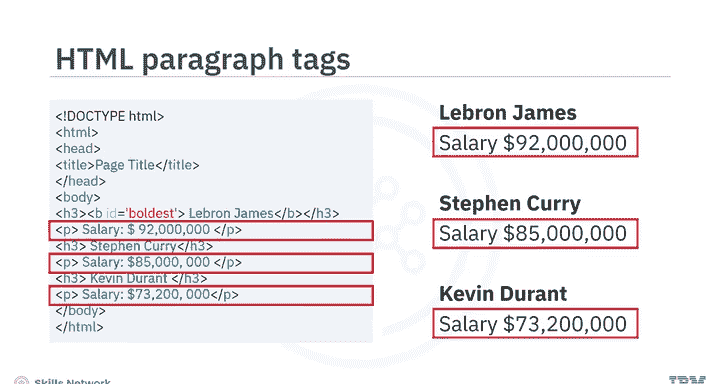

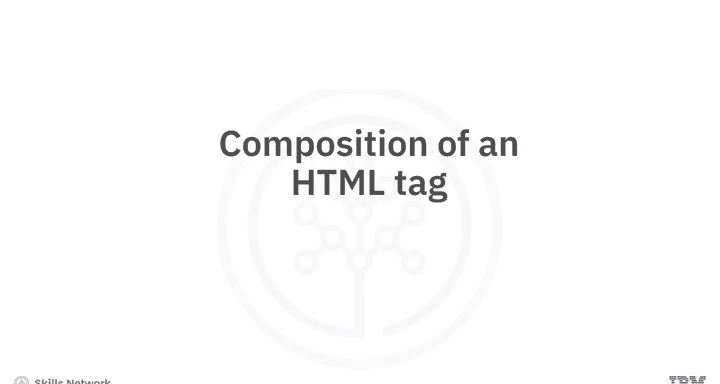

*   **标签名称**：在这个例子中是 `a`。这个标签定义了一个超链接，用于从一个页面链接到另一个页面。将每个标签名称视为Python中的一个类，将每个单独的标签视为一个实例，会很有帮助。
*   **开始标签**：`<a href="https://www.ibm.com">`
*   **结束标签**：`</a>`，在标签名称前有一个斜杠。
*   **内容**：这些标签包含的内容，即网页上显示的部分。本例中是“IBM”。
*   **属性**：由属性名和属性值组成。本例中是 `href="https://www.ibm.com"`，即目标网页的URL。

真实的网页更为复杂。根据你使用的浏览器，你可以选择HTML元素然后点击“检查”，这将使你能够查看HTML代码。网页中还有其他类型的内容，如CSS和JavaScript，本课程将不涉及。

## HTML树状结构

每个HTML文档实际上都可以被称为一个文档树。让我们看一个简单的例子。标签可以包含字符串和其他标签，这些元素就是该标签的子元素。我们可以将其表示为一个家谱，每个嵌套的标签都是树中的一个层级。

例如，`<html>` 标签包含 `<head>` 和 `<body>` 标签。`<head>` 和 `<body>` 标签是 `<html>` 标签的后代。具体来说，它们是 `<html>` 标签的子元素。`<html>` 标签是它们的父元素。`<head>` 和 `<body>` 标签是兄弟元素，因为它们在同一层级。

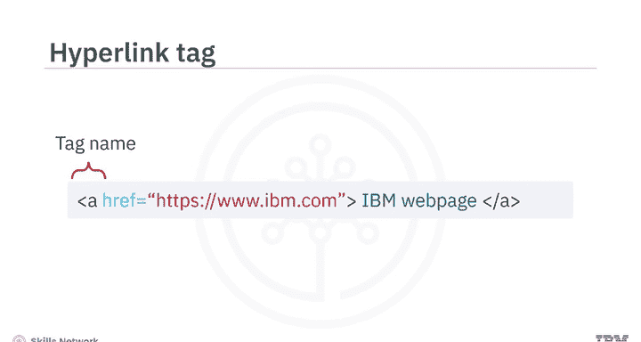

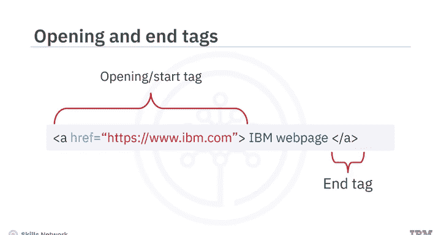

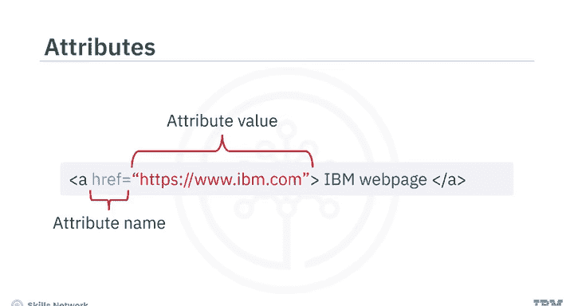

`<title>` 标签是 `<head>` 标签的子元素，其父元素是 `<head>` 标签。`<title>` 标签是 `<html>` 标签的后代，但不是其子元素。标题和段落标签是 `<body>` 标签的子元素，并且由于它们都是 `<body>` 标签的子元素，它们彼此之间也是兄弟元素。`<b>`（加粗）标签是标题标签的子元素。标签的内容也是树的一部分，但画出来可能会很繁琐。

## HTML表格

接下来，让我们回顾HTML表格。要定义一个HTML表格，我们使用 `<table>` 标签。

以下是定义一个简单表格的HTML结构：

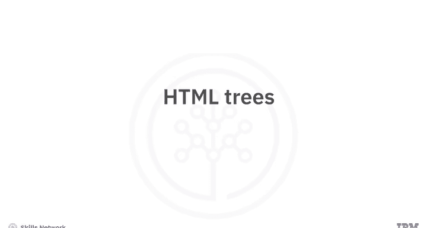

```html
<table>
  <tr>
    <th>表头1</th>
    <th>表头2</th>
  </tr>
  <tr>
    <td>行1， 单元格1</td>
    <td>行1， 单元格2</td>
  </tr>
  <tr>
    <td>行2， 单元格1</td>
    <td>行2， 单元格2</td>
  </tr>
</table>
```

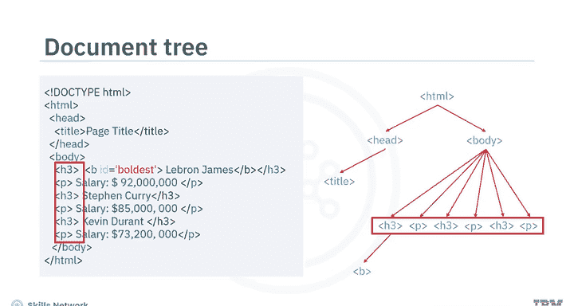

*   **`<table>` 标签**：定义表格。
*   **`<tr>` 标签**：定义表格中的每一行。
*   **`<th>` 标签**：通常用于第一行，定义表头单元格。
*   **`<td>` 标签**：定义表格中的标准数据单元格。

对于第一行第一个单元格，我们有 `<th>` 或 `<td>` 标签及其内容。对于第一行第二个单元格，以此类推。对于第二行，我们有新的 `<tr>` 标签，其内包含该行的 `<td>` 单元格。

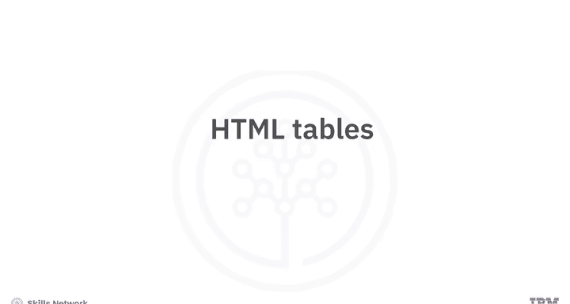

## 总结

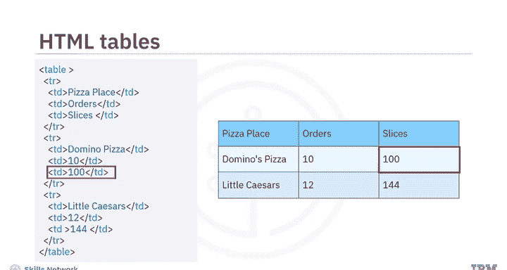

本节课中，我们一起学习了HTML的基础知识，这是进行网页抓取的关键第一步。我们了解了HTML文档的基本结构，包括 `<html>`、`<head>` 和 `<body>` 标签。我们深入探讨了HTML标签的构成，包括标签名、开始/结束标签、内容和属性。我们还学习了如何将HTML文档视为一个树状结构，理解元素之间的父子及兄弟关系。最后，我们回顾了用于组织数据的HTML表格结构。掌握了这些基础知识后，你现在已经具备了使用Python工具从网页中提取所需信息的理论基础。