# 076：网页抓取 🕸️


在本节课中，我们将要学习**网页抓取**。这是一种自动从网站提取信息的技术，可以极大地节省手动收集数据的时间和精力。

## 概述

想象一下，如果你需要分析数百个数据点来找出一个运动队的最佳球员。你会手动从不同网站复制粘贴信息到电子表格吗？这可能需要数小时，甚至因为任务过于繁重而放弃。**网页抓取**正是解决此类问题的工具。它是一个自动从网站提取信息的过程，通常只需几分钟而非数小时即可完成。

## Beautiful Soup 对象的作用

要开始网页抓取，我们只需要一些Python代码以及两个名为 `requests`  和 `beautifulsoup4` 的模块的帮助。

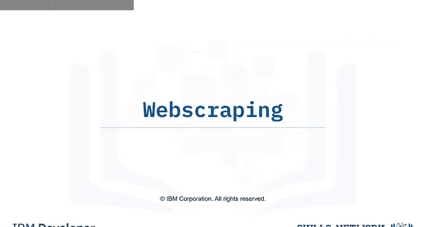

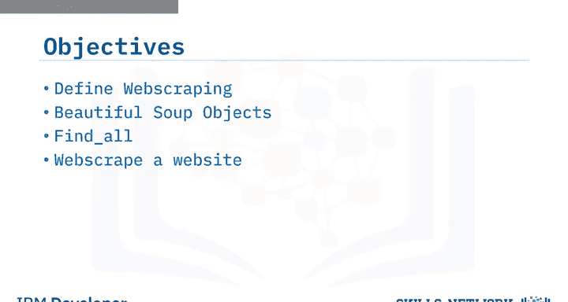

假设你被要求从以下网页中找出国家篮球联盟球员的姓名和薪水。

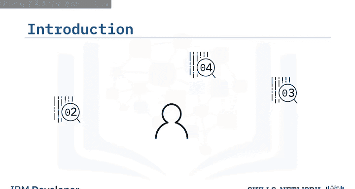

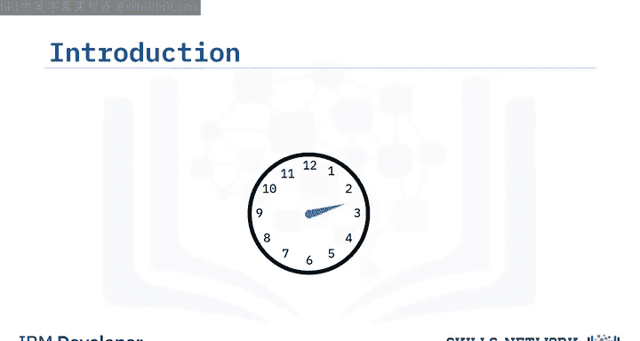

首先，我们导入Beautiful Soup。我们可以将网页HTML作为字符串存储在变量 `html` 中。为了解析文档，我们将其传递给Beautiful Soup的构造函数。这样我们就得到了一个Beautiful Soup对象 `soup`，它以一种嵌套的数据结构来表示文档。

Beautiful Soup将HTML表示为一组树状对象，并提供了用于解析HTML的方法。我们将使用我们创建的 `soup` 对象来回顾这些对象。

**标签对象**对应于原始文档中的一个HTML标签。例如，`title` 标签。考虑 `h3` 标签。如果存在多个具有相同名称的标签，则选择第一个具有该标签的元素。在本例中，第一个 `h3` 标签的内容是“Lebron James”。我们看到这个名字被包裹在粗体属性 `<b>` 中。为了提取它，我们需要使用树状表示法。

## 导航解析树

让我们使用树状表示法。变量 `tag_object` 位于此处。

我们可以通过以下方式访问标签的子节点，或者说沿着分支向下导航：

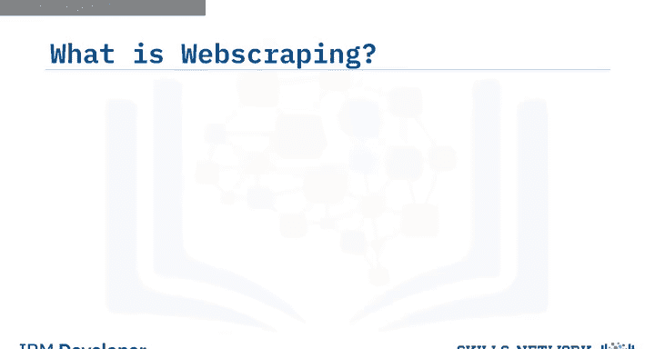

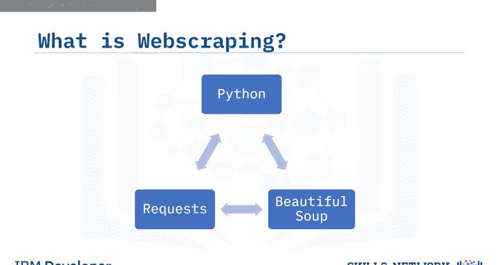

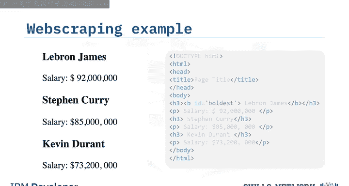

```python
tag_object.contents
```

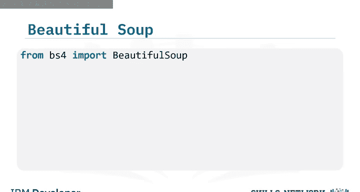

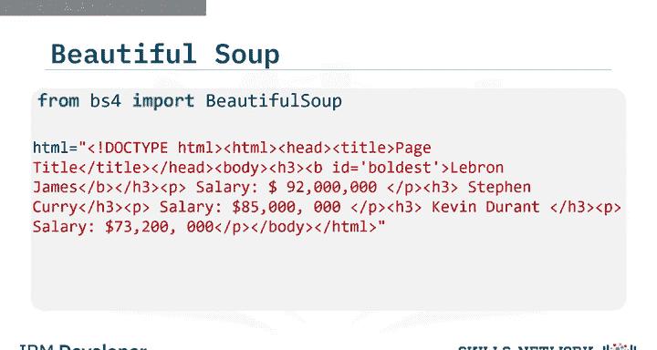

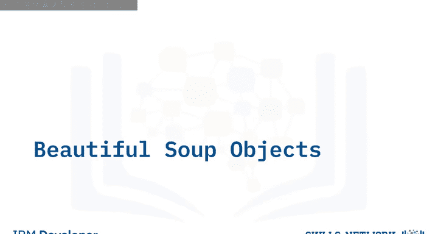

你可以使用 `parent` 属性向上导航树。变量 `tag_child` 位于此处，我们可以访问它的父节点。这就是原始的 `tag_object`。

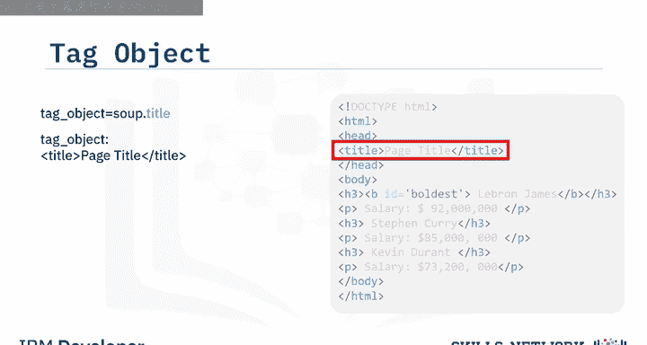

我们还可以找到标签对象的兄弟节点。我们只需使用 `next_sibling` 属性。我们可以找到 `sibling1` 的兄弟节点，同样使用 `next_sibling` 属性。

考虑 `tag_child` 对象。你可以像字典中的键值对一样访问其属性名称和值，如下所示：

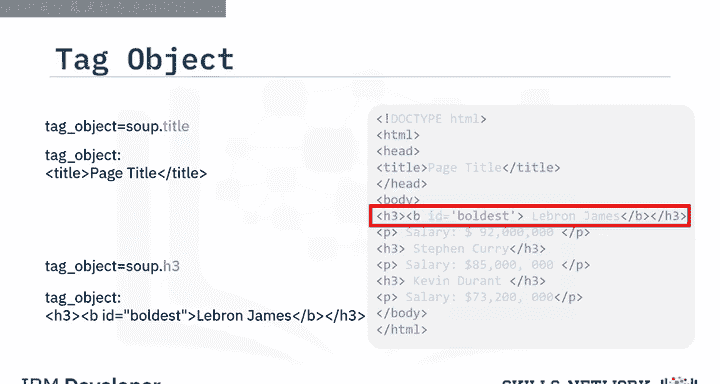

```python
tag_child[‘attribute_name’]
```

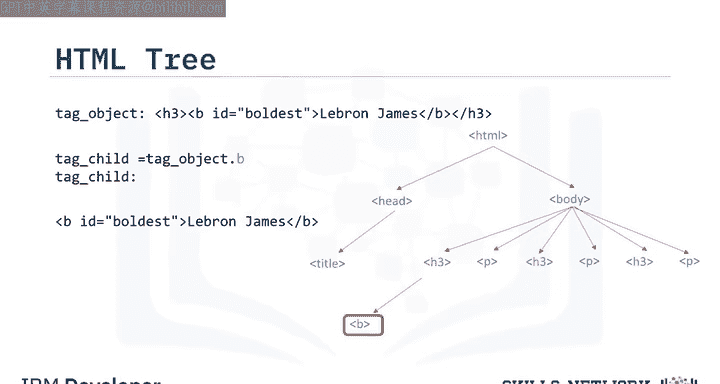

你可以将内容作为可导航字符串返回。这类似于支持Beautiful Soup功能的Python字符串。

## `find_all` 方法

现在，让我们回顾一下 `find_all` 方法。这是一个过滤器。

你可以使用过滤器基于标签的名称、属性、字符串的文本或这些条件的组合进行筛选。

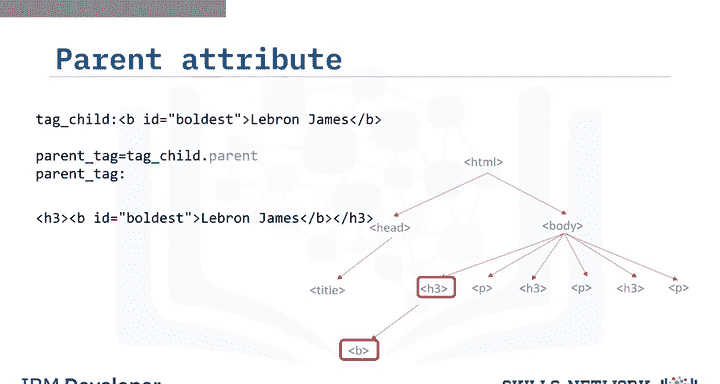

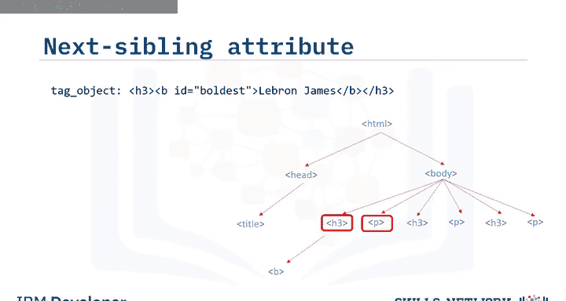

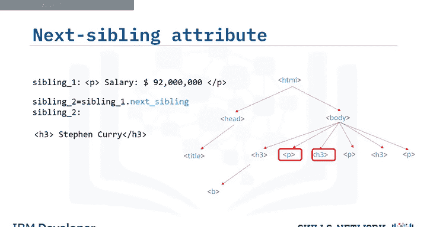

考虑一个披萨店的列表。像之前一样，创建一个Beautiful Soup对象，但这次将其命名为 `table`。

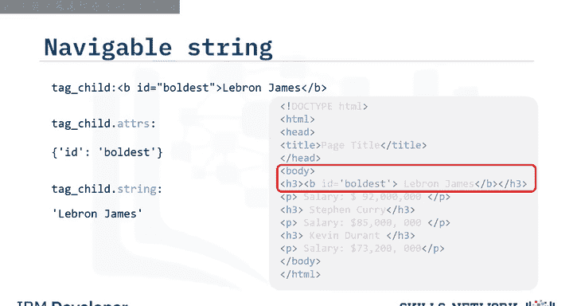

`find_all` 方法会遍历一个标签的所有后代，并检索所有匹配你过滤器的后代。将其应用到带有标签 `tr` 的 `table` 上。结果是一个类似列表的Python可迭代对象。

每个元素都是一个 `tr` 的标签对象。这对应于列表中的每一行，包括表头。

每个元素都是一个标签对象。因此，考虑第一行。例如，我们可以提取第一个表格单元格。

我们也可以遍历每个表格单元格。首先，我们通过变量 `row` 遍历列表 `tr_rows`。每个元素对应于表格中的一行。


我们可以应用 `find_all` 方法来查找所有的表格单元格。然后，我们可以为每一行遍历变量 `cells`。

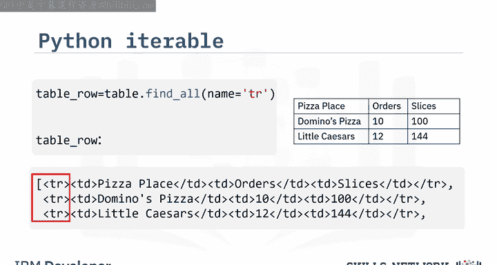

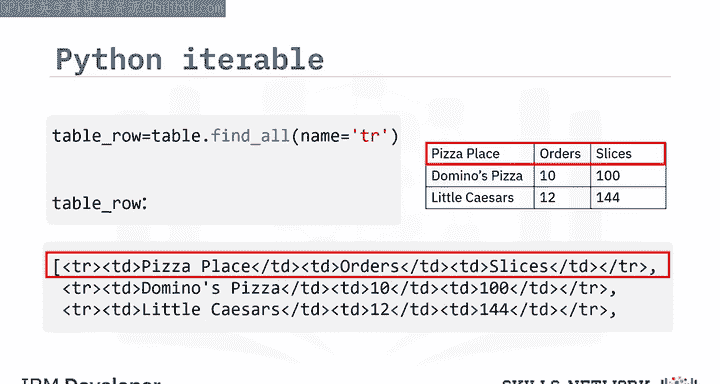

在每次迭代中，变量 `cell` 对应于该特定行表格中的一个元素。我们继续遍历每个元素，并为每一行重复这个过程。

## 应用Beautiful Soup抓取网页

为了抓取一个网页，我们还需要 `requests` 库。

第一步是导入所需的模块。

使用 `requests` 库的 `get` 方法来下载网页。输入是URL。

使用 `text` 属性来获取文本，并将其赋值给变量 `page`。

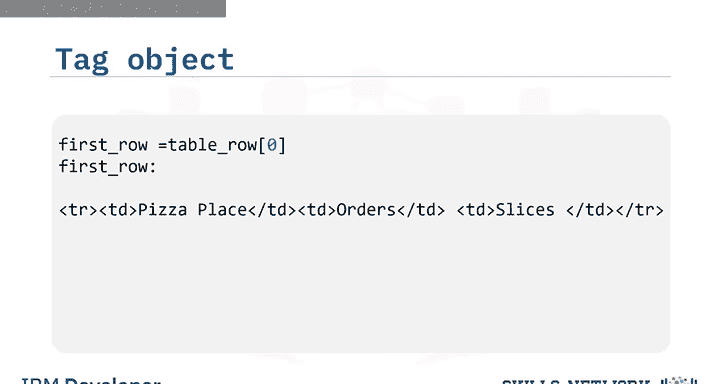

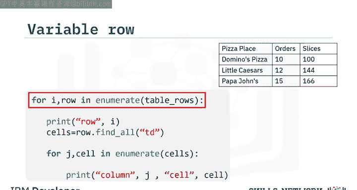

然后，从变量 `page` 创建一个Beautiful Soup对象 `soup`。这将允许你解析HTML页面，现在你就可以开始抓取页面了。

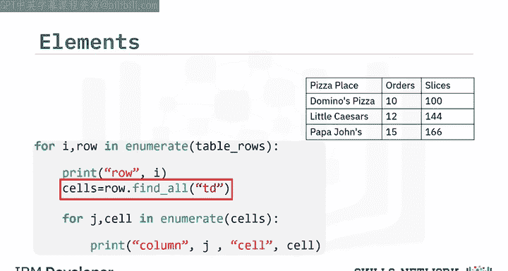

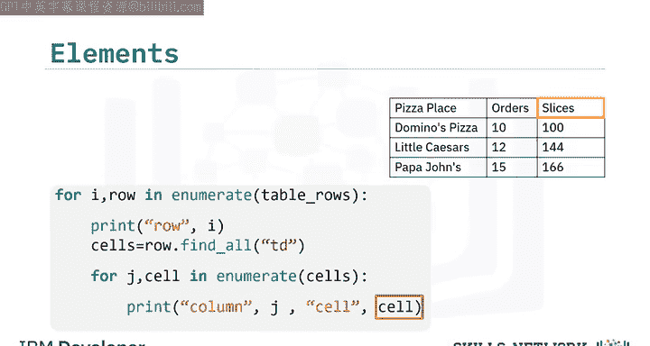

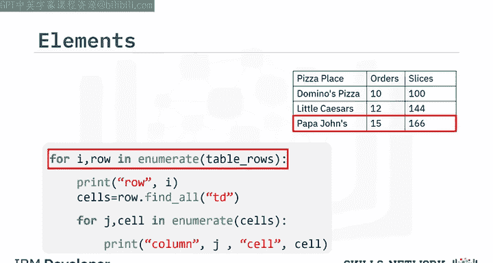

请查看实验部分以获取更多实践内容。

## 总结

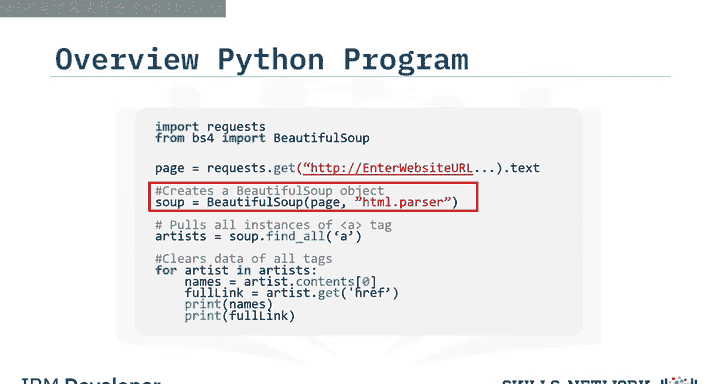

本节课中，我们一起学习了**网页抓取**。我们定义了网页抓取，了解了Beautiful Soup对象的作用，学习了如何应用 `find_all` 方法，并掌握了抓取网站的基本流程。通过结合 `requests` 库获取网页内容，再利用Beautiful Soup解析和提取所需数据，我们可以高效地自动化数据收集任务。