# 077：处理不同文件格式 📁


在本节课中，我们将学习如何使用Python处理多种常见的数据文件格式，包括CSV、JSON和XML。你将了解如何识别这些格式，以及使用哪些Python库来读取和提取其中的数据。

## 认识不同的文件格式 📄


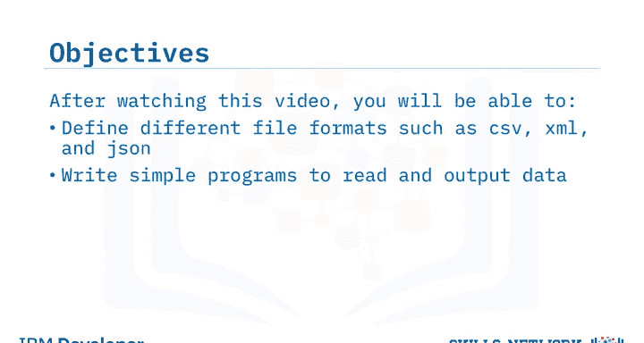

上一节我们介绍了课程目标，本节中我们来看看数据收集过程中会遇到的各种文件格式。

当收集数据以完成数据驱动的分析时，你会遇到许多需要读取的不同文件格式。Python通过其预定义的库可以使这个过程变得更简单。但在探索Python之前，让我们先了解一些常见的文件格式。

观察文件名，你会注意到标题末尾有一个扩展名。这些扩展名让你知道文件的类型以及打开它需要什么工具。例如，如果你看到一个标题如 `file_example.csv`，你就会知道这是一个CSV文件。但这只是不同文件类型的一个例子，还有更多类型，例如JSON或XML。


## 使用Python库读取数据 🛠️

上一节我们认识了不同的文件格式，本节中我们来看看如何利用Python库来访问这些文件中的数据。

当遇到这些不同的文件格式并试图访问其数据时，我们需要利用Python库来简化这个过程。第一个需要熟悉的Python库叫做 `pandas`。通过在代码开头导入这个库，我们就能轻松读取不同类型的文件。

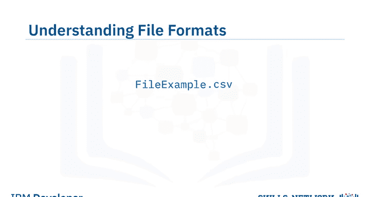

以下是导入pandas库的代码：
```python
import pandas as pd
```

## 读取CSV文件 📊

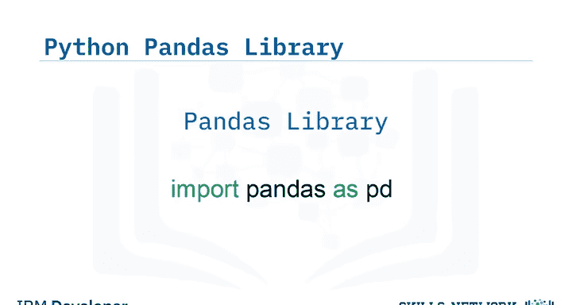

既然我们已经导入了pandas库，让我们用它来读取第一个CSV文件。

在这个例子中，我们遇到了 `file_example.csv` 文件。第一步是将文件分配给一个变量，然后创建另一个变量，借助pandas库来读取文件。我们可以调用 `read_csv` 函数将数据输出到屏幕。

以下是读取CSV文件的代码：
```python
file = ‘file_example.csv’
df = pd.read_csv(file)
print(df)
```

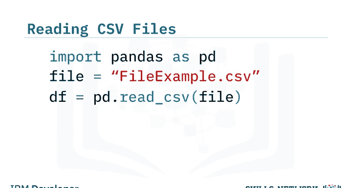

在这个例子中，数据没有表头，所以它将第一行数据添加为表头。由于我们不希望数据的第一行作为表头，让我们看看如何纠正这个问题。

## 整理CSV数据输出 🧹

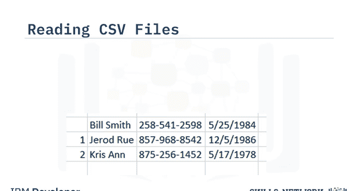

现在我们已经学会了如何读取和输出CSV文件的数据，让我们把它整理得更有序一些。


从上一个例子中，我们能够打印出数据，但因为文件没有表头，它将第一行数据打印成了表头。我们通过添加一个数据框属性轻松解决了这个问题。我们使用变量 `df` 来调用文件，然后通过添加 `columns` 属性来指定列名。通过将这一行添加到我们的程序中，我们可以将数据输出整齐地组织到每列指定的表头下。

以下是添加自定义表头的代码：
```python
df.columns = [‘Column1‘， ‘Column2‘， ‘Column3’] # 根据实际列数调整
print(df)
```

## 处理JSON文件格式 🔤

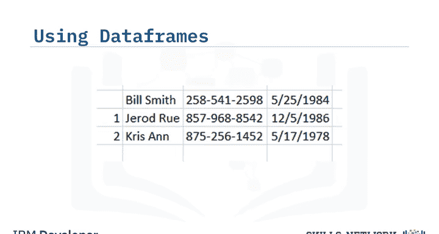


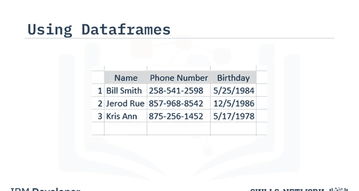

下一个我们将探索的文件格式是JSON文件格式。在这种类型的文件中，文本是以一种独立于语言的数据格式编写的，类似于Python字典。

读取此类文件的第一步是导入 `json` 库。导入json后，我们可以添加一行代码来打开文件，调用json的 `load` 属性开始读取文件，最后，我们可以打印文件。

以下是读取JSON文件的代码：
```python
import json
with open(‘file_example.json‘， ‘r’) as f:
    data = json.load(f)
print(data)
```

## 处理XML文件格式 🏷️

下一个文件格式类型是XML，即可扩展标记语言。虽然pandas库没有直接读取此类文件的属性，但让我们探索如何解析这种类型的文件。

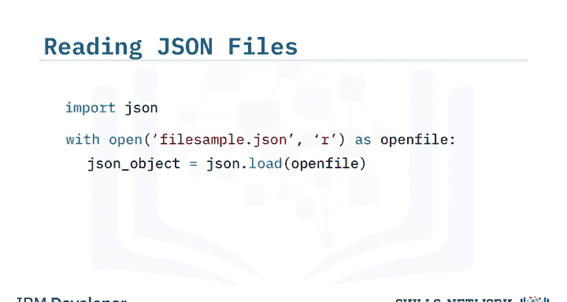

读取此类文件的第一步是导入 `xml.etree.ElementTree`。导入这个库后，我们可以使用 `ElementTree` 属性来解析XML文件。然后我们添加列标题并将它们分配给数据框。

以下是解析XML文件的步骤代码：
```python
import xml.etree.ElementTree as ET
tree = ET.parse(‘file_example.xml’)
root = tree.getroot()
```

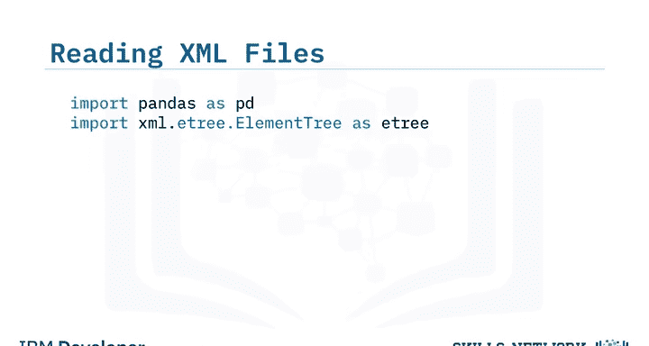

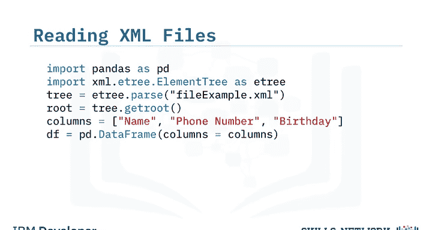

然后创建一个循环来遍历文档以收集必要的数据，并将数据附加到数据框中。


以下是遍历XML并收集数据的示例代码：
```python
data = []
for elem in root.findall(‘./record’): # 根据实际XML结构调整路径
    row = {}
    row[‘Column1’] = elem.find(‘field1’).text # 根据实际字段名调整
    row[‘Column2’] = elem.find(‘field2’).text
    data.append(row)
df = pd.DataFrame(data)
print(df)
```

## 总结 📝


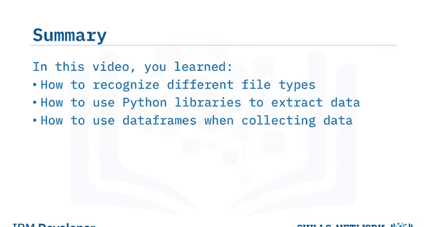


本节课中我们一起学习了如何识别不同的文件类型，如何使用Python库来提取数据，以及在收集数据时如何使用数据框。掌握这些基础技能是进行后续数据分析和人工智能工程的重要一步。