# 001：课程介绍 🎬

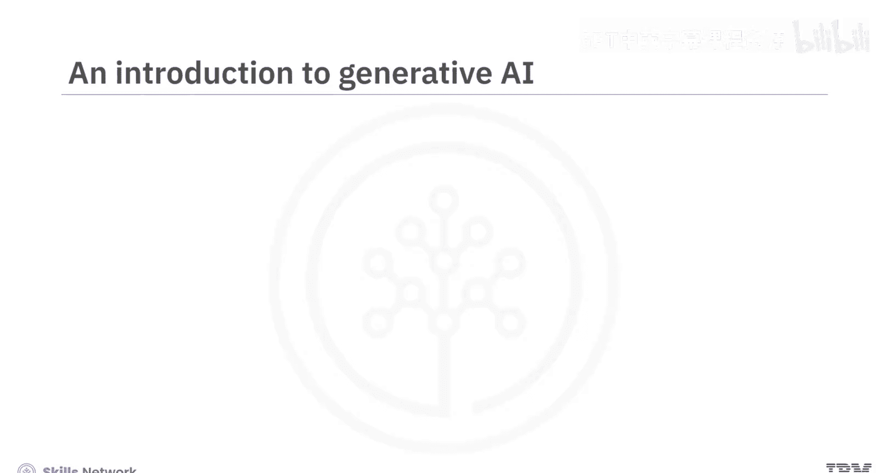

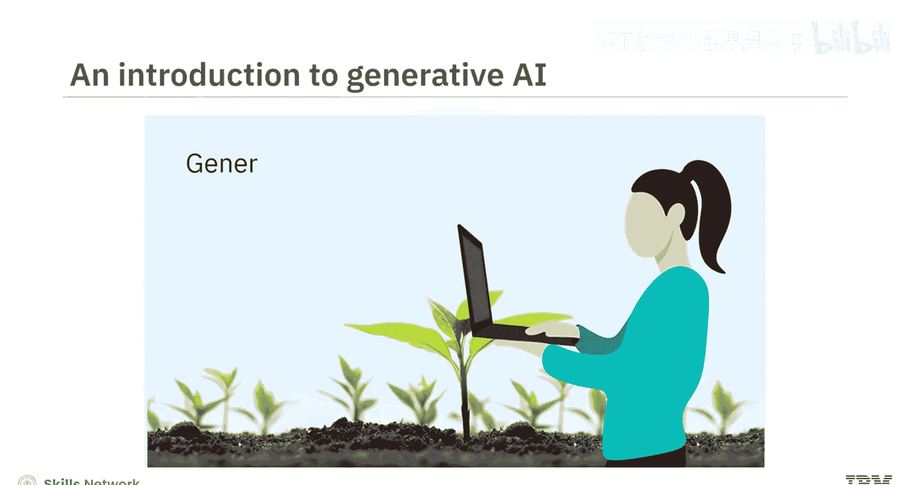

在本节课中，我们将要学习生成式人工智能（AI）的基础介绍，了解其核心概念、应用潜力以及本课程的结构与学习目标。

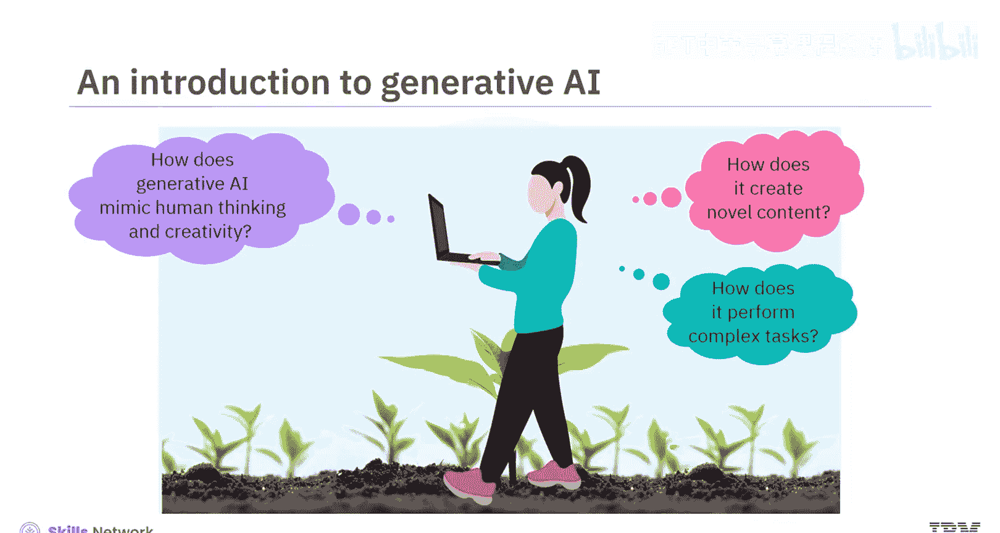

---

想象一个由AI驱动的世界，它能让我们工作更高效、寿命更长、能源更清洁。这个世界已经到来。生成式AI对我们生活方式的各个方面都产生了巨大影响。

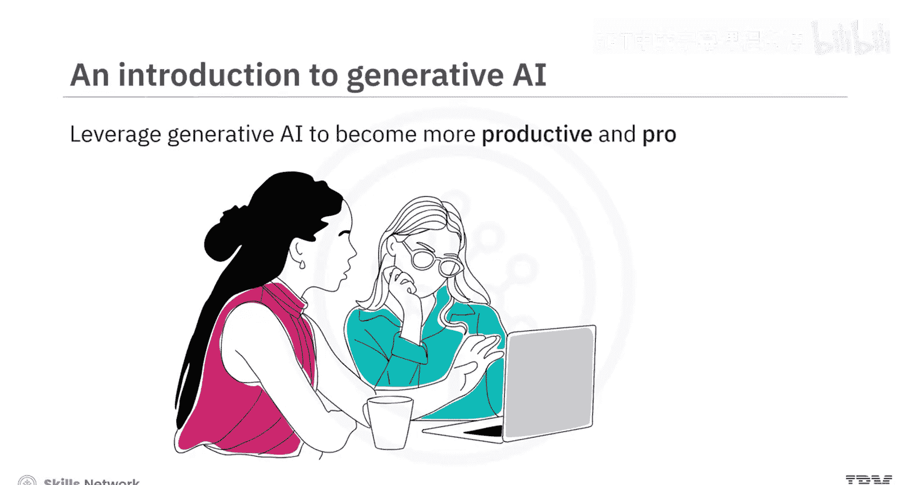

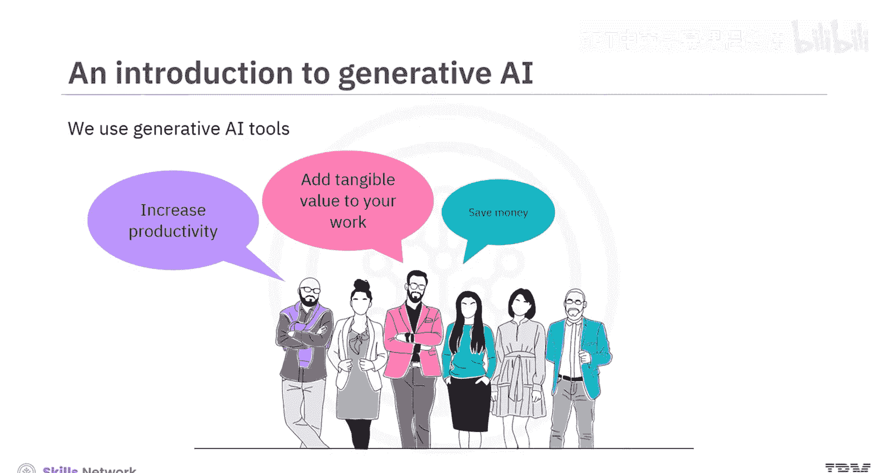

生成式AI模型能够模仿人类的思维和创造力，生成新颖的内容并执行复杂的任务。组织可以利用生成式AI提高生产力和盈利能力。个人可以使用生成式AI工具提升效率、为工作增添实际价值、节省成本并最大化品牌价值。

如果你尚未接触过生成式AI，那么这门课程正适合你。我们欢迎所有对快速发展的生成式AI领域抱有真诚兴趣的专业人士、爱好者、人力资源从业者和学生。无论你的背景或经验如何，这都是一门面向所有人的课程。

本课程旨在让你扎实理解生成式AI的能力、应用以及常见的模型和工具。课程结束时，你将能够描述生成式AI的能力及其在现实世界中的用例，识别不同领域和行业中生成式AI的应用，并探索常见的生成式AI模型和工具。

本课程是一个包含三个模块的聚焦课程。预计每个模块需要花费一到两个小时完成。

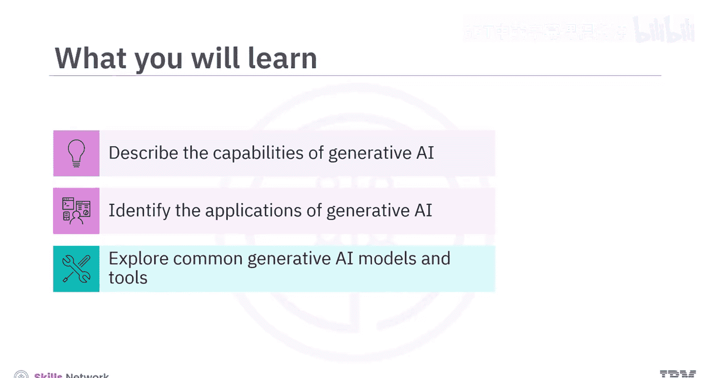

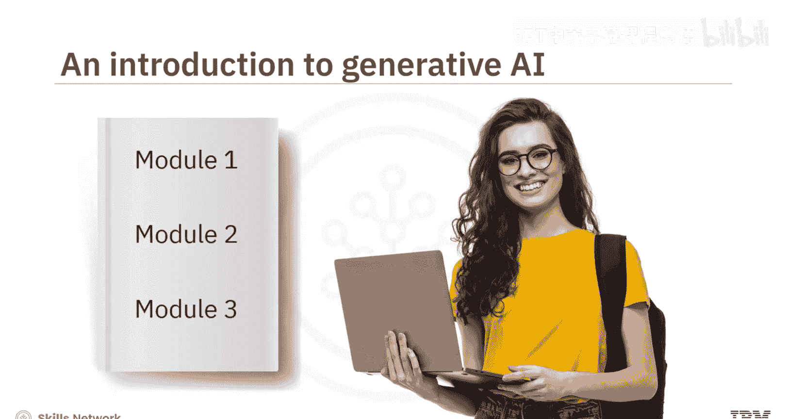

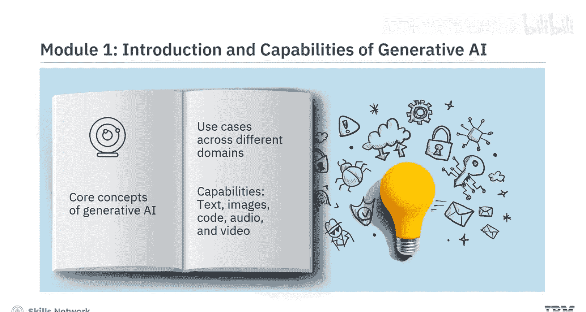

以下是本课程三个模块的主要内容概览：

*   **模块1**：你将学习生成式AI的核心概念，了解其在不同领域的应用案例，并理解其在生成文本、图像、代码、音频和视频方面的能力。
*   **模块2**：你将探索信息技术、娱乐、教育、金融和医疗保健等不同行业如何利用生成式AI。此外，在本模块中，你还将学习用于生成文本、图像、代码、音频和视频的常见模型和工具（如ChatGPT、DALL-E和Synthesia）的能力与特性。
*   **模块3**：你需要参与一个最终项目，并完成一个计分测验来检验你对课程概念的理解。你也可以访问课程术语表，并获得关于后续学习路径的指导。

本课程融合了概念讲解视频和辅助阅读材料。观看所有视频以充分掌握学习材料的潜力。你将体验到动手实验和一个展示生成式AI在多个领域常见用例的最终项目。每节课后都有练习测验帮助你巩固学习。课程结束时，你还需要完成一个计分测验。课程还提供讨论论坛，方便你与课程工作人员联系并与同学互动。最有趣的是，通过专家观点视频，你将听到经验丰富的从业者分享他们对生成式AI不同方面的见解。

当生成式AI正在全球范围内增强个人、组织和社区的创造力表达与专业能力时，这门课程为你提供了一个创造新体验的机会。

---

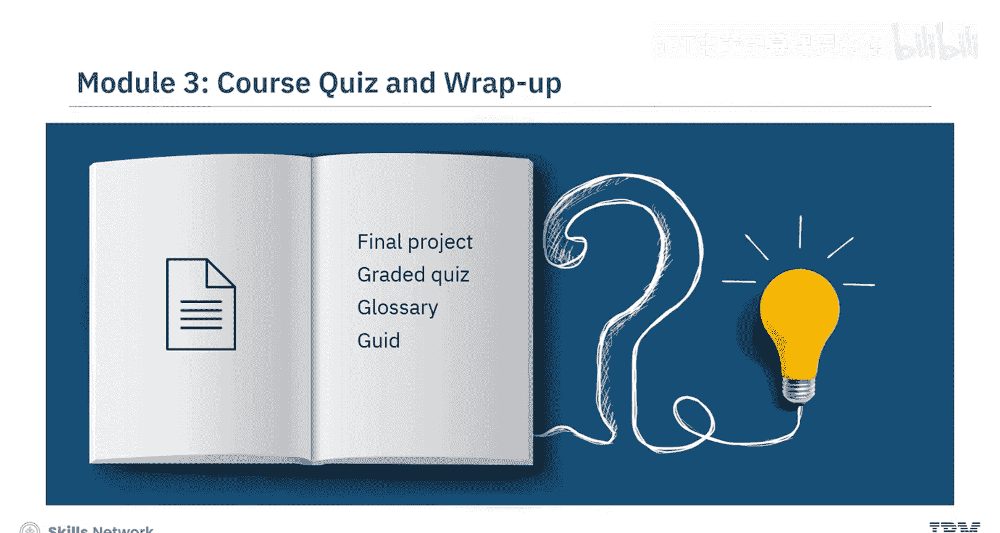

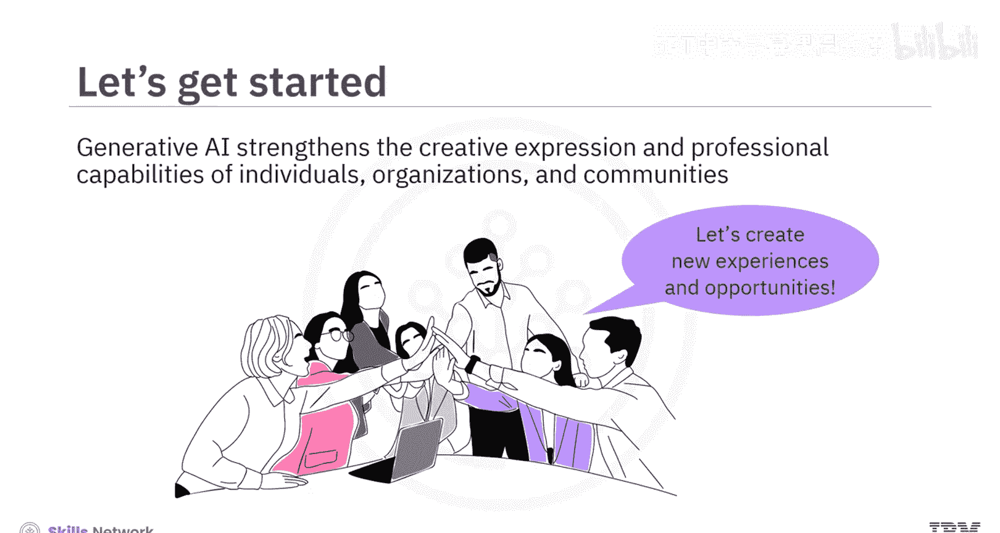

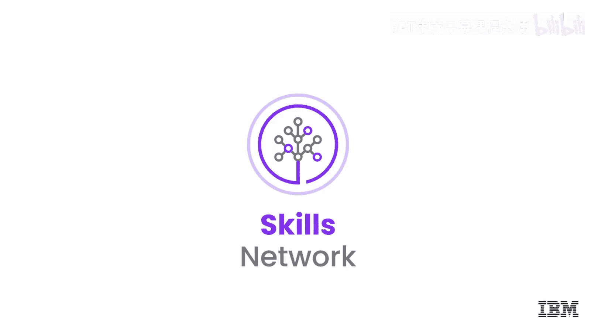

本节课中，我们一起学习了生成式AI的引入及其变革潜力，并概述了本课程的目标、结构和学习方法。我们了解到，生成式AI不仅是一个技术概念，更是提升个人和组织效能的重要工具。