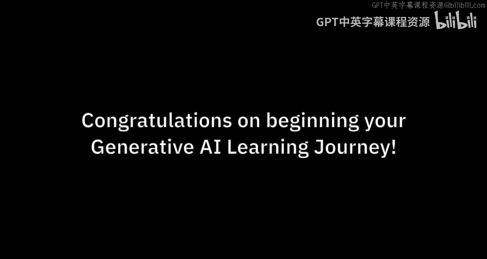
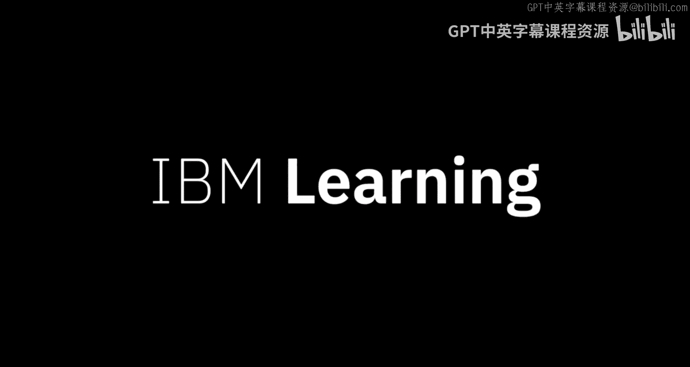

# 002：为何选择IBM学习生成式AI

在本节课中，我们将探讨生成式AI为何成为各行业关注的焦点，以及为何选择IBM作为学习这项关键技能的平台。我们将了解生成式AI的广泛影响、企业对相关技能的需求，以及IBM在负责任地推进AI应用方面的独特优势。

生成式AI是每位领导者都在思考的问题。无论是在企业还是政府机构中，每个组织都在关注它。

随着关注而来的是机遇。各组织正在寻找理解这项技术的人才。

更重要的是，他们需要具备应用这项技术技能的人才。与以往许多流行技术不同，生成式AI几乎触及了每个职业中的每个角色。

生成式AI技能预计将变得非常重要，不仅对计算机科学家如此，对每个人都是如此。这些技能将变得像文字处理、电子表格甚至基本商业素养一样必不可少。因此，这些课程项目旨在让“每个人都掌握生成式AI”。

目前，人们对AI产生了许多新的兴趣。企业正在超越消费级AI的范畴进行探索。聊天机器人界面是展示生成式AI潜力的绝佳方式。

然而，现实生活中的用例是将生成式AI嵌入到现有流程中，使其成为几乎每个业务工作流程不可或缺的一部分。IBM很自豪能够帮助企业将生成式AI整合到其运营中。

作为这些课程项目的一部分，你将获得的技能应该有助于你的职业发展，并能立即应用到你的工作中。

企业对生成式AI的潜力感到兴奋，但同时也对其潜在风险感到担忧。这项使命至关重要，不容有失。

这些课程项目将为你提供处理AI伦理问题的技能，这些技能基于一种负责任的方法，这种方法真正始于IBM。

---

本节课中，我们一起学习了生成式AI的普遍重要性及其对各行各业的影响。我们了解到，掌握生成式AI技能正变得像使用办公软件一样基础，而IBM的课程不仅能提供实用的技术应用知识，还特别强调以负责任和合乎伦理的方式使用AI，这正是企业在采用新技术时所寻求的关键保障。选择IBM学习，意味着同时获得前沿技术能力和可信赖的实施框架。