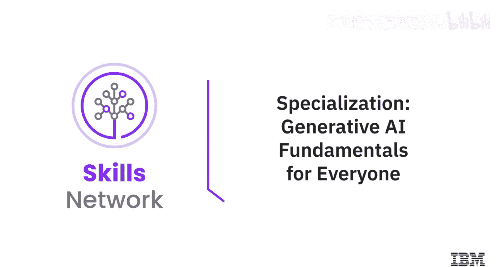
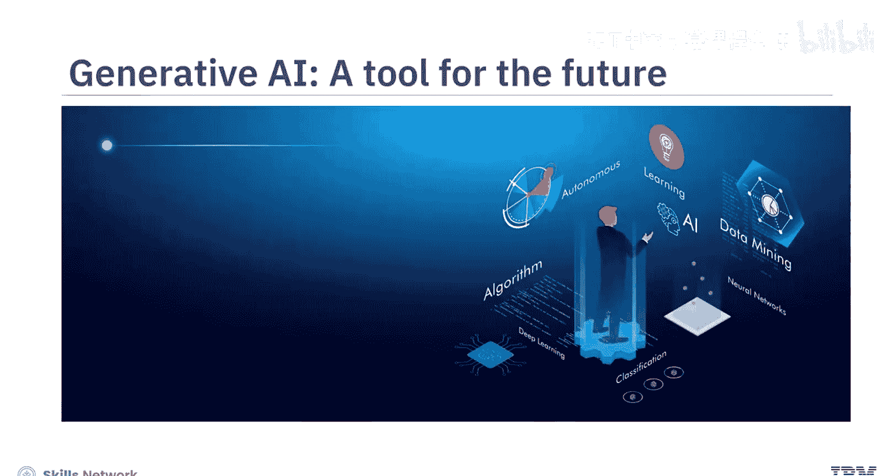
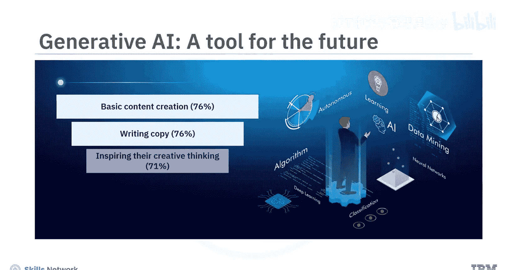
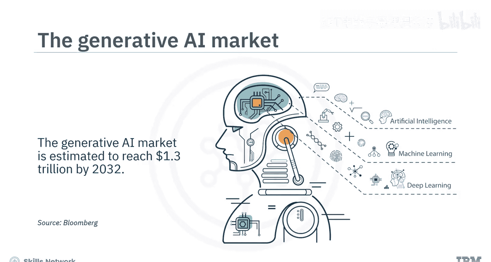
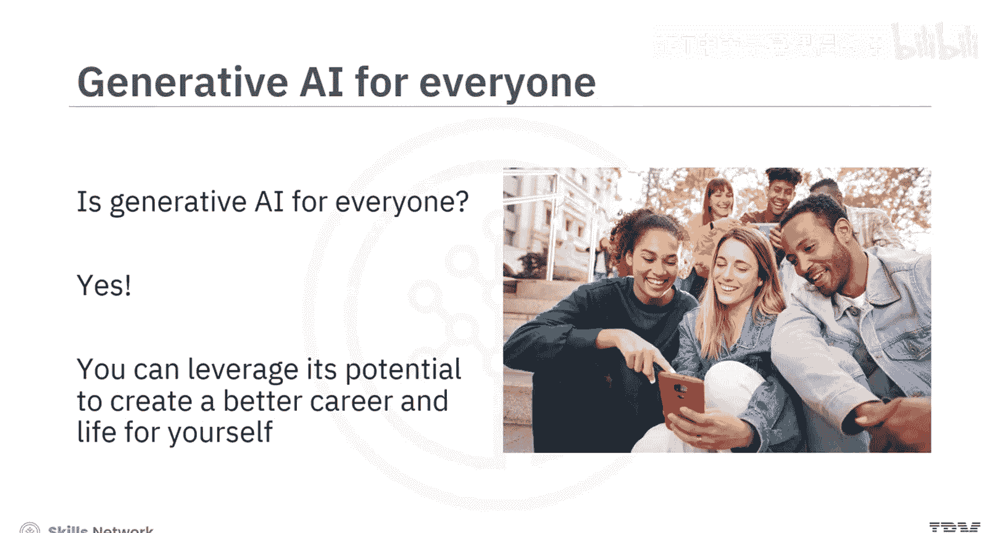
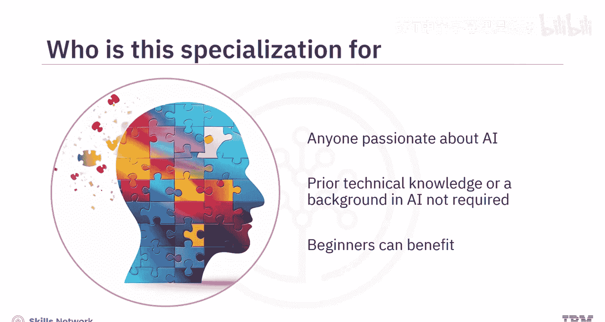
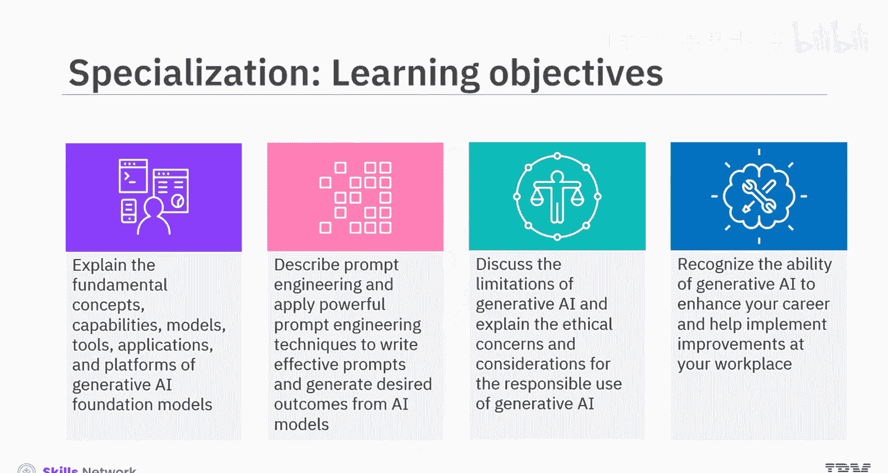
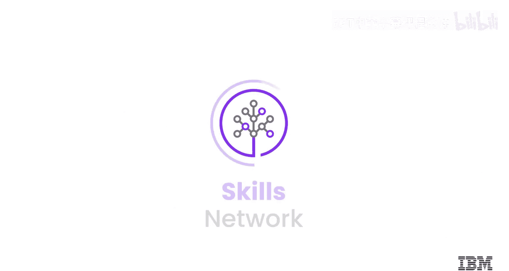

# 003：2_生成式AI基础专项课程介绍

在本节课中，我们将介绍IBM的“生成式AI基础”专项课程。该课程旨在帮助初学者全面了解生成式AI的核心概念、工具和应用，无需任何技术背景。

---

你是否知道，全球的营销人员已经在使用生成式AI来创作内容、撰写文案、激发创意、分析市场数据以及生成图像？

根据彭博社的预测，生成式AI市场预计到2032年将达到1.3万亿美元。因此，深入了解生成式AI对你而言至关重要。

那么，生成式AI适合所有人吗？答案是肯定的。你可以利用其潜力，为自己创造更好的职业和生活。本专项课程适合任何对探索生成式AI力量充满热情的人，无需具备AI技术知识或背景。即使是初学者也能从中受益，因为它全面涵盖了生成式AI的基本概念、模型、工具和应用。

完成本专项课程后，你将能够：
*   解释生成式AI基础模型的基本概念、能力、模型、工具、应用和平台。
*   描述提示工程，并应用强大的提示工程技术来编写有效的提示，从而从AI模型中生成期望的结果。
*   讨论生成式AI的局限性，解释其伦理关切和负责任使用的考量。
*   认识到生成式AI在提升你职业生涯和帮助工作场所实施改进方面的能力。

本专项课程包含五门自定进度的课程，每门课程需要3到5小时完成。

---

上一节我们概述了课程的整体目标，本节中我们来看看具体的课程结构安排。

以下是五门课程的核心内容简介：

**课程1：生成式AI导论**
这是你理解生成式AI能力的第一步，其能力涵盖文本、图像、音频、视频、虚拟世界、代码和数据等多个领域。你将了解不同行业如何应用常见的生成式AI模型和工具，例如GPT、DALL-E、Stable Diffusion、IBM Granite和Synthesia。

**课程2：提示工程**
本课程介绍提示工程的概念，以及它如何帮助你释放ChatGPT等生成式AI工具的全部潜力。你将探索开发有效提示的技术、方法和最佳实践，并使用IBM Watsonx、Prompt Lab、Spellbook和Dust等常用工具进行实践。

**课程3：生成式AI的核心概念**
本课程聚焦于生成式AI的核心概念和构建模块，例如深度学习、基于Transformer架构的大语言模型、扩散模型和基础模型。你还将了解不同的生成式AI平台，如IBM Watsonx.ai和Hugging Face。

**课程4：生成式AI的伦理与限制**
在课程3学习了技术基础后，本课程将探讨与生成式AI相关的伦理考量。你将了解它对数据隐私与安全、版权侵权、劳动力以及环境的影响。同时，你将描述其局限性，如数据偏见、缺乏可解释性、透明度和可理解性，并识别生成式AI的常见误用，例如深度伪造和幻觉。

**课程5：生成式AI的未来**
最后，本课程讨论生成式AI的未来。你难道不想知道在那个未来里你的职业机会是什么吗？你将学习生成式AI如何影响和增强不同行业现有的职能、技能和工作角色，以及如何利用生成式AI构建自己的应用程序以创造新的商业机会。

---

本专项课程的内容旨在吸引并赋能你。通过观看精选的概念视频、聆听AI专家分享他们的见解和技巧，以及在实验和项目中实践技术，你将在日常生活中使用生成式AI工具和应用程序时感到更加自信。

目前，65%的生成式AI用户是千禧一代或Z世代，72%的用户是在职人士。通过本专项课程的学习，你将准备好加入生成式AI变革者的行列。

生成式AI属于每一个人。

---

本节课中，我们一起学习了IBM“生成式AI基础”专项课程的完整介绍。我们了解了课程的目标、适合人群、学习成果以及五门核心课程的具体内容。从基础概念到提示工程，从技术原理到伦理实践，再到未来展望，该课程为初学者提供了一条清晰的学习路径，帮助你自信地开启生成式AI之旅。