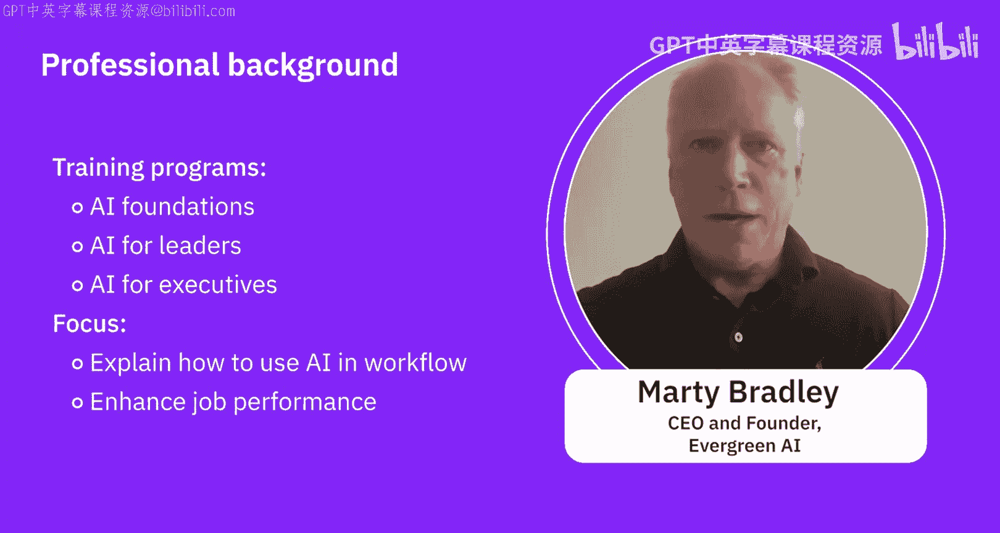
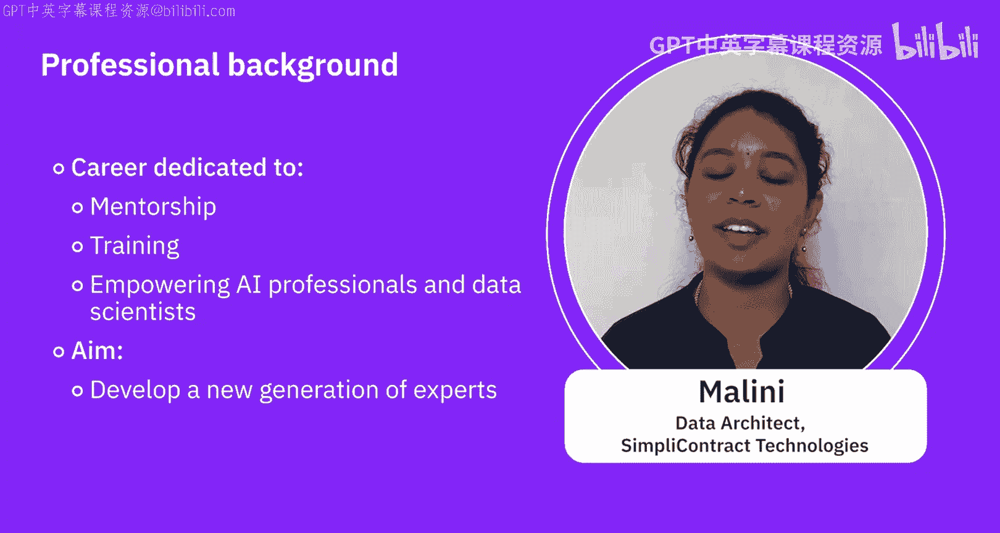
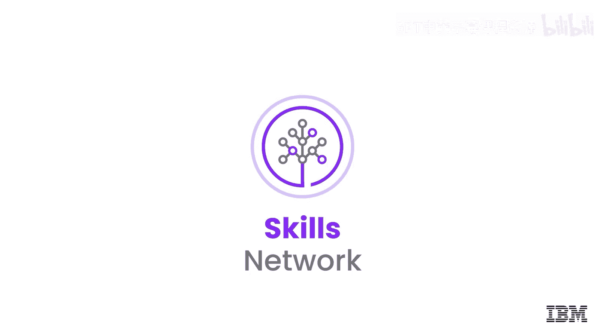

# 004：专家观点与领域专家介绍 👥

在本节课中，我们将认识几位在人工智能领域，特别是生成式AI方向拥有丰富经验的专家。他们将介绍自己的背景、专业领域以及对生成式AI的看法，帮助我们更好地理解这一技术在实际应用中的价值。

---

上一节我们了解了生成式AI的基本概念，本节中我们来看看行业专家们如何介绍自己。

以下是各位专家的自我介绍，包括他们的姓名、职位和所属组织。

*   Hello， 我是 Abyi Goneja， 我是人工智能领域的主题专家，同时也是 IID 的一名人工智能研究员。
*   Hello， 我是 Sapida Sazader， 我是 IBM 某 K 工程团队的 AI 引擎工程师。我很高兴能在这里与大家探讨生成式AI。
*   我是 Bradley Steinfeld， 我是 IBM 的一名高级软件架构师。
*   Hello， 我是 Mali， 我在人工智能和数据工程领域拥有超过12年的经验。我目前是 Simply Contract Technologies 的一名数据架构师。
*   Hi， 我是 Marty Briley， 我是 Evergreen AI 的首席执行官兼创始人。

---

在认识了各位专家之后，接下来让我们深入了解他们的专业背景，包括多年的行业经验和相关资质。

以下是专家们对其背景和经验的分享。

*   **Abyi Goneja**: 关于我的背景，我在加拿大滑铁卢大学获得了人工智能领域的博士学位，在此之前，我正在攻读机器人学硕士学位。完成学业后，我开始在这一领域工作，从事大数据分析。之后移居美国，我仍然在同一领域工作。最近，随着大语言模型和生成式AI这一新趋势的出现，我一直在致力于为我们的客户在不同的用例中实施和应用这项技术。
*   **Bradley Steinfeld**: 我在 IBM 工作了超过10年，大部分时间都在教育领域的 Skills Network 团队工作。
*   **Marty Briley**: 我们在 Evergreen AI 从事多项业务，但我们专注于生成式AI。我们提供生成式AI培训、生成式AI战略咨询，以帮助您理解生成式AI在您组织中的定位。我们还有一个小型开发部门，可以帮助进行一些集成工作。但我为我们拥有的培训项目感到自豪，这些课程旨在培训您组织中的每个人，包括“AI基础”、“面向领导者的AI”和“面向高管的AI”。这些课程展示了如何利用现有工具来完成工作，适用于那些希望了解如何在当前工作流程中使用AI以提升工作效率、实现百倍改进的人。
*   **Mali**: 我曾在银行、金融、电子商务、制造和制药等多个行业工作。每个行业独特的挑战都丰富了我的专业知识和视角，让我认识到数据和人工智能所能带来的切实影响，而不仅仅是处理数据和算法。在我的职业生涯中，我投入了大量时间进行指导和培训，培养有抱负的AI专业人员和数据科学家。我的目标是培养新一代的专家，准备好应对我们数字世界中不断演变的挑战。我很高兴能与大家合作、学习并做出有意义的贡献。感谢大家的欢迎，我期待与大家一起踏上这段激动人心的旅程。

---

本节课中我们一起学习了多位生成式AI领域专家的背景介绍。通过了解他们的专业路径、行业经验以及对AI应用的见解，我们可以更直观地感受到生成式AI技术的多样性和实际应用潜力，为后续深入学习其具体应用场景打下基础。