# 005：生成式AI导论 🧠

在本节课中，我们将要学习生成式人工智能的基本概念、其发展历程，以及它与判别式AI的核心区别。我们将从AI的基础定义开始，逐步深入到生成式AI的工作原理、关键模型及其广泛的应用前景。

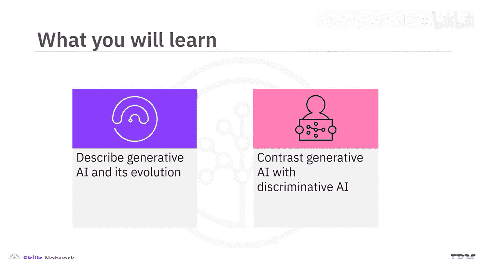

---

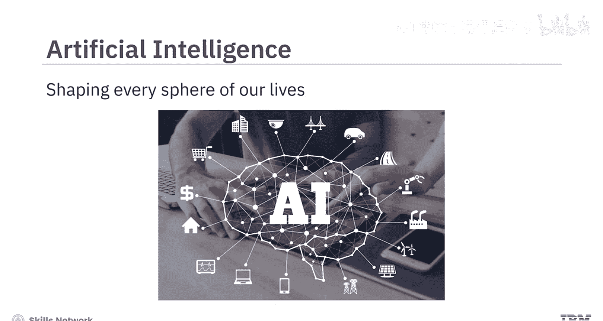

## 人工智能概述

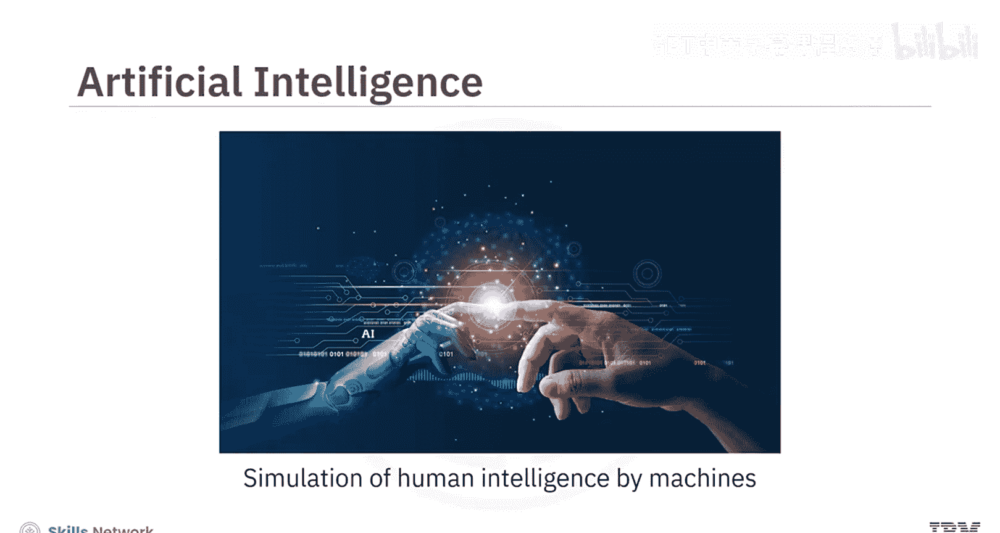

人工智能，或称AI，已经存在多年，它塑造了我们生活的方方面面，并彻底改变了我们的工作和生活方式。

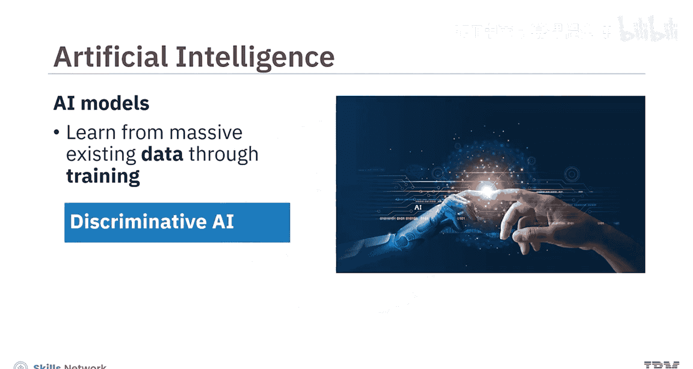

从本质上讲，AI可以定义为**机器对人类智能的模拟**。AI模型从海量的现有数据中学习，这个学习过程被称为**训练**。

---

## 人工智能的两种基本方法

人工智能有两种基本方法：**判别式AI**和**生成式AI**。

上一节我们介绍了AI的基本定义，本节中我们来看看这两种核心方法有何不同。

### 判别式AI

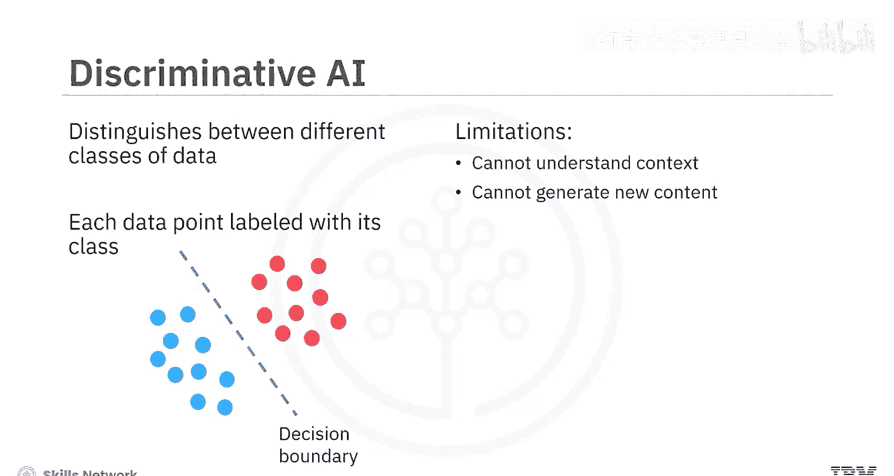

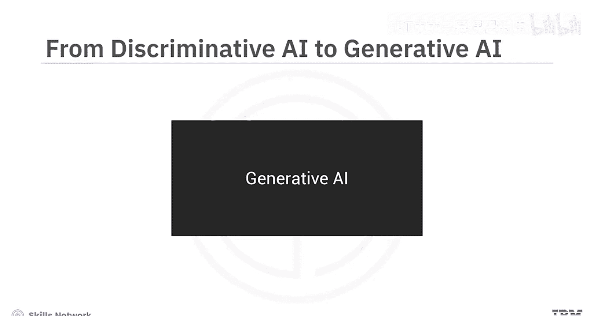

判别式AI是一种学习区分不同数据类别的方法。以下是其工作原理：

*   **训练过程**：一个判别式AI模型会获得一组训练数据，其中每个数据点都带有其类别的标签。
*   **预测过程**：模型通过判断新数据点落在决策边界的哪一侧，来预测其类别。
*   **核心能力**：判别式AI模型使用高级算法来**区分、分类、识别模式**，并根据训练数据得出结论。

一个判别式AI模型的应用实例是电子邮件垃圾邮件过滤器，它可以区分垃圾邮件和非垃圾邮件。

判别式AI模型最适合应用于分类任务。然而，它们无法理解上下文，也无法基于对训练数据的上下文理解来生成新内容。

### 生成式AI

而这正是**生成式人工智能**的用武之地。

生成式AI模型学习根据训练数据**生成新的内容**。它们能够捕捉训练数据的底层分布，并生成新颖的数据实例。

以下是生成式AI的工作流程：

1.  **输入提示**：生成式AI从一个**提示**开始。这可以是文本、图像、视频或模型能够处理的任何其他输入。
2.  **生成内容**：作为输出，模型会生成新的内容，包括文本、图像、音频、视频、代码和数据。
3.  **输出形式**：生成式AI可以生成与提示相同形式的输出（例如，文本到文本），也可以生成与提示不同形式的输出（例如，文本到图像或图像到视频）。

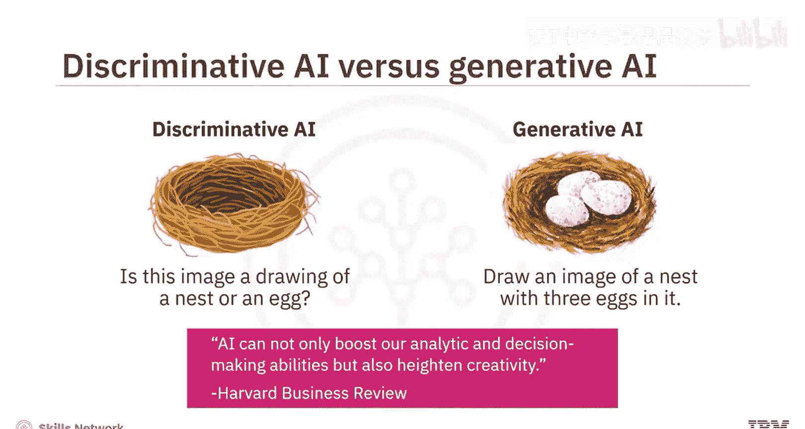

这里有一个简单的例子来理解判别式AI与生成式AI的区别：

*   **判别式AI**最适合回答诸如“这张图片画的是鸟巢还是鸟？”这类问题。
*   **生成式AI**则会响应诸如“画一幅有三个蛋在里面的鸟巢图像”这样的提示。

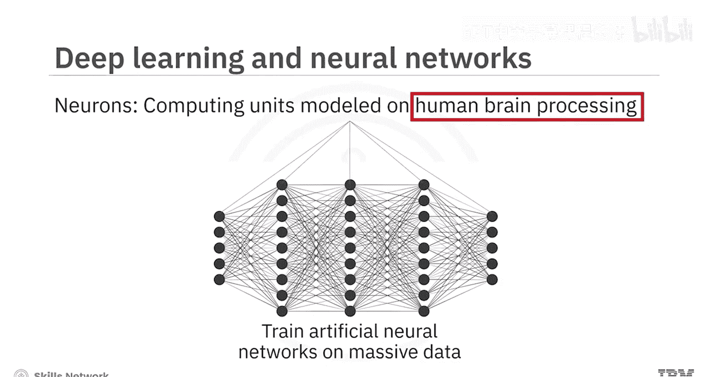

如果说判别式AI模仿了我们的分析和预测能力，那么生成式AI则更进一步，模仿了我们的**创造能力**。正如《哈佛商业评论》的评论所言：“AI不仅可以提升我们的分析和决策能力，还能激发创造力。”生成式模型可以运用所学知识，基于信息创造出全新的内容。

---

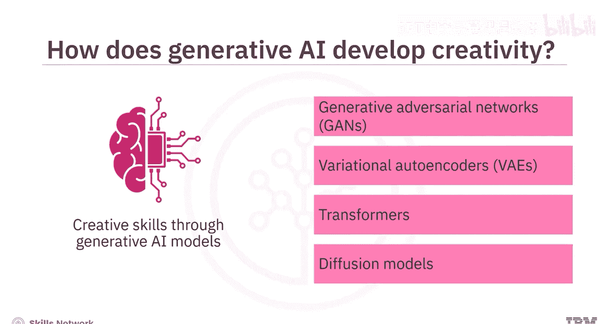

## 生成式AI的技术基础

判别式模型和生成式模型都是使用**深度学习**技术创建的。深度学习涉及训练人工神经网络从海量数据中学习。

**人工神经网络**是由称为神经元的较小计算单元组成的集合，其建模方式类似于人脑处理信息的过程。

生成式AI的创造能力来源于特定的生成式AI模型，这些模型可以被视为生成式AI的**构建模块**。以下是几种关键模型：

*   **生成对抗网络**：`GANs`
*   **变分自编码器**：`VAEs`
*   **Transformer模型**
*   **扩散模型**

---

## 生成式AI的发展历程

生成式AI并非一个新概念，其根源可追溯到机器学习的起源。以下是其发展脉络：

*   **20世纪50年代末**：科学家提出机器学习时，就探索了使用算法创建新数据。
*   **20世纪90年代**：神经网络的兴起进一步推动了生成式AI的发展。
*   **21世纪10年代初**：在大规模数据集和增强计算能力的支持下，深度学习极大地促进了生成式AI的发展。
*   **2014年**：Ian Goodfellow及其同事引入了**GANs**，变革了生成式AI领域。
*   **后续发展**：GANs以及VAEs、Transformer等模型为生成式AI的增长以及**基础模型**和工具的开发奠定了基础。

**基础模型**是具有广泛能力的AI模型，可以被调整以创建更专业的模型或针对特定用例的工具。

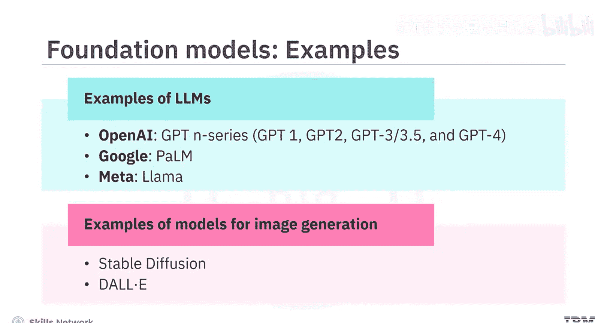

其中一类特定的基础模型称为**大语言模型**，它们经过训练能够理解人类语言，并可以处理和生成文本。

*   **2018年**：OpenAI推出了基于Transformer的LLM——**生成式预训练Transformer**。
*   **后续演进**：GPT系列中的GPT-3和GPT-4、Google的PaLM、Meta的Llama等不同LLM显著增强了生成式AI生成连贯且相关文本的能力。
*   **其他领域**：在其他用例中也出现了类似的模型发展，例如用于图像生成的Stable Diffusion和DALL-E。

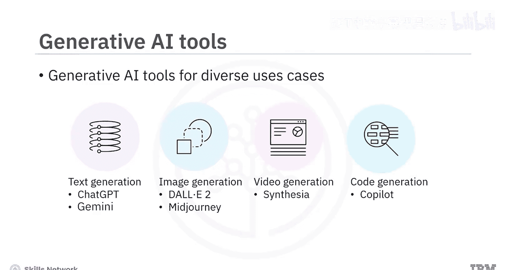

---

## 生成式AI的工具与应用

多种生成式模型的发展，催生了针对不同用例的生成式AI工具市场。以下是一些例子：

*   **文本生成**：`ChatGPT`， `Gemini`
*   **图像生成**：`DALL-E 2`， `Midjourney`
*   **视频生成**：`Synthesia`
*   **代码生成**：`GitHub Copilot`， `AlphaCode`

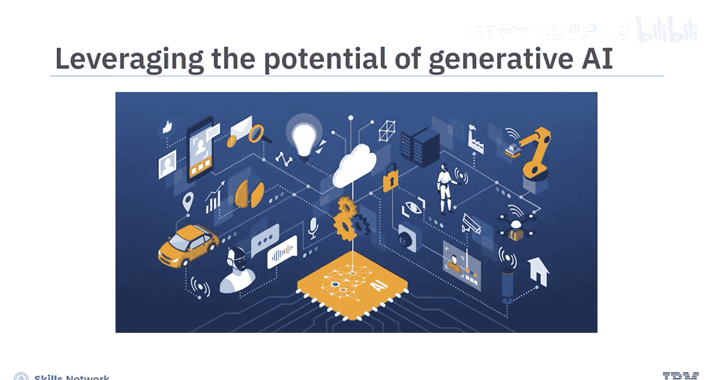

快速涌现的模型和工具为生成式AI在各个领域的应用开辟了广阔前景。引用麦肯锡关于生成式AI经济潜力的报告：“生成式AI有潜力改变工作的结构，通过自动化部分个人活动来增强个体工作者的能力。”该报告还预测，生成式AI对生产力的影响可能为全球经济增加数万亿美元的价值。

---

## 总结

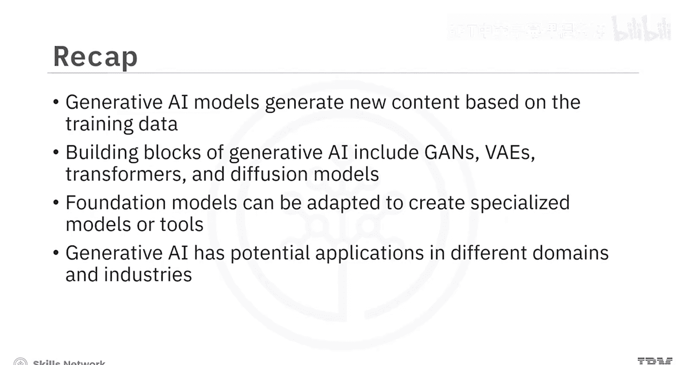

本节课中我们一起学习了生成式AI的核心知识。我们了解到，生成式AI模型能够根据其训练数据生成新的内容。其创造能力建立在如GANs、VAEs、Transformer和扩散模型等模型之上。基础模型可以被调整以创建针对特定用例的专门模型或工具。最后，我们认识到生成式AI模型和工具在不同领域和行业中拥有广泛的应用范围。