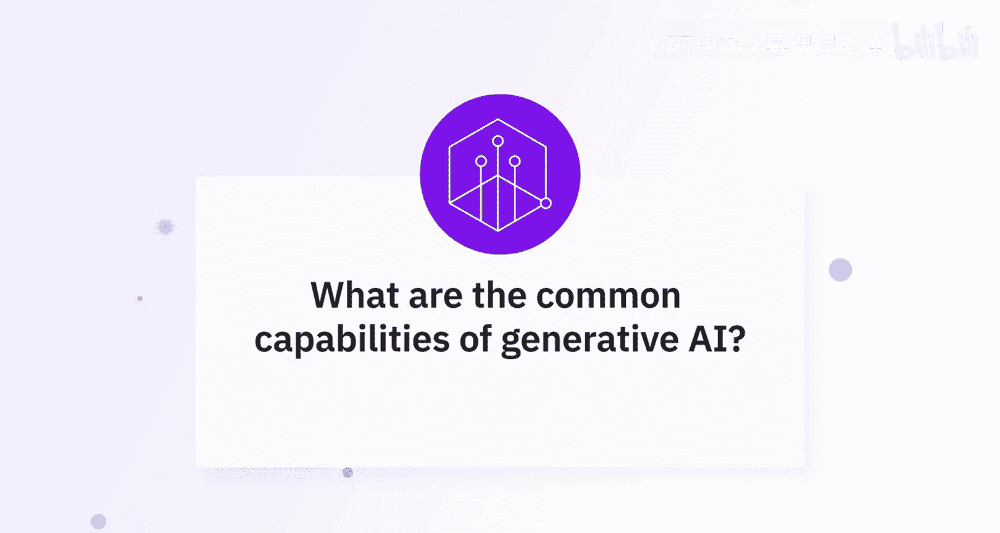
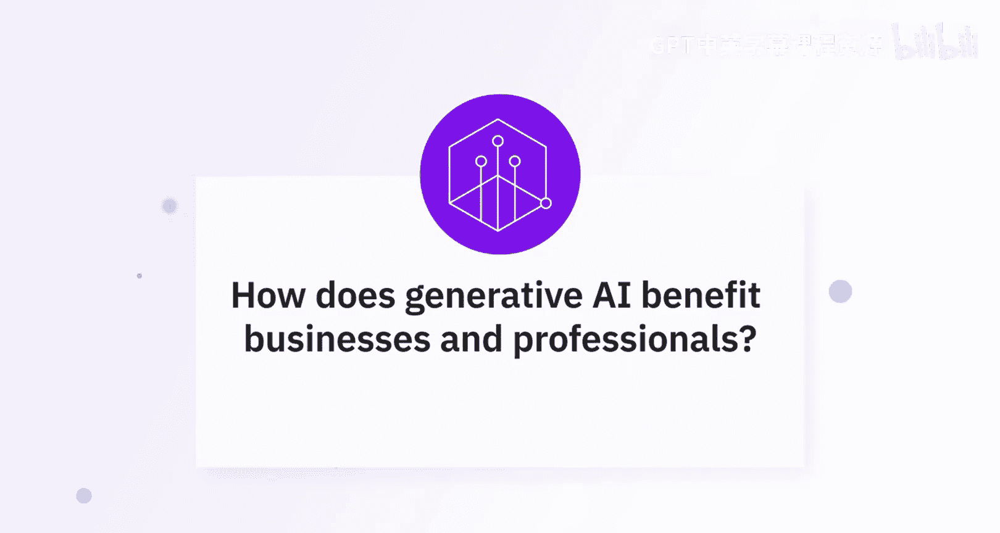
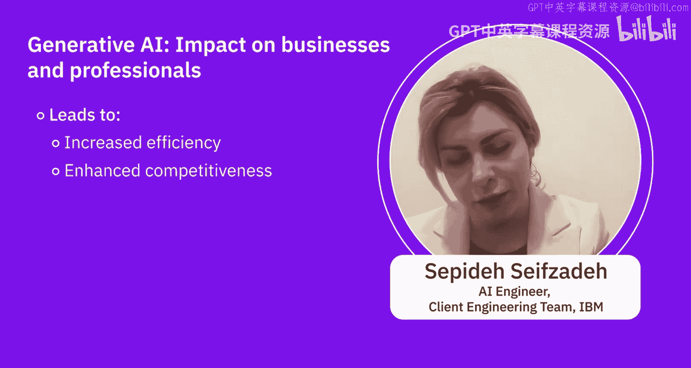

# 007：生成式AI能力解析 🧠

在本节课中，我们将聆听AI专家对生成式AI核心能力的解析，了解它如何为企业和专业人士带来变革。

---

## 概述

本节内容汇集了多位专家的见解，系统性地介绍了生成式AI的常见能力及其在各行各业的应用价值。我们将从内容创作、任务自动化到行业解决方案，全面解析这项技术如何提升效率、激发创意并驱动个性化体验。

---

## 生成式AI的常见能力 🛠️

上一节我们了解了生成式AI的基本概念，本节中我们来看看专家们总结出的具体能力。

生成式AI为企业与专业人士提供了多种有益的能力。它尤其擅长内容创作，例如生成文本、图像、音乐甚至视频，从而简化和加速市场营销与创意流程。

以下是基于大语言模型的一些常见用例：

*   **总结**：快速归纳长文档或对话的核心内容。
*   **提取**：从复杂信息中精准抓取关键数据或要点。
*   **生成**：根据指令或上下文创造全新的文本、代码等内容。
*   **分类**：对信息进行自动归类和打标签。
*   **代码生成**：辅助编写和调试程序代码。

生成式人工智能的应用不仅限于生成原始数据，还包括生成模式、配置和设置等多种形式。具体到工业领域，合成数据能以多种方式帮助各行各业。

一个我们与客户合作中非常常见的用例是 **RAG（检索增强生成）**。这是一个当前非常流行和普遍的用例，因为我们的客户拥有许多私有文档，他们不希望将这些文档暴露在公有云或公开环境中，但他们又希望快速从这些文档中检索信息。

生成式AI不仅仅是一个花哨的玩具，它是一个游戏规则改变者。想象一下，拥有一个数字助手，它能激发你的创造力、理解你的需求并为你节省时间——这正是生成式AI所做的。所以，别再猜测了，拥抱未来吧。生成式AI的到来是为了让一切变得更快、更好、更个性化。

---

## 生成式AI如何使企业与专业人士受益 💡

了解了核心能力后，我们接下来看看这些能力具体能带来哪些商业价值和个人效率的提升。

生成式AI可以通过多种方式帮助我们。例如，在文本生成方面，GPT等模型可以帮助生成用于营销材料的文案。在图像生成方面，DALL-E等工具可以创建非常接近真实效果的图像和视频。它还能帮助进行音乐和音频生成、数据合成与增强。

AI驱动的内容生成节省了时间，并通过自动化撰写报告、创建社交媒体帖子和设计图形等任务来降低成本。此外，生成式AI通过个性化推荐和交互式聊天机器人增强了客户体验，从而提升了参与度和满意度。在设计和产品开发中，它有助于快速生成多种设计变体，实现快速原型设计和探索创新解决方案。

例如，在医疗保健行业，涉及合成数据生成和合成图像生成的操作可以保护患者隐私——即保护患有特定疾病的人的隐私。生成式AI也可用于金融分析中的欺诈检测。众所周知，它在制药行业被用于发现更多的药物模式。因此，这是一个应用范围非常广泛的结构，生成式AI正在不断提供巨大帮助。

它能绘制令人惊叹的图画，撰写引人入胜的故事，甚至像专业人士一样翻译语言。个性化推荐？没问题。这个AI伙伴能准确找到你想要的东西，无论是电影、产品，甚至是职业道路。在医疗保健和航空等领域，它创建用于培训的真实模拟，使学习变得安全高效。但这还不是全部，生成式AI自动化了任务，让你能腾出时间专注于最重要的事情。

因此，所有这些任务都有助于我们增强创造力、个性化体验并做出数据驱动的决策，从而最终提高效率、竞争力和客户满意度。

---

## 总结

本节课中，我们一起学习了专家视角下的生成式AI核心能力。我们了解到，它不仅是强大的内容创作工具，能完成总结、提取、生成和分类等任务，更是通过**RAG（检索增强生成）** 等技术处理私有信息的关键。更重要的是，生成式AI通过自动化流程、提供个性化解决方案和生成合成数据，为包括医疗、金融在内的各行各业带来了效率提升、成本节约和创新动力。它正成为一个不可或缺的数字助手，推动工作方式向更快、更好、更智能的方向发展。