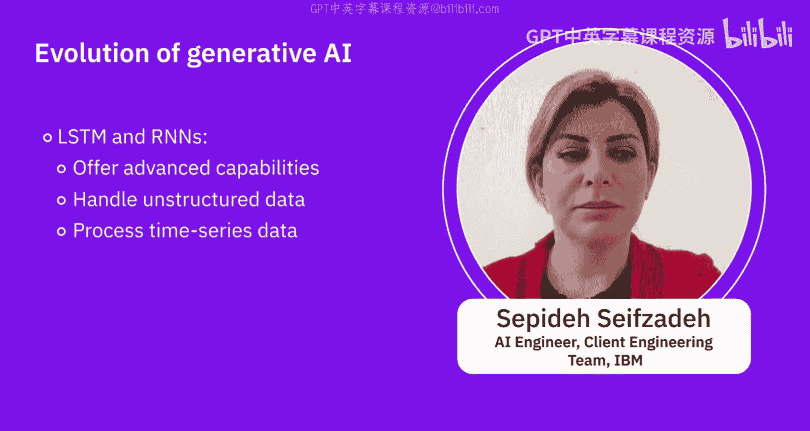
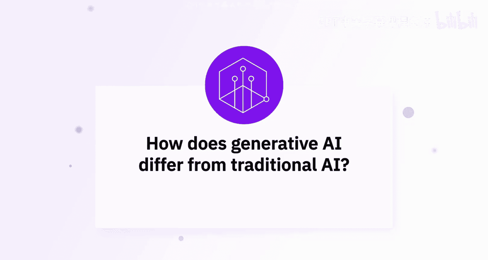

# 008：生成式AI的演进历程 🤖

在本节课中，我们将聆听专家们的见解，共同探讨生成式人工智能的演进历程。我们将了解它是如何从早期的概念发展到如今成为行业焦点的，并理解它与传统人工智能方法的根本区别。

---

## 生成式AI的演进历程 📈

上一节我们介绍了本课程的主题，本节中我们来看看生成式AI是如何一步步发展至今的。

生成式AI与人工智能一同演进，但最近获得了更多关注。它在超过20年的时间里一直存在，但并未真正流行。最近，随着像生成对抗网络和变分自编码器这类技术的出现，它获得了更大的发展势头，几乎已成为行业的未来。

生成式AI的演进历程以其创造新颖原创内容能力的显著进步为标志。早期的生成式AI模型在连贯性和质量上略有不足。但自从GPT-3，以及随后的GPT-4和DALL-E等模型出现后，它们能够生成高度复杂的文本和图像，从而增强了各个领域的创造力和自动化水平。

简单来说，生成式AI已经到来，它是一个创意引擎。可以把它想象成一个超级聪明的艺术家，不仅能遵循指令，更能创造新事物。它能绘画、写故事，甚至能提出全新的想法。

以下是其演进过程中的几个关键阶段：

*   **第一阶段：基于规则的机制与传统模型**
    系统仅在我们提供的上下文范围内工作，并严格遵循预设的规则。

*   **第二阶段：机器学习与统计模型**
    这些模型能够从数据中发现模式。基于半监督学习、监督学习或强化学习，它们比基于规则的系统更智能，并能识别出一些规律。

*   **第三阶段：深度学习与神经网络**
    它们能以更先进的方式在数据集中发现模式，并处理非结构化的数据。

*   **第四阶段：生成对抗网络**
    这是一个生成式任务和生成新数据的新时代。GANs通过一个“生成器”和一个“判别器”的对抗过程来学习并创造内容，能生成非常逼真的图片和艺术作品。

*   **第五阶段：Transformer模型**
    像LSTM和Transformer这类神经网络，帮助我们更先进地处理某些用例、非结构化数据和时间序列数据集。特别是2017年提出的Transformer架构，为生成式任务开启了新纪元。如今，许多类似GPT的模型在开源社区中可用，其核心思想是拥有一个在海量数据上预训练的模型，可以轻松针对特定任务进行微调。

---

## 生成式AI与传统AI的区别 🔄

了解了演进历程后，本节我们来探讨生成式AI与传统AI方法有何不同。

传统AI与生成式AI的区别在于：传统AI侧重于分析和预测现有数据，例如分类、回归、推荐等任务。相比之下，生成式AI，特别是随着生成对抗网络和Transformer模型的出现，能够创造出与训练数据相似的新数据。

人工智能在过去五六十年里，经历了从基础水平到应用和预测水平的发展。而生成式AI更侧重于利用人工智能技术生成类人的高质量输出。

本质区别在于：传统AI执行你告诉它的任务，而生成式AI则能自行构思和创造，就像一个酷炫的AI发明家，准备释放人工智能的创造力。

---

## 总结 ✨

本节课中，我们一起学习了生成式AI的演进历程及其与传统AI的核心区别。我们了解到，生成式AI已经从早期的、能力有限的模型，发展到如今能够创造高度复杂和原创内容的强大工具，这主要得益于生成对抗网络和Transformer架构等关键技术的突破。同时，我们也明确了生成式AI的核心在于“创造”新数据，这与传统AI专注于“分析”和“预测”现有数据的范式形成了鲜明对比。