# 009：生成式AI的应用场景 🚀

在本节课中，我们将学习生成式AI在不同领域的具体应用。我们将探讨它在IT与DevOps、娱乐、教育、银行与金融、医疗保健以及人力资源等领域的实际用例，了解这项技术如何改变各行各业的工作方式。

## IT与DevOps领域的应用 💻

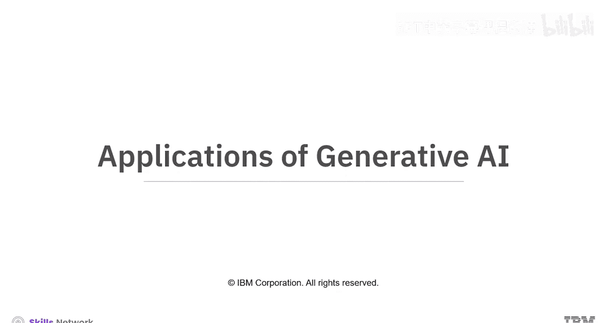

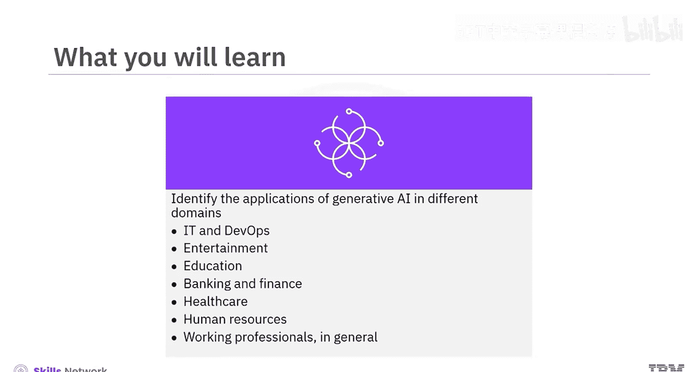

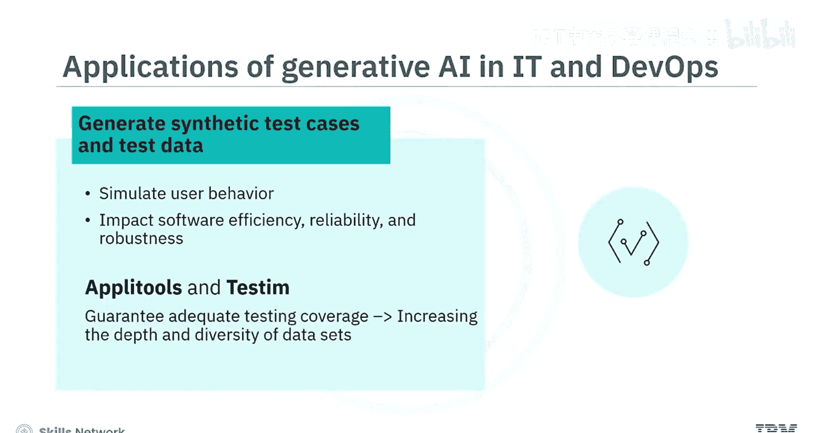

上一节我们介绍了生成式AI的基本概念，本节中我们来看看它在IT与DevOps领域的应用。生成式AI能够帮助改进软件交付流程和基础设施管理。

以下是生成式AI在IT与DevOps中的主要应用：

*   **代码生成**：生成式AI的代码生成能力减少了手动编码的工作量和在重复性任务上花费的时间。
*   **代码审查**：由生成式AI驱动的代码审查工具，如**GitHub Copilot**和**Synk DeepCode**，会检查代码库和编码标准，以提升代码质量和可维护性。
*   **自动化测试**：生成式模型可以生成模拟用户行为的合成测试用例和测试数据。测试用例的变化会影响软件的效率、可靠性和健壮性。像**Applitools**和**Testim**这样的工具通过增加数据集的深度和多样性来保证充分的测试覆盖率。
*   **监控与异常检测**：用于监控和检测代码中的异常。例如，**IBM的Watson AIOps**和**Moogsoft AIOps**会分析系统日志、指标和其他数据。这有助于进行主动维护和故障排除，减少停机时间并防止关键故障。
*   **自动化文档与部署**：**GitLab Duo**通过自动创建发布说明、变更日志以及更新部署模板和脚本来支持持续集成与部署（CI/CD）流程。
*   **其他应用**：其他应用包括自然语言界面、自动化基础设施管理和预测性维护。

## 娱乐领域的应用 🎬

现在，让我们看看生成式AI在娱乐领域的应用。生成式AI工具可以生成各种合成内容，如音乐、剧本、故事、视频、电影和电子游戏。它们还可以翻译、本地化和个性化内容。

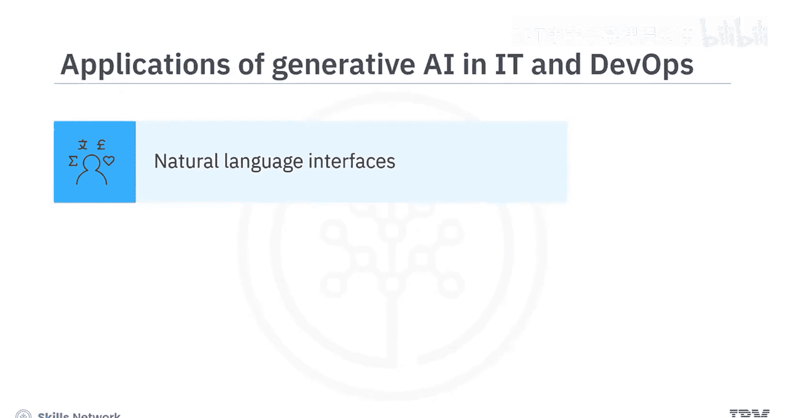

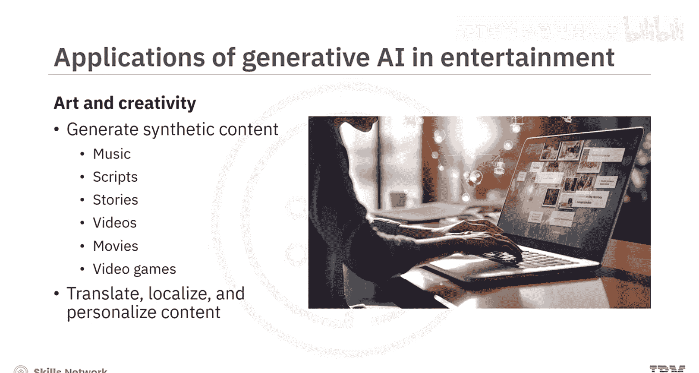

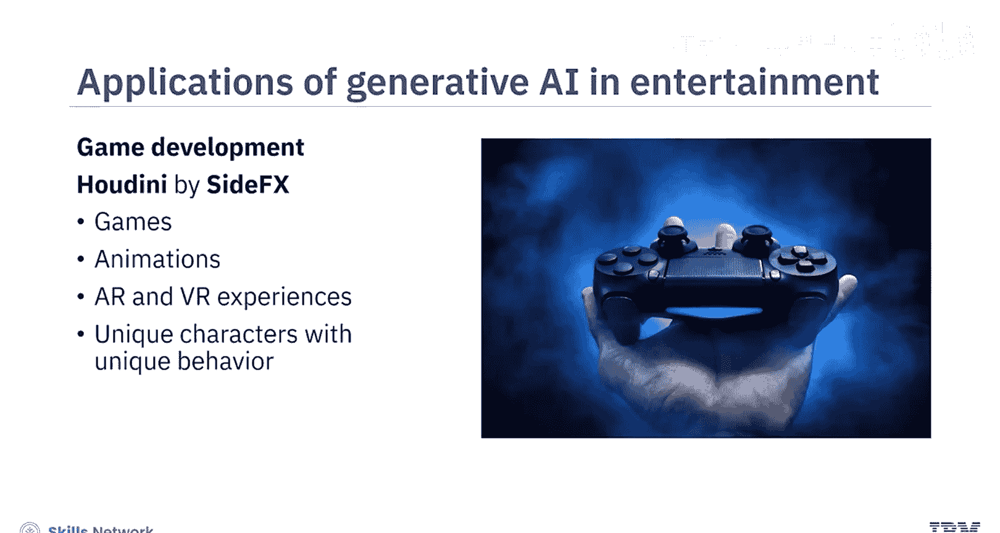

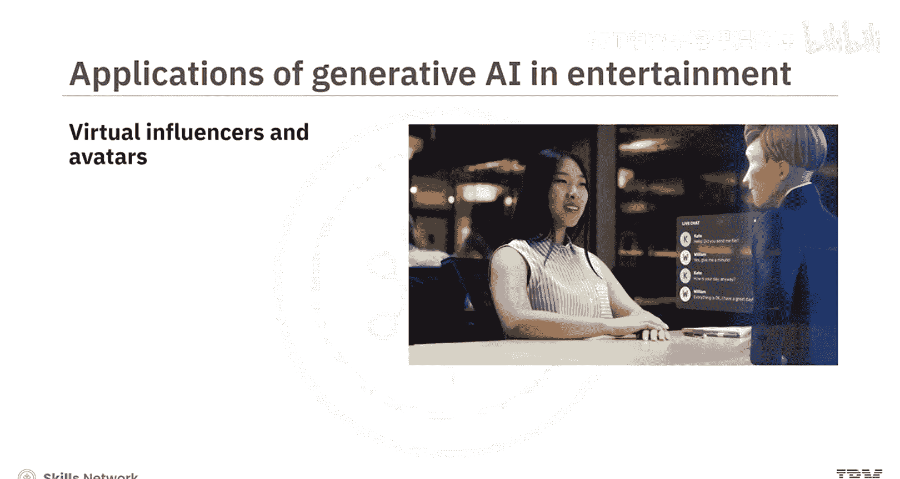

以下是生成式AI在娱乐领域的主要应用：

*   **游戏开发**：像**Side Effects Software的Houdini**这样的游戏开发工具，利用生成式AI的力量来创建游戏、动画、增强现实和虚拟现实体验，以及具有独特行为的角色。
*   **虚拟形象**：最近，由生成式AI驱动的虚拟影响者和虚拟形象也日益流行，它们能与用户互动，创造引人入胜的体验。

## 教育领域的应用 📚

生成式AI产生重大影响的另一个领域是教育。从内容生成到个性化和自适应学习体验，再到模拟体验式学习，生成式AI的影响是巨大的。

以下是生成式AI在教育领域的主要应用：

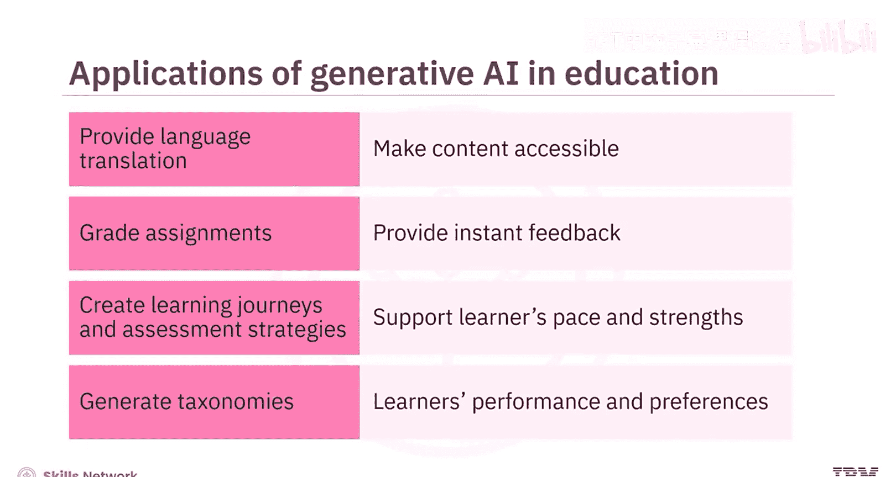

*   **语言翻译**：凭借其语言能力，它们可以提供语言翻译，使内容能以不同语言访问。
*   **个性化学习**：它们可以生成作业以提供即时反馈，并创建支持个体学习者节奏和优势的学习路径与评估策略。
*   **学习分析**：可以根据学习者的表现和偏好生成分类法。
*   **特殊需求识别**：生成式算法可以检测特殊需求和学习障碍，以帮助学习者和教育者制定特定的课程计划。
*   **知识追踪**：生成式算法也被用于追踪学习者随时间推移的进度，即知识追踪。这有助于为个体需求提供合适的节奏和内容。
*   **其他应用**：辅导支持、虚拟和模拟环境以及包容性教育也从中受益。
*   **工具示例**：例如，**Nolej**能在几分钟内提供AI生成的电子学习内容，包括针对目标主题的互动视频、术语表、练习题和摘要。**Duolingo**是一个语言学习平台，它使用GPT-3来纠正法语语法并为英语创建测试项目。

## 银行与金融领域的应用 💰

银行和金融机构极大地受益于生成式AI自动检测风险、生成见解并提供具备金融知识的建议的能力。

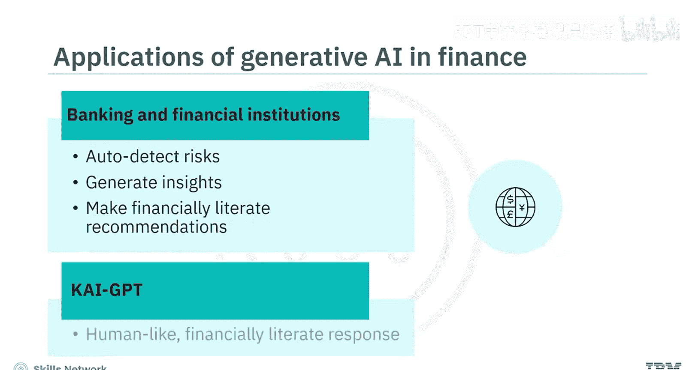

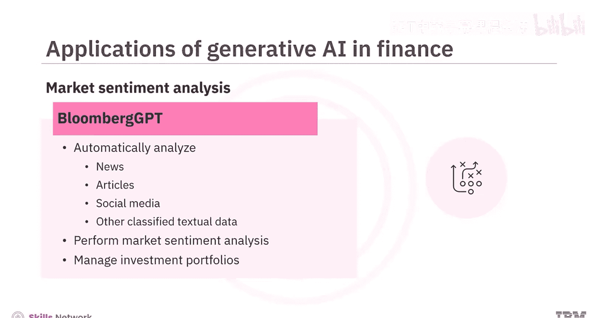

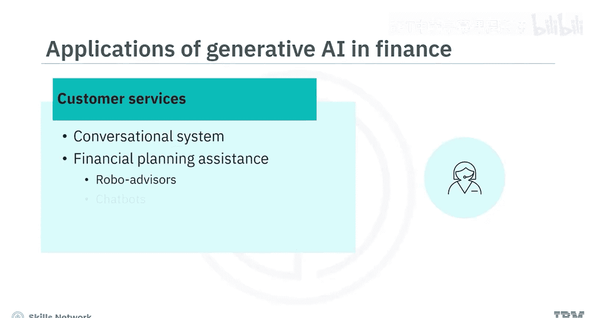

以下是生成式AI在银行与金融领域的主要应用：

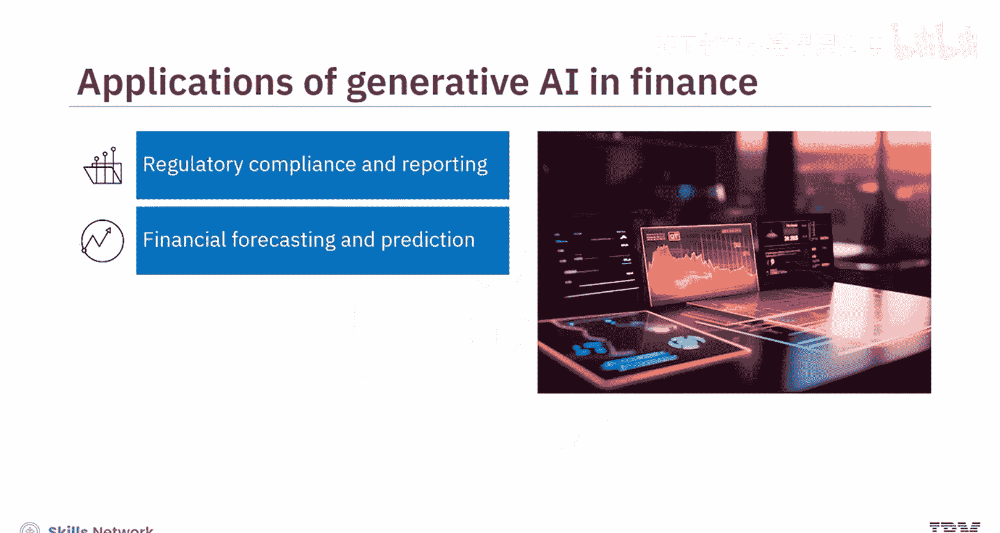

*   **行业专用模型**：**Kore.ai KG**是首个银行业专用的LLM，它帮助银行应用程序提供类人的、具备金融知识的响应。
*   **风险评估**：例如，**DataRobot**可以通过模拟潜在的欺诈场景来生成合成用例，以检测信用风险、欺诈风险和市场波动。
*   **信用评分**：**Personetics**和**AIO Logic**利用生成式模型来检测风险、确定利率并构建定制贷款。它们自动化评估客户信用度并设定信用额度或保险费率。
*   **市场分析**：像**BloombergGPT**这样的NLP驱动生成式AI可以分析新闻、文章、社交媒体和其他分类文本数据，以更有效地进行市场情绪分析和管理投资组合。
*   **客户服务**：生成式AI工具建立了对话系统，并使用机器人顾问、聊天机器人和虚拟助手来协助财务规划。
*   **其他应用**：监管合规与报告、财务预测、投资组合优化、反洗钱和算法交易是一些受益极大的领域。需要注意的是，其中一些应用和工具同时利用了生成式和判别式AI模型。

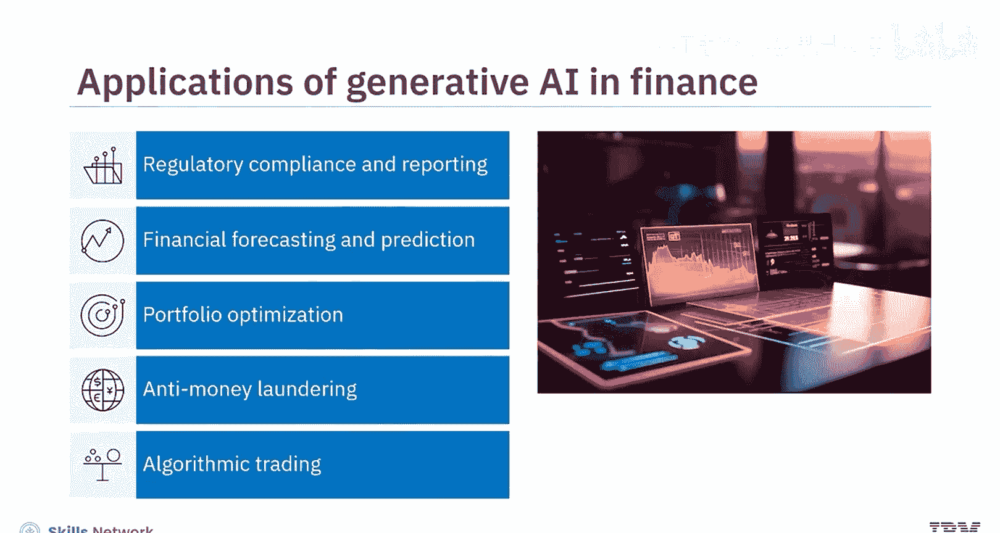

## 医疗保健领域的应用 🏥

现在，让我们讨论生成式AI在医学和医疗保健研究、药物发现、诊断和患者护理方面的一些应用。

以下是生成式AI在医疗保健领域的主要应用：

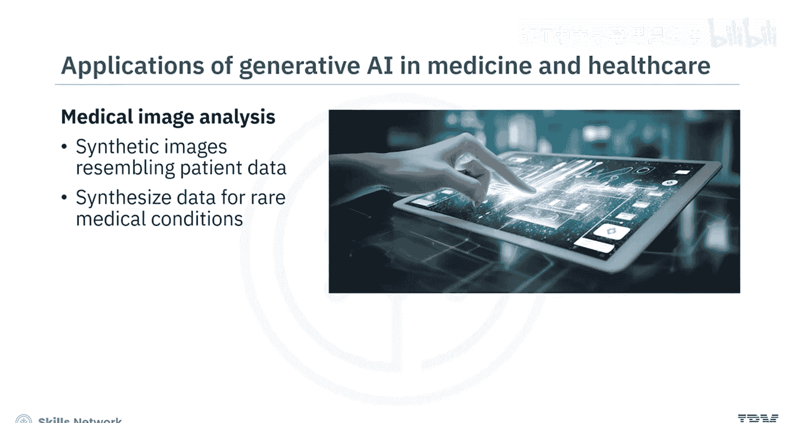

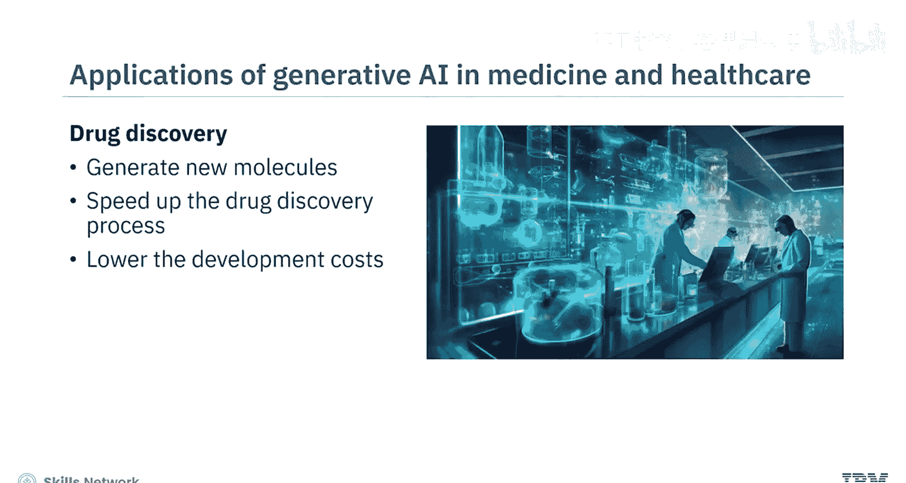

*   **医学影像分析**：凭借其生成类似于患者数据的合成图像的能力，生成式模型提高了用于医学影像分析的深度学习模型的健壮性。这些模型可以为数据非常有限的罕见医疗状况合成数据。这有助于促进研究、训练AI模型并为罕见病例开发新的诊断工具。
*   **药物发现**：在药物发现中，这些模型通过生成新分子、加速药物发现过程并降低开发成本来提供帮助。
*   **远程医疗**：远程医疗和远程监控也受益于生成式AI驱动的对话工具。例如，**Rasa**可以与患者建立具备医学知识的对话，以提供即时医疗建议、健康相关支持和个性化治疗计划。
*   **其他应用**：该领域的其他应用包括电子健康记录管理、医疗保健欺诈检测以及医学模拟和培训。

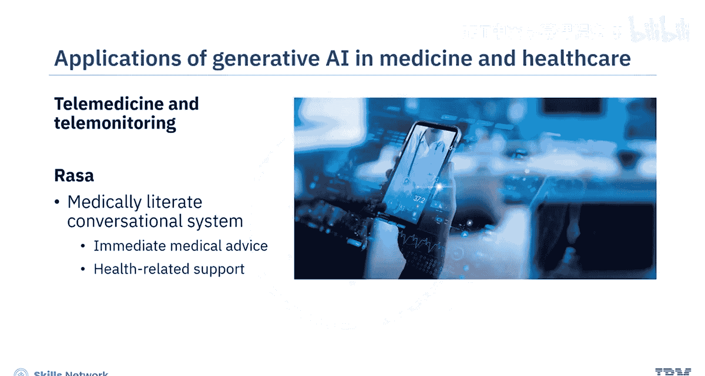

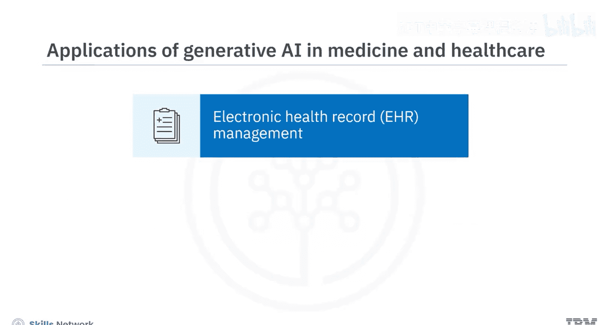

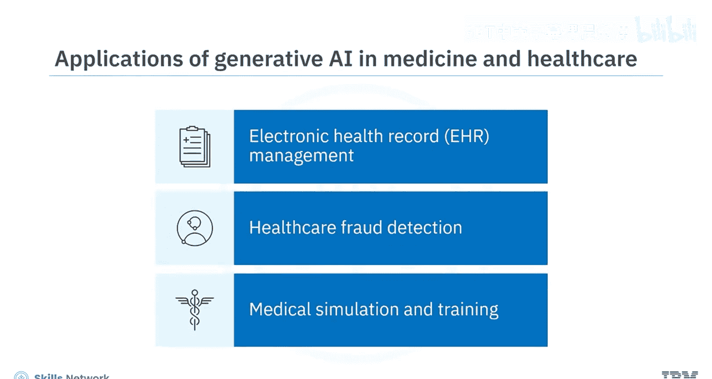

## 人力资源领域的应用 👥

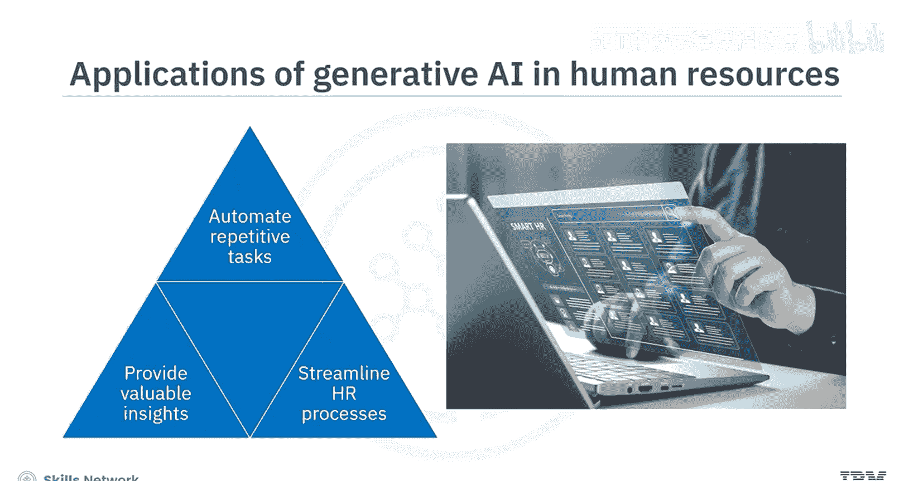

让我们看看生成式AI如何赋能人力资源部门，使其自动化重复性任务、提供有价值的见解并简化HR流程。

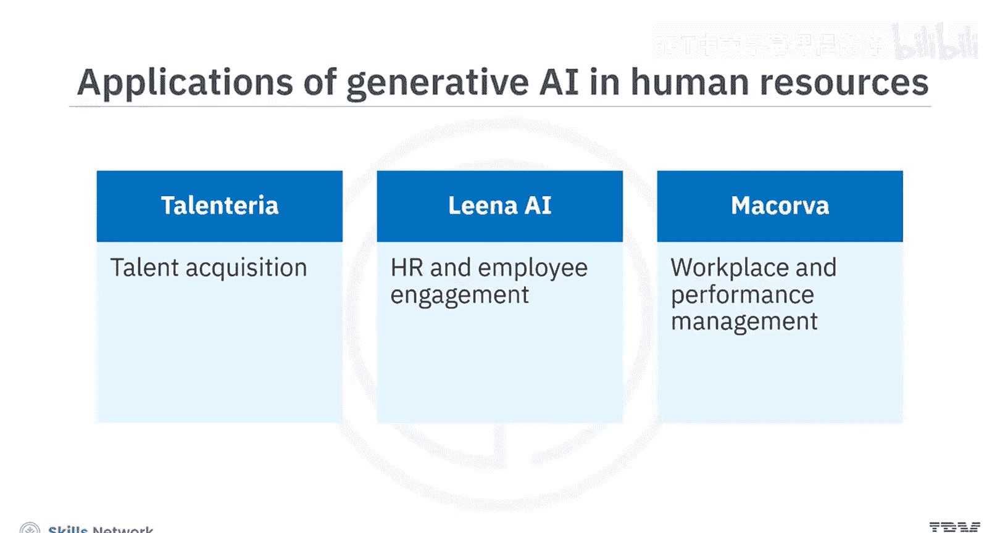

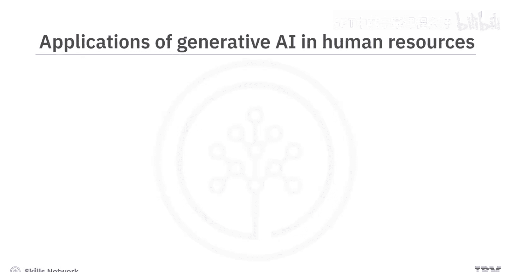

以下是生成式AI在人力资源领域的主要应用：

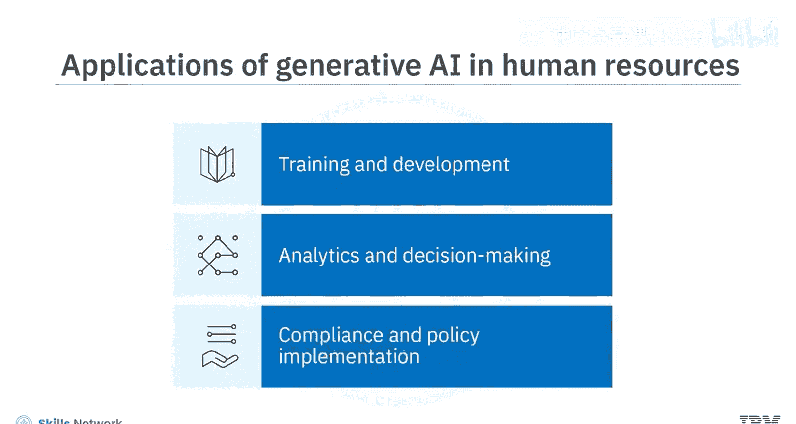

*   **任务自动化**：例如，**Watson X Orchestrate**帮助自动化HR任务，如创建职位需求、筛选和入围相关简历、安排面试、候选人入职等。
*   **人才招聘**：**Talenteria**专注于人才招聘。
*   **员工互动**：**Leena AI**使用对话式AI系统来自动化HR任务和员工互动。
*   **绩效管理**：**McCormick**专注于工作场所和绩效管理，自动生成绩效文档和评估。
*   **其他应用**：生成式AI在HR中的其他应用包括培训与发展、分析与决策制定，以及合规与政策实施。

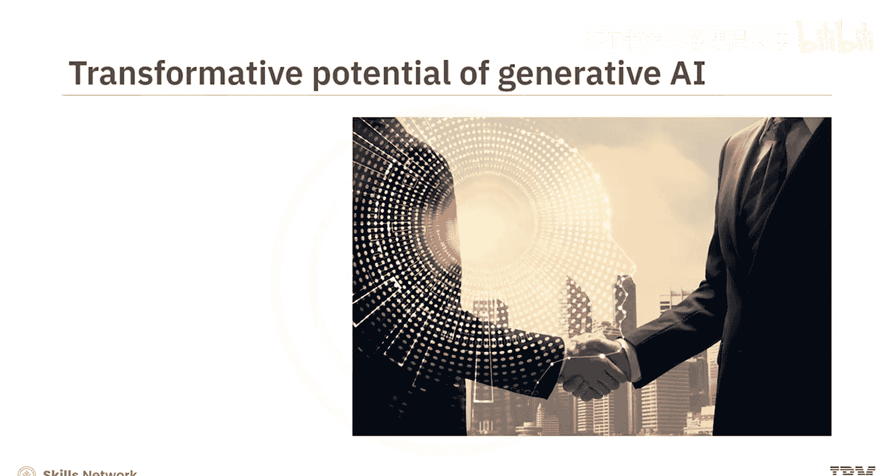

## 对工作方式的广泛影响 🌐

虽然我们今天只讨论了几个领域，但生成式AI最终被认为会对所有行业产生重大影响。另一个产生重大影响的领域是我们的工作方式。

根据麦肯锡关于生成式AI经济潜力的报告，当前的生成式AI和其他技术有潜力自动化目前占用员工60%至70%时间的工作活动。到2030年至2060年间，当今一半的工作活动可能被自动化。生成式AI日益增长的理解自然语言的能力，最终将影响甚至通常与高等教育和习得技能相关的知识型工作。

## 总结 📝

本节课中我们一起学习了生成式AI在各个领域的流行应用。然而，重要的是要注意，生成式AI的潜在应用在所有行业和生活的各个方面几乎是无限的。

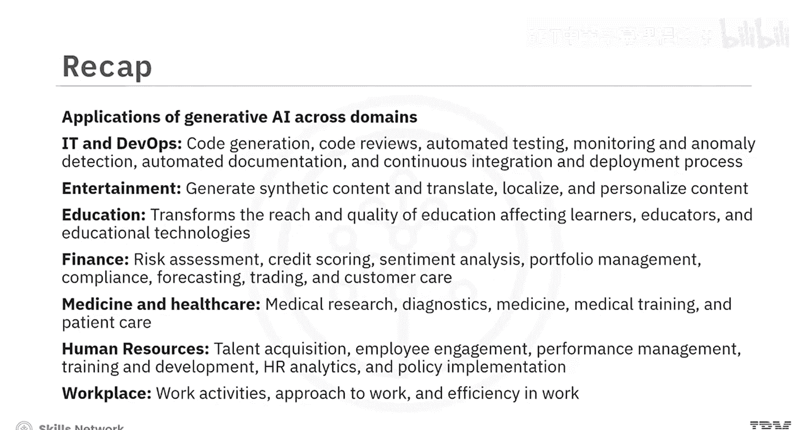

*   在**IT与DevOps**中，应用包括代码生成、代码审查、自动化测试、监控与异常检测、自动化文档以及持续集成与部署流程。
*   在**娱乐**领域，生成式AI通过生成各种合成内容以及翻译、本地化和个性化内容，提供了令人兴奋的可能性。
*   在**教育**领域，生成式AI改变了教育的覆盖范围和质量，影响着学习者、教育者和教育技术。
*   在**金融**领域，应用领域包括风险评估、信用评分、情绪分析、投资组合管理、合规、预测、培训和客户服务。
*   在**医疗保健**领域，我们看到应用包括医学研究、诊断、药物发现、医学培训和患者护理。
*   在**HR**领域，应用涉及人才招聘、员工互动、绩效管理、培训与发展、HR分析和政策实施。
*   在**工作场所**，生成式AI的应用正在改变我们的工作方式，使我们更高效、更成功。