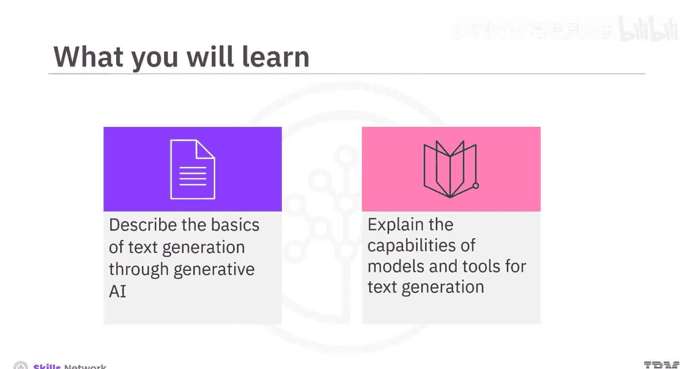
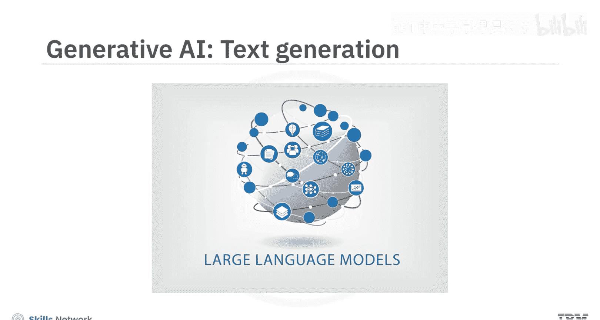
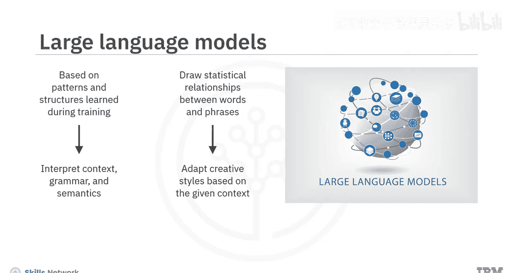
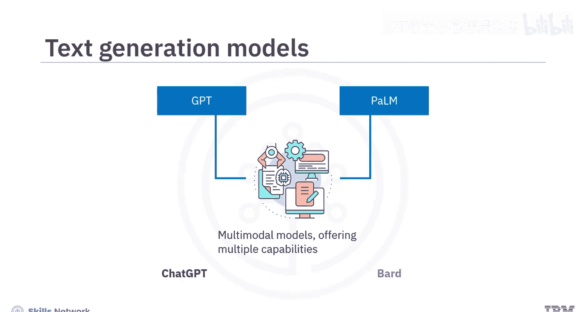
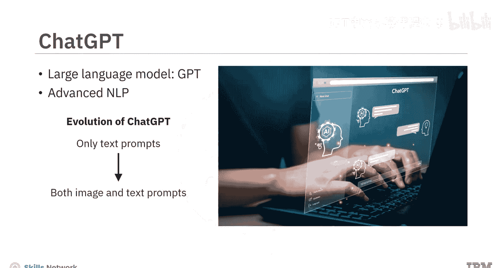
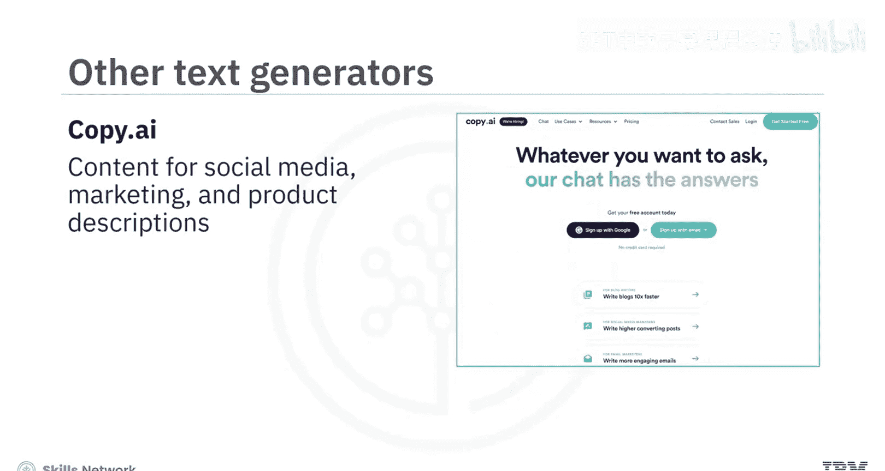
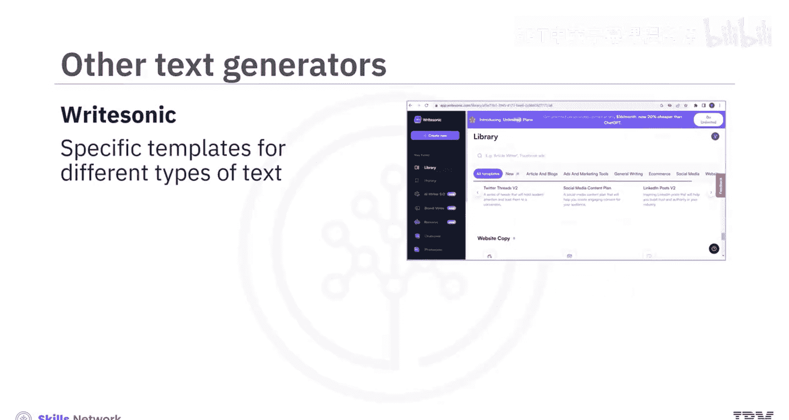

# 010：文本生成工具 📝

在本节课中，我们将要学习生成式AI中的文本生成工具。我们将了解其核心原理、主流模型的能力，并通过具体工具来探索如何生成各种类型的文本。

## 概述

文本生成是生成式AI的核心能力之一。本节将介绍其基础——大语言模型，并探讨以ChatGPT和Bard为代表的主流文本生成工具的关键功能与特点。

---

## 大语言模型（LLMs）基础

生成式AI文本生成能力的核心是大语言模型。这些模型基于训练期间学习到的模式和结构进行工作。

大语言模型能够解读**上下文**、**语法**和**语义**，从而生成连贯且符合语境的文本。它们通过分析词语与短语之间的**统计关系**，来适应不同语境下的创意写作风格。

其核心关系可以概括为：
**输入文本 (Prompt) → LLM (基于统计模式) → 输出文本 (Generated Text)**

许多文本生成模型都基于大语言模型构建，例如生成式预训练变换模型和Pathways语言模型。这些模型已发展为多模态模型，提供多种能力。

---

## 主流文本生成工具

接下来，我们通过两个流行的工具——ChatGPT和Bard，来了解这些模型的具体能力。

### ChatGPT：基于GPT模型的对话引擎

ChatGPT基于GPT大语言模型，并采用了先进的自然语言处理技术。最初，ChatGPT仅接受文本提示来生成新内容；而在新版本中，它已能同时接受图像和文本输入。

ChatGPT为文本生成提供了多样化的能力，尤其擅长进行流畅且基于上下文的对话。

以下是ChatGPT的一些核心应用示例：

*   **进行对话式学习**：你可以像与人交谈一样，通过连续提问来深入学习一个概念。
    *   例如，输入提示：“我听说过生成式AI，想了解更多。” ChatGPT会提供一些基本信息。
    *   接着，你可以基于上下文进一步提问来细化研究，例如：“我如何利用生成式AI来提升我的讲故事技巧？” ChatGPT会根据你提供的上下文和问题给出相应回答。

*   **协助创意任务**：它可以帮助你完成各种创造性工作。
    *   例如，输入提示：“帮我创建一个演示学习平台功能的幻灯片。” ChatGPT会为特定幻灯片提供标题、内容和视觉元素的建议。

*   **多语言支持**：虽然ChatGPT最精通英语，但它也能理解并响应多种其他语言。
    *   例如，提示它“用法语和西班牙语写‘你好’”，它就能生成所需的输出。这使得它成为学习新语言或任何科目的有用工具。

### Google Bard：基于PaLM模型的网络研究助手

另一个流行的文本生成工具是Google Bard。它基于谷歌的先进语言模型PaLM。

PaLM是Transformer模型与谷歌Pathways AI平台的结合体。Pathways AI基于专门的“路径”模块，每个模块负责特定任务，如自然语言处理或机器翻译。除了庞大的文本和代码训练数据集，Bard还能从互联网上的资源中提取信息来响应提示。

你可以尝试不同的提示来探索Bard的能力：

*   **获取信息摘要**：尝试使用提示来获取某个主题的最新新闻摘要。
    *   例如：“提供关于乌克兰战争的最新新闻摘要。”它会为你提供多个回复草稿，你可以选择其中一个或重新生成。

*   **生成创意或解决问题**：尝试让它为某个问题提供策略。
    *   例如，提示它：“为推广一个时尚品牌提供一个数字营销活动策略。”它会提供一个分步进行的营销活动方法。

---

## 工具对比与更多用例

与ChatGPT和Bard交互后，你会发现它们各有侧重：
*   **ChatGPT** 在生成动态响应和维持对话流方面更有效。
*   **Bard** 在研究某个主题的最新新闻或信息方面可能是更好的选择，因为它能通过谷歌搜索和谷歌学术访问网络资源。

需要认识到，包括GPT和PaLM在内的生成式AI模型仍在不断进化，其能力和特性可能会发生变化。

除了ChatGPT和Bard，它们还能胜任许多其他有价值的任务：
*   **数学与问题解决**：它们可以帮助你处理基础数学、统计和通过这些学科解决问题。
*   **金融分析**：它们也精通金融分析、投资研究、预算制定等。
*   **代码生成**：ChatGPT和Bard可以生成代码，并跨各种编程语言和框架执行与代码相关的任务。

---

## 其他文本生成工具简介

市场上还存在许多其他文本生成工具，它们各有专长：

*   **Jasper**：生成任何长度的高质量营销内容，并能贴合品牌声音。
*   **Writesonic**：为不同类型的文本（如文章、博客、广告和营销文案）提供特定模板。
*   **Copy.ai**：擅长为社交媒体、营销和产品描述创建内容。

此外，还有一些针对特定用例的工具：
*   **摘要工具**（如Resoomer）：通过提取关键思想或概念来生成文本摘要。
*   **分类工具**（如YouClassifer）：用于为一段文本分配一个或多个类别。
*   **情感分析工具**（如Brand24）：生成能反映人类语言中所表达的基础情感的文本。
*   **多语言翻译工具**：例如Language Weaver和Yandex Translate。

---

## 隐私考量与开源替代方案

需要注意的是，许多开源的生成式AI工具会收集并审查与其共享的数据，以改进其系统。在与这些工具交互时，这是一个重要的考虑因素，应避免分享任何机密或敏感信息。

那么，我们是否有保护隐私的开源替代方案呢？答案是肯定的。

例如：
*   **GPT4All**：可以安装在你的机器上，作为具有隐私意识的聊天机器人运行，无需互联网或图形处理单元。
*   **H2O AI** 和 **PrivateGPT**：这类聊天机器人旨在通过在没有互联网连接的情况下在本地机器上运行，利用大语言模型的能力来保护用户隐私。

不仅如此，你还可以通过将这些工具链接到你组织的文档和数据库，来为特定组织内部使用进行定制。

---

## 文本生成工具的优势总结

基于生成式AI的文本生成工具提供了诸多好处：
1.  **优秀的学习助手**：它们能提供分步解释。
2.  **提升效率**：能快速生成不同形式的文本，为作者和创作者带来效率。
3.  **激发创造力**：它们能增强创造力并激发新想法。
4.  **充当虚拟助手**：通过实现引人入胜的交互式对话，它们可用作虚拟助理和聊天机器人。
5.  **提高生产力**：通过自动化重复性写作任务，可以提高组织的生产力。
6.  **支持全球化**：借助多语言支持，它们能够为全球受众实现沟通和内容本地化。

---

## 课程总结

本节课中，我们一起学习了文本生成工具的核心知识。

我们了解到，大语言模型通过解读**上下文**、**语法**和**语义**来生成连贯且符合语境的文本，它们是许多生成模型的基础。两个流行的生成工具是OpenAI的ChatGPT（基于GPT模型）和Google的Bard（基于PaLM模型）。ChatGPT和Bard都能生成不同类型的文本、翻译语言，并以交互式和信息丰富的方式回答你的问题。

我们还讨论了一些其他工具，包括Jasper、Copy.ai、Writesonic。在隐私保护方面，开源的文本生成器包括GPT4All、H2O AI和PrivateGPT。