# 011：图像生成工具 🖼️

在本节课中，我们将学习生成式AI在图像生成方面的基本能力，并介绍几种常见的图像生成模型与工具的核心功能。通过学习，你将能够描述这些模型如何工作，并了解如何利用它们来创建和修改图像。

## 概述

生成式AI图像生成模型能够根据文本描述创建全新的图像，并能对真实或生成的图像进行定制化修改，以获得期望的输出。例如，你可以生成一个“小女孩手拿一本书”的图像，随后还可以将书中封面的颜色进行更改。

上一节我们介绍了生成式AI的基本概念，本节中我们来看看它在图像生成领域的具体应用和工具。

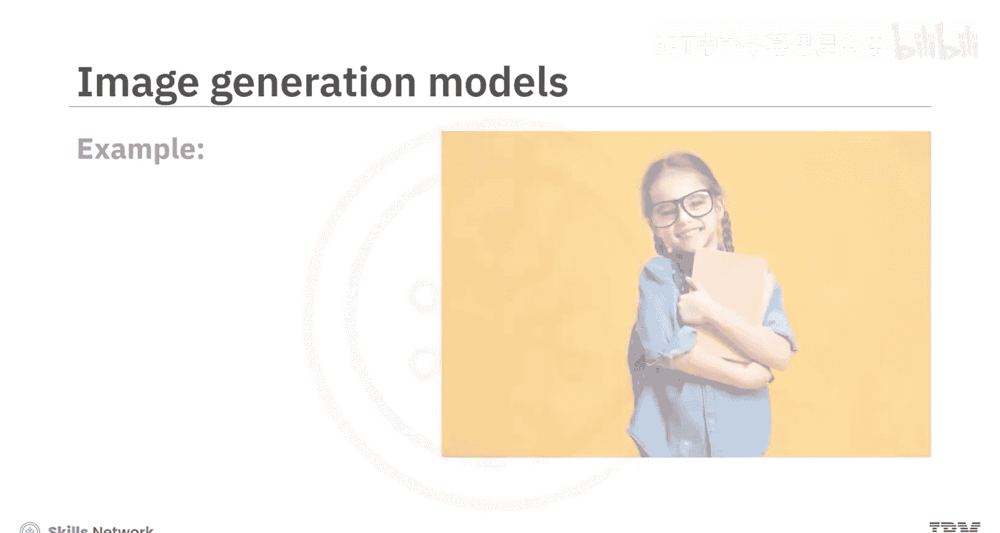

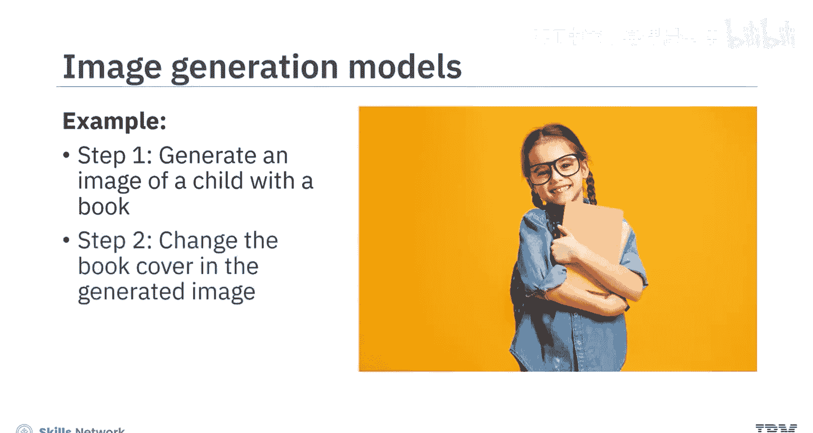

## 图像生成的基本流程

让我们通过一个免费的AI图像生成工具来实际生成一张新图像。你需要输入一段描述你想要的图像的文本提示词。

例如，你可以输入以下提示词：“夕阳下，一艘小船在平静的湖面上航行，周围是郁郁葱葱的绿树和宁静的天空。”

**提示词的质量直接决定了生成图像的准确性与质量。**

选择好风格后，即可生成图像。工具通常会生成多张图像供你选择下载，你也可以通过修改提示词来生成其他图像。

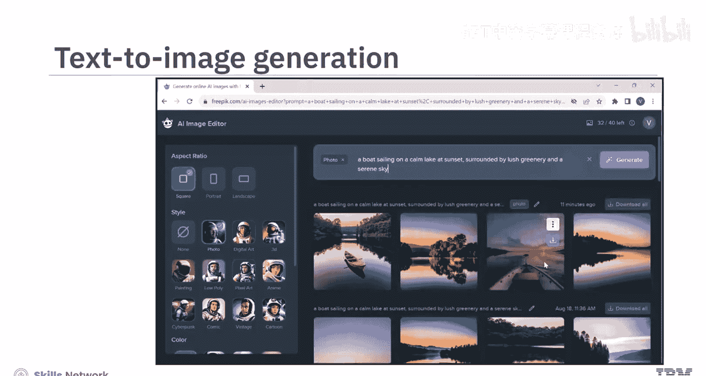

## 图像生成模型的进阶能力

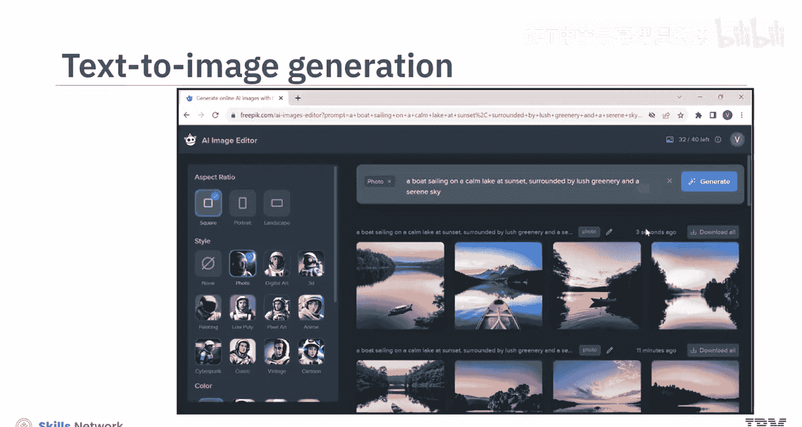

除了基础的文生图，图像生成模型还具备更多高级功能。

### 图像到图像转换

图像到图像转换指的是将一个领域的图像转换到另一个领域，同时保留原始图像的内容和风格。

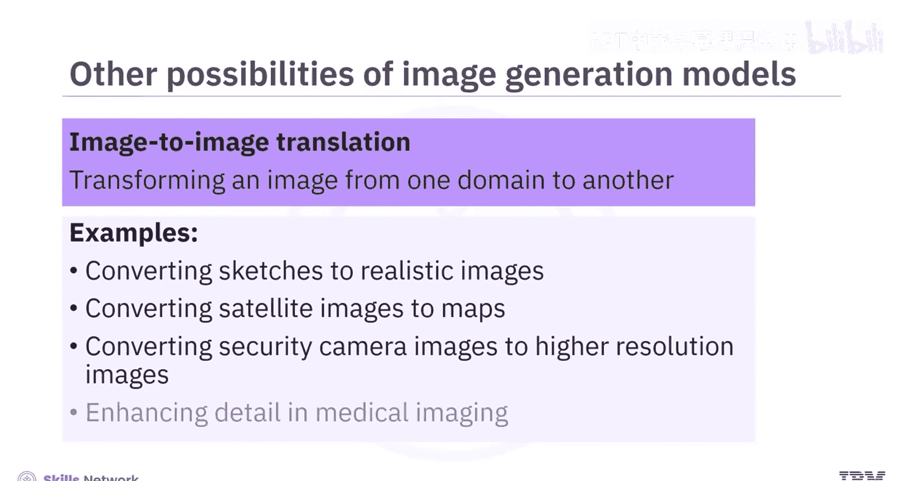

以下是其常见应用场景：
*   将草图转换为逼真的图像。
*   将卫星图像转换为地图。
*   提升安防摄像头图像的分辨率与细节。
*   应用于医学影像增强。

### 风格迁移与融合

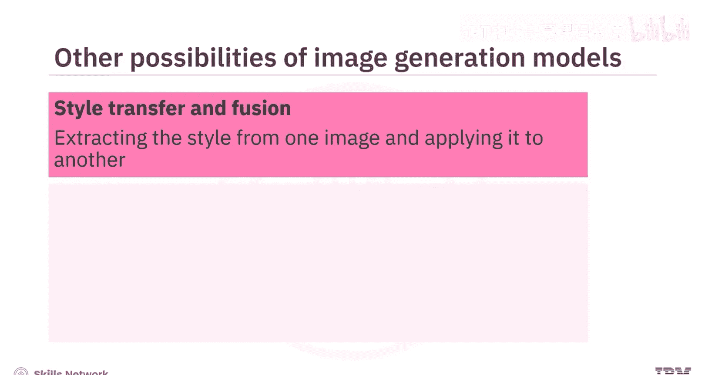

风格迁移与融合涉及提取一张图像的风格，并将其应用到另一张图像上，从而创建混合或融合图像。

例如，将一幅绘画作品的风格应用到一张照片上。

### 图像修复

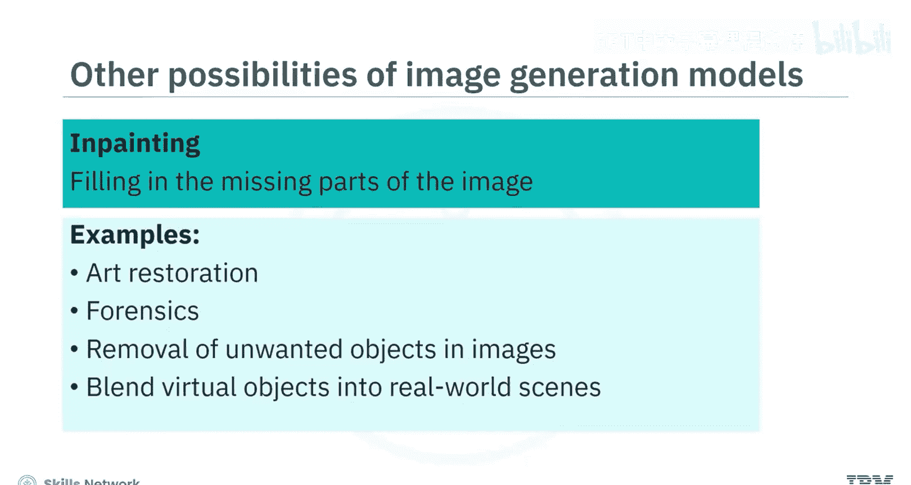

图像修复指的是重建图像中缺失或损坏的部分，使其变得完整。

这项技术可用于：
*   艺术品修复。
*   法证分析。
*   移除图像中不需要的物体，同时保持画面的连续性和上下文。
*   在增强现实中，将虚拟物体无缝融合到真实场景中。

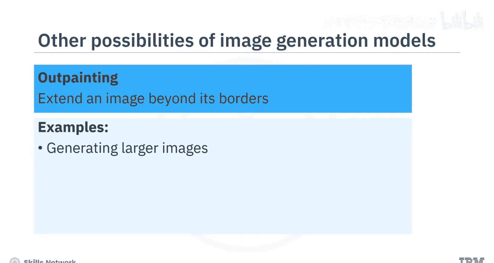

### 图像扩展

图像扩展是指通过生成与原始图像连贯的新部分来扩展原始图像。

这可以用于：
*   生成更大尺寸的图像。
*   提升图像分辨率。
*   创建全景视图。

## 核心图像生成模型

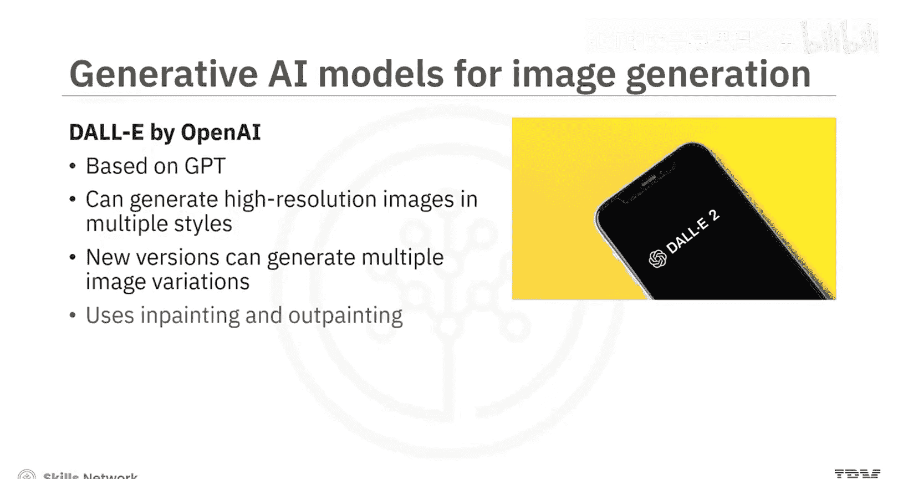

生成模型和工具的图像生成与修改能力，随着其底层模型的进化而不断发展。

### DALL·E 🎨

OpenAI的DALL·E基于在大型图像及其文本描述数据集上训练的GPT模型。DALL·E能够生成多种风格的高分辨率图像，包括逼真的照片和绘画。其新版模型提供了生成多种图像变体，以及通过图像修复和扩展进行图像转换的能力。

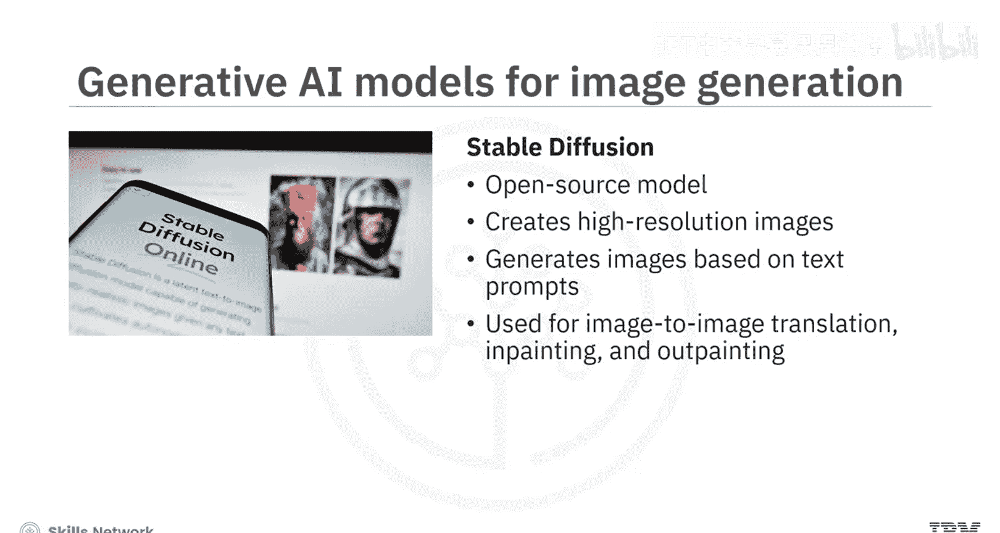

### Stable Diffusion 🌪️

Stable Diffusion是一个开源的文生图扩散模型。扩散模型是一种能够创建高分辨率图像的生成模型。Stable Diffusion主要用于基于文本提示生成图像，但也可用于图像到图像转换、修复和扩展。

其核心过程可以简化为一个逐步去噪的公式：`x_{t-1} = f(x_t, prompt)`，其中模型根据提示词，一步步将随机噪声 `x_T` 转化为目标图像 `x_0`。

### StyleGAN 🎭

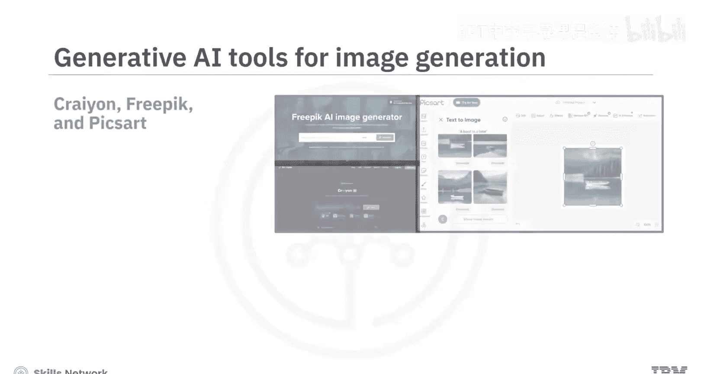

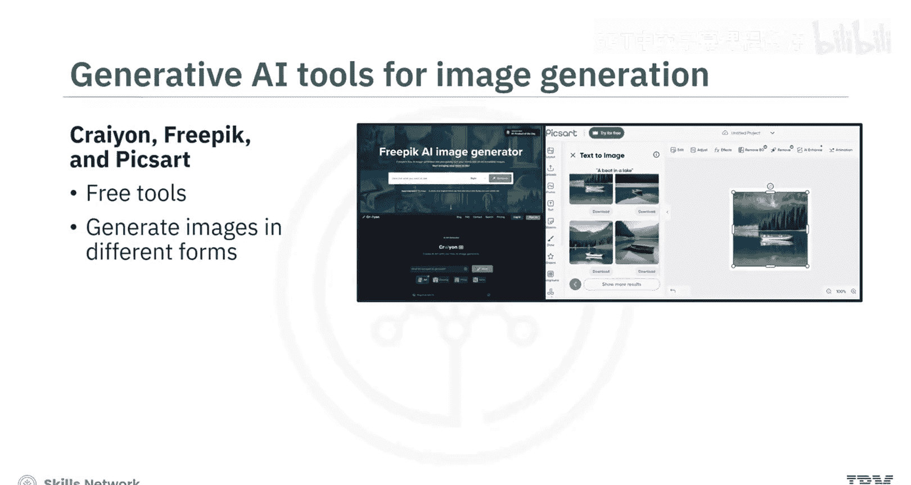

StyleGAN模型将图像内容和图像风格的建模分离开，从而能够精确控制风格，并操纵特定特征（如姿势或面部表情）。StyleGAN已进化到能够生成具有更逼真细节的高分辨率图像。

## 常用图像生成工具

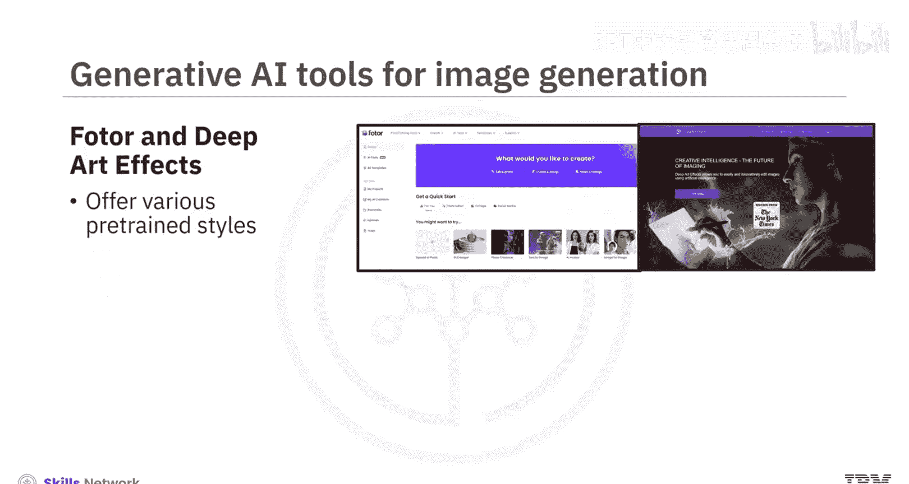

你可以使用一些免费工具来探索生成式AI的文生图能力。

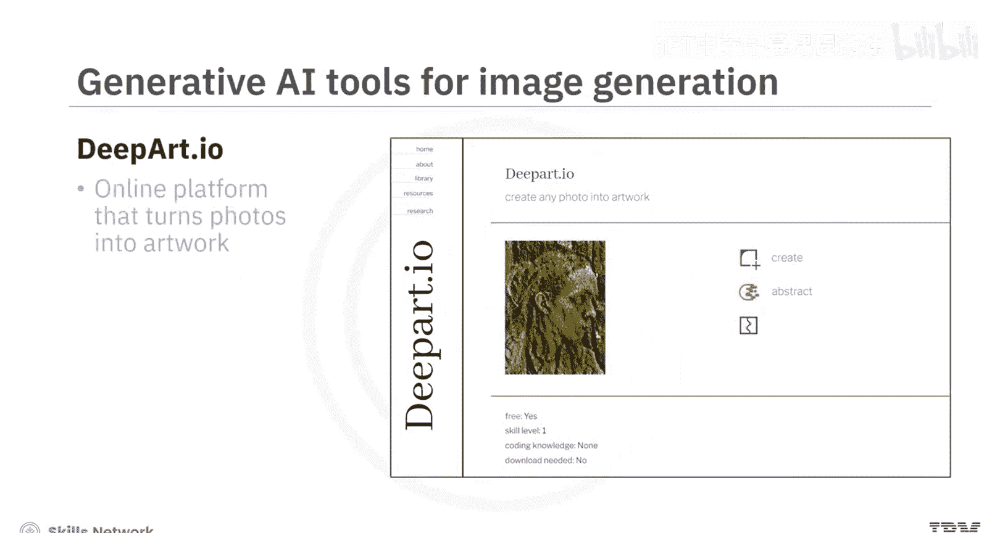

以下是几款流行的免费在线工具：
*   **Craiyon**： 能够生成不同形式和风格的图像。
*   **FreePik**： 提供多种预训练风格，允许你创建自定义风格。
*   **Pixlr**： 一款在线图像编辑器，集成了AI生成功能。

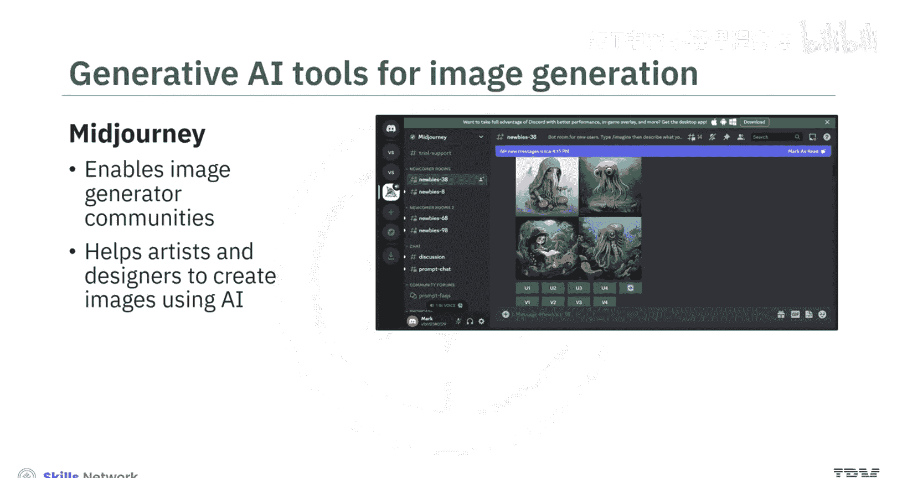

### 风格化与社区平台

除了基础生成，还有一些专注于特定领域的工具。

**DeepArt.io** 是一个在线平台，可以将照片转化为不同艺术风格的作品。

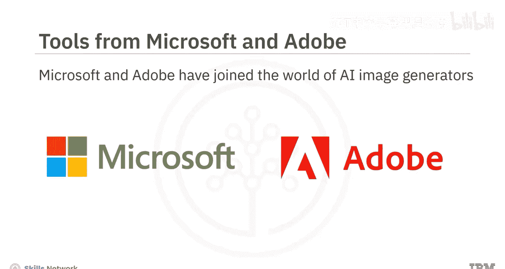

**MidJourney** 是一个平台，它构建了一个图像生成社区，帮助艺术家和设计师使用AI创作图像，并探索彼此的作品。

### API集成

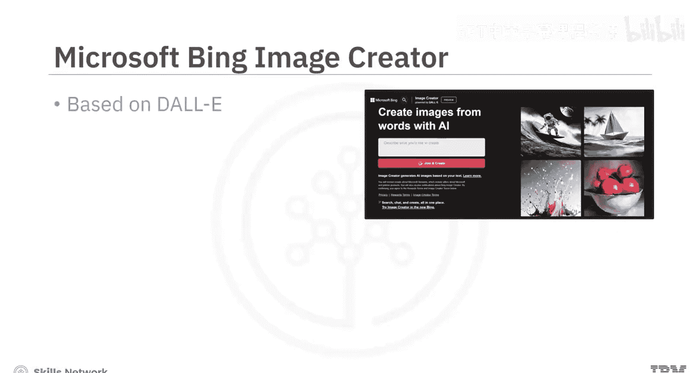

许多生成式AI图像生成器也提供应用程序接口，允许将它们的功能嵌入到不同的软件程序和工具中。

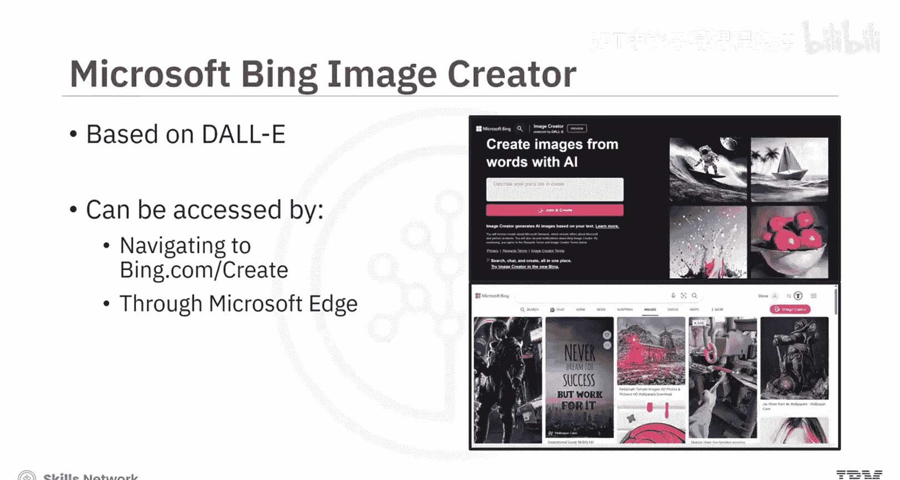

一些提供API的流行图像生成器包括：
*   DALL·E
*   MidJourney
*   Craiyon

## 科技巨头的入场

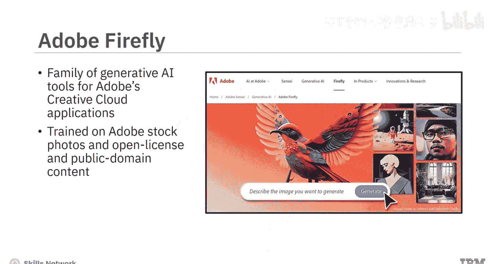

微软和Adobe等科技巨头也已进入AI图像生成器领域。

### 微软 Bing Image Creator 🖥️

微软Bing图像生成器基于DALL·E模型。你可以通过访问Bing.com/create或通过Microsoft Edge浏览器来使用该工具。这使得Microsoft Edge成为首个集成AI图像生成器的浏览器。

### Adobe Firefly 🔥

Adobe Firefly是专为与Adobe创意云应用程序（如Photoshop和Illustrator）集成而设计的一系列生成式AI工具。Firefly使用Adobe Stock图片、开放许可内容和公共领域内容进行训练。

Firefly支持超过100种语言的文本提示，并包含多种工具，允许你操控颜色、色调、光照、构图，以及进行生成式填充、文本效果、生成式重新着色、3D转图像和图像扩展等操作。

## 总结

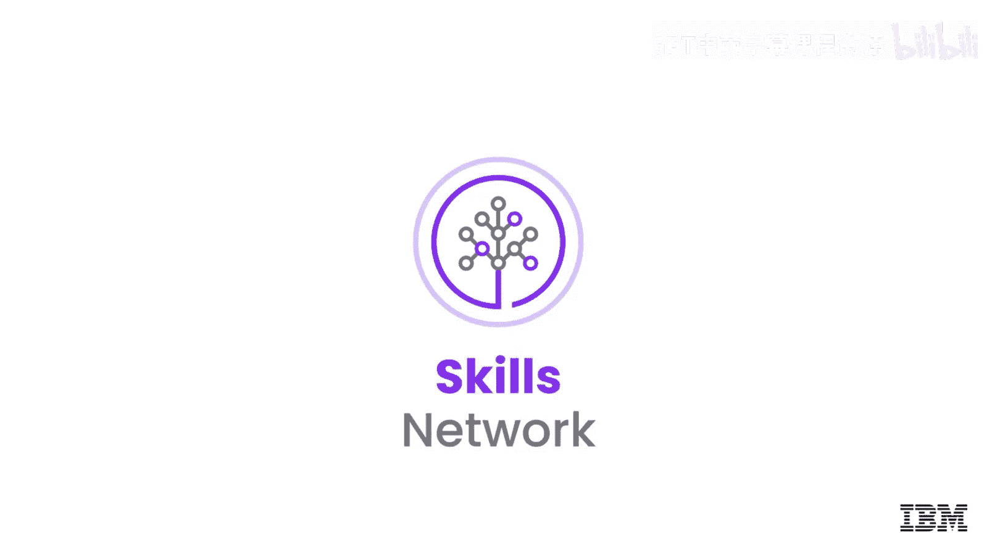

本节课中我们一起学习了生成式AI在图像生成领域的应用。我们了解到，基于生成式AI的模型和工具可以通过文本或图像提示来生成新图像，并提供图像到图像转换、风格迁移、图像修复和扩展等能力。几种重要的图像生成模型包括DALL·E、Stable Diffusion和StyleGAN。市场上有多种图像生成工具可供选择，它们提供了多样化的图像生成和转换功能。部分图像生成器还能以API形式集成。此外，我们还了解到Adobe Firefly这类专为与创意软件深度集成而设计的生成式AI工具套件。