# 012：音视频生成工具 🎵🎬

在本节课中，我们将学习生成式AI在音频和视频创作领域的应用。你将了解这些工具如何生成富有影响力的媒体内容，掌握其主要功能，并探索生成式AI重塑虚拟世界的能力。

---

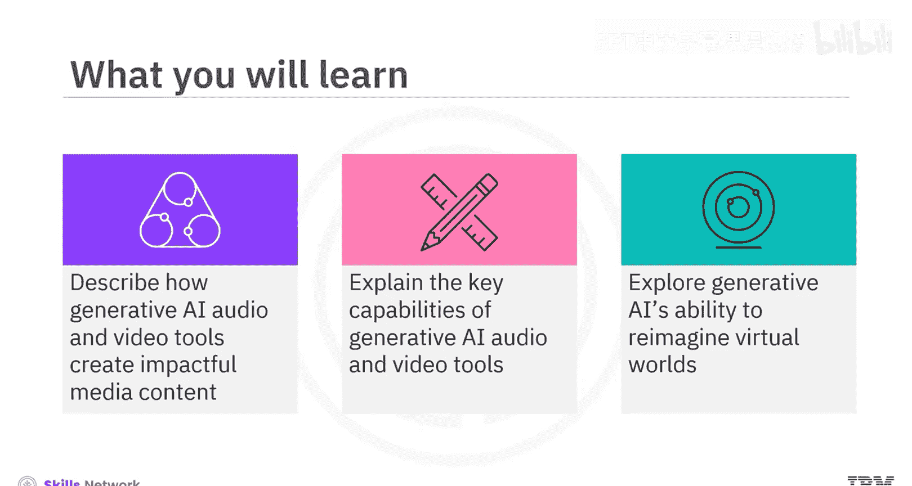

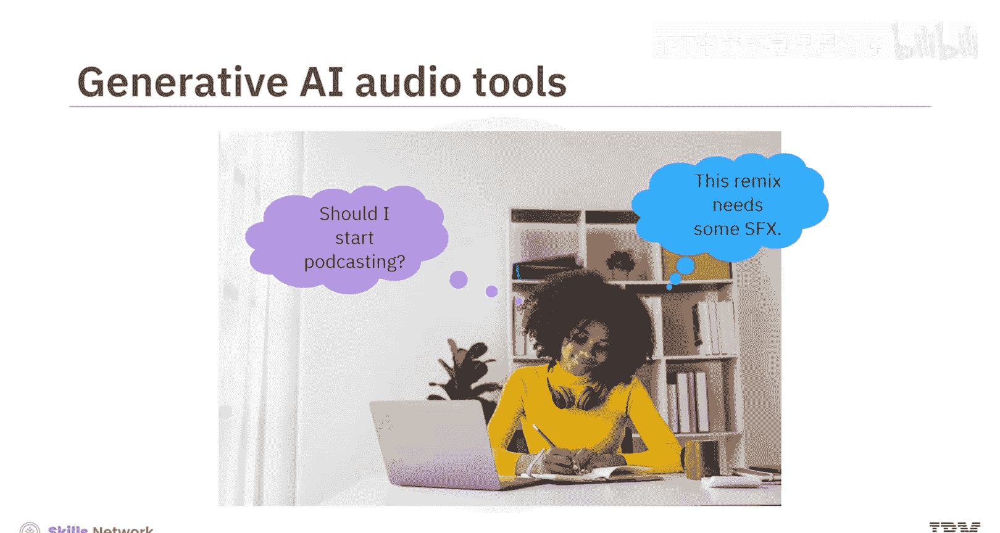

## 音频生成工具

上一节我们介绍了生成式AI的概况，本节中我们来看看它在音频生成方面的具体应用。生成式AI音频工具能够帮助公司和个人，无论其经验如何，简化流程，将复杂的创意变为现实。

以下是生成式AI音频工具的三个主要类别：

1.  **语音生成工具**：这类工具主要是文本转语音工具，能将文本转换为音频。虽然朗读技术并非全新，但生成式AI架构升级了其工作方式。深度学习算法在大量人类语音数据集上反复训练，使其能够分解并高效复制发音、语速、情感和语调等声音特征。因此，生成式AI文本转语音工具能创造出更准确、更自然的语音。
2.  **音乐创作工具**：这些工具允许你从广泛的音乐库中选择不同的音乐流派、乐器风格和旋律。你只需输入基于需求的文本提示，工具便能创作简短的旋律或即兴重复段、建议或添加乐器、创作新歌曲，或为你的视频制作配乐。
3.  **音频增强工具**：这类工具经过预训练，能够识别特定声音，可以为你的音频添加有趣的声音效果，或去除不需要的噪音。例如，它们可以帮助去除背景噪音、增强低质量录音，并添加所需的音效。

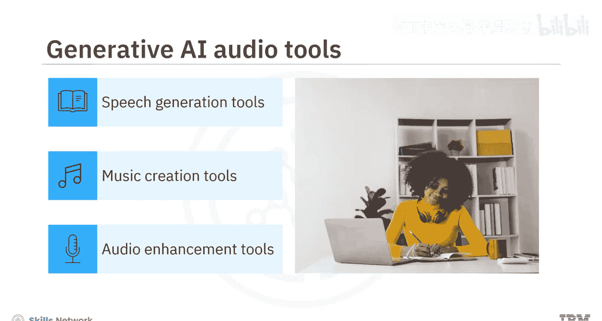

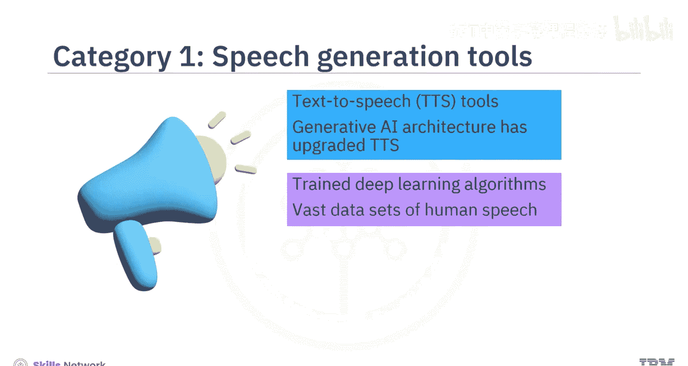

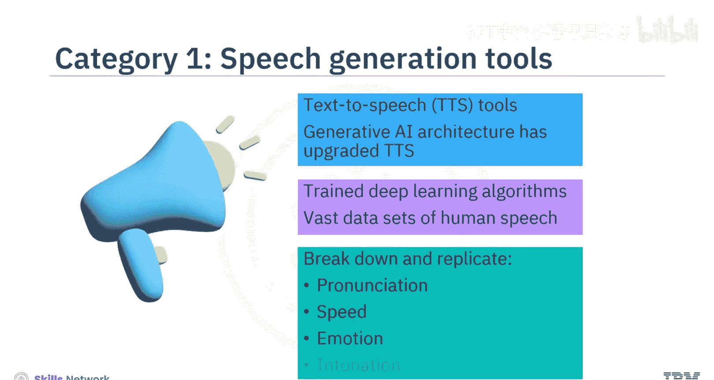

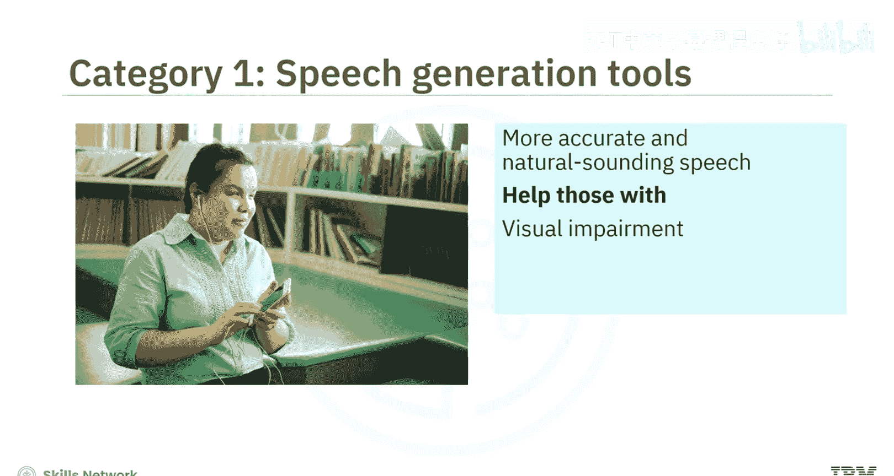

许多音乐生成工具也具备音频编辑和增强功能。

---

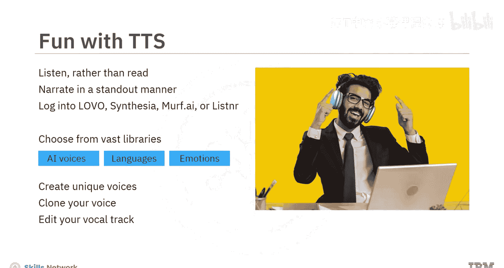

## 视频生成工具

了解了音频工具后，我们转向视频生成。有些项目需要的不仅仅是精选的音效。生成式AI视频工具可以在日常生活中使用。

以下是使用生成式AI视频工具的几种方式：

*   你可以使用工具将现有视频片段转换为不同风格。
*   你可以使用文本、图像或视频输入来创建视频。
*   你可以上传照片，如果没有照片，可以使用文本提示生成所需图像。
*   你可以录制旁白、增强音频、转换视频文件格式并发布视频。
*   你甚至可以创建自定义虚拟形象以增强品牌辨识度。

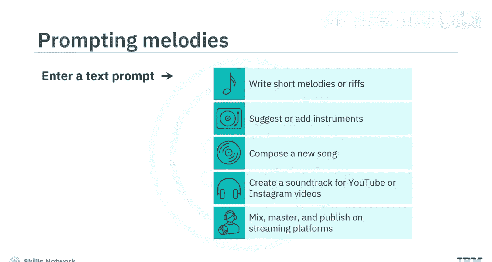

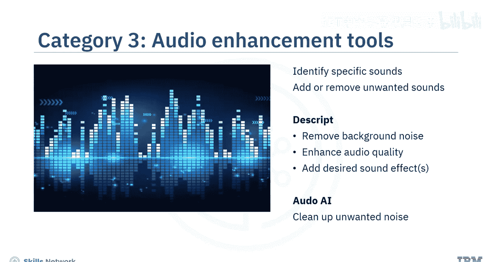

---

## 虚拟世界增强

生成式AI不仅能创作音视频，还能增强你的虚拟世界体验。你可以创建具有混合特征和异域风情的独特虚拟世界。

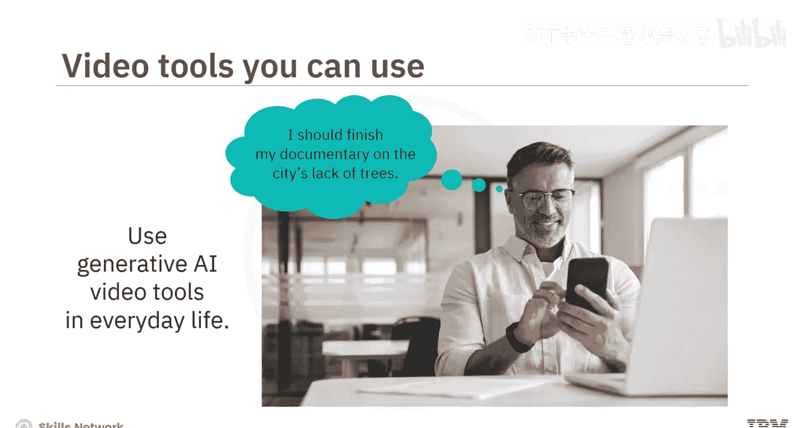

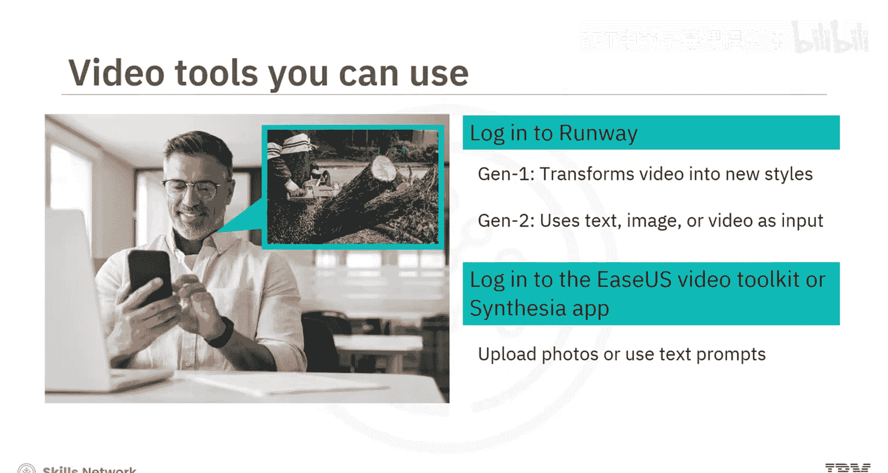

以下是生成式AI在虚拟世界中的应用：

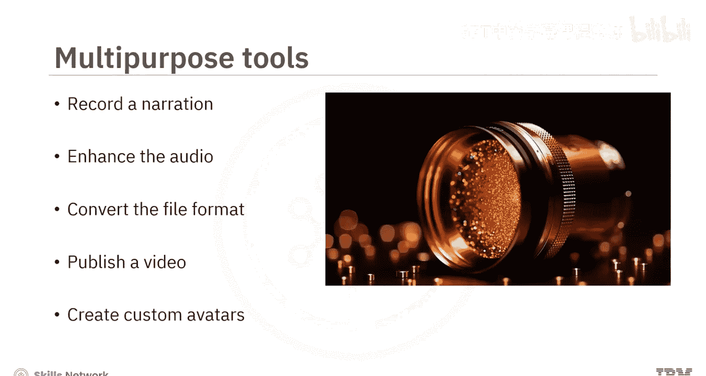

*   **生成个性化体验**：元宇宙平台利用生成式AI创造更个性化、更具吸引力的用户体验。
*   **快速生成3D内容**：游戏元宇宙允许你快速生成3D对象，甚至创建具有特定个性特征的虚拟形象，这些特征会体现在其表情、行为和决策中。
*   **构建与连接**：例如，有些平台是一个元宇宙，用户可以在其中即时构建、拥有并向全球推广他们的游戏。另一些工具则帮助创建和连接定制的移动游戏资产。

---

## 总结

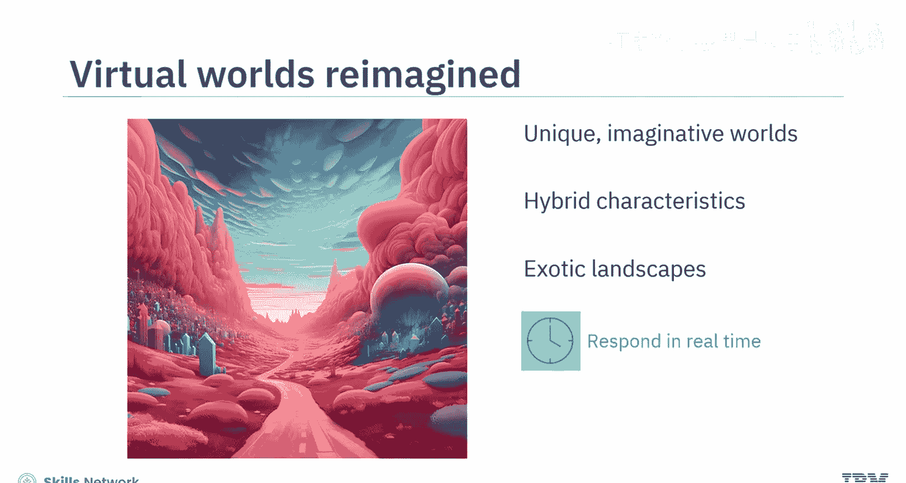

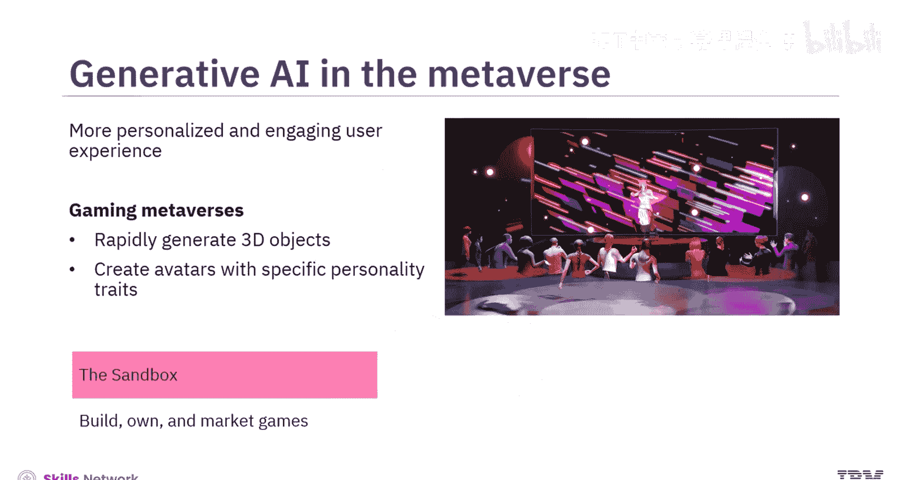

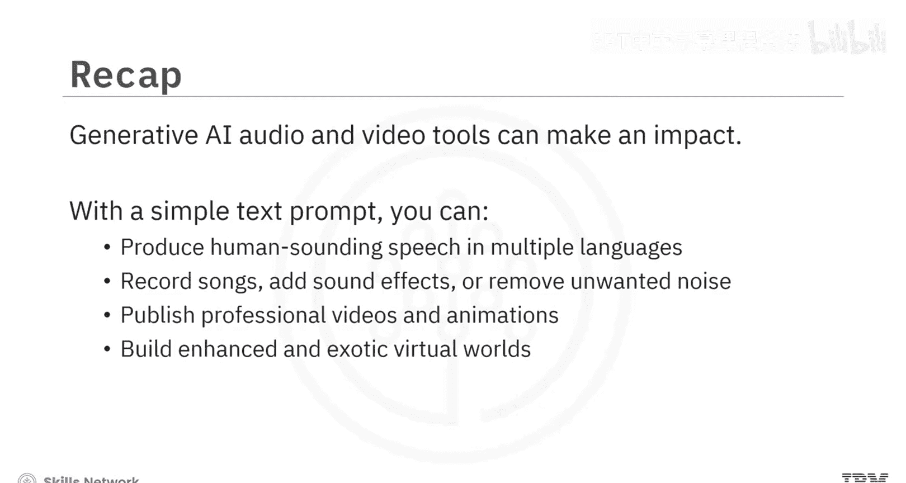

本节课中，我们一起学习了生成式AI音视频工具如何产生影响。通过简单的文本提示，你可以生成多种语言的人声语音、录制歌曲、添加音效或去除噪音。你还可以制作视频和动画，构建增强版的和充满异域风情的虚拟世界。