# 013：代码生成工具 🛠️

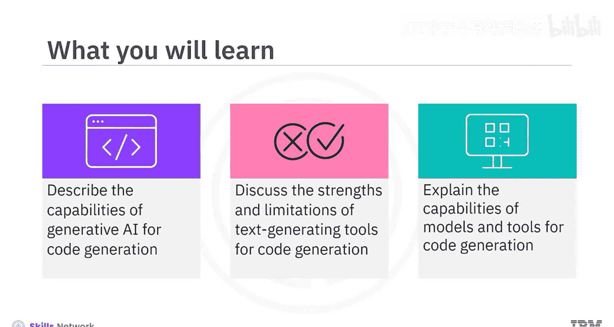

在本节课中，我们将学习生成式AI在代码生成方面的基本能力，探讨相关工具的优势与局限，并介绍几种常见的代码生成模型和工具。

## 概述

生成式AI模型和工具能够基于自然语言输入生成代码。它们基于深度学习和自然语言处理技术，理解上下文并生成符合语境的代码。这些工具不仅能生成新代码片段，还能优化现有代码、进行跨语言转换，并协助调试和文档编写。

## 代码生成的核心能力

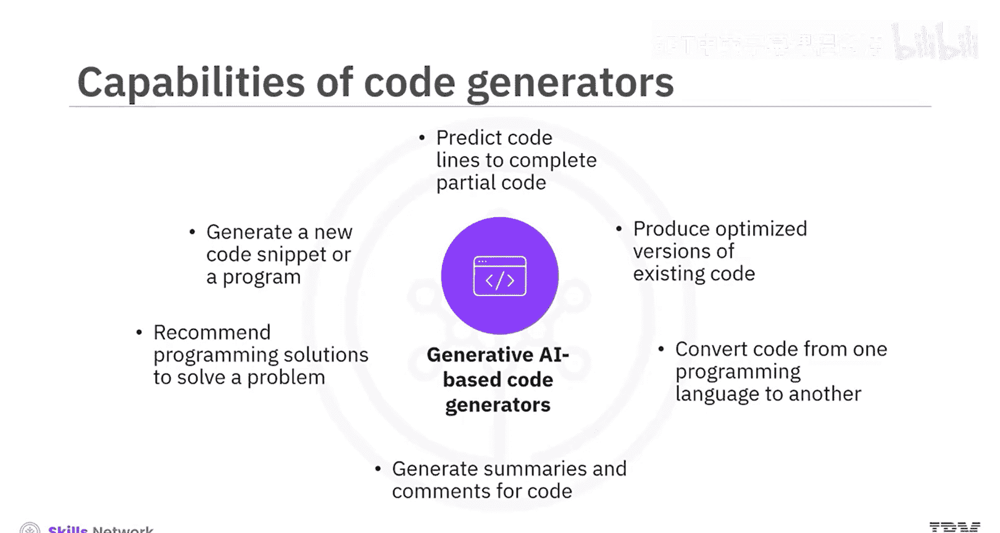

以下是生成式AI代码工具的主要功能：

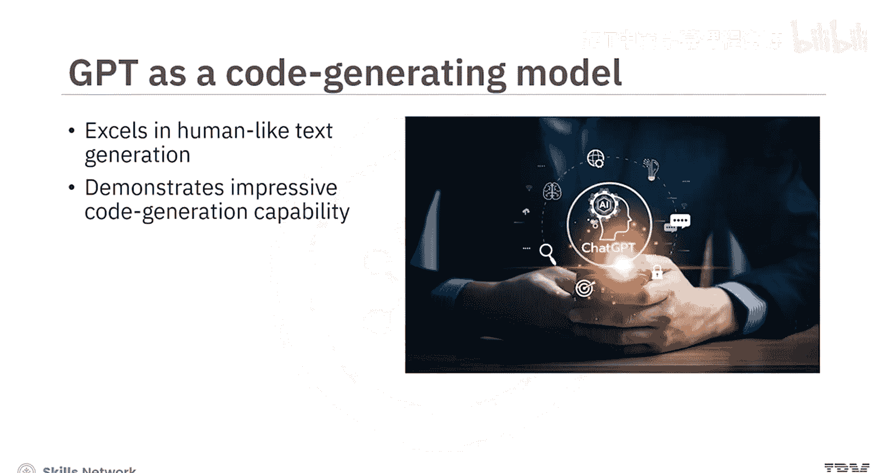

*   **生成新代码**：根据文本提示生成全新的代码片段或程序。
*   **代码补全**：预测并补全部分编写的代码片段。
*   **代码优化**：生成现有代码的优化版本。
*   **代码转换**：将代码从一种编程语言转换为另一种。
*   **生成文档**：为代码生成摘要和注释，以改进文档。
*   **提供解决方案**：描述待解决的问题，工具会推荐算法、数据结构和合适的编程方法。

## 通用文本模型的代码生成能力

上一节我们介绍了代码生成的基本功能，本节中我们来看看像GPT这样的通用文本模型在代码生成方面的表现。

OpenAI的GPT模型在类人文本生成方面表现出色，在代码创建方面也展示了令人印象深刻的能力。

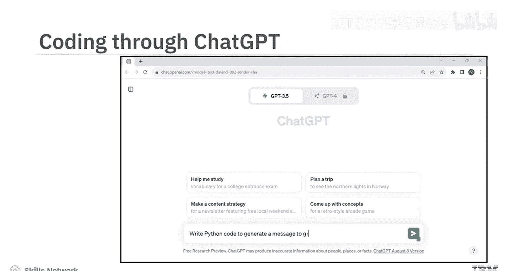

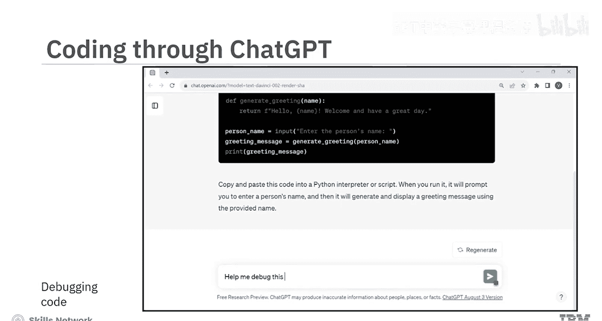

例如，通过基于GPT的ChatGPT工具生成简单的Python代码。当你输入提示：“写一段Python代码来生成问候某人的消息”，ChatGPT会生成相应的代码。有趣的是，它还会提供如何运行这段代码的指导。

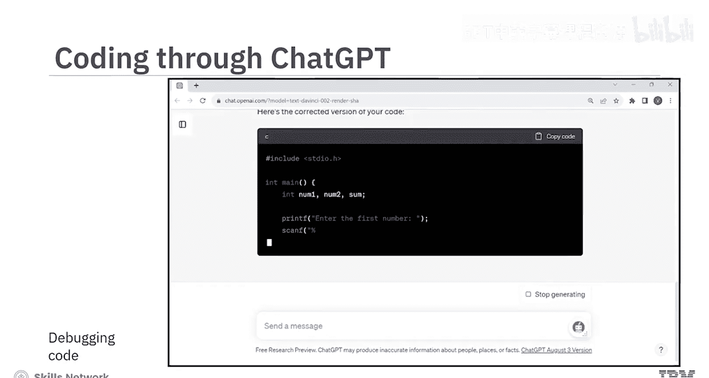

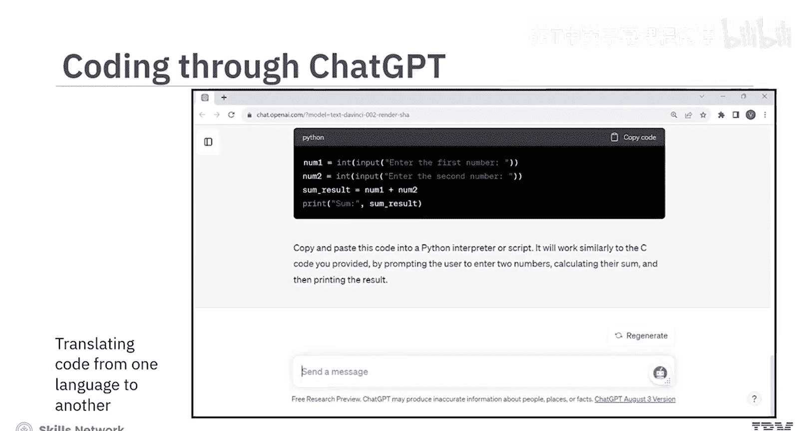

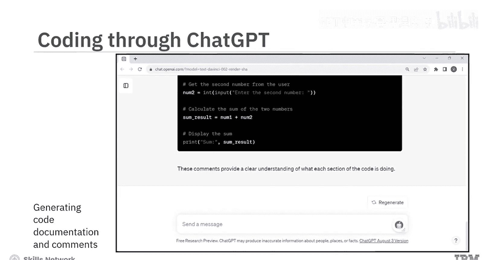

**重要提示**：为了生成有效的代码，你需要提供清晰的提示，指定编程语言，并说明其他相关的要求和约束。

为了演示GPT如何帮助调试代码，可以在ChatGPT中输入错误的代码作为文本提示。ChatGPT会提供正确的代码，并解释所做的修正。

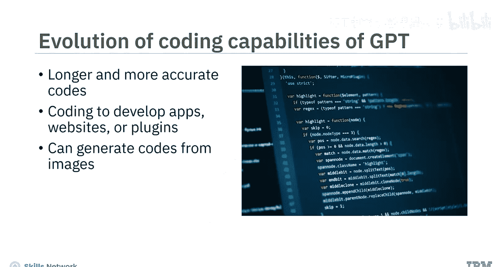

GPT还能够将代码从一种编程语言翻译到另一种，并生成代码文档和注释以提高可读性。

基于GPT的模型和工具已经发展到能够生成更长、更准确的代码。这使得开发者可以利用这些模型和工具来开发应用程序、网站和插件。此外，GPT的演进使其能够根据图像生成代码。例如，你可以输入课程大纲的图片，来生成一个功能完整的应用程序代码。

Google的Gemini也提供了代码生成和调试功能，支持超过20种编程语言。

ChatGPT和Gemini是学习新编程语言的宝贵工具，因为它们能提供逐步的详细解释以帮助理解。它们擅长生成具有基本逻辑和编程概念的代码。然而，它们可能无法从头开始生成大型或复杂的代码。虽然这些工具理解编程概念和语法，但可能无法完全理解语义。因此，生成的代码可能在技术上是准确的，但仍可能无法按预期运行。

**需要注意**：这些模型的知识受限于其训练数据。特定版本的GPT可能不了解其训练后发布的编程框架和库。例如，GPT-3.5的知识截止日期是2021年9月。因此，如果你需要生成更新版本的代码，可以考虑使用专门为代码生成设计的模型和工具。

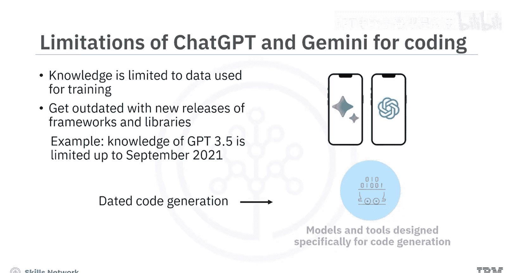

## 专用代码生成工具

了解了通用模型的局限性后，我们来看看一些专门为代码生成设计的工具。

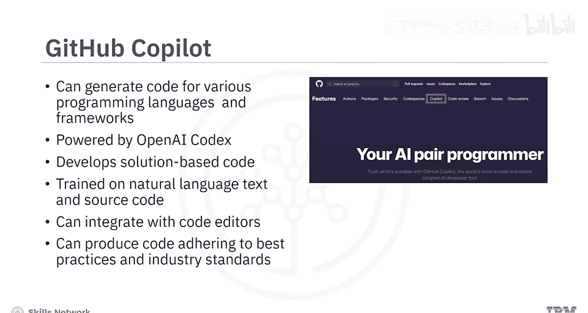

### GitHub Copilot 🤖

GitHub Copilot是一个AI代码生成器，可以根据多种编程语言和框架生成代码。它由OpenAI Codex驱动，Codex是一个生成式预训练语言模型，帮助开发者生成基于解决方案的代码。Copilot在自然语言文本和公开来源（包括GitHub仓库）的源代码上进行训练。它可以作为扩展集成到流行的代码编辑器（如Visual Studio）中，并能生成遵循最佳实践和行业标准的代码片段。

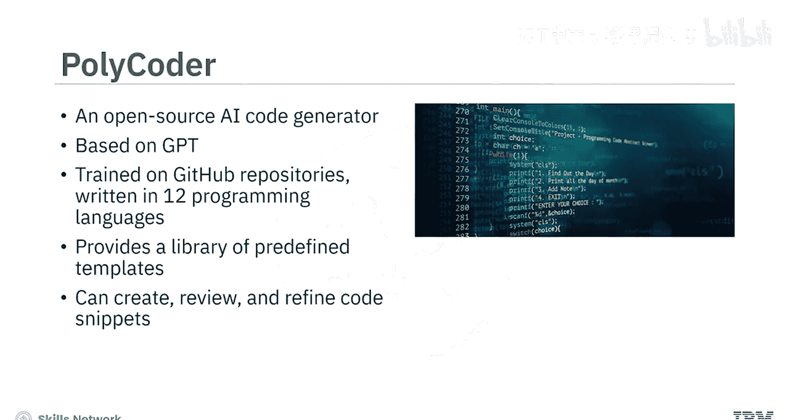

### Polycoder 💻

Polycoder是一个开源的AI代码生成器。它基于GPT模型，并在用12种编程语言编写的各种GitHub仓库数据上进行了训练。它在编写C语言代码方面特别准确。Polycoder提供了一个广泛的预定义模板库，可作为各种用例代码生成的蓝图。它可以帮助创建、审查和精确定制符合要求的代码片段。

### IBM Watson Code Assistant ☁️

不同的代码生成器提供特定的功能和特性。然而，当需求是让混合云开发者编写满足多样化需求的代码时，IBM Watson Code Assistant是一个选择。它建立在IBM watsonx.ai的基础模型之上，适用于任何技能水平的开发者。

你可以将Watson Code Assistant与代码编辑器集成。它使开发者能够通过实时推荐、自动补全功能和代码重构辅助，准确高效地编写代码。此外，你可以将代码或项目文件输入Watson Code Assistant进行分析。它会识别模式、提出改进建议并生成代码片段或模板。开发者可以为特定项目需求定制生成的代码。

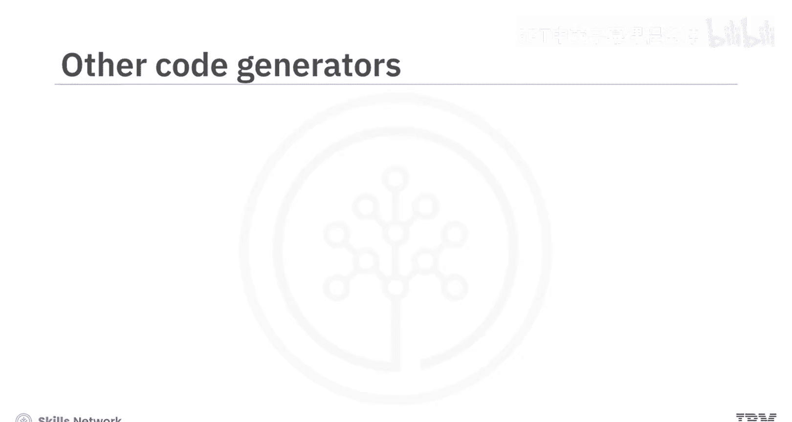

## 其他工具与优势

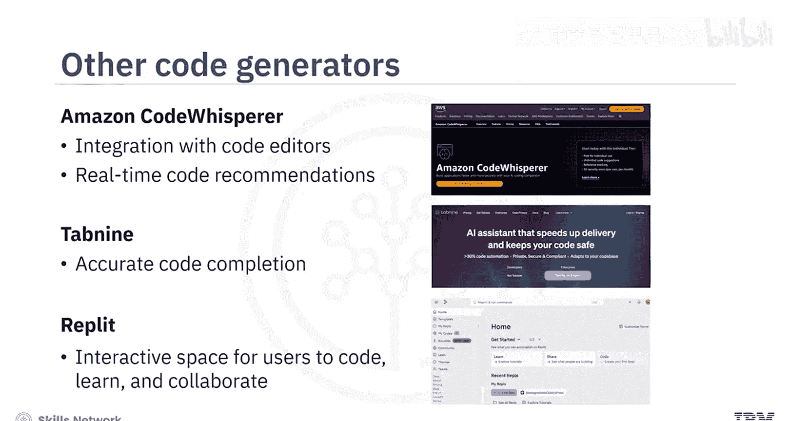

除了上述工具，还有许多其他AI驱动的代码生成器和代码助手工具可以帮助开发者更快地编写准确代码。

*   **Amazon CodeWhisperer**：可以集成到代码编辑器中，提供实时代码推荐。
*   **Tabnine**：有助于实现准确的代码补全。
*   **Replit**：一个为用户提供编码、学习和协作的交互式空间的平台。

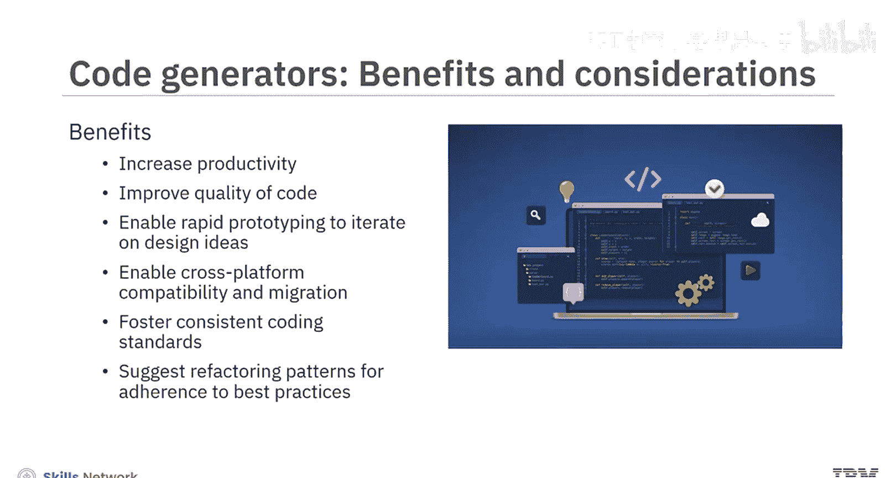

## 优势与注意事项

具有自动代码编写和优化功能的基于AI的代码生成器，帮助开发者提高了生产力和代码质量。它们支持快速原型设计以迭代设计想法。这些工具还通过支持多语言代码翻译，有助于实现跨平台兼容性和迁移。基于AI的代码生成器遵循一致的模式和编码标准，可以建议重构模式以遵循最佳实践。

**然而**，使用这些工具时需要谨慎，以确保AI生成的代码不会导致伦理问题，例如安全漏洞，因为这些工具可能被用于生成恶意代码，或者其训练数据可能存在偏见。

## 总结

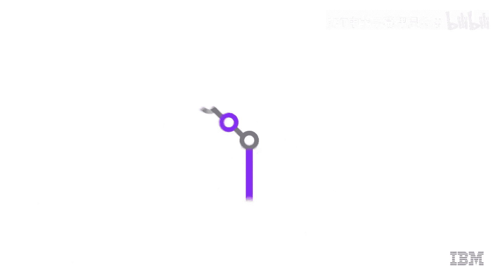

本节课中，我们一起学习了基于生成式AI的模型和工具可以根据文本和图像提示生成新代码、优化现有代码并生成基于解决方案的代码。ChatGPT和Gemini适用于简单的代码生成、调试和学习编程。而GitHub Copilot、Polycoder和IBM Watson Code Assistant等主流代码生成器则提供了实时推荐、代码重构和解决方案模板等多样化功能。总体而言，代码生成器提高了生产力，加速了开发周期，促进了编码最佳实践，并培养了统一的编码标准。