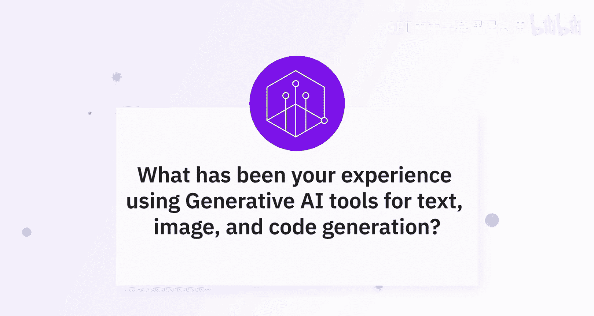
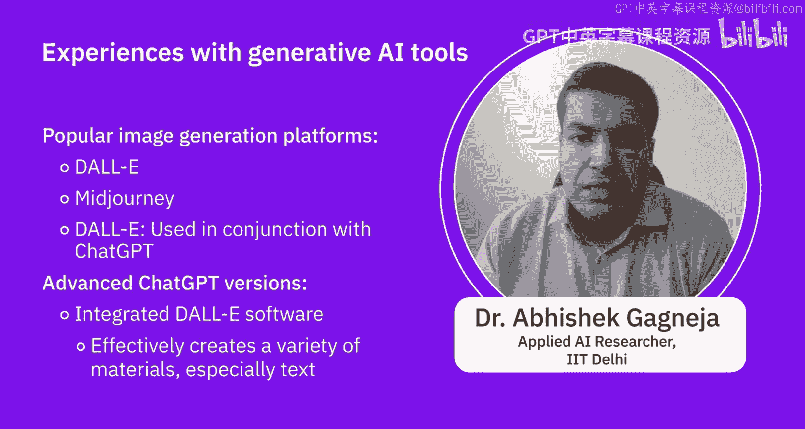

# 014：生成式AI工具的有效运用 🧠

在本节课中，我们将学习AI专家们分享的使用生成式AI工具（如文本、图像和代码生成工具）的个人经验，并探讨这些工具的优势与挑战。

## 专家经验分享 🗣️

上一节我们介绍了课程背景，本节中我们来听听AI专业人士的实际使用体验。

一位专家分享道，他尝试了多种生成式AI工具，涵盖文本、代码、图像、视频、音乐和3D文件生成等领域。他明确指出，就首次尝试即能获得满意结果而言，**文本生成**和**代码生成**是目前表现最好的领域。这不仅因为这些模型感觉上经过了更多优化，也因为市面上有更多关于如何**设计提示词（prompt）** 以获得优质输出的指导。

## 工具选择与模型多样性 🛠️

没有哪个单一的大型语言模型能够应对所有生成式AI用例。因此，针对任何特定任务，都可以考虑并使用多种大型语言模型。这些模型或由开源社区提供，或由具备训练能力的组织发布。此外，还存在**微调（fine-tuning）** 的概念，这意味着你可以考虑使用一个大型语言模型，并针对你的数据或客户数据进行微调，而无需巨大的计算资源或海量数据。

以下是不同生成任务的主流工具选择：

**文本生成**：基于GPT-3的ChatGPT模型和Google Bard是非常流行的平台，它们也具备代码生成能力。然而，在代码生成方面，GitHub Copilot表现更佳。其他常用工具还包括Copilot AI、Jasper、Phrasee IO和MS Copilot。

**图像生成**：视觉领域可分为图像生成、视频生成和设计生成三类。对于图像生成，DALL-E是最受欢迎的工具之一。从平台角度看，Midjourney也非常流行。值得注意的是，DALL-E可以与ChatGPT结合使用，且ChatGPT的高级版本正逐步集成DALL-E功能。

**代码生成**：除了上述提到的ChatGPT和GitHub Copilot，专门用于此用例的大型语言模型还包括Microsoft Copilot、IBM Watson Code Assistant、Ponicoder和OpenAI Codex。

这些是流行的选择，对于创建你所需的任何材料（特别是文本）来说，它们已经足够好。

## 优势与挑战 ⚖️

接下来，让我们探讨使用生成式AI工具的几点好处与挑战。

**优势**在于它们可以帮助你创建一个良好的基线，用于开发你的内容。当然，你不能完全依赖这些技术，因为所有生成的内容都存在局限性。

**挑战**则体现在更小众的领域，尤其是音乐或3D文件/模型生成。在这些领域，通常更难获得你想要的结果，生成过程耗时更长，并且目前需要更多的试错。专家明确预见，未来情况会变得更简单、更好，并且更重要的是走向**多模态（multimodal）**，即通过单一界面无缝处理所有不同类型的生成任务。但就目前而言，他建议尽可能尝试所有工具，即使你现在不感兴趣，因为未来它们可能会变得非常有用。

## 总结 📝

本节课中，我们一起学习了AI专家使用各类生成式AI工具（文本、图像、代码）的实践经验，了解了针对不同任务应如何选择工具和模型，并分析了当前使用这些工具的优势与面临的挑战。关键要点是：文本和代码生成相对成熟，需善用提示词技巧；没有万能模型，可根据任务选择或微调；面对新兴领域需保持耐心并积极尝试。