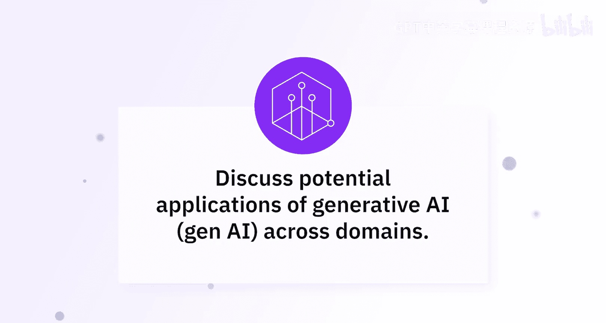
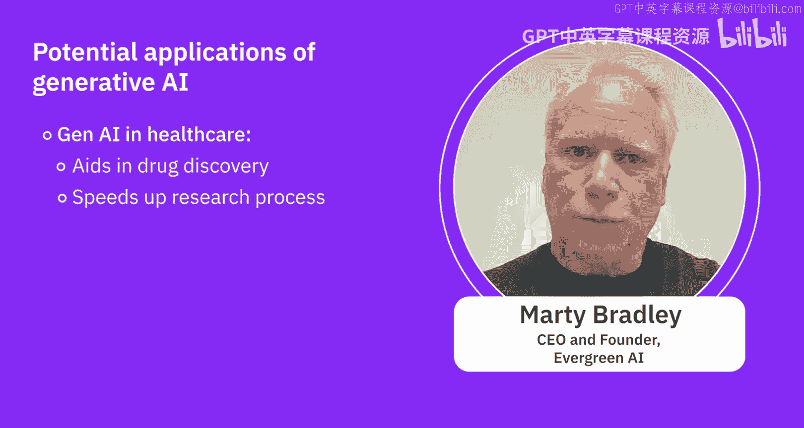
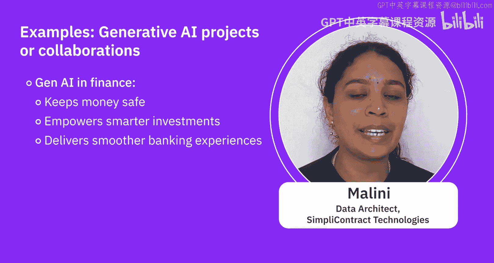

# 015：跨领域生成式AI应用探索 🧠

在本节课中，我们将聆听专家们的见解，共同探索生成式AI在不同行业领域的潜在应用。我们将看到，这项技术远不止于文本生成，它正在深刻改变教育、金融、医疗等多个关键领域的工作方式。

---

## 概述：无处不在的生成式AI

生成式AI几乎在每一个行业都拥有潜在的应用前景。为了深入理解，我们将跟随专家的视角，聚焦几个特定领域进行探讨。

---

## 教育领域的应用 🎓

上一节我们提到了生成式AI的广泛潜力，本节中我们来看看它在教育领域的具体实践。

在Skill Network，我们已经开始在多个环节实施生成式AI。我们不仅开发了能够自动批改作业和测验的工具，更重要的是，它能在学习者答错时提供反馈。借助生成式AI，这几乎可以零成本实现。我们只需设计一个提示词，例如：“请根据以下评分标准批改此作业，如有错误，请生成一段文字帮助学习者从错误中学习。”

此外，我们还有一个名为“TI”的个人导师，它是一位AI助教，可以解答你遇到的几乎所有问题。例如，当你在实验中卡住、不知如何继续，或遇到错误信息时，只需将错误信息交给TI，它就会帮助你解决问题——无论是定位代码中的错误，还是提供修复思路。这创造了一种双向互动模式，让你能即时提问并获得帮助，无需在留言板上等待数天或数周。

更重要的是，有了这位全程陪伴的个人导师，你能够随时获得作业的批改和反馈。这对我们而言非常实用，因为有些课程拥有成千上万甚至更多的学习者，仅凭有限数量的讲师和助教，根本不可能批改如此多的作业。生成式AI有效地填补了这一空白。

以下是生成式AI在教育中的核心应用方式：
*   **自动评分与反馈**：使用提示词工程，让AI根据评分标准批改作业并提供个性化学习建议。
*   **个人AI助教**：构建一个能够实时回答技术问题、调试代码的对话式助手。
*   **规模化教学支持**：解决大规模在线课程中师资不足的问题，为每位学习者提供即时支持。

---

## 金融领域的变革 💹

了解了教育领域的创新后，我们转向金融世界，看看生成式AI如何改变游戏规则。

生成式AI正在改变金融世界。首先，它像一名侦探，能够识别交易中的可疑活动以防止欺诈。其次，它通过分析海量市场运作数据，帮助交易员做出更明智的决策。此外，它还驱动着你在网上看到的那些友好的聊天机器人，帮助客户处理咨询和交易。

像摩根大通和高盛这样的大型机构已经在使用生成式AI。摩根大通的“COIN”系统用于快速理解法律文件，节省了时间和金钱。高盛则用它来预测市场走势，为交易员提供优势。因此，生成式AI正在变革金融业，而这仅仅是个开始。准备好迎接未来吧，届时你的资金将更安全、投资更智能、银行体验比以往任何时候都更顺畅。

以下是生成式AI在金融领域的核心应用：
*   **欺诈检测**：分析交易模式，实时识别异常和潜在欺诈行为。
*   **市场分析与预测**：处理大量非结构化数据，生成市场洞察和预测报告。
*   **智能客服与自动化**：通过聊天机器人处理客户查询、账户管理甚至部分交易流程。
*   **文档智能处理**：快速解析、总结复杂的法律与合规文件。

---

## 医疗与生命科学的突破 🏥

看过了金融领域的效率提升，我们进入关乎人类健康的医疗领域，探索生成式AI如何推动生命科学的前沿研究。

生成式AI在医疗领域具有变革性潜力。课程中描述的一些应用包括但不限于IT与开发运维、医疗保健、工业、金融、人力资源、营销和娱乐。

具体到医疗健康行业，生成式AI带来了诸多进步，例如医学影像生成。通过创建合成影像数据，它使我们能够构建、训练和验证更强大的、用于医学影像的机器学习模型。它还能帮助药物发现。在制药行业，生成式AI一个流行的应用方向是生成个性化医疗方案。它被用于创建氨基酸序列、蛋白质模式和基因组模式，特别是利用这些信息为相关症状制定个性化医疗方案。其核心概念是，利用可用数据和信息创造更好、前所未有的模式，这一点因生成式AI而变得更容易。

生成式AI在健康领域具有变革潜力，它通过生成具有所需特性的分子结构来辅助药物发现，显著加快了研究进程。

以下是两个成功的项目案例：
1.  **DeepMind的AlphaFold**：该项目使我们能够根据氨基酸序列预测蛋白质的3D结构。
2.  **AI赋能影像分析**：利用生成对抗网络（GANs）生成合成数据，并用这些生成的图像构建更强大的卷积神经网络，从而更准确地检测乳腺癌，帮助诊断过程并造福患者。

此外，**Insilico Medicine**公司利用生成式AI识别新的候选药物，加速了早期发现阶段。同时，它通过增强图像分辨率和检测异常来辅助医学影像分析，从而提高诊断准确性。另一个值得注意的项目是**英伟达与伦敦国王学院的合作**，他们使用AI模型创建合成脑部MRI扫描图像，用于培训放射科医生，且无需担心隐私问题。

以下是生成式AI在医疗领域的核心应用与公式表示：
*   **医学影像增强与生成**：使用GANs等模型生成合成数据以扩充数据集。
    *   **核心概念公式**：`GAN = Generator（生成器） + Discriminator（判别器）`，两者在对抗中学习，最终生成器能产生以假乱真的数据。
*   **药物发现与分子设计**：生成具有特定属性（如药效、低毒性）的新分子结构。
*   **个性化医疗**：分析患者基因组、蛋白质组等数据，生成定制化的治疗或健康管理方案。
*   **辅助诊断**：通过图像分析模型（如CNN）检测医学影像中的病变。
    *   **代码概念**：`预测结果 = CNN_模型(输入影像)`，模型通过训练学习从影像中提取特征并做出分类。

---

## 总结

本节课中，我们一起学习了生成式AI在多个核心领域的跨界应用。我们看到：
*   在教育领域，它化身个人导师和自动评分系统，实现个性化、规模化的学习支持。
*   在金融领域，它作为分析引擎和自动化工具，提升风控、交易和客服的效率和智能。
*   在医疗领域，它成为科研加速器，在医学影像分析、新药研发和个性化医疗方面展现出巨大潜力。

这些案例表明，生成式AI的核心价值在于其**创造（生成新内容、新方案）** 和**增强（提升效率、精度、体验）** 的能力。它并非遥不可及的未来科技，而是正在各行各业落地生根，解决实际问题的强大工具。理解这些应用场景，将帮助我们更好地把握技术趋势，思考其在自身领域的可能性。