**生成式AI用于人力资源：P17：课程介绍2** 🎯

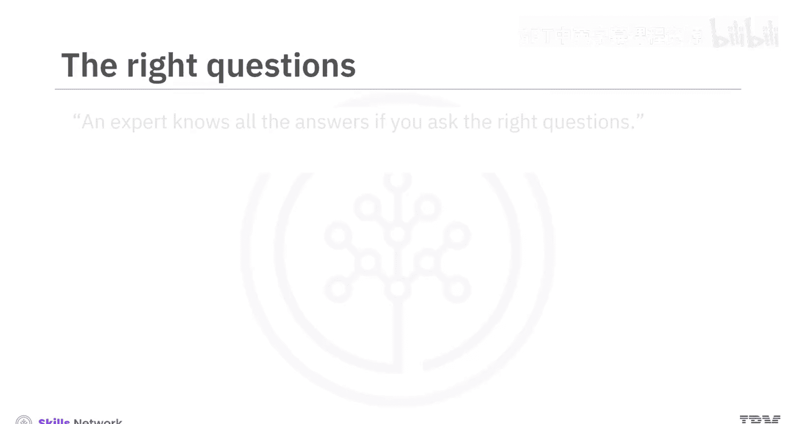

在本节课中，我们将学习提示工程的基础知识，了解其核心概念、课程目标以及你将掌握的具体技能。

---

专家知道所有答案，前提是你提出了正确的问题。有趣的是，这正是我们为生成式AI模型设计提示词所遵循的原则。我们使用提示词来查询和提问AI应用，例如聊天机器人、图像、音频或视频生成工具，甚至虚拟世界。提示词能够优化生成式AI模型的响应。其力量在于你所提出的问题。了解如何编写有效且直接的提示词，将使你能够生成更精确、更相关的内容。

现在，一个很好的问题是：完成本课程后，我能做什么？

本课程面向所有初学者，无论是专业人士、爱好者、从业者还是学生，只要对学习如何编写有效提示词抱有真诚的兴趣。这是一门面向所有人的课程，无论你的背景或经验如何。

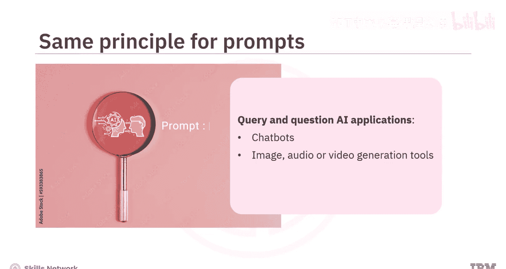

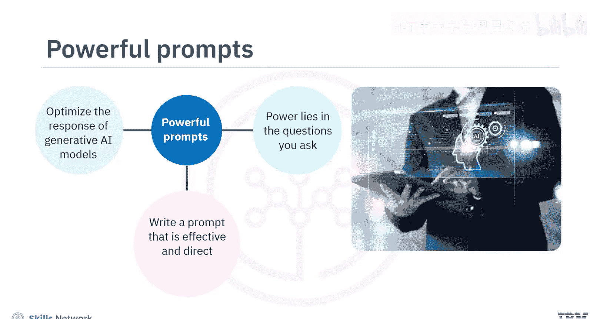

在本课程结束时，你将能够：
*   解释提示工程和生成式AI模型的概念及其相关性。
*   应用创建提示词的最佳实践。
*   评估常用的提示工程工具。
*   应用常见的提示工程技术和方法来编写有效的提示词。

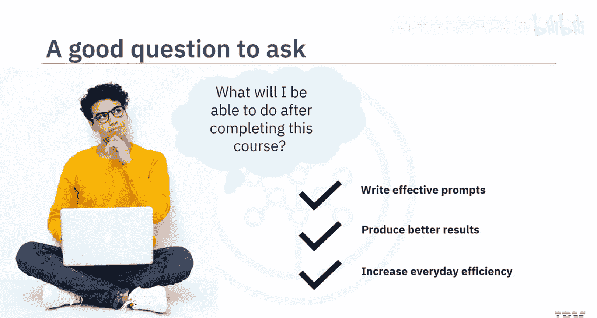

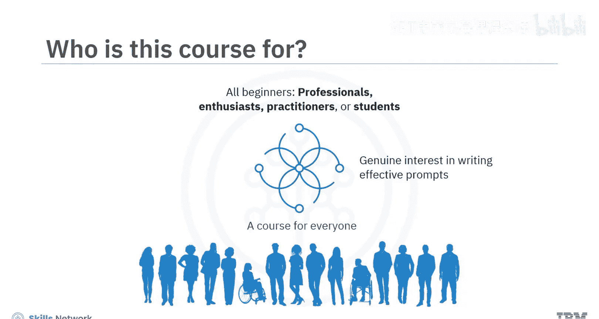

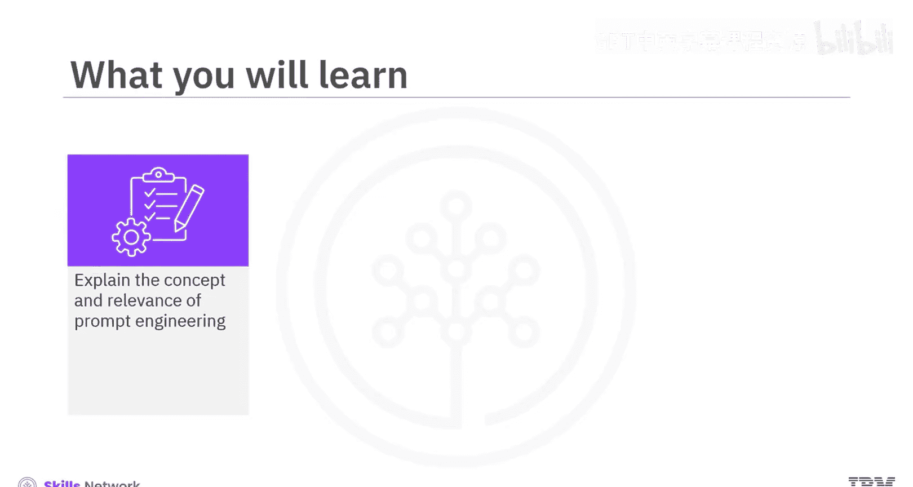

这是一门精炼的课程，包含三个模块，每个模块需要一到两个小时完成。

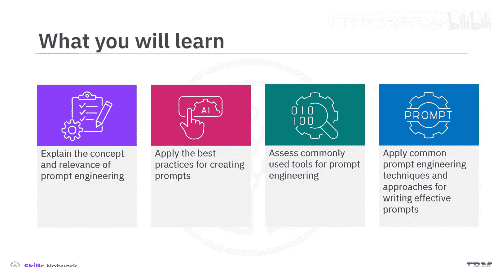

---

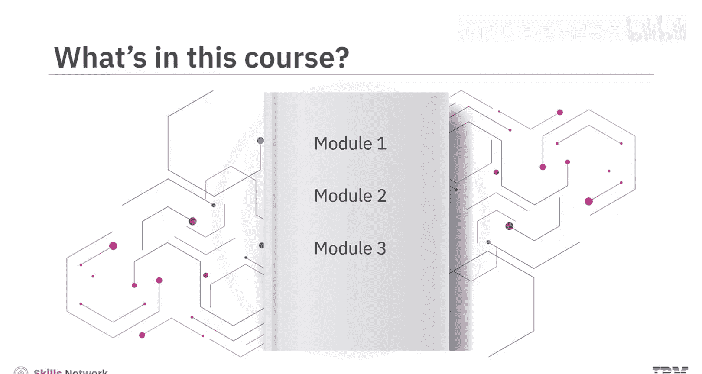

上一节我们介绍了课程的整体目标，本节中我们来看看课程的具体结构安排。

以下是本课程三个模块的详细内容：

*   **模块1**：你将学习提示工程的概念，从如何定义提示词及其构成要素开始。你将学习应用编写有效提示词的最佳实践，并评估常见的提示工程工具，例如IBM Watson X Prompt Lab、Spellbook和Dust。
*   **模块2**：你将研究各种提示工程方法，如**面试模式**、**思维链**和**思维树**。你将发现巧妙设计提示词的技术，例如**零样本**和**少样本**，以产生精确且相关的响应。
*   **模块3**：邀请你参与一个最终项目，并提供一个分级测验来测试你对课程概念的理解。

你还可以访问课程术语表，并获得关于后续学习步骤的指导。

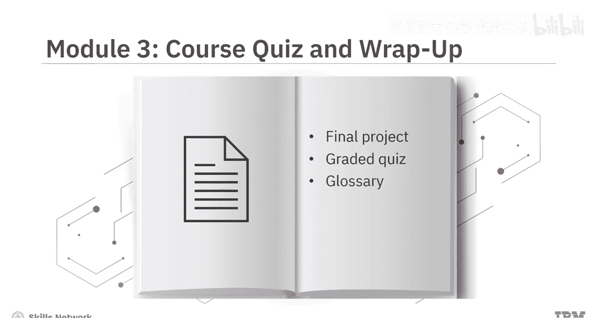

本课程融合了概念讲解视频和辅助阅读材料。观看所有视频以充分掌握学习材料的潜力。你将通过实践实验室和一个最终项目来享受动手操作的乐趣，该项目演示了如何在IBM生成式AI教室中通过创建有效的提示词来优化结果。

课程包含练习测验，帮助你巩固学习。课程结束时，你还需要完成一个分级测验。课程还提供了讨论论坛，以便与课程工作人员联系并与同伴互动。

最有趣的是，通过专家观点视频，你将听到经验丰富的从业者分享他们对提示工程中使用的工具、方法以及编写有效提示词的艺术的见解。

你准备好学习关于编写提示词的一切，以释放生成式AI的全部潜力了吗？让我们开始吧。

---

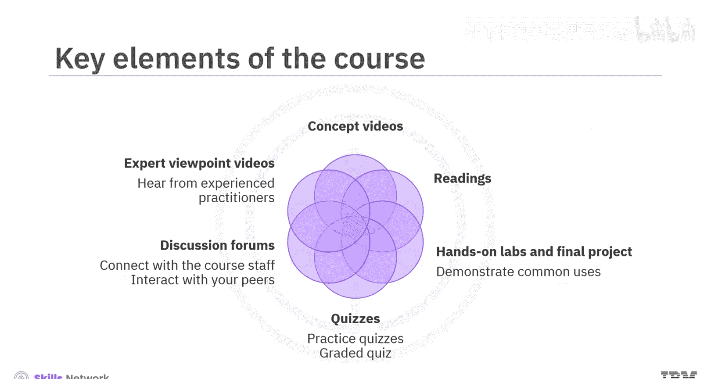

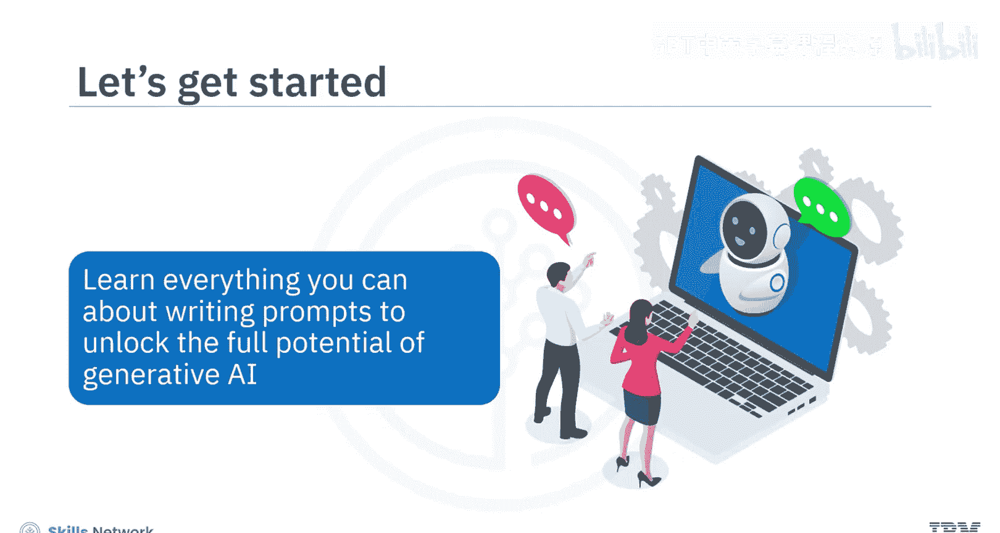

本节课中，我们一起学习了本课程的核心目标、你将获得的能力以及详细的课程模块安排。我们了解到，掌握提示工程是有效利用生成式AI的关键，而本课程将通过理论、实践和专家见解，引导你从入门到应用。