# 019：提示词工程解析 🧠

在本节课中，我们将要学习什么是提示词工程。我们将定义提示词工程，解释其在生成式AI模型中的相关性和重要性，并详细阐述通过提示词工程来制定有效提示词、以引导模型产生相关响应的过程。

## 什么是提示词工程？

设计有效的提示词以生成更好、更符合期望的响应的过程，被称为提示词工程。

尽管生成式AI模型有潜力辅助人类创造力，但如果你未能提供精确的提示词，这些模型可能会产生不充分的结果，甚至是虚假和误导性的信息。

提示词工程是批判性分析、创造力和技术敏锐度的结合。它不仅仅局限于提出正确的问题，还包括在正确的语境下构建问题，提供正确的信息，并明确你对期望结果的预期，从而引出最恰当的回应。

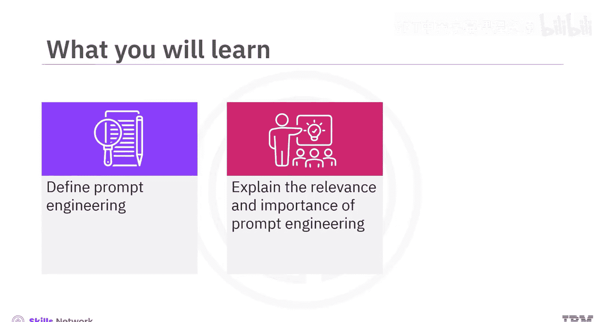

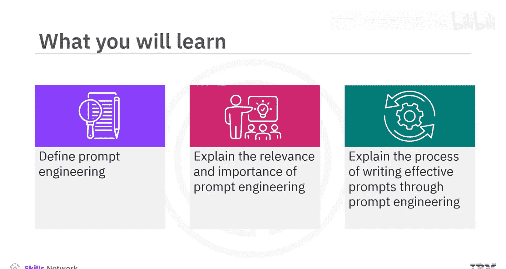

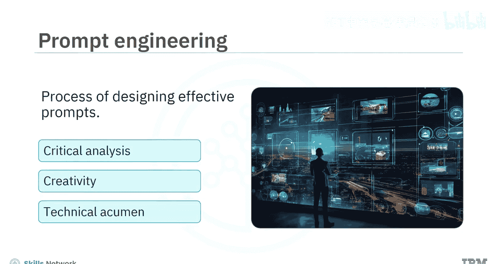

## 一个示例：天气预报 🌊

让我们通过一个例子来理解这一点。一艘船正在大西洋航行。为了规划航程，船长需要知道特定地点在特定时间的天气预报。

在这种情况下，向模型提供一个简单的提示词，例如“大西洋的天气预报”，可能无法获得期望的结果。为了得到最准确的结果，船长需要对提示词进行“工程化”设计。

在设计提示词时，船长需要定义上下文，包括诸如天气预报的目标位置（经纬度）和预测的时间范围等细节。

**例如：**
> 一艘船的船长正在计划大西洋的战略航行。为了帮助船长有效导航，请提供2023年8月28日至9月1日接下来一周的天气预报。目标位置的坐标在北纬20度到30度，西经40度到20度之间。

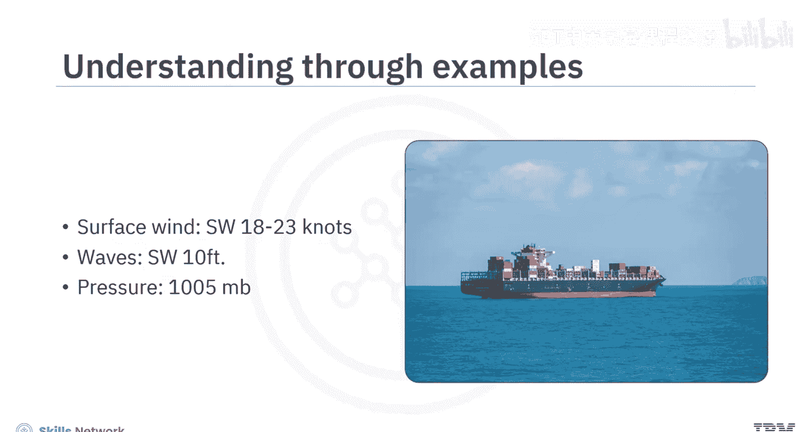

船长还必须指明是否需要特定的输出，例如模型是否应返回可能影响航程的其他天气要素信息。

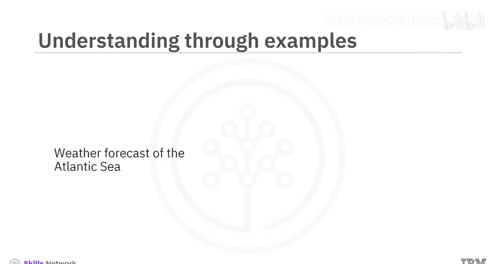

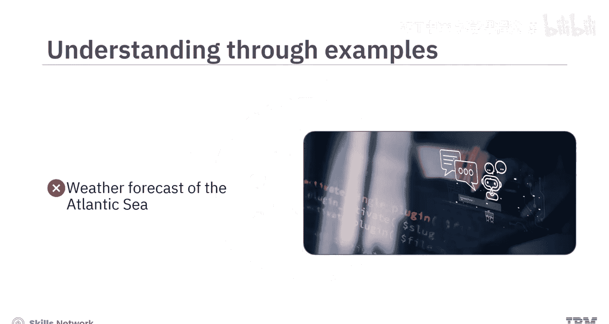

**例如：**
> 为了帮助规划大西洋的有效航行，请提供关于指定时间和地点内预期风型、浪高、降水概率、云量以及任何可能影响航程的潜在风暴的详细信息。

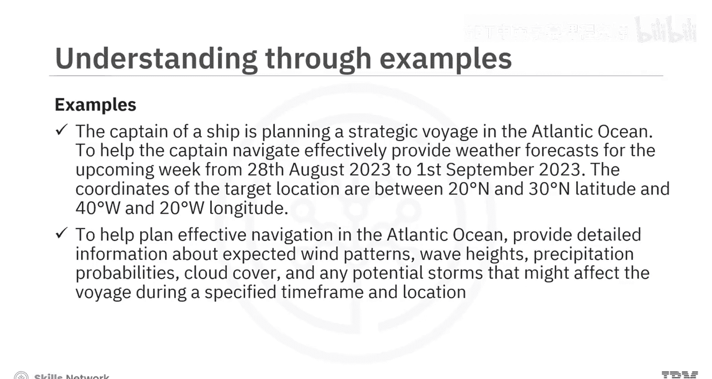

## 提示词工程的迭代过程 🔄

重要的是要认识到，提示词工程是一个结构良好的迭代过程，涉及优化提示词并尝试可能影响模型输出的各种因素。

以下是创建有效提示词的逐步过程。

### 1. 定义目标
该过程的第一步是建立一个明确的目标。你必须确切知道你想要模型生成什么。

**例如：**
> 目标：形成一份关于人工智能在汽车领域应用的益处和风险的简要概述。

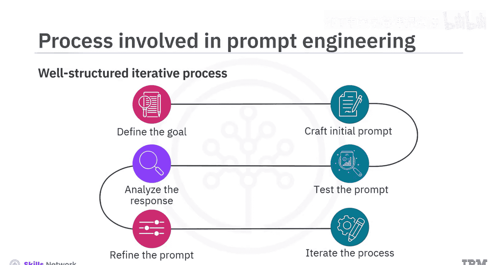

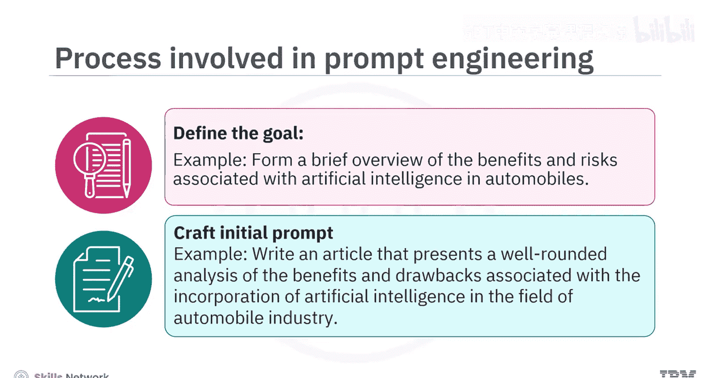

### 2. 创建初始提示词
明确了目标后，现在是时候创建初始提示词了。根据目标，这可能表现为一个问题、一个指令，甚至是一个情境。

**例如：**
> 初始提示词：撰写一篇文章，对人工智能融入汽车行业所带来的益处和弊端进行全面分析。

### 3. 测试提示词
你现在应该测试并分析你所创建提示词的响应。虽然响应可能是相关的，但它可能缺乏你所追求的独特视角。

**例如：**
> 对初始提示词的响应直接列出了人工智能融入汽车行业的益处和弊端。它没有强调可能出现的任何伦理问题。此外，也没有讨论其积极和消极的影响。

### 4. 分析响应
你必须仔细审查响应，并检查它是否符合你的目标。如果不符合，请记下不足之处。

**例如：**
> 所使用的初始提示词未能全面涵盖人工智能在汽车行业相关的益处和风险范围。

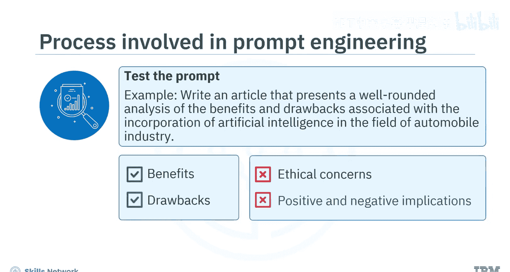

### 5. 优化提示词
利用通过测试和分析获得的知识，现在可以修改提示词了。这可能包括增强其特异性、融入更多上下文或重新措辞。

初始提示词可以优化如下：

**优化后的提示词：**
> 撰写一篇信息性文章，讨论人工智能在革新汽车行业中的作用。阐述关键方面，如益处、弊端、伦理考量以及积极和消极的影响。具体说明自动驾驶和实时交通分析等领域，同时探讨潜在挑战，如技术复杂性和网络安全问题。

### 6. 迭代过程
最后三个步骤（测试、分析、优化）会重复进行，直到你对响应感到满意为止。

因此，经过几轮优化后，最终的提示词可能呈现以下形式：

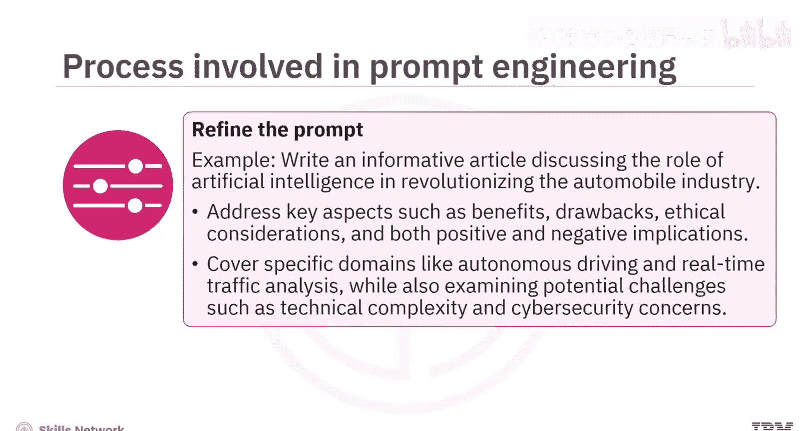

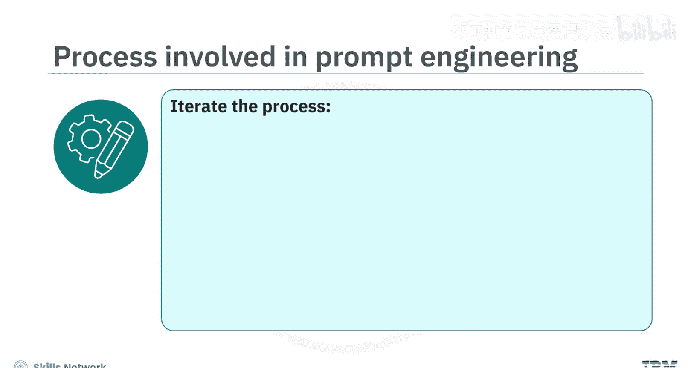

**最终提示词：**
> 撰写一篇文章，重点介绍人工智能如何重塑汽车行业。聚焦于积极进展，特别是在自动驾驶和实时交通分析方面，同时深入探讨与复杂技术方面相关的担忧，例如决策算法和潜在的网络安全漏洞。强调这些担忧可能对车辆安全产生的影响。确保分析透彻、有实例支持并鼓励批判性思考。

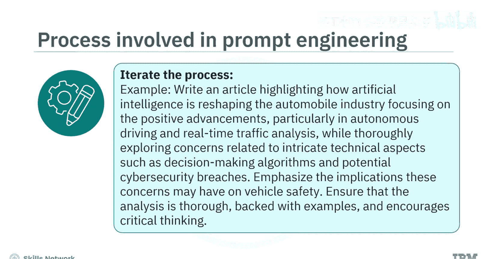

## 提示词工程的重要性与相关性 💡

上一节我们介绍了提示词工程的具体步骤，本节中我们来看看它在生成式AI模型中的核心价值。

以下是提示词工程的重要性和相关性：

*   **优化模型效率**：提示词工程有助于设计智能提示词，使用户能够充分利用这些模型的全部能力，而无需进行大量的重新训练。
*   **提升特定任务性能**：提示词工程使生成式AI模型能够提供细致入微且具有上下文的响应，使其对特定任务更加有效。
*   **理解模型限制**：通过每次迭代优化提示词并研究模型的相应响应，可以帮助我们理解其优势和弱点。这些知识可以进一步指导未来的功能增强或模型的完整开发。
*   **增强模型安全性**：熟练的提示词工程可以防止因提示词设计不当而导致有害内容生成的问题，从而增强模型的安全使用。

## 总结 📝

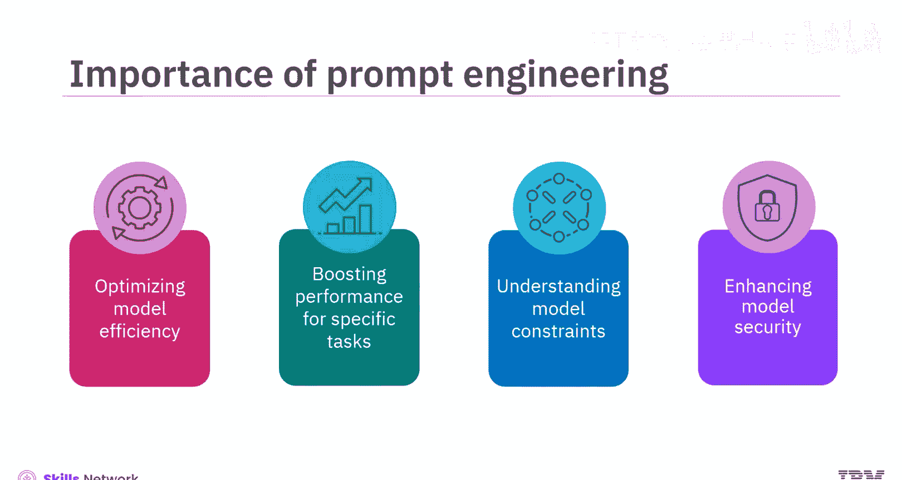

本节课中我们一起学习了提示词工程。你了解到，提示词工程是设计有效提示词以充分利用生成式AI模型能力、产生最佳响应的过程。你也学习了通过提示词工程优化提示词的迭代过程。最后，你掌握了提示词工程在优化模型效率、提升任务性能、理解模型限制以及增强其安全性方面的重要性。