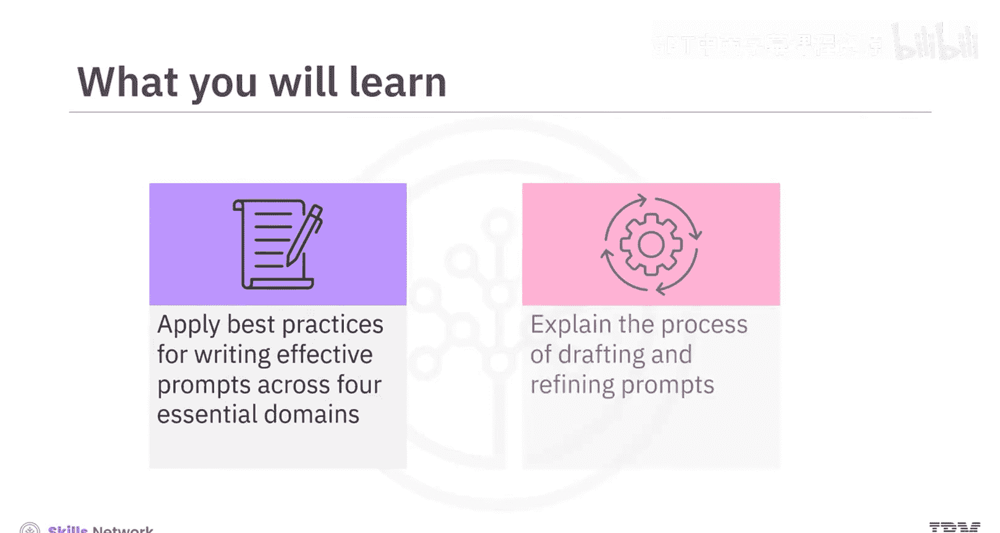
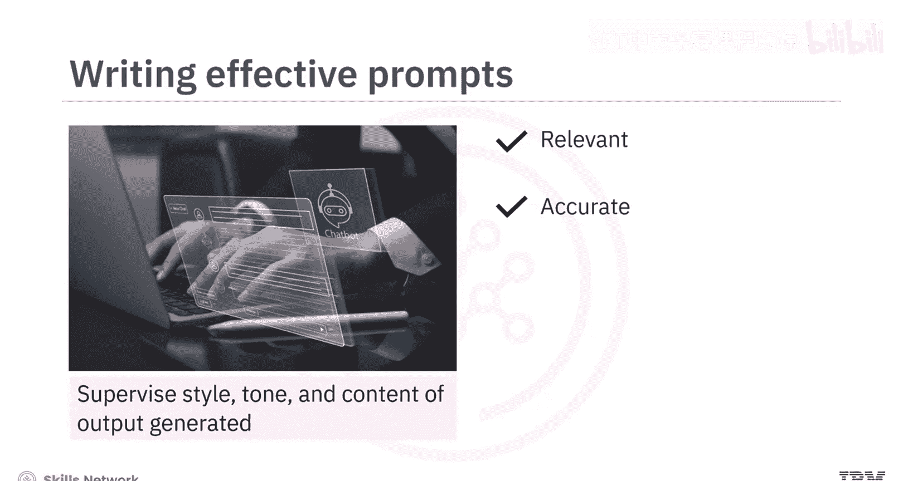
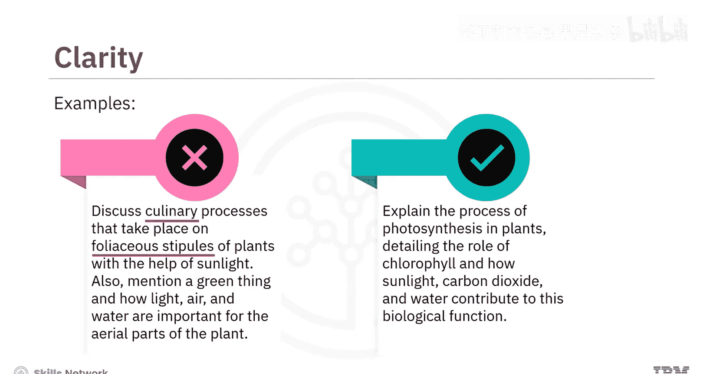
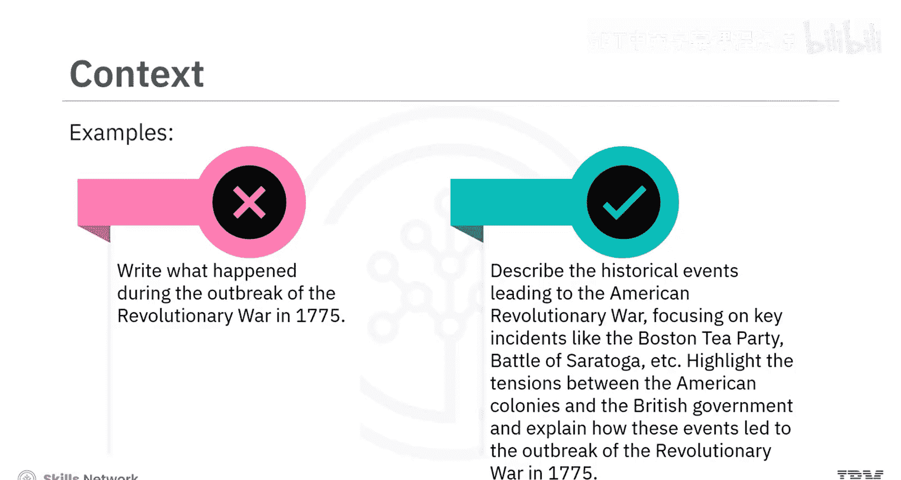
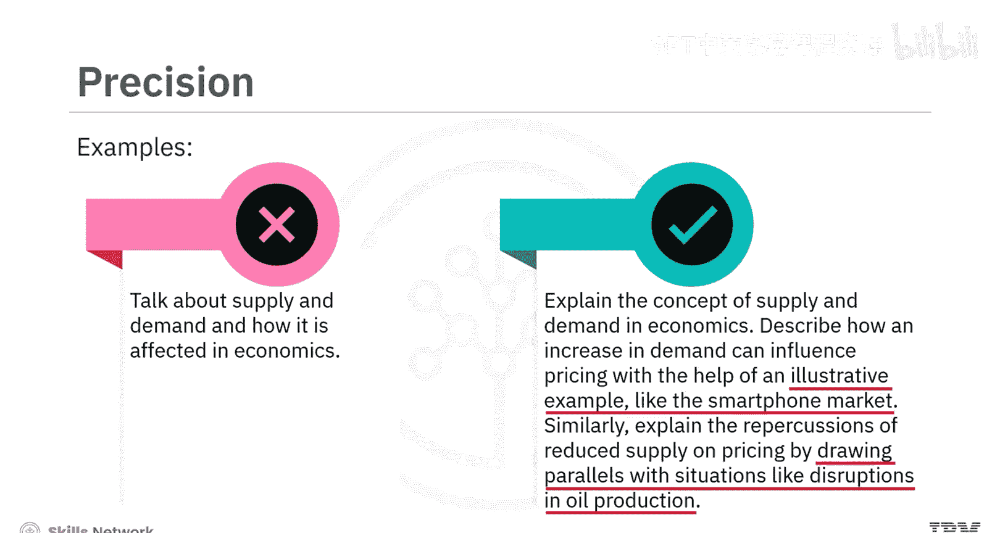
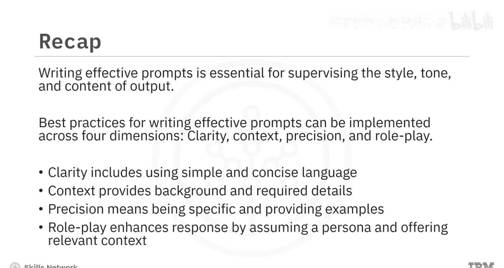

# 020：提示词创建最佳实践 ✍️

在本节课中，我们将学习如何为生成式AI模型创建有效的提示词。通过应用最佳实践，你可以更好地控制AI输出的风格、语气和内容，从而获得更相关、更准确的回答。

## 概述

撰写有效的提示词对于充分发挥生成式AI模型的潜力至关重要。通过遵循清晰性、上下文、精确性和角色扮演这四个维度的最佳实践，你可以引导模型生成符合预期的输出。本节课程将通过具体示例，详细介绍如何起草和优化提示词。

---

## 清晰性：使用简单明确的语言

上一节我们介绍了创建有效提示词的四个核心维度。首先，我们来看看**清晰性**。清晰的提示词能确保模型准确理解你的意图。

为了保持清晰性，请牢记以下几点：

*   **使用简单直接的语言**：易于理解的指令能更好地传达给模型。因此，应撰写**明确且易于理解**的提示词。
*   **避免专业术语**：特殊术语可能会让模型或用户感到困惑。应使用**能被广泛受众理解的简单词汇**来撰写提示词。
*   **避免模糊描述**：模糊的提示词可能导致回答与你的意图不符。因此，必须**清晰描述模型需要执行的任务**。

让我们通过一个例子来理解：

**原始提示（不清晰）**：
> 讨论在植物完全叶状托叶上借助阳光发生的烹饪过程。同时提及一个绿色物质，以及光、空气和水对植物地上部分的重要性。

这个提示词存在多处问题：
1.  它没有明确提及想要讨论的过程（光合作用）。
2.  包含了“完全叶状托叶”等复杂术语，难以理解。
3.  描述模糊，没有清晰说明任务是什么。

**优化后的提示（清晰）**：
> 解释植物光合作用的过程，详细说明叶绿素的作用，以及阳光、二氧化碳和水如何参与这一生物功能。

修订后的提示使用了**简单、清晰、简洁的语言**，并**明确声明**了要讨论植物光合作用的过程。

---

## 上下文：提供背景与相关信息

在理解了清晰性的重要性后，我们来看看第二个维度：**上下文**。上下文能帮助模型理解情境或主题。

这可以包括提供简短的介绍或对所需回答所处环境的解释。相关的信息或具体细节（如人物、地点、事件或概念）有助于引导模型的理解。因此，在撰写提示词时，融入这些细节非常重要。

以下是应用上下文的示例：

**原始提示（缺乏上下文）**：
> 写一写1775年革命战争爆发期间发生了什么。

这个提示词没有包含足够的背景和具体细节来引导模型的理解。

**优化后的提示（包含上下文）**：
> 描述导致美国革命战争的历史事件，重点关注波士顿倾茶事件、萨拉托加战役等关键事件。强调美洲殖民地与英国政府之间的紧张关系，并解释这些事件如何导致了1775年革命战争的爆发。

---

## 精确性：明确要求与提供示例

接下来，我们探讨创建有效提示词的第三个重要维度：**精确性**。精确性能帮助你勾勒出请求的轮廓。

如果你在寻找特定类型的回答，请清晰地表达出来。在提示词中**融入示例**，可以帮助模型理解你期望的回答类型，并引导其思考过程。

让我们看一个例子：

**原始提示（不精确）**：
> 谈谈经济学中的供给与需求，以及它是如何受影响的。

这个提示没有精确勾勒出特定类型的回答轮廓，也没有提供示例。

**优化后的提示（精确）**：
> 解释经济学中的供给与需求概念。描述需求增加如何影响价格，并借助一个说明性示例，例如智能手机市场。同样，通过类比石油生产中断等情况，解释供给减少对价格的影响。

这个提示**清晰地表达**了你想借助示例来解释一个概念。

---

## 角色扮演：设定视角与身份

最后，我们来讨论最后一个维度：**角色扮演或人物模式**。从特定角色或人物视角撰写的提示词，可以帮助模型生成与该视角一致的回答。

提供**必要的上下文细节**能使模型有效地扮演特定角色。因此，如果你要求模型从历史人物、虚构角色或特定职业的角度进行回答，请提供相应的上下文细节。

请看以下示例：

**原始提示（无角色设定）**：
> 写一篇日志，描述一个未知外星星球上奇特的动植物。

这个提示只会给出关于外星星球的科学细节，而不会从专业人士的视角解释其答案。

**优化后的提示（包含角色扮演）**：
> 假设你是一名刚刚降落在一个未知外星星球上的宇航员。写一篇日志，描述你遇到的奇特动植物，例如天空的颜色和在外星地貌中回荡的陌生声音。表达你在记录这段非凡旅程时的兴奋、好奇以及一丝忧虑。

在这个例子中，你**明确提供了上下文细节**，并**假设自己是一名宇航员**。因此，这个提示词将生成与宇航员视角一致的回答。😊

---

## 总结

本节课中，我们一起学习了为生成式AI模型撰写有效提示词的最佳实践。

我们了解到，撰写有效的提示词对于控制输出的风格、语气和内容至关重要。最佳实践主要体现在四个维度：
1.  **清晰性**：包括使用简单、简洁的语言。
2.  **上下文**：提供背景和所需细节。
3.  **精确性**：意味着要具体，并提供示例。
4.  **角色扮演**：通过假设一个身份并提供相关上下文，可以增强回答的针对性。

这些实践可以根据具体需求进行调整，以获得最佳结果。