# 021：常用提示词工程工具 🛠️

在本节课中，我们将要学习提示词工程工具的常见功能，并介绍几款常用的工具。提示词工程是设计精确且符合语境的提示词，以与生成式AI模型交互，从而获得相关且准确输出的过程。为了辅助这一过程，市面上有多种提示词工程工具可供选择。

## 概述

提示词工程工具提供了多种特性和功能，旨在优化提示词的创建，以获得期望的结果。这些工具对于不精通自然语言处理技术，但又希望在使用生成式AI模型时达成特定目标的用户尤为有用。

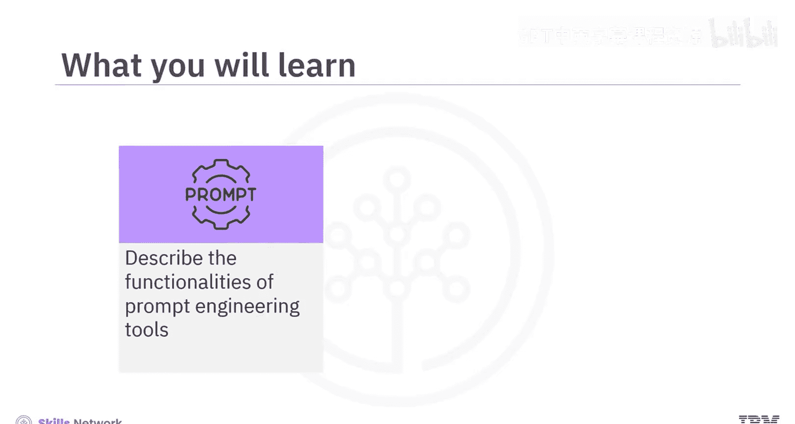

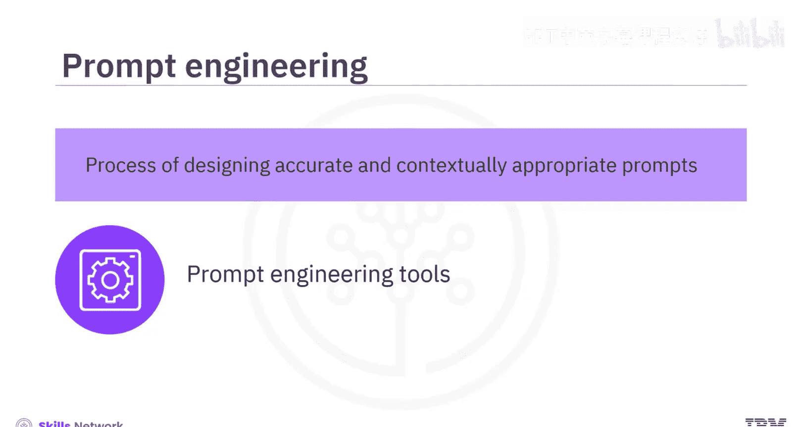

接下来，我们将探讨这些工具提供的常见功能。

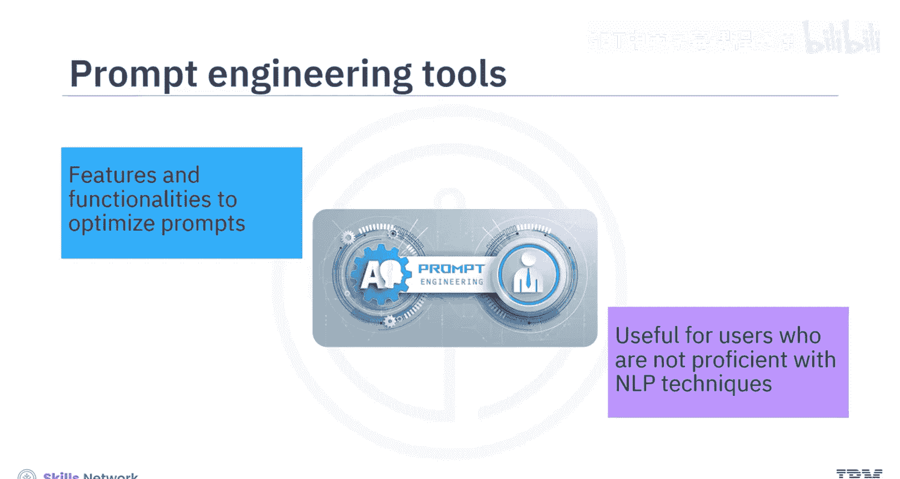

## 提示词工程工具的常见功能

以下是提示词工程工具通常具备的核心功能：

*   **提示词建议**：许多工具能够根据给定的输入或期望的输出，为用户提供提示词建议。
*   **结构优化**：这些工具可以建议如何构建提示词，以实现更好的语境沟通，帮助用户构建能为模型提供必要上下文、以理解用户意图的提示词。
*   **迭代优化**：用户可以根据工具的初始响应，迭代地优化提示词，以找到最有效的版本。
*   **偏见缓解**：提示词工程工具可能提供功能，帮助减轻生成式AI模型响应中的偏见，指导用户如何构建提示词以降低产生偏见或不恰当输出的可能性。
*   **领域特定支持**：这些工具可以帮助创建针对特定领域（如法律、医疗或技术）的提示词。
*   **预定义提示词库**：一些工具提供了针对各种用例的预定义提示词库，用户可以根据具体需求进行定制。

上一节我们介绍了提示词工程工具的通用功能，本节中我们来看看几款具体的常用工具。

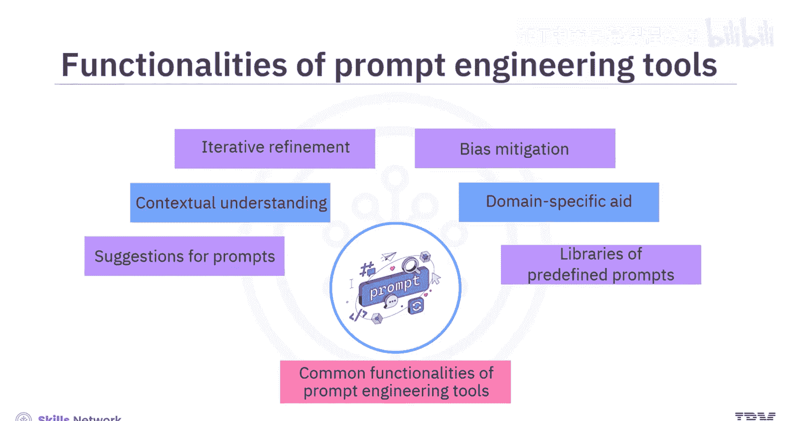

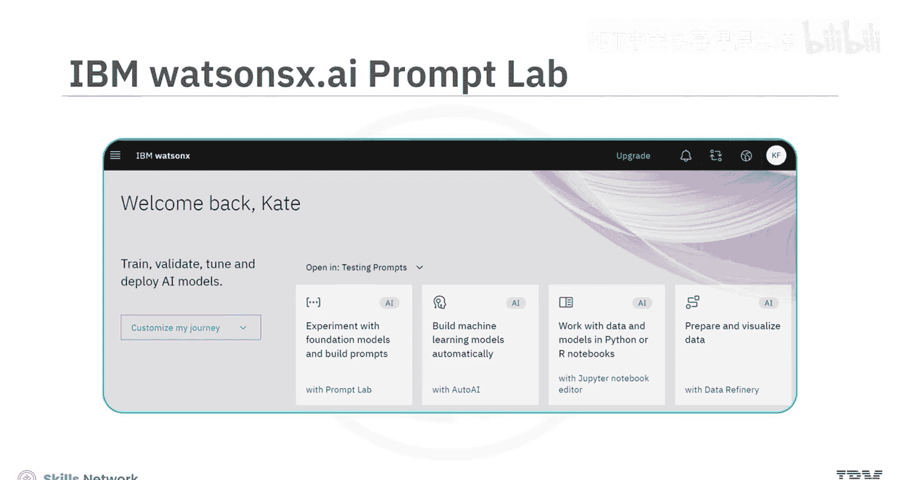

## 常用提示词工程工具介绍

### 1. IBM Watsonx.ai 提示词实验室 (Prompt Lab)

IBM Watsonx.ai 是一个集成的工具平台，用于轻松训练、调优、部署和管理基础模型。该平台包含 **提示词实验室** 工具，使用户能够基于不同的基础模型试验提示词，并根据需求构建提示词。

为了帮助用户入门，提示词实验室为不同用例（如摘要、分类、生成和提取）提供了示例提示词。要创建符合特定需求的提示词，用户可以通过添加指令和示例来训练模型，向模型展示应如何响应输入。

### 2. Spellbook (Scale AI)

Spellbook 是 Scale AI 提供的一个集成开发环境。借助 Spellbook，用户可以基于大型语言模型构建应用程序，并为各种用例（包括文本生成、文本提取、分类、问答、自动补全和摘要）试验提示词。

对于提示词工程，Spellbook 包含一个**提示词编辑器**，允许用户编辑和测试提示词。用户可以使用**提示词模板**来利用结构化提示词生成文本，也可以访问预构建的提示词作为示例。

### 3. Dust

Dust 提供了一个用于编写提示词并将其链接在一起的 Web 用户界面。用户可以管理链式提示词的不同版本。它还提供了一种自定义编码语言和一组用于处理LLM输出的标准模块。Dust 还支持 API 集成，以接入其他模型和服务。

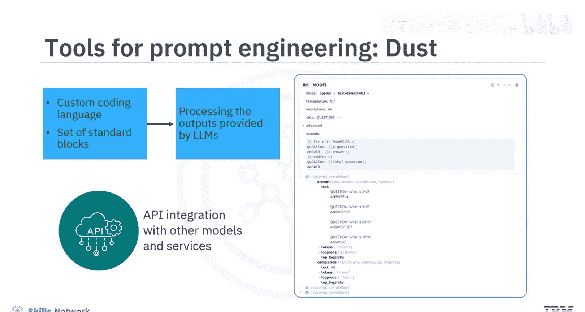

### 4. PromptPerfect

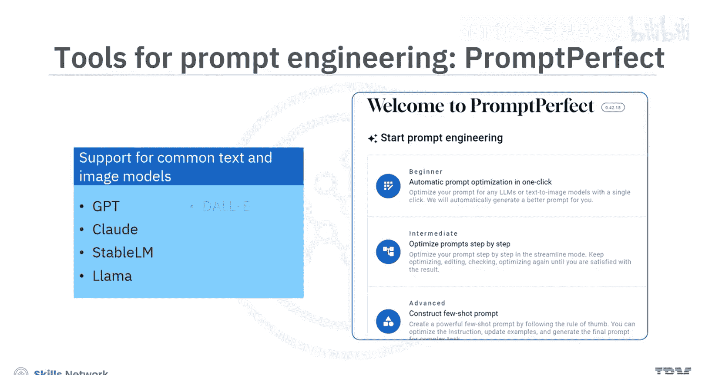

PromptPerfect 是一款可用于为不同的大型语言模型或文生图模型优化提示词的工具。它支持常见的文本模型（如 GPT、Claude、Stable LM 和 LLaMA）以及图像模型（如 DALL-E 和 Stable Diffusion）。

要编写或优化提示词，首先需要选择要为其优化提示词的相关模型，因为不同模型有不同的优化策略。用户还可以选择与预览质量、语言和审核相关的附加功能。

在编写提示词时，可以尝试**自动补全**功能，该功能会在用户输入时提供建议。用户可以进一步优化已编写的提示词。例如，工具会展示用户编写的原始提示词和由 PromptPerfect 生成的相应优化提示词。为了进行更深层次的优化，用户可以在**流线模式**下逐步优化和完善提示词：编写提示词 -> 优化 -> 再次编辑 -> 再优化，直到对输出满意为止。

除了上述专门工具，还有一些其他流行的平台和接口为提示词工程提供资源或帮助用户试验提示词。

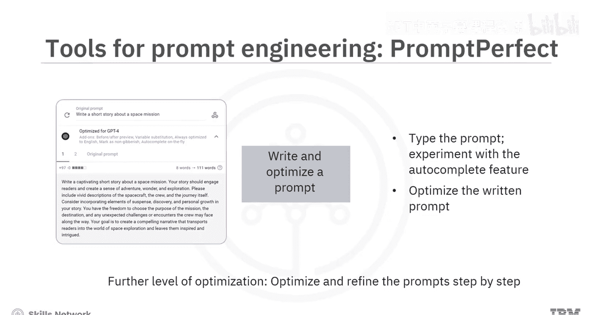

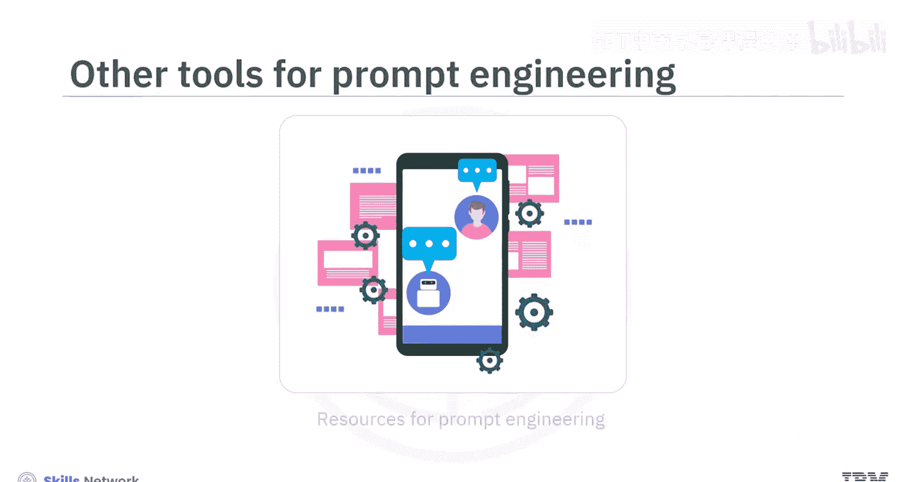

### 其他资源与平台

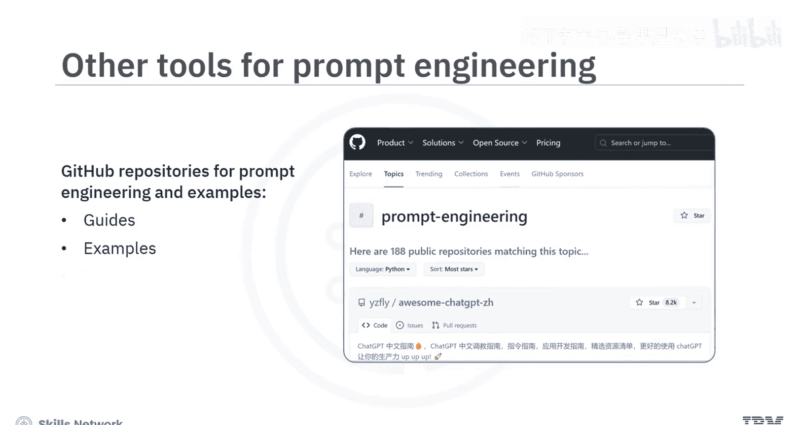

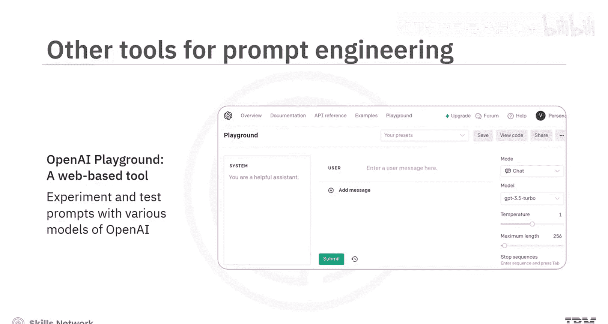

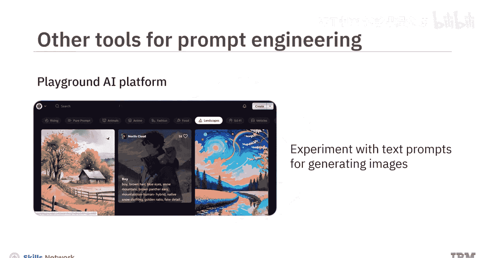

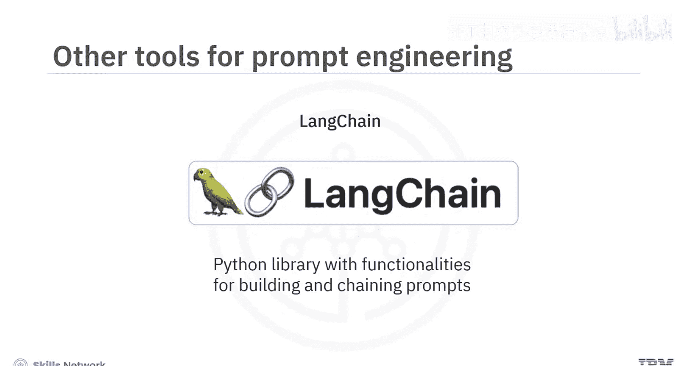

*   **GitHub**：拥有大量关于提示词工程和LLM的代码仓库。这些仓库中提供的指南、示例和工具有助于提升提示词工程技能。
*   **OpenAI Playground**：一个基于 Web 的工具，帮助用户使用 OpenAI 的各种模型（如 GPT 系列）试验和测试提示词。
*   **Playground AI**：该平台帮助用户使用文本提示词，通过 Stable Diffusion 模型生成图像进行实验。
*   **LangChain**：一个 Python 库，提供了构建和链接提示词的功能。

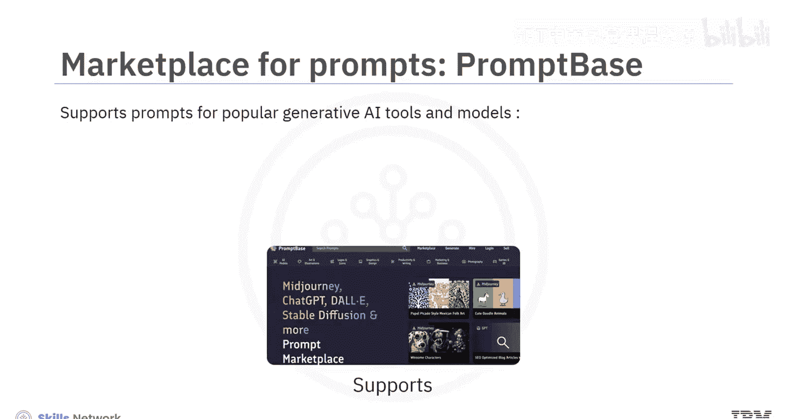

最后，有趣的是，提示词本身也可以进行买卖。**PromptBase** 就是一个提示词市场的例子。它支持为流行的生成式AI工具和模型（如 Midjourney、ChatGPT、DALL-E、Stable Diffusion 和 LLaMA）提供提示词。

通过 PromptBase，用户可以购买符合特定要求、且针对特定模型或工具的提示词。例如，可以购买一个用于通过 Midjourney 生成滑稽卡通角色的提示词。同时，如果你拥有出色的提示词构建技能，也可以通过 PromptBase 上传和出售提示词。该平台还支持直接在其平台上构建提示词，并在其市场上出售。

## 总结

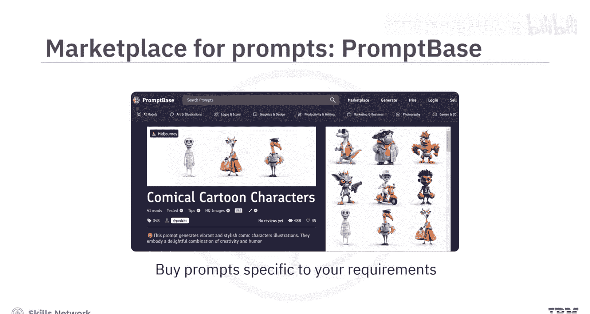

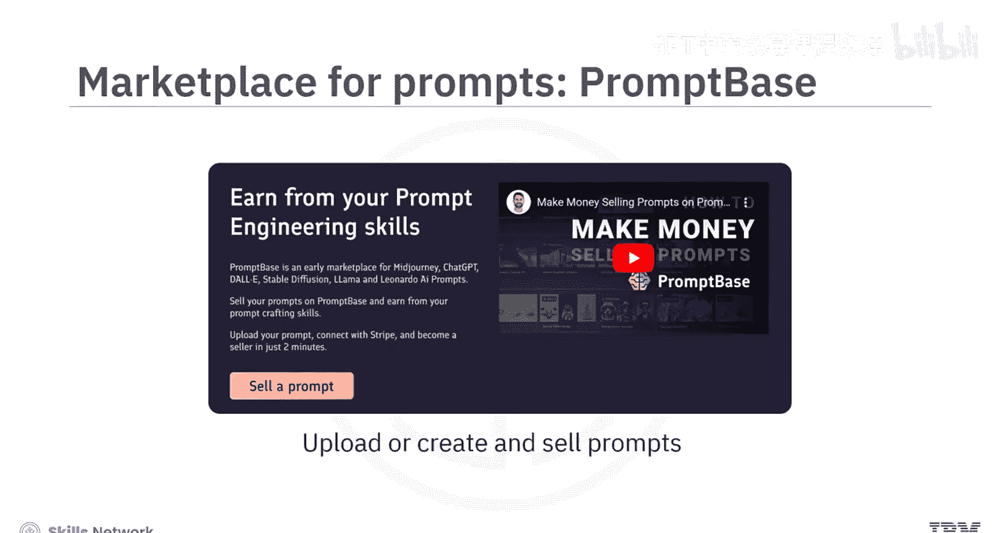

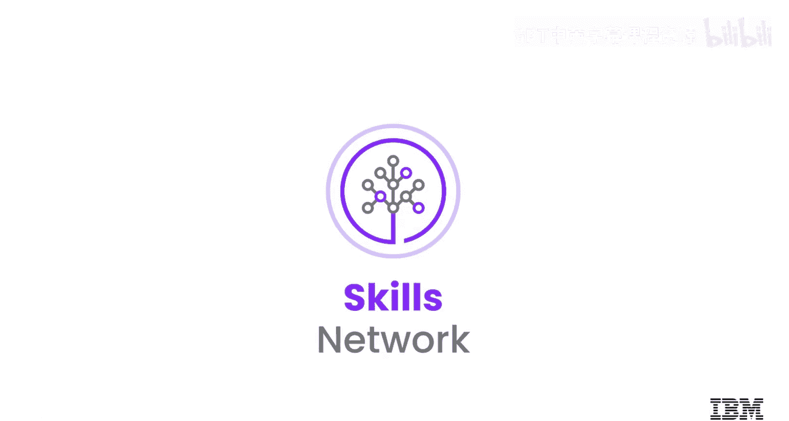

本节课中，我们一起学习了提示词工程工具如何提供多种功能来优化提示词，这些功能包括提示词建议、语境理解、迭代优化、偏见缓解、领域特定支持和预定义提示词库。我们还介绍了几款常见的提示词工程工具和平台，包括 IBM Watsonx.ai 提示词实验室、Spellbook、Dust 和 PromptPerfect。了解这些工具将帮助您更高效地与生成式AI进行交互。