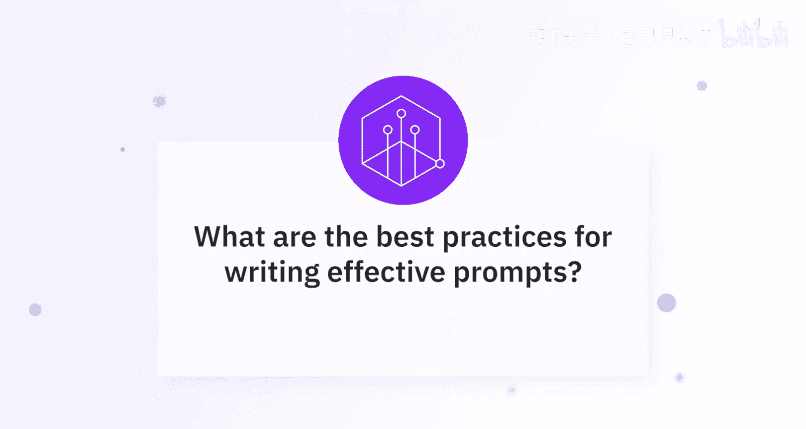
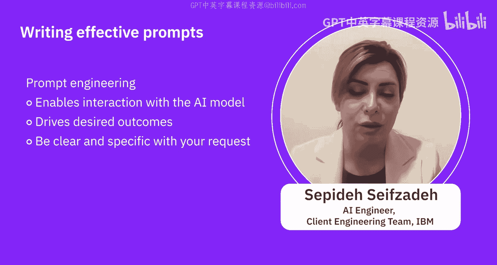
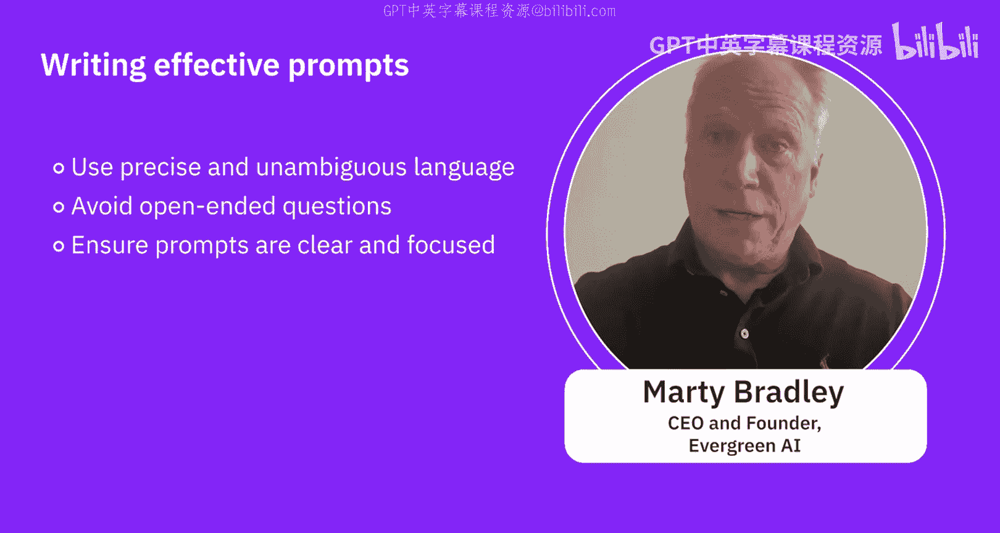
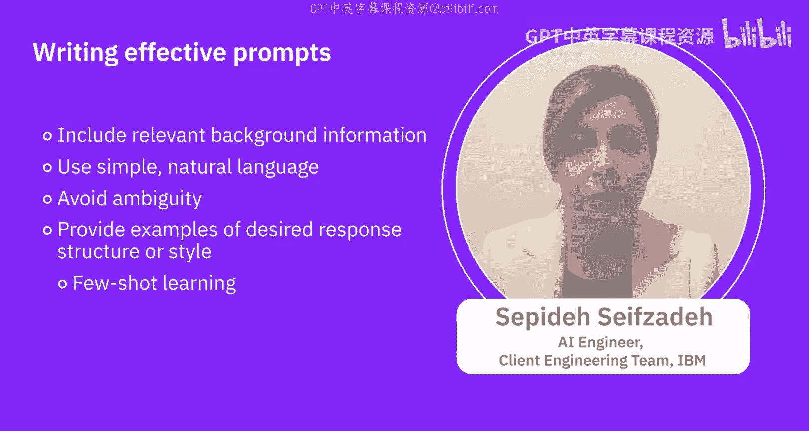
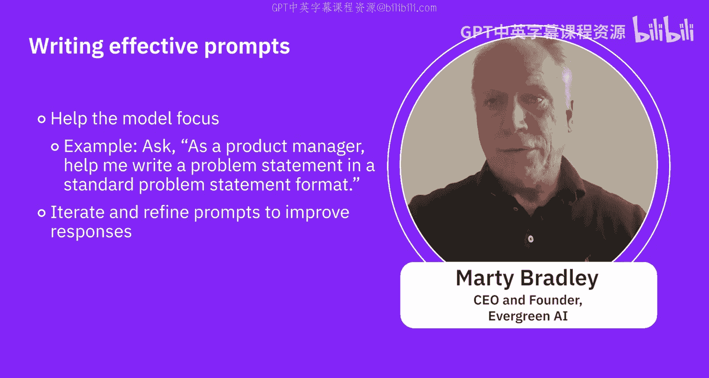
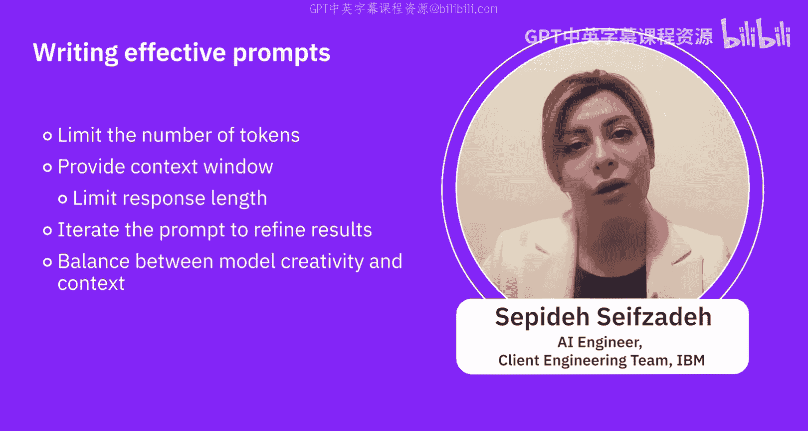
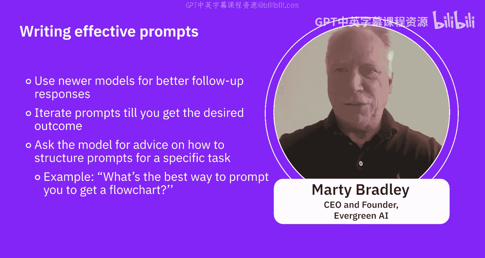
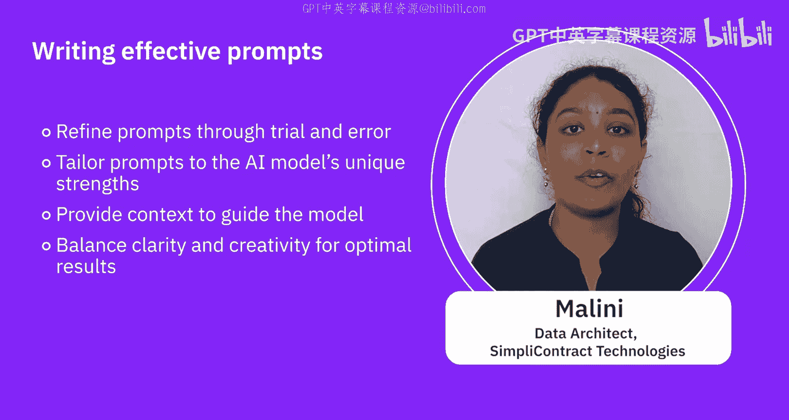
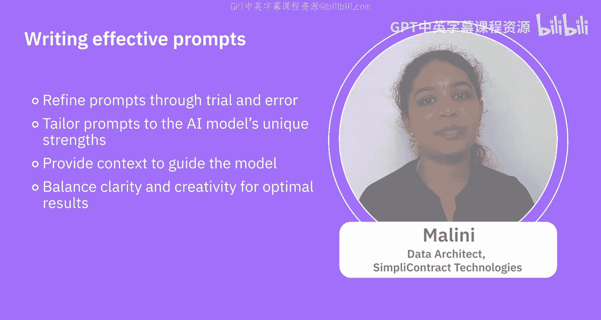

# 022：高效提示词设计原则 ✨



在本节课中，我们将学习由生成式AI专家分享的高效提示词设计原则。提示工程是与AI模型交互、获取理想结果的关键步骤。掌握这些原则，能帮助你更有效地利用AI工具。



## 概述 📋

提示词是与生成式AI模型沟通的桥梁。一个设计良好的提示词能显著提升模型输出的质量和相关性。本节将介绍一系列核心原则，帮助你从清晰度、语境、迭代等方面优化你的提示词。



## 核心设计原则

上一节我们概述了提示工程的重要性，本节中我们来看看具体的设计原则。以下是构建高效提示词的关键要点。

### 1. 清晰与具体
与人类交流时，我们常使用开放式问题以鼓励探索。但与AI模型交互时，需要更加具体和直接。清晰的请求能减少歧义，引导模型生成更符合预期的内容。

**核心公式**：`清晰指令 = 明确动作 + 具体目标`

例如，避免使用“写点关于招聘的东西”，而应使用“以人力资源专家的身份，撰写一份针对初级软件工程师的招聘职位描述，需包含职责、要求和公司文化介绍。”

### 2. 提供充分语境
为模型提供相关的背景信息，能帮助其更好地理解任务并生成更贴切的回复。这包括指定应用场景、目标受众或相关细节。

**示例代码（伪指令）**：
```
背景：公司正在扩张技术团队，需要招聘前端开发人员。
角色：你是一名资深技术招聘专员。
任务：根据以上背景，起草一封邀请潜在候选人进行电话面试的邮件。
```



### 3. 利用示例进行引导（少样本学习）
通过提供输入-输出的示例，可以明确你期望的回复格式、风格或内容结构。这种方法被称为“少样本学习”（Few-shot Learning）。

以下是使用示例引导的格式：
*   **示例输入**：“为‘年度团队建设活动’构思三个创意主题。”
*   **示例输出**：“1. 主题：城市逃脱探险。描述：在市区进行解谜寻宝，促进团队协作。2. 主题：公益黑客松。描述：用技术为非营利组织解决实际问题，体现社会价值。3. 主题：国际美食工作坊。描述：分组学习并制作不同国家菜肴，体验多元文化。”

### 4. 使用专业角色与限定条件
通过指定角色（如“作为一位薪酬福利专家”）或领域，可以让模型聚焦于特定的知识库和表达方式。同时，可以设定约束，如避免使用某些术语、限制输出长度或规定文本格式。



**实践示例**：“作为一名培训与发展经理，用不超过200字，为公司新上线的内部学习平台起草一段简洁的推广文案，避免使用‘革命性’、‘颠覆性’这类夸张词汇。”

### 5. 迭代优化与平衡
首次提示可能无法得到完美结果。生成式AI是一个需要反复对话和调试的工具。你可以基于初始输出，要求模型进行补充、改写或调整。

此外，需要在**模型的创造性**和**输出的相关性/准确性**之间找到平衡。过于宽泛的指令可能导致天马行空的结果，而过于严格的限制则可能扼杀有用的创意。



## 进阶技巧与总结

在掌握了上述基本原则后，我们来看看一些能进一步提升效果的技巧。

如果对如何提问不确定，可以直接询问AI本身。例如，你可以输入：“**为了从你这里获得一个关于员工入职流程的流程图，最佳的提问方式是什么？**” AI模型通常会给出如何向它提问的建议。



记住，设计提示词是一门艺术，需要练习。不同的模型可能有不同的“特性”，尝试多种表达方式，并根据反馈进行调整是关键。

**总结**：本节课我们一起学习了高效提示词设计的核心原则。
1.  **清晰具体**：给出明确指令。
2.  **提供语境**：补充相关背景信息。
3.  **示例引导**：通过例子展示期望的格式或风格。
4.  **角色限定**：指定专业领域以聚焦输出。
5.  **迭代优化**：基于结果不断 refining 你的提示词。





通过保持清晰、平衡以及不断的实践，你将能解锁生成式AI强大的创造潜力，让人力资源工作更高效。