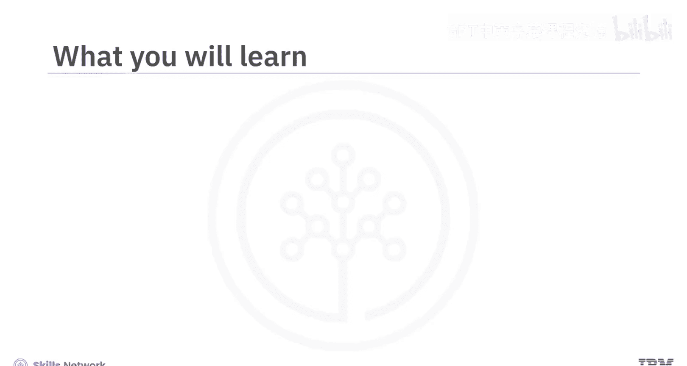
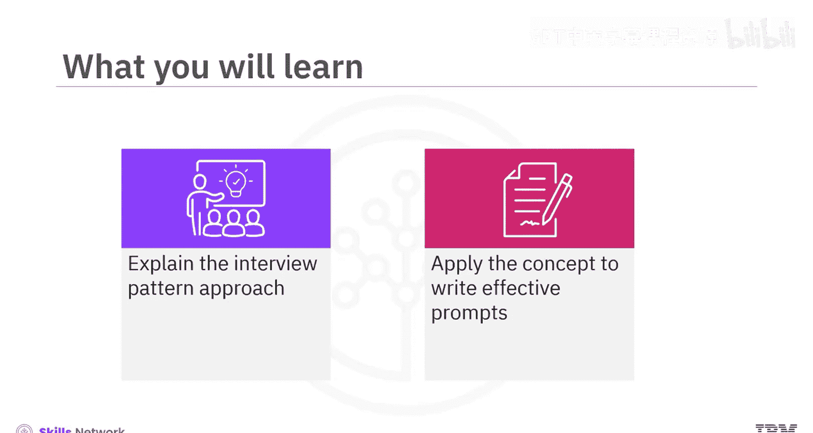
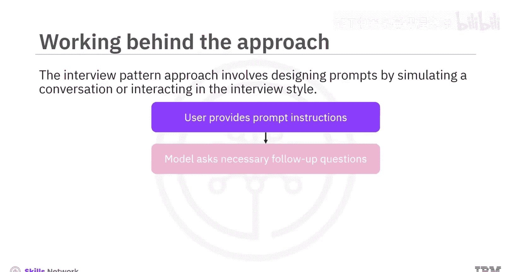
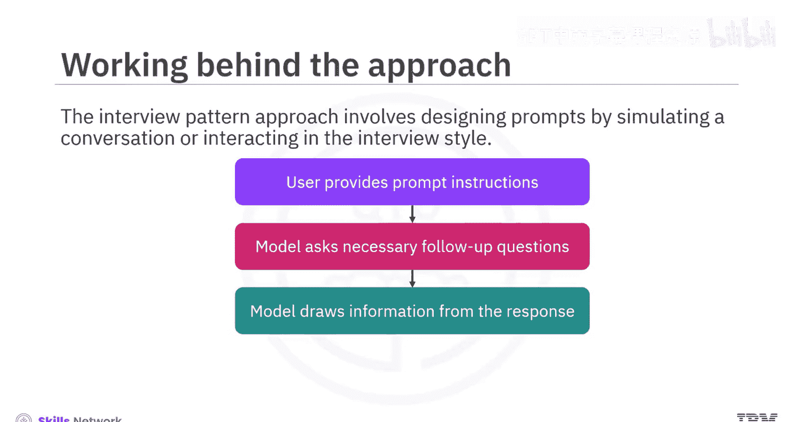
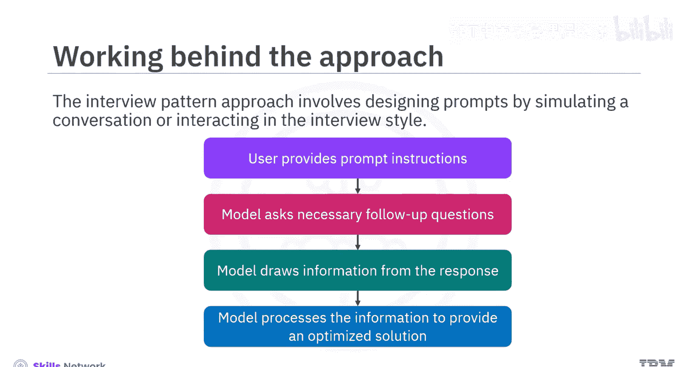
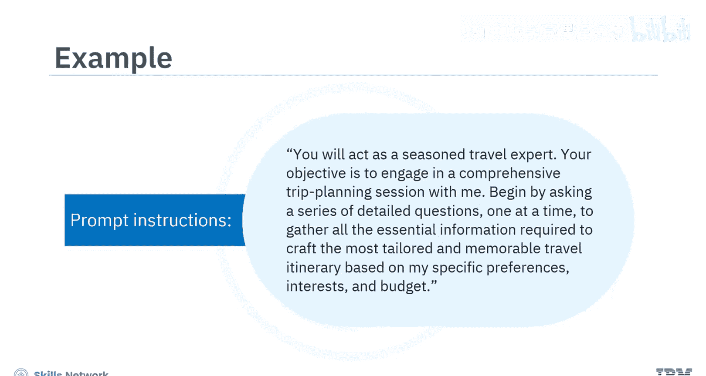
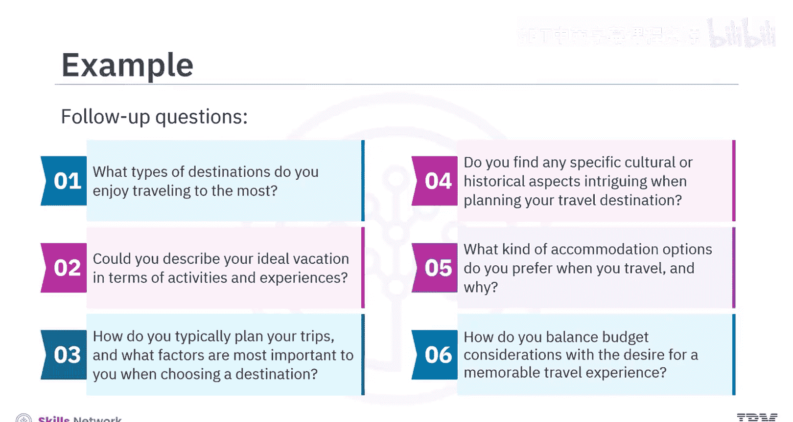
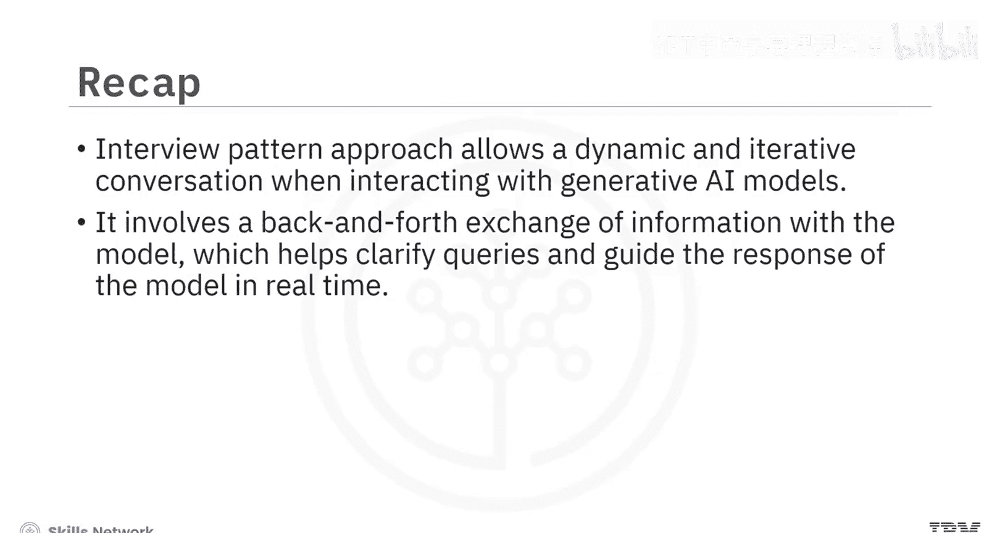

# 025：面试模式法 🎤

在本节课中，我们将学习一种名为“面试模式法”的提示工程策略。这种方法通过模拟对话或面试风格的互动来设计提示，旨在引导生成式AI模型产生更具体、更符合需求的回答。

## 概述





面试模式法是一种提示工程策略，其核心在于通过模拟对话或面试的形式与模型进行交互。这种方法要求对提示进行细致优化，以确保模型生成的回答能精确满足你的目标。它涉及向模型提供特定的提示指令，模型则根据这些指令向用户提出必要的后续问题。根据用户对这些后续问题的回答，模型会提取相关信息进行处理，最终为用户提供一个经过优化的回答。通常，你提供的信息越详细，得到的结果就越好。

## 面试模式法如何运作

上一节我们介绍了面试模式法的基本概念，本节中我们来看看它的具体运作流程。

这种方法通常包含以下几个步骤：

1.  **设定角色与目标**：首先，你需要明确指示模型扮演一个特定角色（例如，旅行顾问），并告知其本次交互的最终目标（例如，制定旅行计划）。
2.  **发起结构化提问**：模型会根据你的初始指令，开始提出一系列详细的、一个接一个的问题，以收集所有必要信息。
3.  **信息收集与处理**：用户回答这些问题。模型会根据用户的回答，提取关键信息并理解其偏好与需求。
4.  **生成优化响应**：在收集到足够信息后，模型综合处理所有信息，生成一个高度定制化的、符合用户具体需求的最终回答。





为了更好地理解，让我们通过一个例子来具体说明。




## 应用实例：旅行行程规划

假设你希望模型扮演一位旅行顾问，为你规划一次假期旅行行程。你应该如何提示模型呢？



你可以向模型提供如下提示指令：

```
你将扮演一位经验丰富的旅行专家。你的目标是与我进行一次全面的旅行规划会话。请首先提出一系列详细的问题（一次一个），以收集所有必要信息，从而根据我的具体偏好、兴趣和预算，制定出最量身定制且令人难忘的旅行行程。
```

根据这个提示指令，模型会开始提出所有必需的后续问题。以下是模型可能会问的一些问题示例：

*   你最喜欢去哪种类型的旅行目的地？
*   能否描述一下你理想假期的活动和体验？
*   你通常如何规划旅行？在选择目的地时，哪些因素对你最重要？
*   在规划旅行目的地时，你是否对特定的文化或历史方面感兴趣？
*   旅行时你偏好哪种住宿选择？为什么？
*   你如何平衡预算考虑与获得难忘旅行体验的愿望？

在这个例子中，每个问题都建立在前一个问题的基础上，形成了一场关于旅行偏好的结构化、信息丰富的对话。根据你对这些问题的回答，模型将规划出一个符合你偏好和需求的、令人难忘的旅行行程。

## 面试模式法的优势

通过上面的学习，我们了解到面试模式法相比传统的单次提示方法更具优势。



传统的单次提示方法通常是静态的，而面试模式法则允许与生成式AI模型进行更动态、迭代的对话。它涉及与模型进行来回的信息交换，这有助于实时澄清疑问并引导模型的回答方向。反过来，这也增强了用户优化所获结果的能力。

## 总结



本节课中，我们一起学习了提示工程的“面试模式法”。我们了解到，这种方法通过模拟面试对话，引导AI模型提出后续问题来收集详细信息，从而生成更精准、更个性化的回答。关键在于提供清晰的初始指令，让模型扮演特定角色并明确目标，然后通过交互式问答不断完善输出结果。这种方法尤其适用于需要深度定制和复杂信息处理的场景。