# 026：思维链方法 🧠

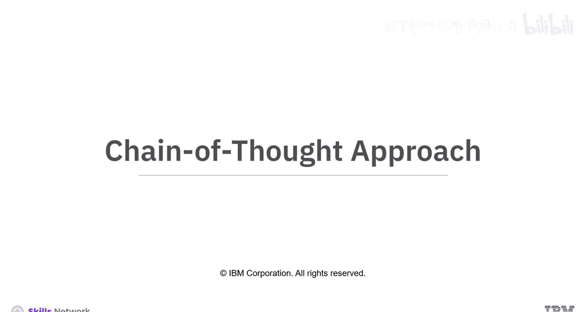

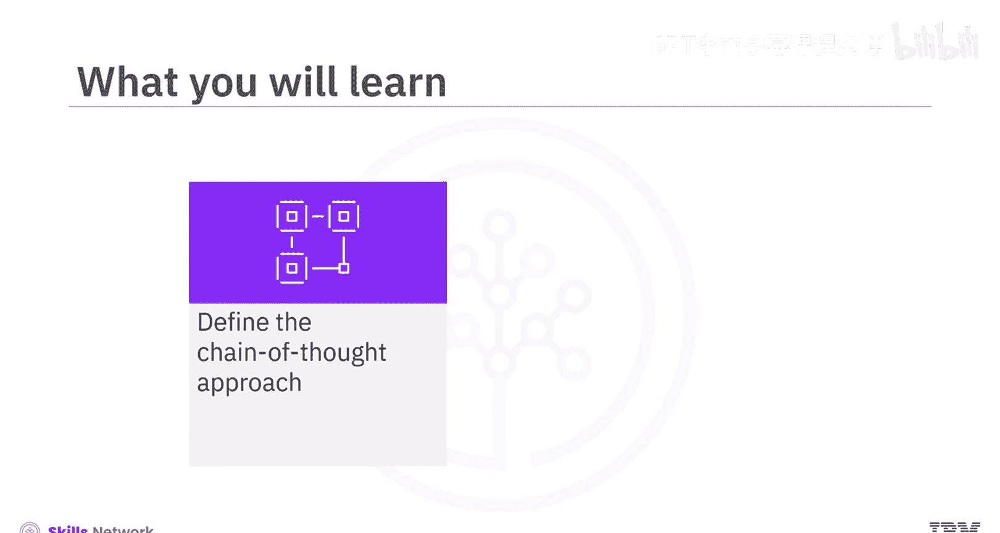

在本节课中，我们将要学习**思维链方法**。这是一种通过将复杂任务分解为更小、更易管理的步骤，来引导生成式AI模型进行推理的技术。我们将了解其定义、应用、两种主要实现方式及其优缺点。

## 概述

思维链方法是一种通过一系列提示或问题，将困难或复杂的任务分解为更小、更易管理步骤的方法。每个提示都建立在前一个的基础上，引导AI模型逐步思考问题并生成期望的回应。这种方法使模型能够展示其推理过程，并提高其准确解决类似问题的能力。

通过向模型提供问题及其解决方案，思维链帮助模型以结构化和逻辑化的方式处理任务。

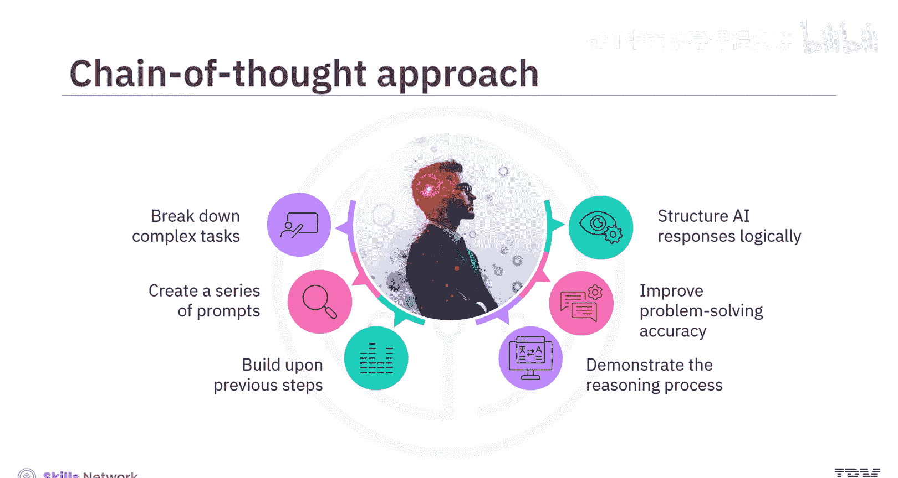

## 思维链方法的应用与优势

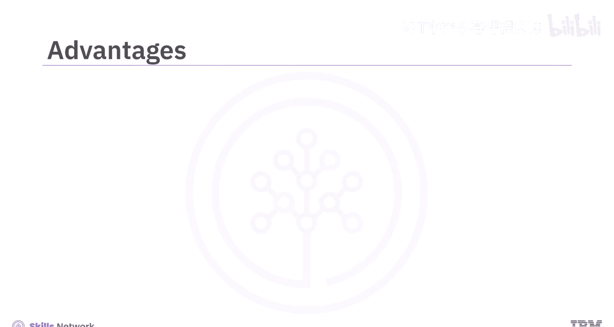

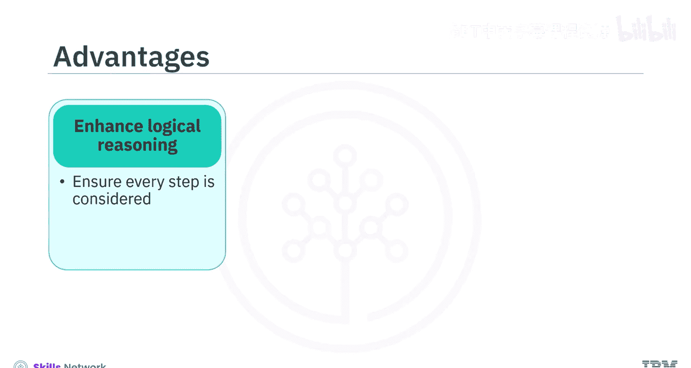

上一节我们介绍了思维链的基本概念，本节中我们来看看它为何在生成式AI中被广泛应用。

该方法之所以被广泛使用，是因为它能增强逻辑推理能力，并确保过程中的每一步都被考虑到，从而得出更准确的结果。

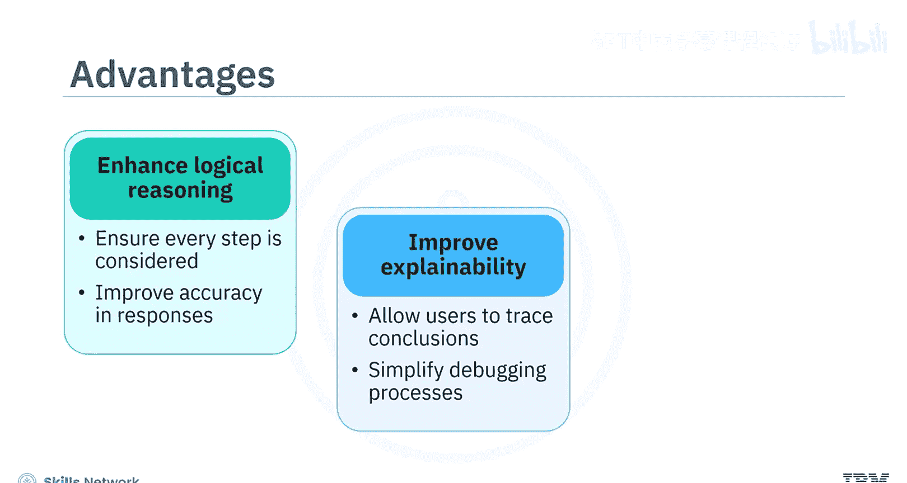

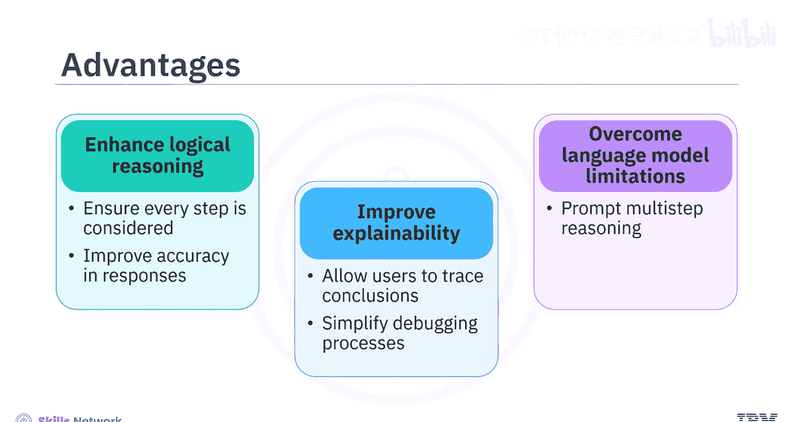

它还能提高**可解释性**，允许用户追溯AI得出结论的过程，并简化调试。此外，它有助于克服语言模型的局限性，因为语言模型本身并非为多步推理而设计，除非被提示这样做。

## 思维链的两种主要模型

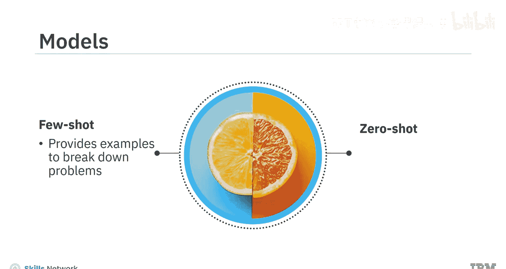

了解了思维链的优势后，接下来我们具体看看它的两种实现方式。

思维链建模中最常见的两种模型是**少样本思维链**和**零样本思维链**。

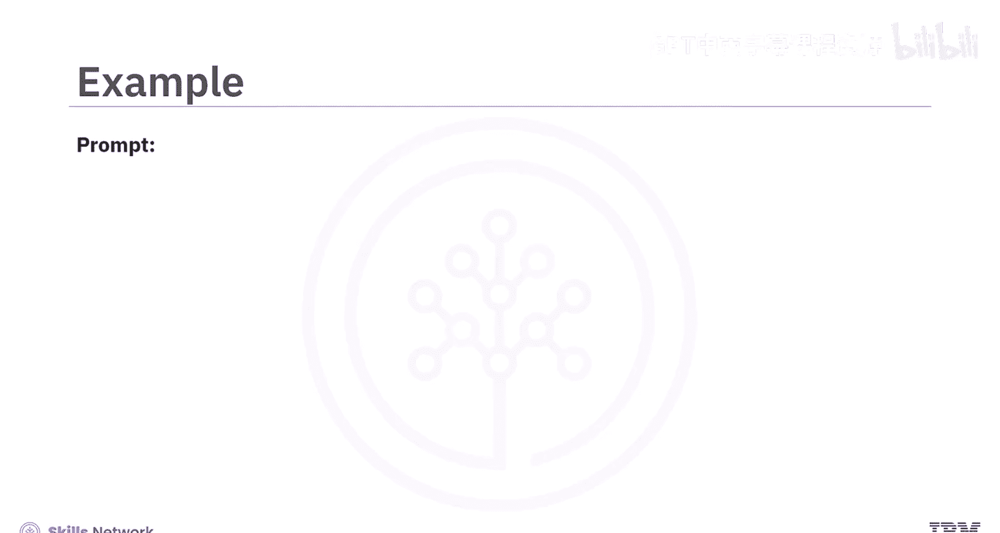

*   **少样本思维链**：通过提供示例来展示如何分解问题。
*   **零样本思维链**：鼓励模型独立地逐步思考问题。

## 少样本思维链示例

为了更清晰地理解这两种方法，让我们通过一个例子来说明。首先从少样本方法开始。

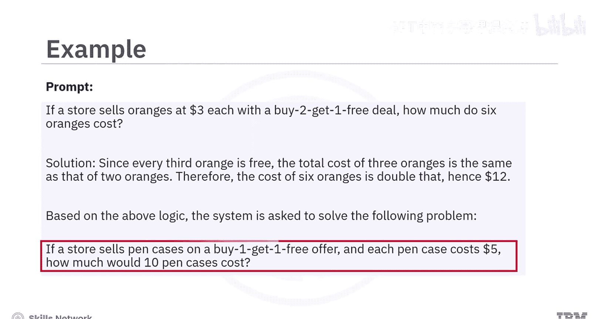

示例问题是关于一家商店以每个3美元的价格出售橙子，并提供“买二送一”的优惠。解决方案通过识别“每三个橙子中有一个是免费的”这一规则来逐步推导。因此，三个橙子的成本相当于支付两个的钱。

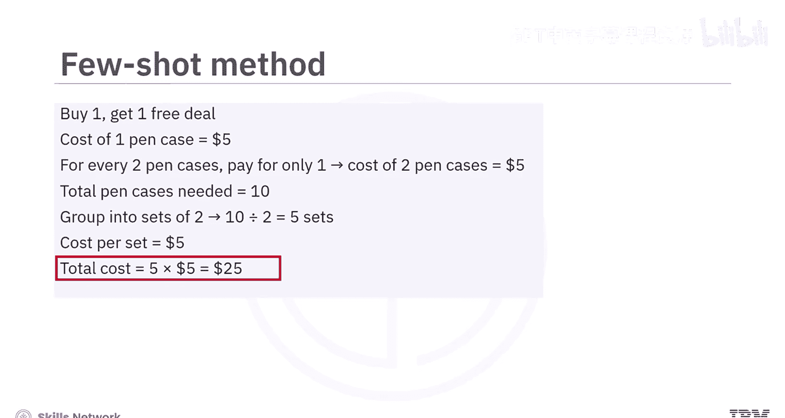

将这一逻辑延伸，六个橙子的成本相当于四个，总计12美元。

现在，向系统提出一个类似的问题。这次的问题是：一家商店出售笔盒，提供“买一送一”优惠，每个笔盒售价5美元。利用提示中提供的示例所展示的相同思维链推理，系统首先理解优惠结构，然后基于示例中的推理生成回应。因此，它能够得出正确答案：成本将是25美元。因为10个笔盒中，只需支付5个的钱。

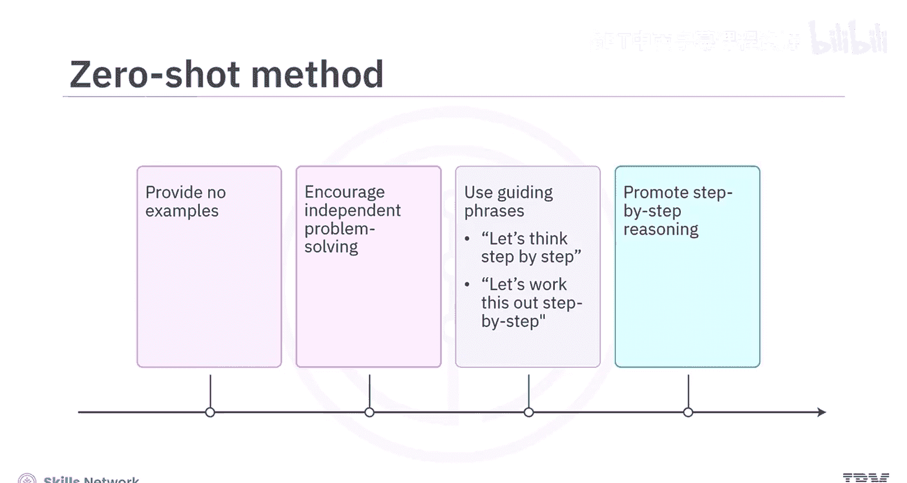

## 零样本思维链示例

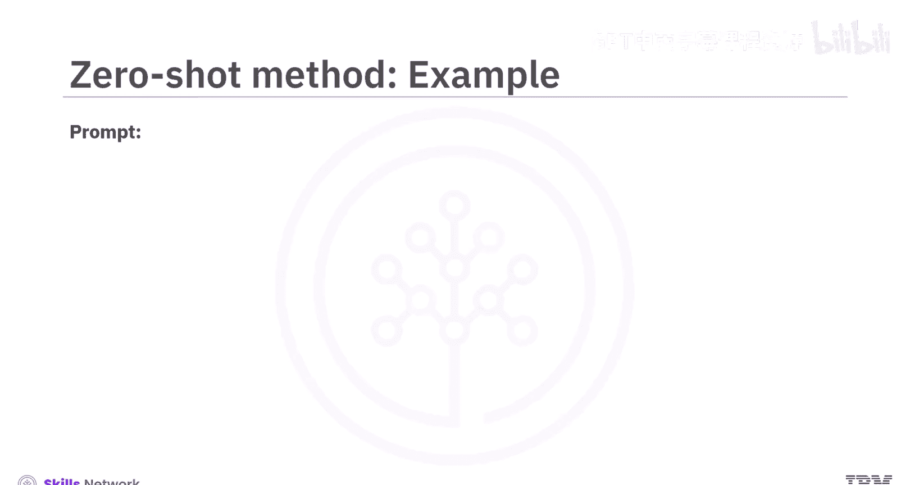

在零样本方法中，不提供任何示例，而是鼓励系统独立找出答案。提示中会添加诸如“让我们逐步思考”或“让我们一步步解决这个问题以确保答案正确”之类的短语，以帮助系统独立推导出解决问题的方法。

让我们用同样的笔盒问题，看看如何使用零样本方法解决。

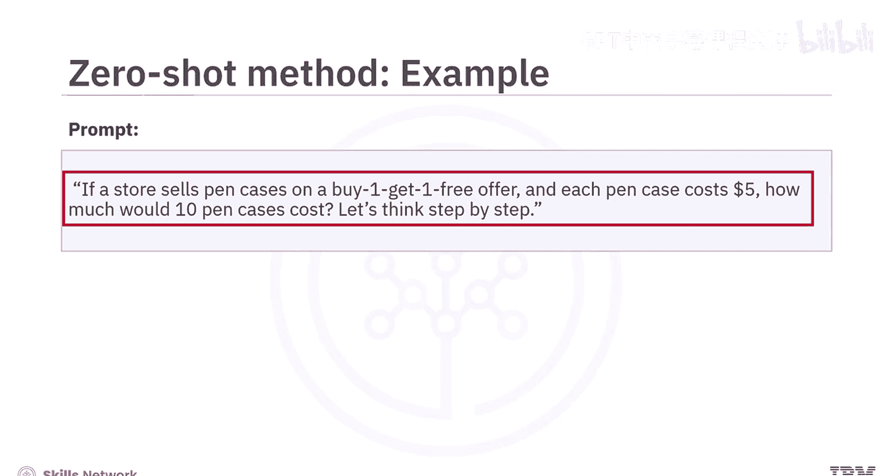

提示如下：“如果一家商店以‘买一送一’的优惠出售笔盒，每个笔盒5美元，那么10个笔盒需要多少钱？让我们逐步思考。”

在这种情况下，系统不依赖事先的样本或示例。相反，它尝试自己推理问题。它首先解释优惠，理解每两个笔盒，顾客只需支付一个的钱。

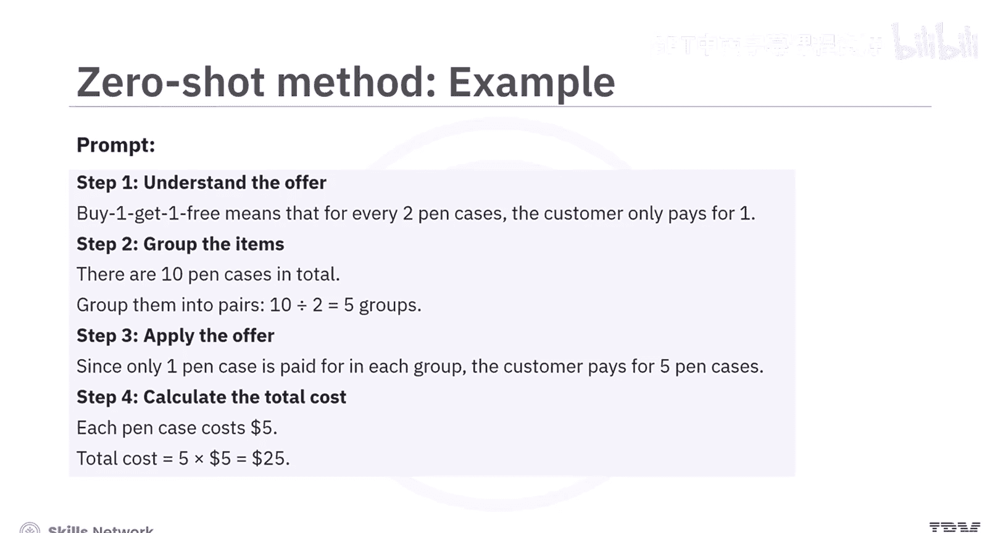

然后它将这种理解应用于问题。它将10个笔盒分成5个“付费+免费”的组合，意识到只需支付5个笔盒的钱，并计算出总价为25美元。因此，即使没有先看到示例，系统也能够逐步推理逻辑并得出正确答案。

## 思维链方法的挑战

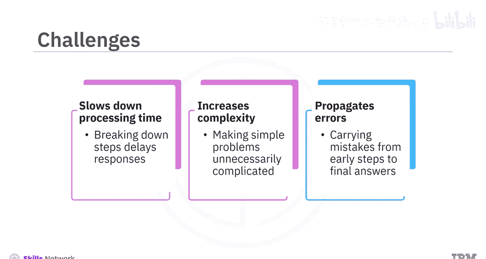

虽然思维链方法功能强大，但也存在一些需要考虑的挑战。

将回应分解为步骤可能会减慢模型速度，这对于聊天机器人等需要快速响应的应用可能并不理想。此外，这种方法可能使简单问题变得不必要的复杂，让AI显得效率低下。早期步骤中的错误可能会延续下去，导致最终答案错误。

## 总结

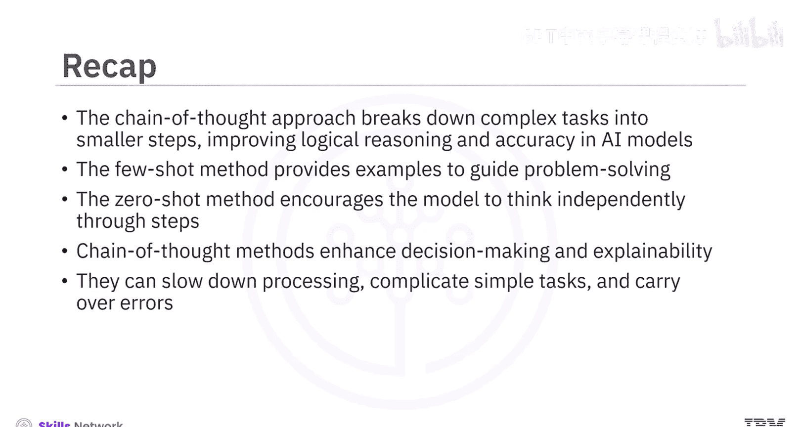

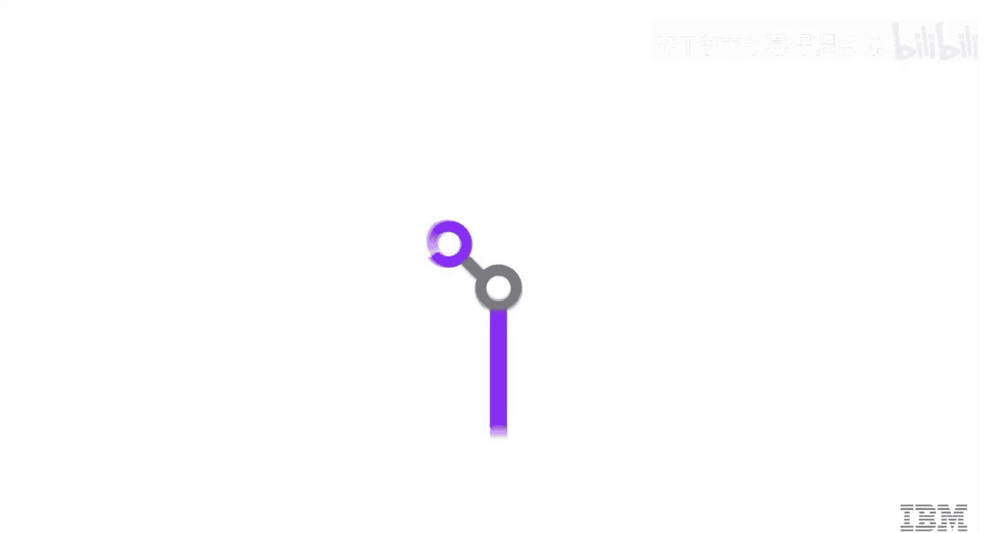

本节课中我们一起学习了思维链方法。我们了解到，思维链方法通过将复杂任务分解为更小的步骤，提高了AI模型的逻辑推理能力和准确性。两种主要的思维链方法是：提供示例以指导问题解决的**少样本思维链**，以及鼓励模型独立逐步思考的**零样本思维链**。虽然思维链增强了决策能力和可解释性，但它也可能降低处理速度、使简单任务复杂化，并可能延续早期步骤中的错误。