# 027：树状思维链方法 🌳

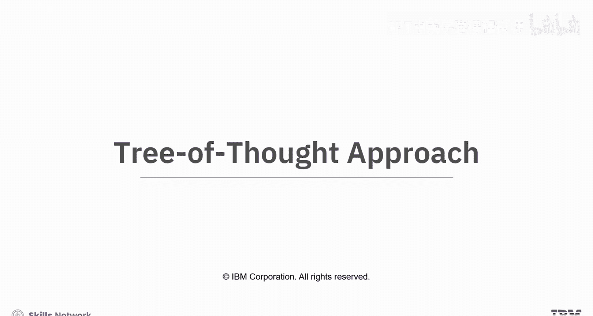

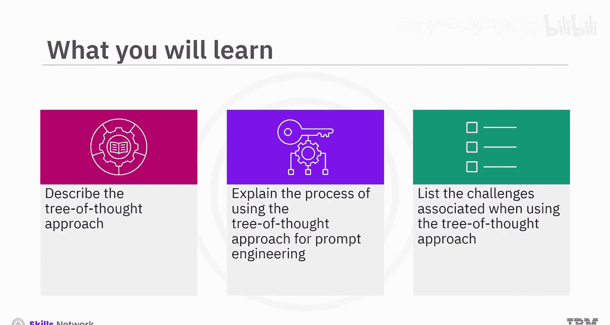

在本节课中，我们将要学习一种名为“树状思维链”的高级提示工程方法。我们将了解其核心概念、应用过程，并通过实例分析其如何帮助解决复杂问题，最后探讨其局限性。

## 概述

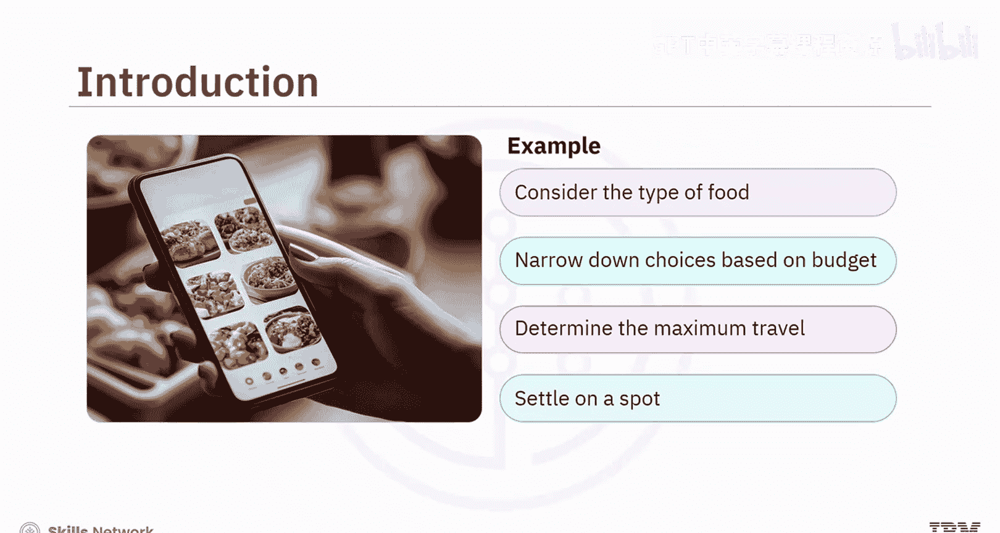

树状思维链方法通过将提示结构化为一个具有层级分支的树，来增强AI的推理能力。它允许AI同时评估多种可能性，预测潜在结果，并聚焦于最有希望的选项。这种方法对于通过提供明确指导和探索多种解决方案来解决复杂问题非常有价值。

## 树状思维链方法简介

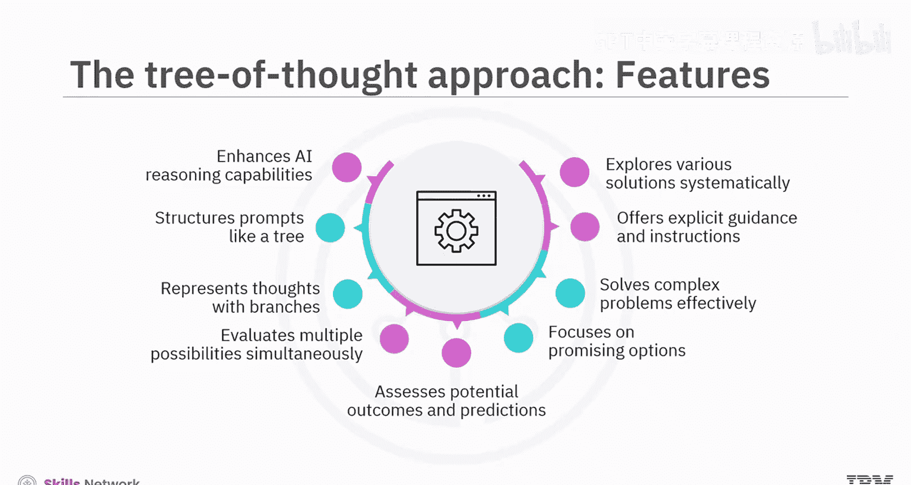

想象一下，你和朋友需要决定去哪里吃饭。首先，你们会考虑想吃什么类型的食物。然后，根据预算和愿意出行的距离来缩小选择范围。最后，你们选定一个符合口味和偏好的地点。

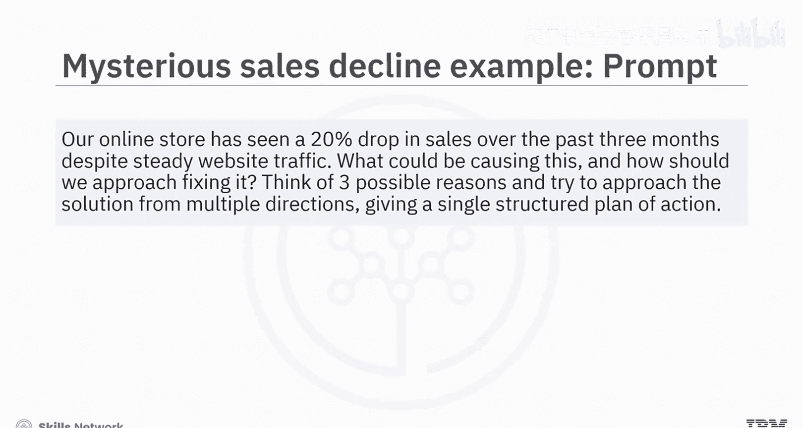

这就是树状思维链方法在现实中的一个例子。

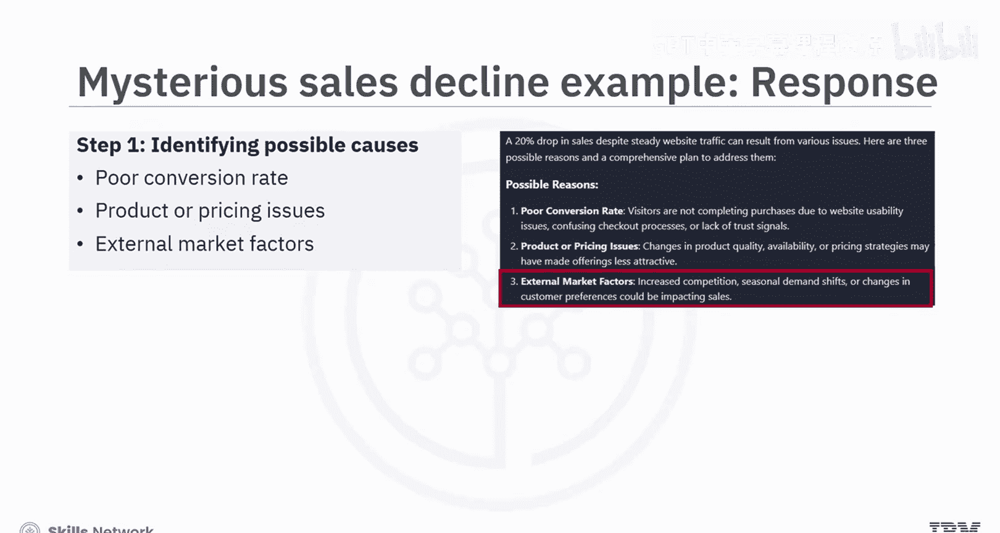

上一节我们介绍了树状思维链的基本概念，本节中我们来看看它的具体工作原理。

树状思维链方法通过将提示结构化为一个**树状层级分支**，来增强AI推理。每个分支代表不同的思考路径。这使得AI能够：
*   同时评估多种可能性。
*   评估潜在结果。
*   专注于最有希望的选项。

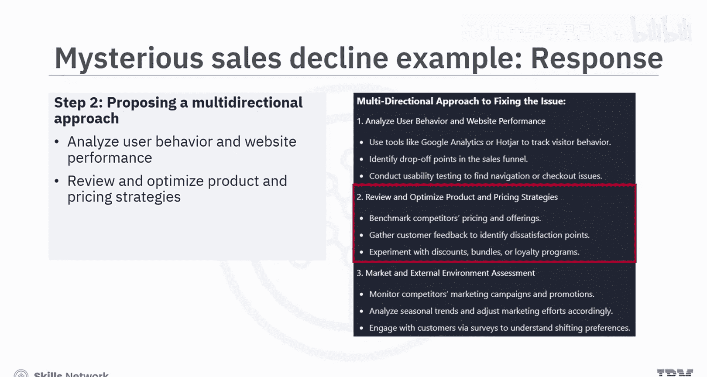

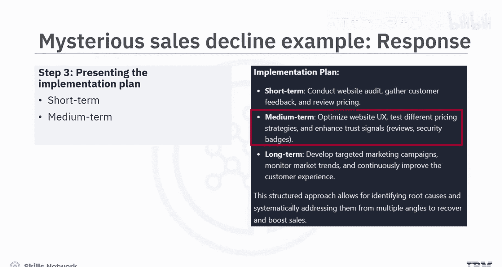

该技术通过提供明确的指导和探索各种解决方案，对解决复杂问题很有价值。

## 应用实例：解决业务问题

以下是树状思维链方法在解决业务问题中的应用示例。

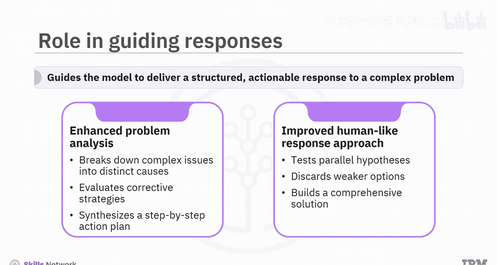

让我们考虑一个场景：一家在线商店经历了神秘的销售额下降。提示如下：
> “我们的网店在过去三个月销售额下降了20%，尽管网站流量保持稳定。可能是什么原因导致的？我们应该如何解决？请思考三种可能的原因，并尝试从多个方向着手，最终给出一个结构化的行动计划。”

作为对提示的回应，模型首先识别并清晰地列出了销售额下降的三个最可能原因：
1.  **转化率低**：流量未转化为购买。
2.  **产品或定价问题**：商品缺乏吸引力或价格不合理。
3.  **外部市场因素**：竞争加剧或消费者趋势变化。

然后，它提出了一个针对已识别主要问题的多方向解决策略，即为每个主要原因制定策略。最后，模型呈现了一个结构化的实施计划，通过短期、中期和长期行动来解决该问题。

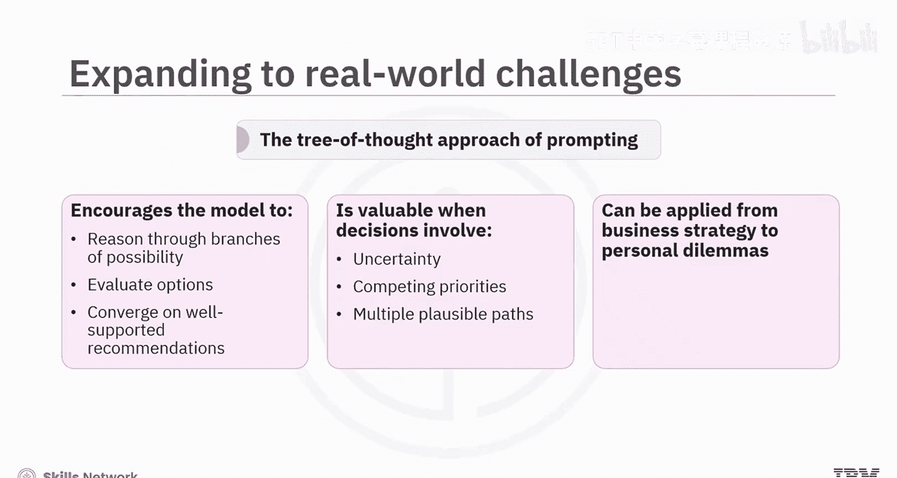

让我们分析这个网店例子，以理解树状思维链提示方法如何在引导模型为复杂业务问题提供结构化、可操作的响应中发挥关键作用。

通过鼓励模型探索多种推理路径，提示实现了跨相互关联维度的更深入分析。模型没有提供通用回答，而是将问题分解为三个不同的原因，从用户体验、定价和市场趋势等不同功能角度评估纠正策略，并综合出一个分步行动计划。这模仿了人类专家处理复杂、多层面问题的方式：测试平行假设、舍弃较弱选项并构建全面解决方案。这解释了树状思维链提示方法如何增强了模型的整体推理能力，并交付了兼具诊断性和战略性的响应。

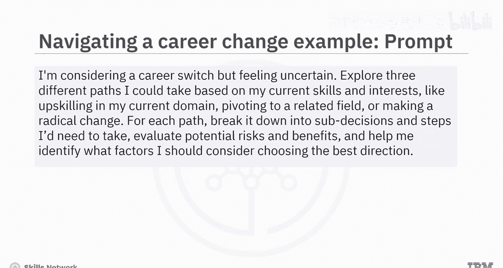

## 应用实例：支持个人决策

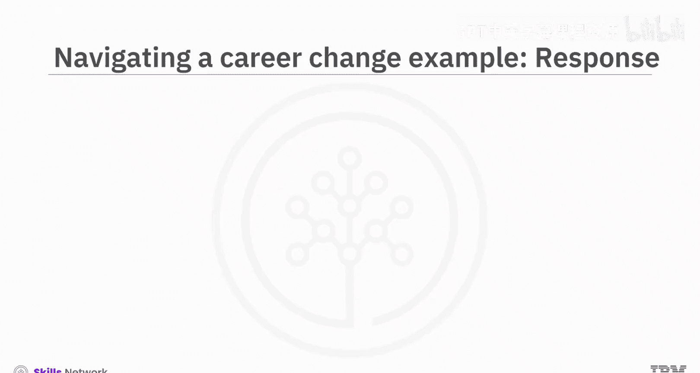

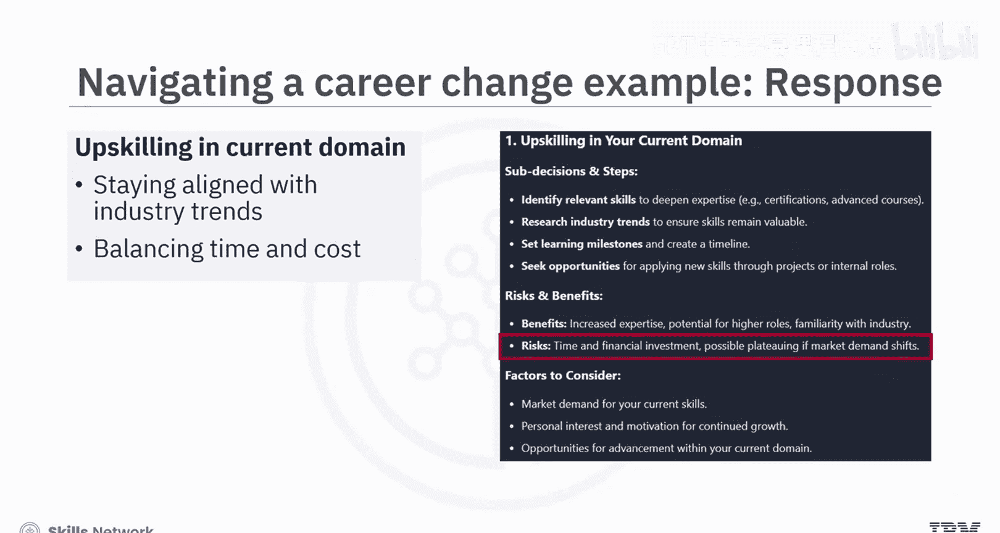

除了业务策略，树状思维链方法也可应用于个人困境，例如规划职业转型。

我们来看一个提示，它展示了树状思维链方法如何在规划职业转型的背景下支持深思熟虑的决策。
> “我正在考虑转行，但感到不确定。请基于我当前的技能和兴趣，阐述三条我可以走的路径（例如：在当前领域提升技能、转向相关领域或进行彻底转变）。对每条路径，分解出细分步骤。评估潜在的风险和收益，并帮助我确定在选择最佳方向时应考虑哪些因素。”

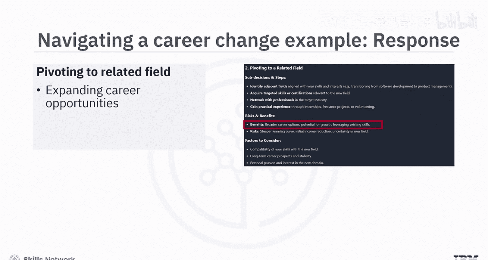

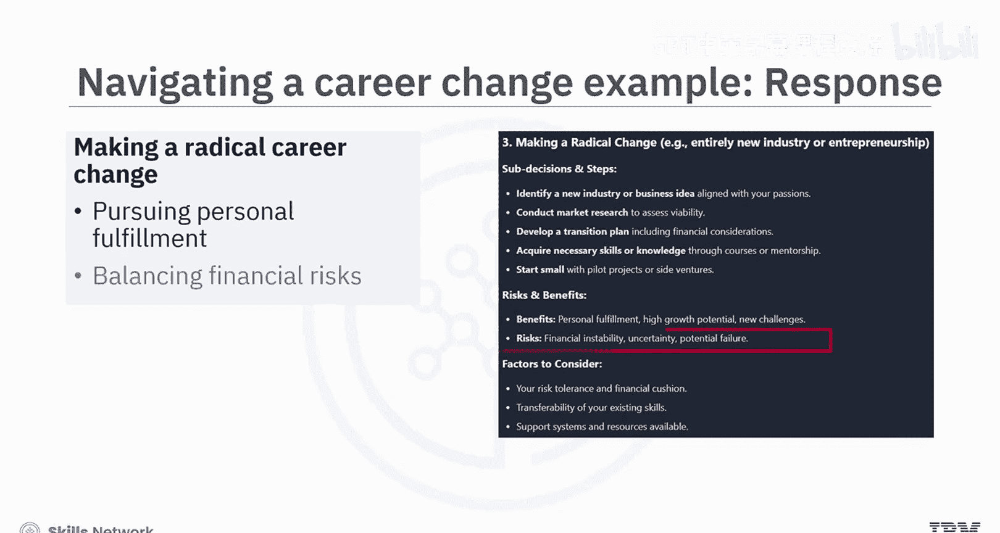

为了回应提示，模型遍历了每条思考路径，概述了不同职业转型选项的利弊。
*   **在当前领域提升技能**：优势是与行业趋势保持一致，但预设了时间和资金投入等限制。
*   **转向相关领域**：好处是拓宽职业机会，但也指出了现有技能与新角色的兼容性问题。
*   **彻底转变职业**：指出了获得更大个人满足感的潜力，但受限于财务风险和失败的可能性。

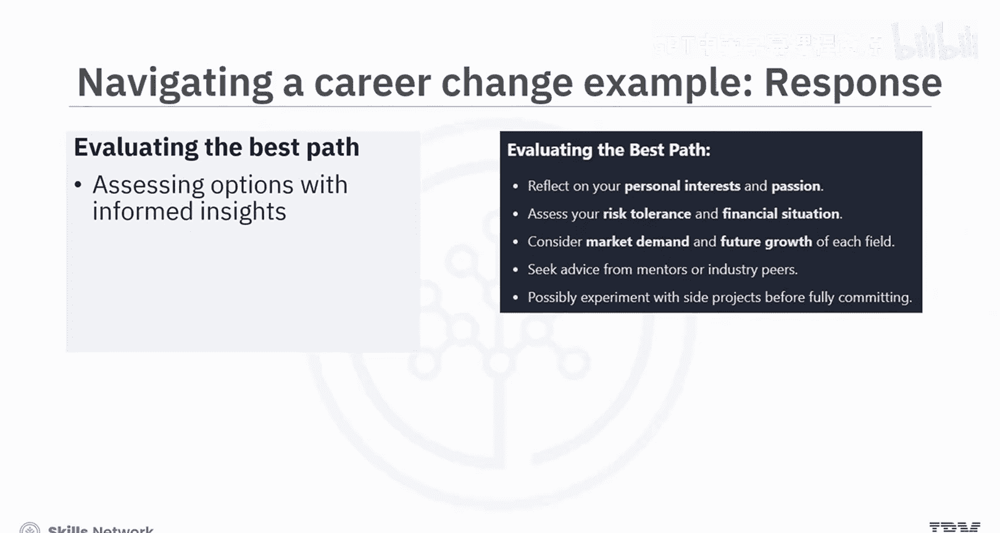

最终，模型将最终决定权留给用户，并提供了个人兴趣、风险承受能力和市场需求等考虑要点。

## 方法的局限性

虽然树状思维链提示法对于结构化推理和处理复杂的多步骤问题非常有效，但它也有其局限性。

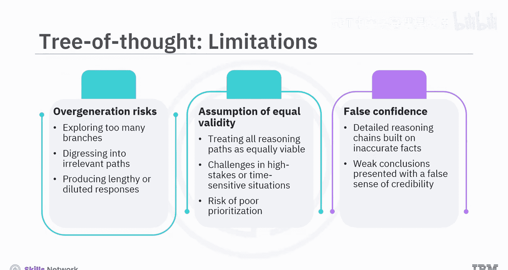

以下是使用该方法时可能遇到的一些挑战：
*   **过度生成**：模型可能探索过多分支或偏离到不太相关的路径，导致响应冗长或重点分散。
*   **假设均等有效**：该方法可能假设所有推理路径都同样有效，但在需要优先处理的高风险或时间敏感场景中并非总是如此。
*   **错误自信风险**：如果模型围绕有缺陷的逻辑或不准确的事实创建了详细的推理链，可能会给薄弱的结论带来虚假的可信度。

总而言之，如果使用得当，这种方法为在AI支持下应对模糊性和做出明智决策提供了一个强大的框架。

## 总结

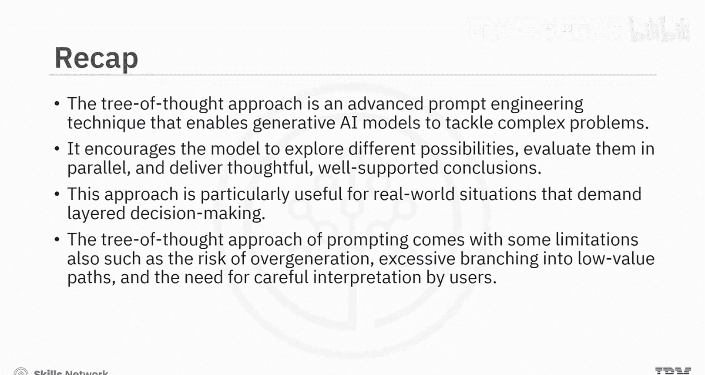

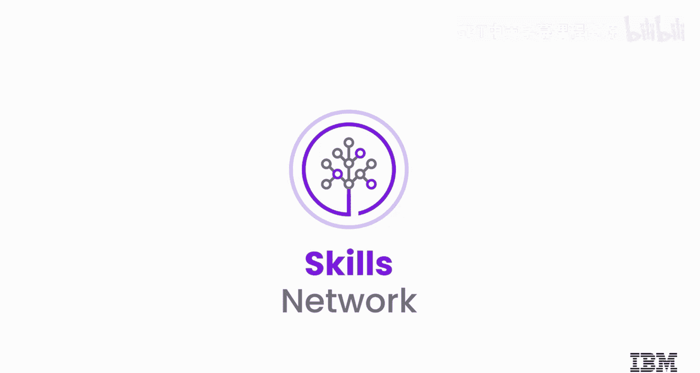

本节课中我们一起学习了树状思维链方法。
*   树状思维链是一种高级提示工程技术，它使生成式AI模型能够通过以结构化、分步的方式推理多种解决路径来处理复杂问题。
*   它鼓励模型探索不同的可能性，并行评估它们，并得出深思熟虑、有充分支持的结论。
*   这种方法对于需要分层决策的现实世界情况特别有用。
*   树状思维链提示法也存在一些局限性，例如过度生成的风险、过度分支到低价值路径，以及需要用户仔细解读。