# 029：文本到图像提示技术 🎨

在本节课中，我们将学习如何运用文本到图像提示技术，以提升生成式AI模型所创建图像的质量、多样性和影响力。掌握这些技巧，你将能够撰写出更有效的提示词，从而获得更具说服力和吸引力的视觉内容。

图像是沟通的重要组成部分，广泛应用于市场营销、广告、教育、新闻等多个领域。然而，有些图像在传达情感和信息方面比另一些更为出色。一个图像提示词就是你希望生成图像的文本描述，它可以简单到一个单词，也可以详细描述图像的构图、色彩和氛围。

为了增强通过生成式AI模型获得的图像效果，使其更具说服力和吸引力，我们可以使用图像提示技术。这些技术旨在提升生成模型所产出图像的质量、多样性和相关性。

有多种图像提示技术可用于改善图像效果。接下来，我们将逐一了解这些技术。

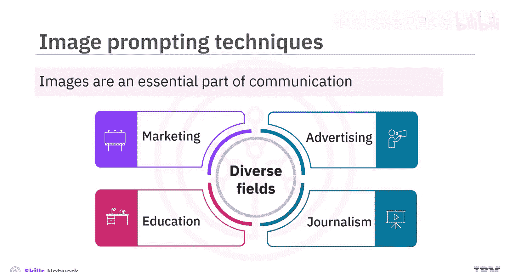

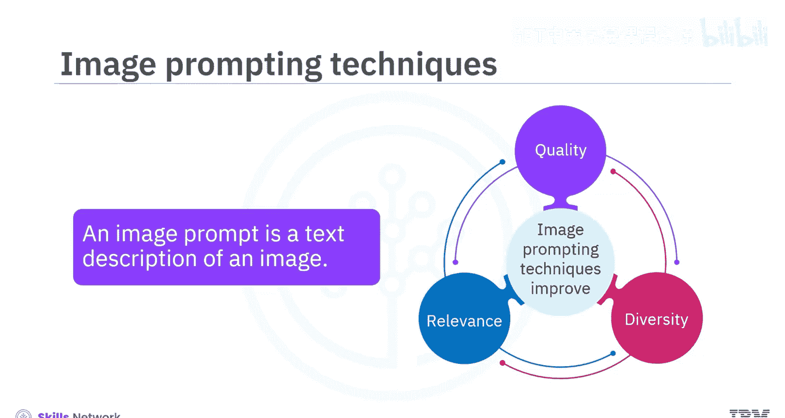

## 风格修饰词 🖌️

风格修饰词是用于影响生成式AI模型所产出图像的艺术或视觉属性的描述符。这些描述符可以帮助模型在遵循输入提示词结构和内容的同时，创造出具有创新风格的图像。

你可以修改图像的各种视觉元素，如颜色、对比度、纹理、形状和大小，从而生成具有美学吸引力、视觉上令人愉悦的输出。你的提示词可以包含关于各种艺术风格、历史艺术时期、摄影技术、所用艺术材料类型，甚至是你希望模型模仿的知名品牌或艺术家特征的信息。所有这些信息都有助于生成模型理解期望的输出图像外观或风格。

以下是图像提示词中使用风格修饰词的一些例子（示例中已高亮显示风格修饰词）：

*   **提示词**：`A futuristic cityscape at dusk, in the style of cyberpunk art, with neon lights and towering skyscrapers.`
*   **提示词**：`A portrait of a wise old wizard, rendered in the manner of a classical oil painting from the Renaissance period.`
*   **提示词**：`A serene mountain lake at sunrise, captured with a long exposure photography technique, creating a misty, ethereal effect.`

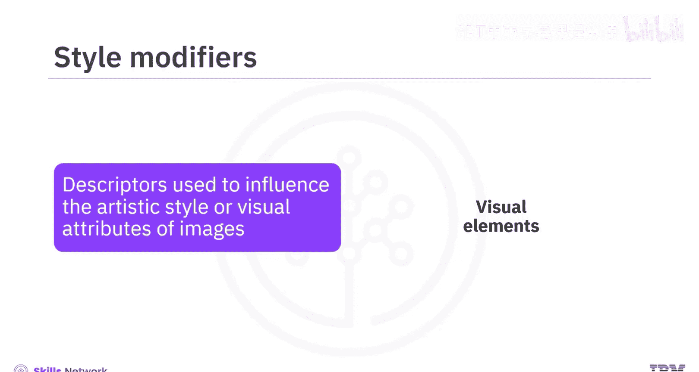

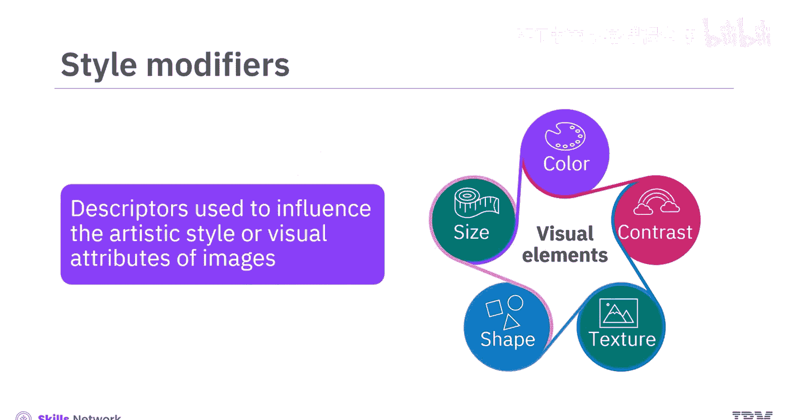

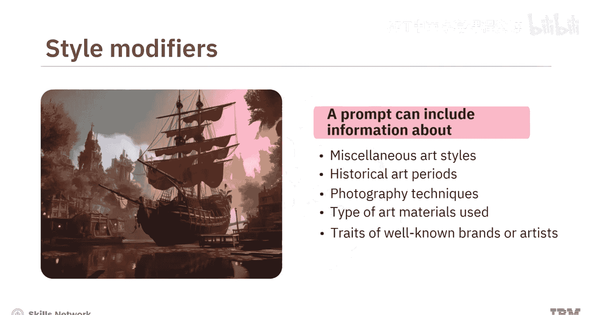

## 质量提升词 📈

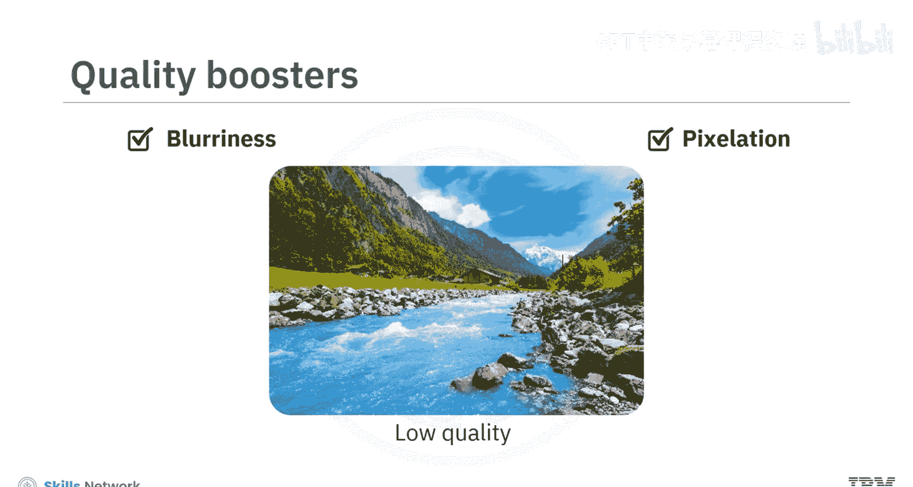

高质量的图像比低质量的图像更具说服力和可信度。低分辨率图像常常显得模糊和有像素感，使观看者难以辨别其中的细节。另一方面，高分辨率图像则能保证基本的可见性和可读性。使用高质量的图形设计可以提升图像的感知价值。

质量提升词是用于图像提示词中以增强视觉吸引力、改善整体保真度和清晰度的术语。这些特定术语可以指导生成式AI模型执行降噪、锐化、色彩校正和分辨率增强等步骤。

你可以在图像提示词中使用诸如 `high resolution`、`hyper detailed`、`sharp focus`、`complementary colors` 等术语作为质量提升词。它们可以增强图像的特定特征，从而产生更连贯的输出。

让我们看一些例子来理解如何在图像提示词中使用质量提升词（示例中已高亮显示质量提升词）：

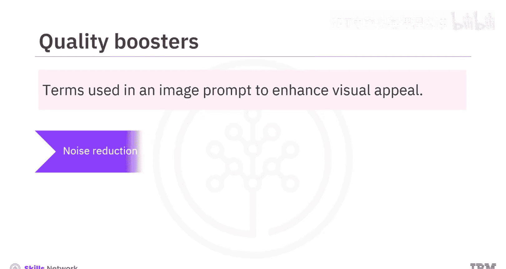

*   **提示词**：`A close-up of a bee on a flower, **hyper detailed**, **sharp focus**, **highlighting the texture** of its wings and the pollen.`
*   **提示词**：`An abstract artwork featuring **complementary colors** of blue and orange, with **fine lines** and a **blurred background** to make the central shape **stand out**.`

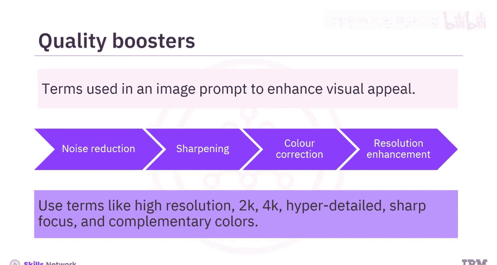

## 重复强调法 🔁

这种技术利用迭代采样来增强模型生成图像的多样性。重复强调法涉及在图像中强调特定的视觉元素，为模型创造一种熟悉感，使其能够专注于你想要突出的特定想法或概念。这可以通过在图像提示词中重复相同的单词或相似的短语来实现。

重复有助于强化通过图像传达的信息，并提高模型对关键元素的关注度。模型不会仅根据提示词生成一张图像，而是生成多张具有细微差别的图像，从而产生一组多样化的潜在输出。当生成模型面对抽象或模糊的提示词，而存在多种有效解释可能时，这种技术尤其有价值。

让我们看一些在图像提示词中使用重复单词的例子（示例中重复的单词已用粗体标出）：

*   **提示词**：`A **tiny**, **tiny** fairy in a **dense**, **dense** forest of **enormous**, **vast** mushrooms.`
*   **提示词**：`A **serene**, **clear** mountain lake reflecting the **lush**, **lush** green pine trees under a blue sky.`

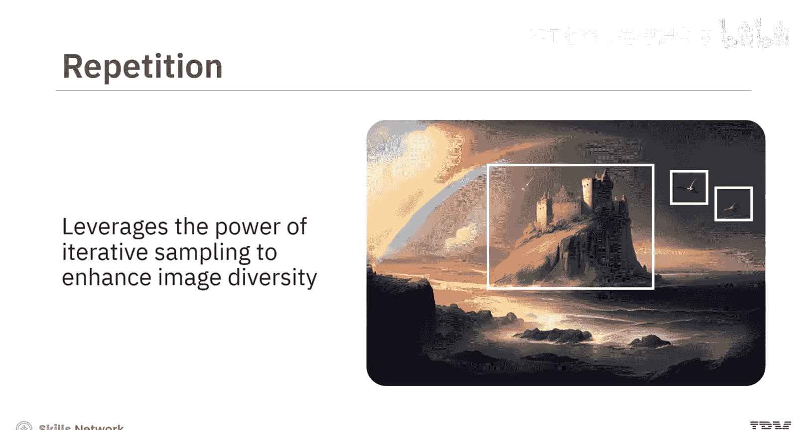

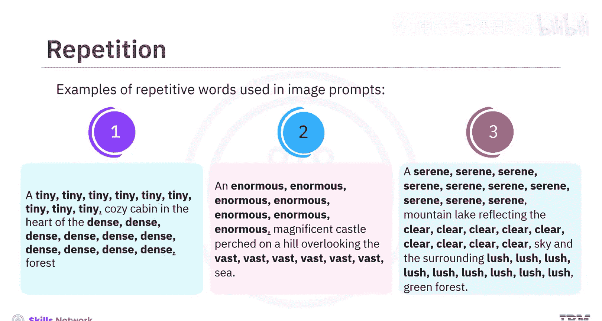

## 加权术语 ⚖️

加权术语指的是使用能够产生强烈情感或心理影响的词语或短语。例如，`free`、`limited time offer` 和 `guaranteed` 等词常用于广告中，以引发紧迫感、安全感和信任感。同样，`luxury`、`premium` 和 `exclusive` 等词则用于营造排他性和精致感。

生成式AI模型允许你为正负术语赋予权重，以强调或弱化某种情感。在图像提示词中使用加权术语有助于创建令人难忘、有说服力并能引起观众情感反应的图像。

以下是一些在图像提示词中使用加权术语的例子：

*   **提示词**：`A **warm:10** and cozy fireplace with **crackling:8** logs.` （模型应更侧重于“温暖”一词，对“噼啪作响”的关注稍弱。）
*   **提示词**：`A **shimmering:6** city skyline at night, **neon lit:8**.` （模型应更侧重于“霓虹灯照亮”。）
*   **提示词**：`An **exotic:10** bird with **colorful:-6** feathers.` （模型必须强调“异国情调”一词，并弱化“色彩鲜艳”一词。）

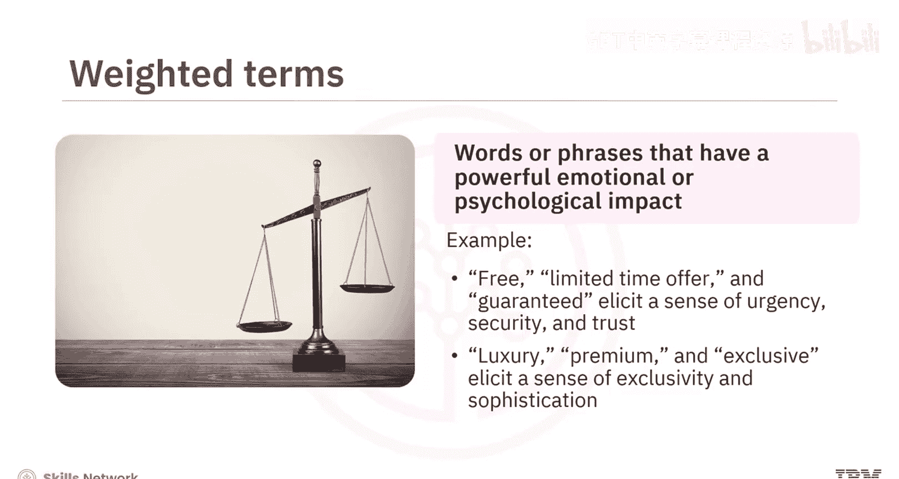

## 修复畸形生成 🛠️

该技术用于修改可能影响图像效果的畸形或异常。图像中的畸形可能包括扭曲（特别是在人体部位如手或脚上）、像素化或其他影响图像视觉吸引力和清晰度的质量问题。通过使用恰当的负面提示词，可以在一定程度上缓解这些问题。

以下是图像提示词中使用修复畸形生成技术的一些例子（示例中使用了负面提示词来缓解图像畸形问题）：

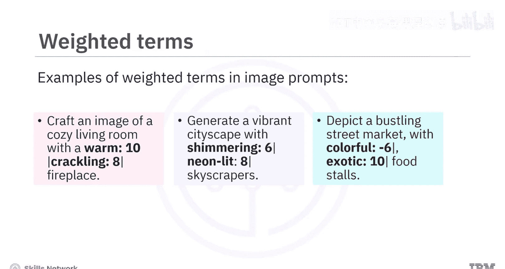

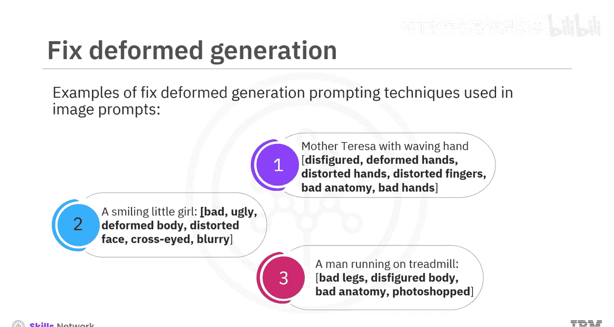

*   **提示词**：`A professional full-body portrait of a businessperson, sharp suit, confident pose.` **负面提示词**：`deformed hands, extra fingers, blurry face.`
*   **提示词**：`A majestic eagle in flight against a clear blue sky, detailed feathers.` **负面提示词**：`distorted wings, pixelated background, unnatural colors.`

## 总结 📝

本节课中，我们一起学习了文本到图像提示技术。我们了解到，图像提示技术在提升生成式AI模型的图像生成能力方面起着至关重要的作用。**风格修饰词**、**质量提升词**、**重复强调法**、**加权术语**和**修复畸形生成**是五种可用于改善图像影响力的技术。通过结合运用这些技巧，可以创造出更令人难忘、更具吸引力和说服力的视觉内容，从而有效地传达预期信息。