# 031：0_课程介绍3

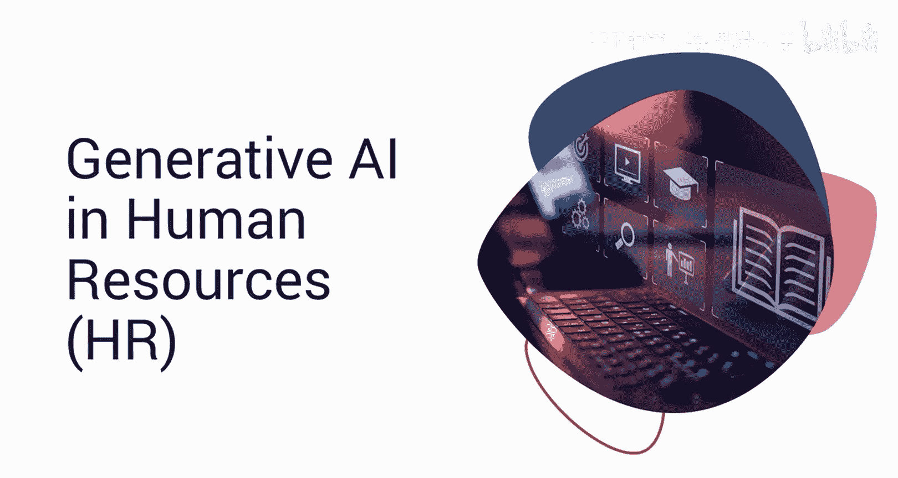

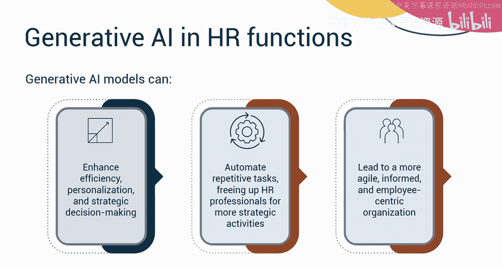

## 概述 📋

在本课程中，我们将学习如何利用生成式人工智能（Generative AI）来增强人力资源（HR）职能的效率、个性化水平和战略决策能力。

## 课程目标 🎯

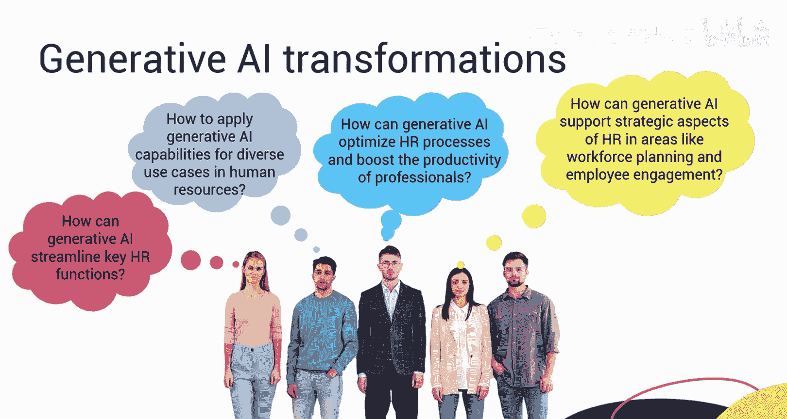

欢迎来到《生成式AI与人力资源》课程。利用生成式AI的能力对于提升HR职能的效率、个性化和战略决策至关重要。

生成式AI可以自动化重复性任务，从而让HR专业人员能够专注于更具战略性的活动。将生成式AI整合到HR职能中，可以打造一个更敏捷、信息更灵通、更以员工为中心的组织。

工作、职位和市场动态的变革促使我们提出一些深刻的问题，例如：
*   生成式AI如何简化关键的HR职能？
*   如何在人力资源的多样化应用场景中运用生成式AI能力？
*   生成式AI如何优化HR流程并提升专业人员的生产力？
*   生成式AI如何在劳动力规划和员工敬业度等领域支持HR的战略层面？

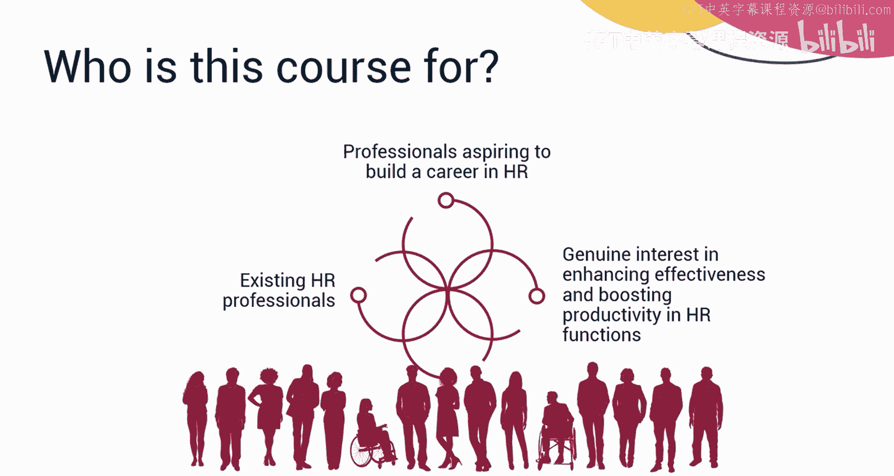

## 课程内容与结构 📚

本课程将解答上述问题，你将探索如何利用生成式AI能力来提升HR领域专业人员的生产力。本课程专为现有的HR专业人员以及有志于在HR领域建立职业生涯的人士设计。如果你有兴趣了解生成式AI如何提升不同流程的效能并推动各项HR职能的生产力，那么这门课程非常适合你。

课程结束时，你将能够：
*   解释生成式AI在人力资源中的益处、影响和应用场景。
*   在各种HR职能中实施生成式AI解决方案。
*   讨论在HR中实施生成式AI的伦理考量、潜在问题和最佳实践。
*   为HR制定AI采用路线图，并组建一支具备AI能力的团队。

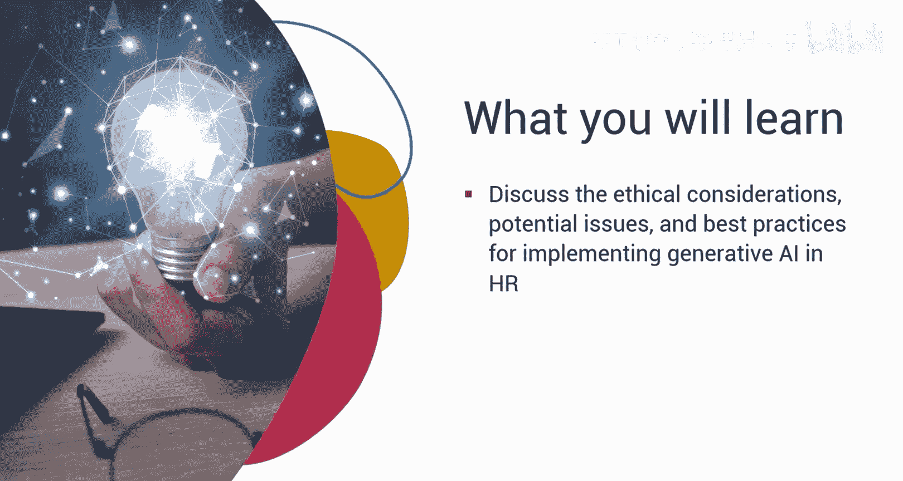

本课程是一个包含三个模块的聚焦课程，预计每个模块需要花费一到两个小时完成。

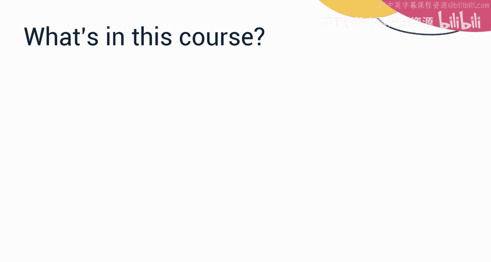

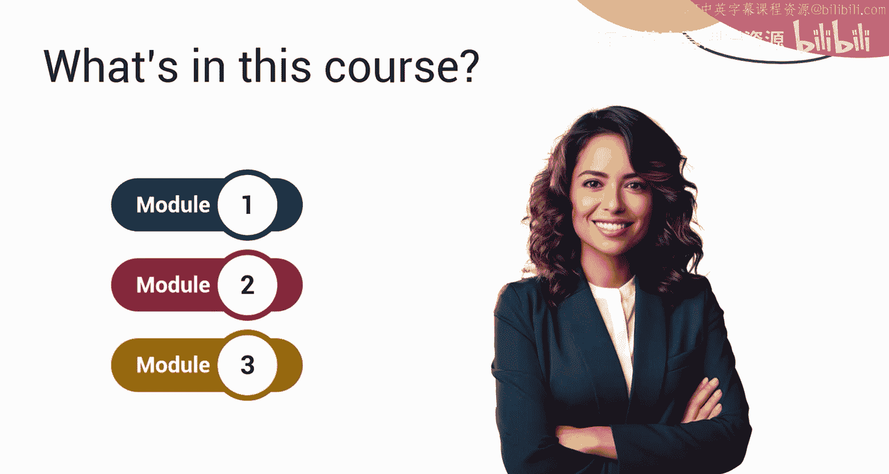

## 模块详解 🔍

上一部分我们概述了课程的整体目标，接下来我们详细看看每个模块的具体内容。

### 模块一：生成式AI在HR中的基础与应用

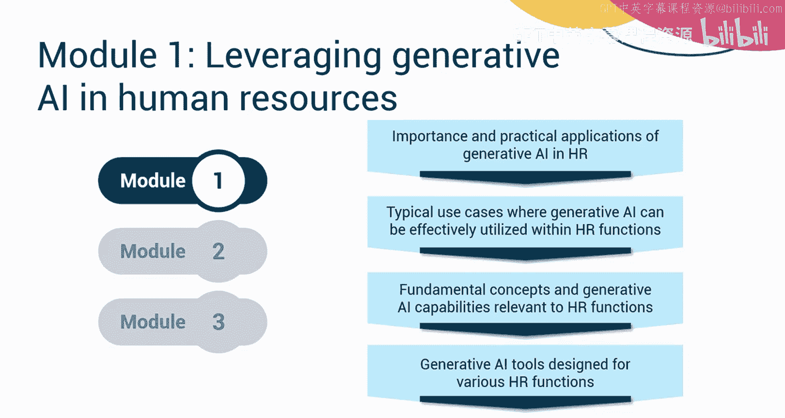

在课程的第一个模块中，你将学习生成式AI在HR中的重要性和实际应用。你将探索生成式AI可以在HR职能中有效应用的典型场景。你还将涵盖与这些HR职能相关的生成式AI基本概念和能力。此外，你将了解为各种HR职能设计的各类生成式AI工具。

### 模块二：优化流程与战略赋能

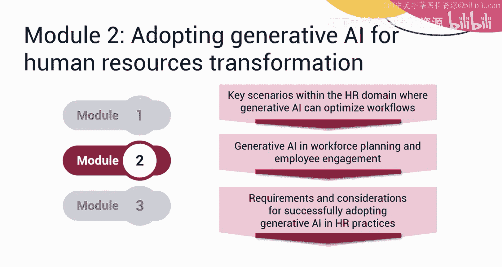

在模块二中，你将审视HR领域内生成式AI可以优化工作流程的关键场景。你还将探索HR的战略角色，展示生成式AI如何在劳动力规划和员工敬业度等关键领域提供协助。此外，你还将探讨在组织HR实践中成功采用生成式AI的要求和考量因素。

### 模块三：伦理、实践与巩固

在模块三中，你将探讨生成式AI的伦理考量和负责任的使用，并讨论其局限性和潜在问题。为了巩固你的理解，该模块包含一个基于核心概念的计分测验。此外，你将完成一个在实践场景中应用这些概念的最终项目。

## 学习资源与活动 🛠️

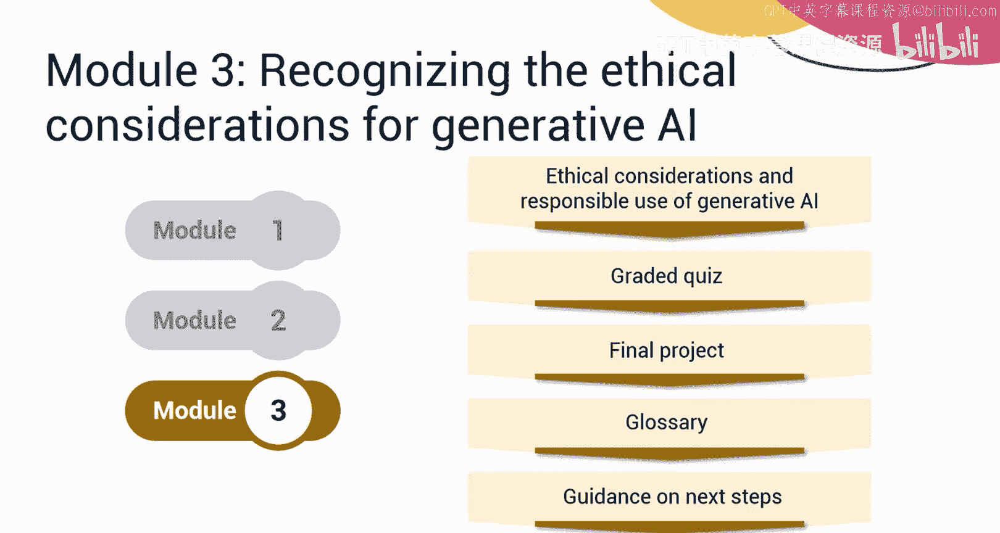

为了支持你的学习，课程中包含了术语表，以帮助你理解与生成式AI相关的技术术语含义。你也可以获得关于后续学习步骤的指导。

本课程融合了概念讲解视频和辅助阅读材料。观看所有视频以充分掌握学习材料的潜力。你将通过动手实验来学习在各种HR职能中实施生成式AI。最终项目为你提供了展示在HR中使用生成式AI知识的机会。每节课末尾都有练习测验，帮助你巩固所学知识。课程结束时，你还需要完成一个计分测验。课程还提供讨论论坛，方便你与课程工作人员联系并与同伴互动。最有趣的是，专家观点视频邀请了经验丰富的从业者，分享在HR领域利用生成式AI能力的见解。

## 总结 🏁

本节课中，我们一起学习了《生成式AI用于人力资源》课程的介绍部分。我们了解了课程的目标是赋能HR人员利用生成式AI探索无限可能，掌握了课程的核心结构分为基础、应用与战略、伦理与实践三大模块，并明确了通过视频、实验、项目和测验等多种方式进行学习。让我们开始学习吧。

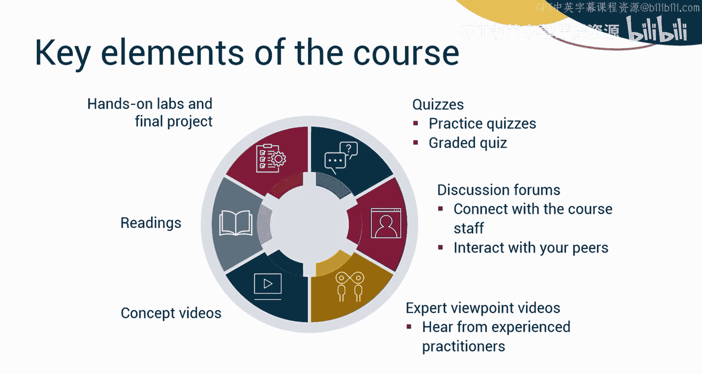

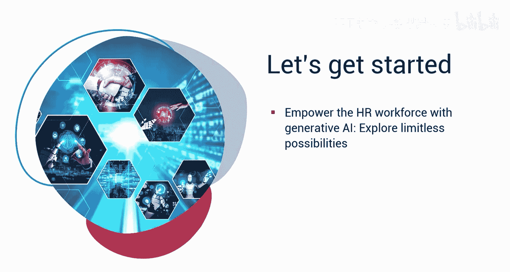

