# 032：生成式AI在人力资源中的意义与优势 🚀

在本节课中，我们将要学习生成式人工智能在人力资源领域的重要意义及其带来的具体优势。我们将了解HR专业人员面临的挑战，以及生成式AI如何通过自动化、数据分析和标准化流程来应对这些挑战，从而推动组织变革与创新。

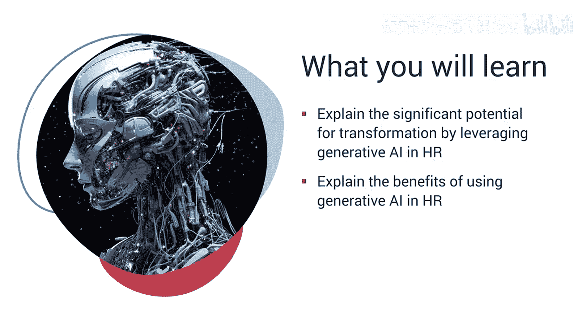

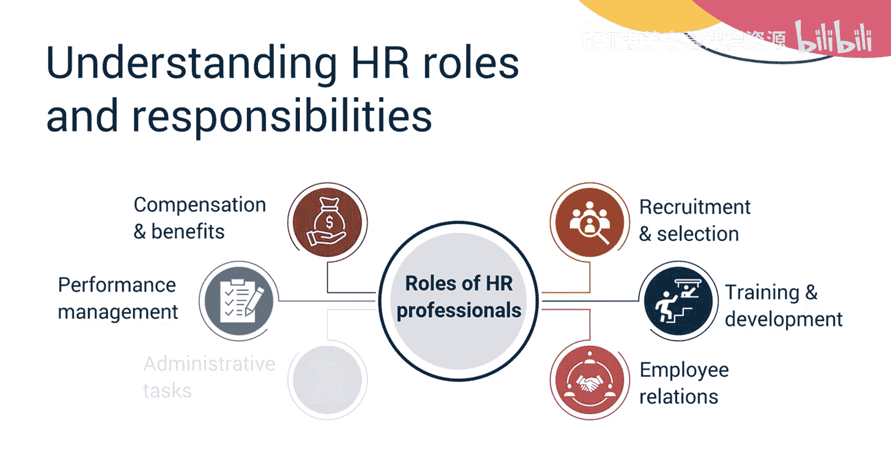

HR专业人员在组织中扮演着关键角色，他们处理包括招聘与选拔、培训与发展、员工关系、薪酬福利、绩效管理以及各类行政职责在内的广泛职能。他们充当管理层与员工之间的重要纽带，确保管理层的目标与政策能有效传达给员工，同时也将员工的反馈、关切与建议传达给管理层。

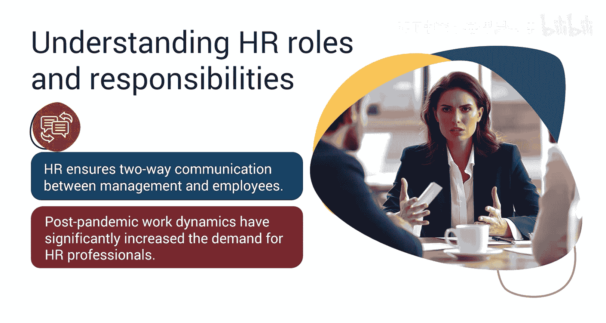

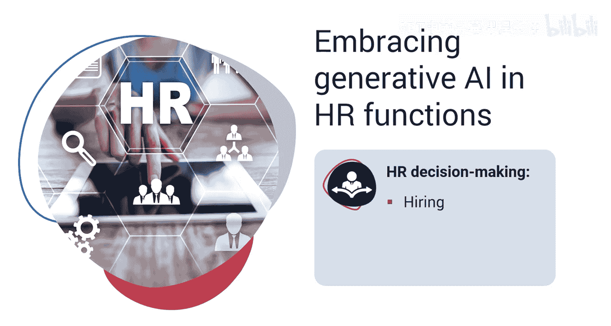

由于疫情后工作模式的重大变化，对HR专业人员的需求显著增加。HR职能面临着诸多挑战与不完善之处。当HR专业人员做出诸如招聘谁、晋升谁或确定员工薪酬等决策时，他们通常依赖自身经验、个人观点以及积累的某些数据。这有时可能导致决策存在偏见或不完全公平。此外，各项HR职能中的手动工作更加耗时、易出错、效率低下且缓慢，从而降低了部门的整体生产力。

这正是生成式AI的用武之地。随着生成式AI的出现，公司正推动HR专业人员利用生成式AI模型的能力，以精简各项HR职能、自动化重复性任务，并做出数据驱动的明智决策，以确保在招聘、晋升和绩效管理中实现公平。

生成式AI在人力资源领域提供了广泛的潜在优势。以下是其主要优势：

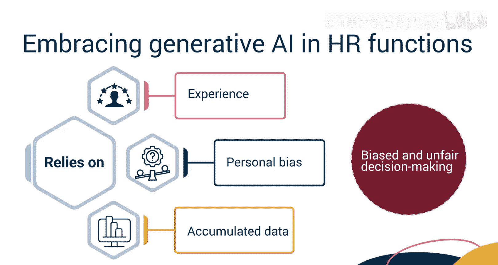

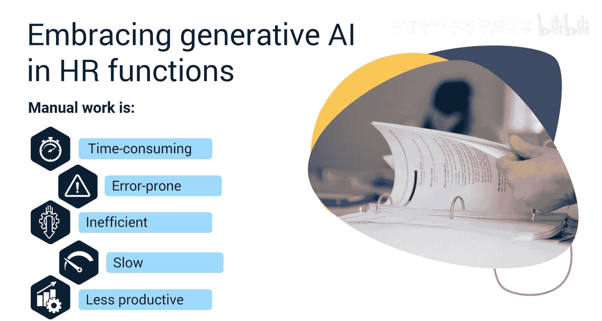

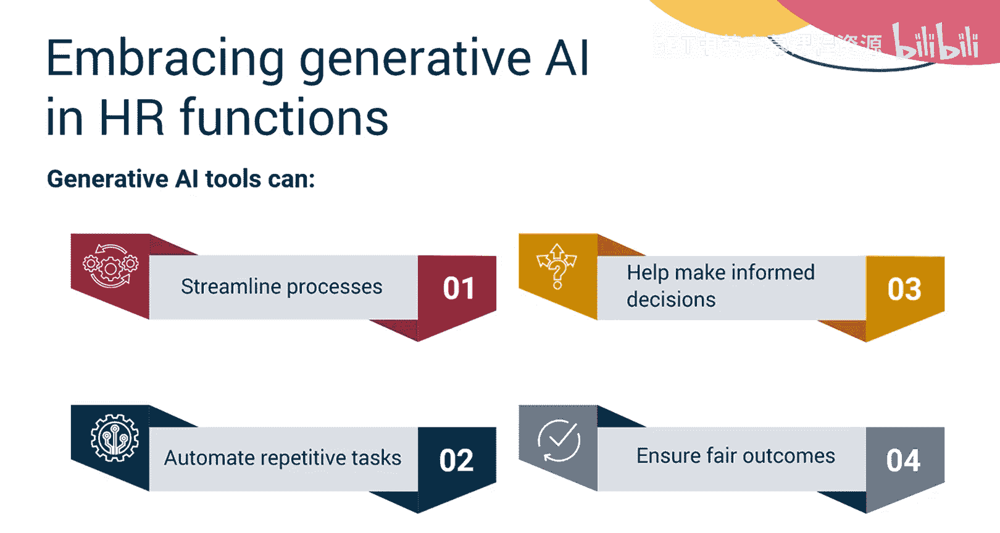

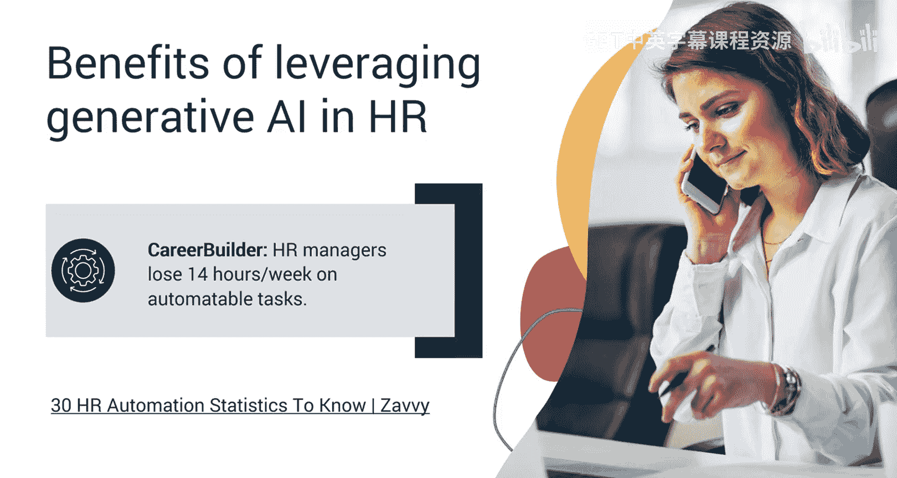

**提升效率与生产力**
根据Career Builder的数据，HR经理平均每周在可自动化的任务上损失14小时。自动化可以提升效率与生产力。利用生成式AI自动化诸如筛选简历、安排面试和创建入职材料等重复性任务，有助于提高HR专业人员的效率与生产力。

**改善员工体验与参与度**
生成式AI驱动的聊天机器人可以即时响应员工查询，提供个性化的学习与发展建议，并简化内部沟通，从而改善员工体验与参与度。

**实现数据驱动的决策**
生成式AI可以分析海量数据以识别趋势并预测未来劳动力需求，使HR能够在招聘、晋升和员工保留策略方面做出明智决策。

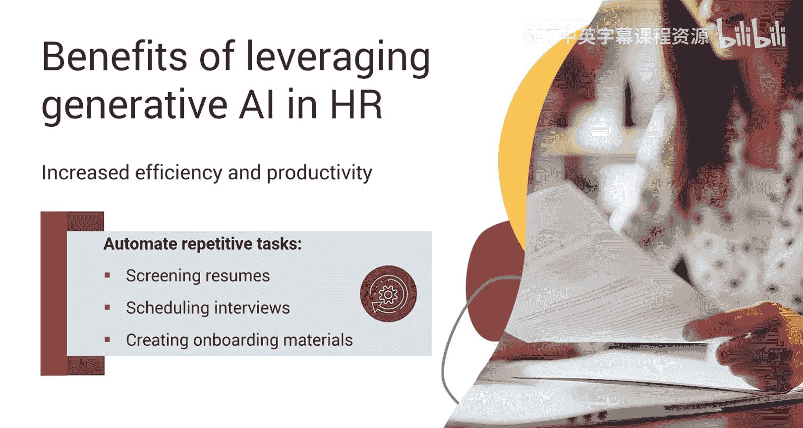

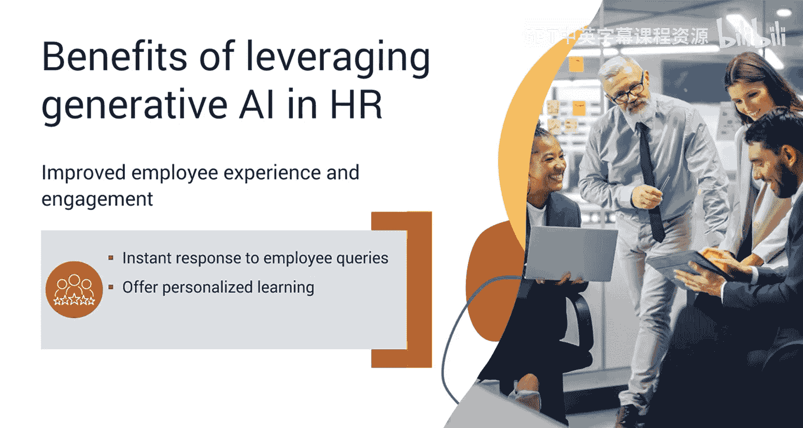

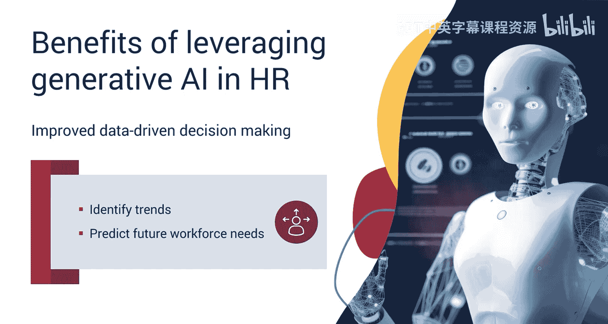

**减轻行政负担**
根据Frevvo的数据，HR高达73%的时间被繁琐的行政职责所消耗。利用生成式AI可以简化诸如薪资处理、福利管理和合规报告等行政任务。这可以减轻HR人员的工作量，并最大限度地减少错误风险。

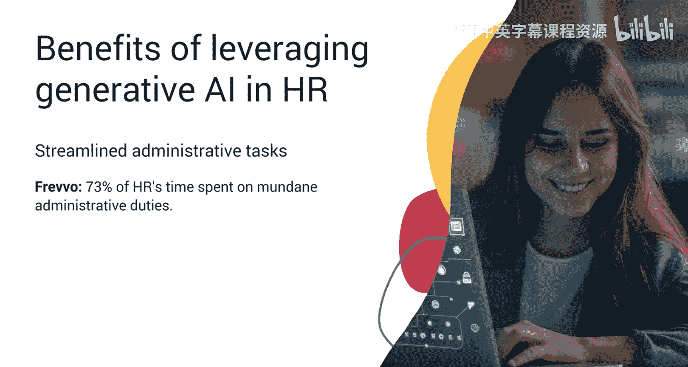

**促进公平与多样性**
生成式AI可以通过标准化评估流程，帮助减少招聘及其他HR流程中的偏见。这可以促进组织内部的多样性，并确保所有候选人无论背景如何都能得到公平评估。

**赋能战略性角色**
通过将HR专业人员从单调任务中解放出来，生成式AI可以帮助他们承担更具战略性的角色，如人才管理、劳动力规划、文化与变革管理以及员工敬业度与保留，所有这些对于组织的长期成功都至关重要。

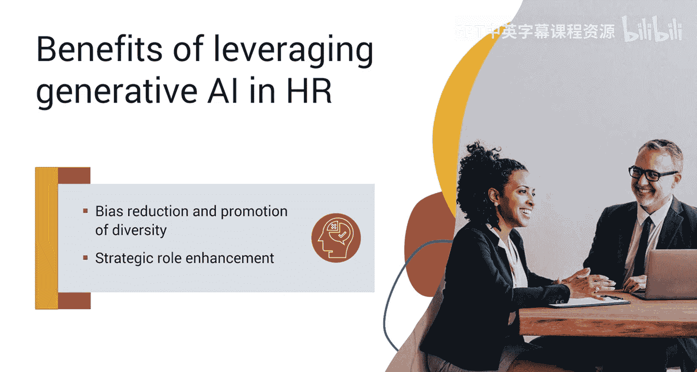

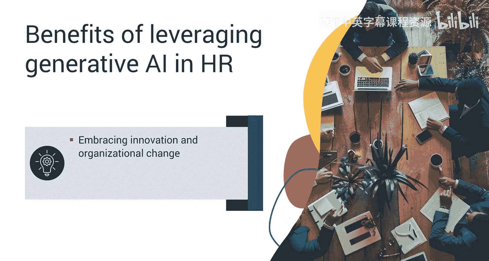

**助力组织变革管理**
AI可以通过提供关于员工准备度和潜在阻力的洞察来协助HR管理组织变革。通过理解这些动态，HR可以制定更有效的变革管理策略，确保创新举措得以成功实施。

**促进协作与连接文化**
最后，生成式AI可以提供无缝协作和信息共享的平台，培育更具连接性的组织文化。

在数字化转型的时代，HR团队可以抓住机会，以身作则，在整个业务部门中拥抱生成式AI。虽然这一旅程充满挑战，但它为HR团队引领组织变革与创新提供了重要机遇。

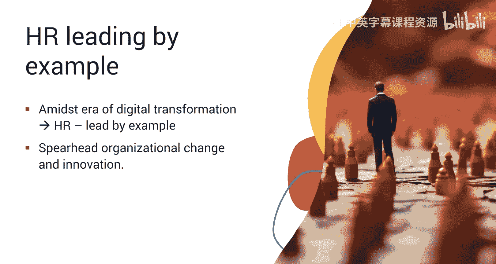

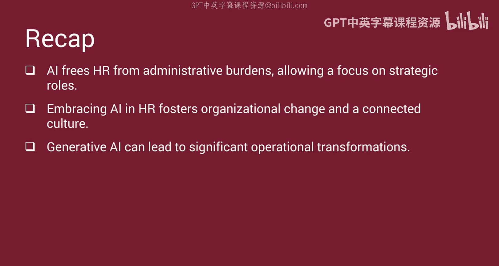

本节课中我们一起学习了在人力资源中使用生成式AI的重要意义与诸多益处。我们了解到HR专业人员处理众多职能，是管理层与员工之间的关键纽带。生成式AI可以自动化重复性任务、提高效率、减少错误，并支持数据驱动的决策以实现更公平的结果。它能够改善员工体验与参与度，并通过标准化评估促进多样性。通过将HR从行政负担中解放出来，AI使其能够专注于战略性角色，助力组织变革并培育连接文化。在人力资源中拥抱AI可以带来重大的运营转型。