# 033：生成式AI在人力资源中的应用 🚀

在本节课中，我们将要学习生成式人工智能在人力资源领域的各种应用。我们将了解它如何改变传统工作方式，并在招聘、入职、薪酬等多个核心职能中提升效率与员工体验。

在不断变化的人力资源领域，生成式人工智能正在产生重大影响。它正在改变传统的工作方式，并引入了新的创新理念。领英最近进行的一项全球调查显示，62%的招聘专业人士对人工智能对招聘的影响持积极看法，其中14%的人表示已将生成式人工智能整合到人力资源运营中。

接下来，让我们了解生成式人工智能在人力资源管理中发挥作用的各个方面。

## 生成式AI在HR中的核心应用领域 📊

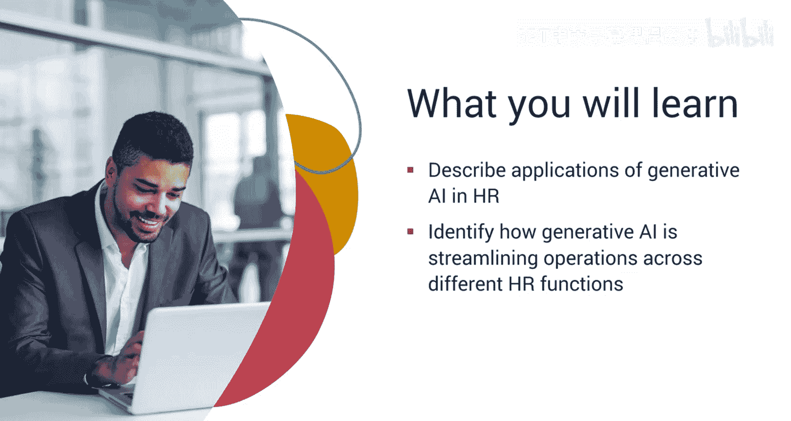

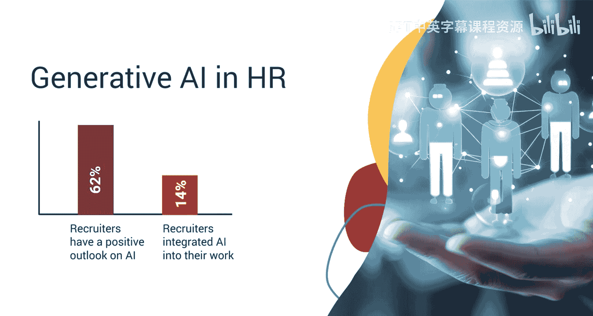

生成式人工智能在招聘、入职支持、行政工作、薪酬、学习与发展、绩效管理、员工敬业度、员工福利和合规监控方面都非常有帮助。

上一节我们介绍了生成式AI在HR中的整体应用范围，本节中我们来看看它在招聘环节的具体作用。

### 招聘环节的应用

招聘团队可以巧妙地运用生成式人工智能来实现顺畅、快速的运作。以下是生成式AI在招聘中的具体应用方式：

*   **简历筛选与匹配**：生成式AI可以分析职位描述和候选人简历，为特定职位提供最佳匹配的见解。例如，当一个组织收到数百份求职简历时，AI系统可以利用自然语言处理技术分析简历和职位描述，识别关键技能、资格和经验，然后将候选人资料与职位要求进行匹配，向招聘人员呈现一份最合适候选人的短名单。这减少了人工筛选的时间和精力，提高了招聘流程的效率。
    *   **核心概念**：`AI系统使用自然语言处理(NLP)分析文本数据，并计算匹配度分数。`
*   **生成个性化面试问题**：它可以根据候选人资料和职位要求生成个性化的面试问题，从而优化招聘流程。

在完成招聘流程后，新员工的入职体验同样重要。接下来，我们将探讨生成式AI如何为新员工提供支持。

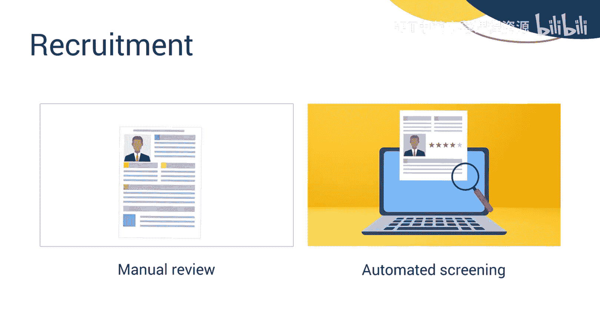

### 入职支持

AI可以通过为新人创建个性化的入职计划来提供入职支持，这些计划包括培训材料、介绍邮件和任务日程表。它可以生成交互式入职模块或聊天机器人，引导新员工了解公司政策、流程和文化。

除了招聘和入职，人力资源部门还面临大量的日常行政工作。下面我们看看生成式AI如何简化这些任务。

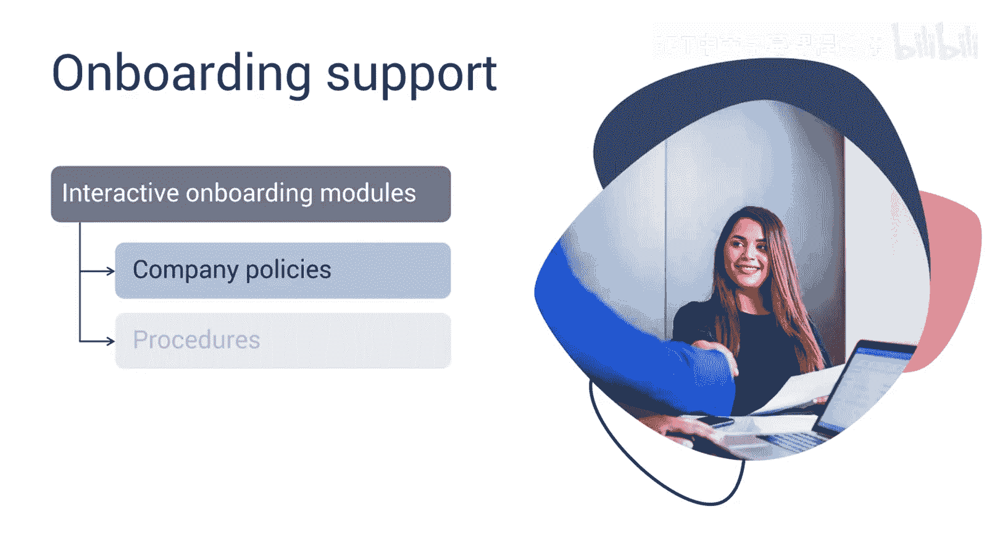

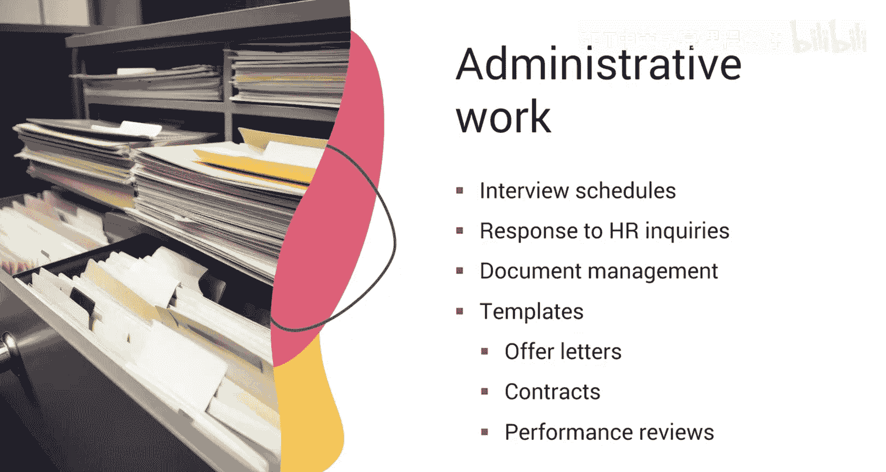

### 行政工作自动化

日常行政工作也可以通过使用生成式人工智能实现自动化。例如，安排面试、回复基本的人力资源咨询和管理文档。您还可以为各种人力资源文档生成模板，如录用通知书、合同和绩效评估，从而为人力资源专业人员节省时间。

薪酬处理是人力资源中另一项需要高度准确性的工作。生成式AI在此领域也能大显身手。

### 薪酬流程

生成式人工智能可以简化薪酬流程，自动生成工资单、计算扣除额和处理员工报销。它可以识别考勤数据中的模式以检测差异，从而提高薪酬准确性。

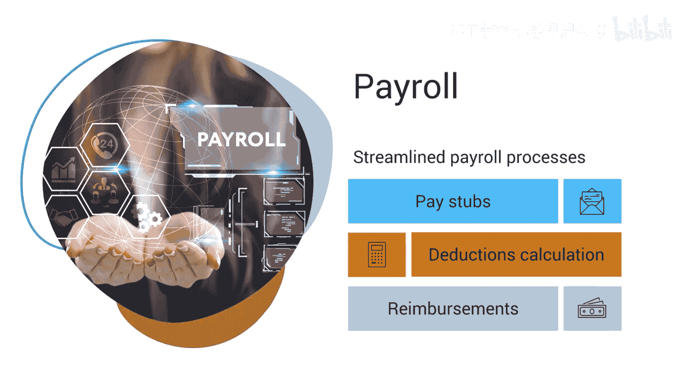

员工的能力提升对企业发展至关重要。接下来，我们看看生成式AI如何赋能学习与发展。

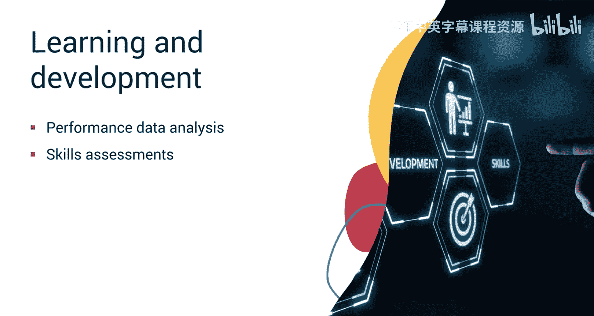

### 学习与发展

生成式人工智能可以应用于学习与发展。考虑一家使用生成式人工智能个性化员工培训计划的科技公司。AI系统分析每位员工的绩效数据、技能评估和学习偏好。基于此分析，它为每位员工生成个性化的学习路径，推荐相关课程、研讨会或在线资源。例如，一位对数据科学感兴趣的员工可能会收到学习特定数据分析课程和编程语言的建议。它可以生成交互式培训模块、测验或模拟，以提高员工的参与度和知识留存率。这种量身定制的方法增强了员工参与度并加速了技能发展。

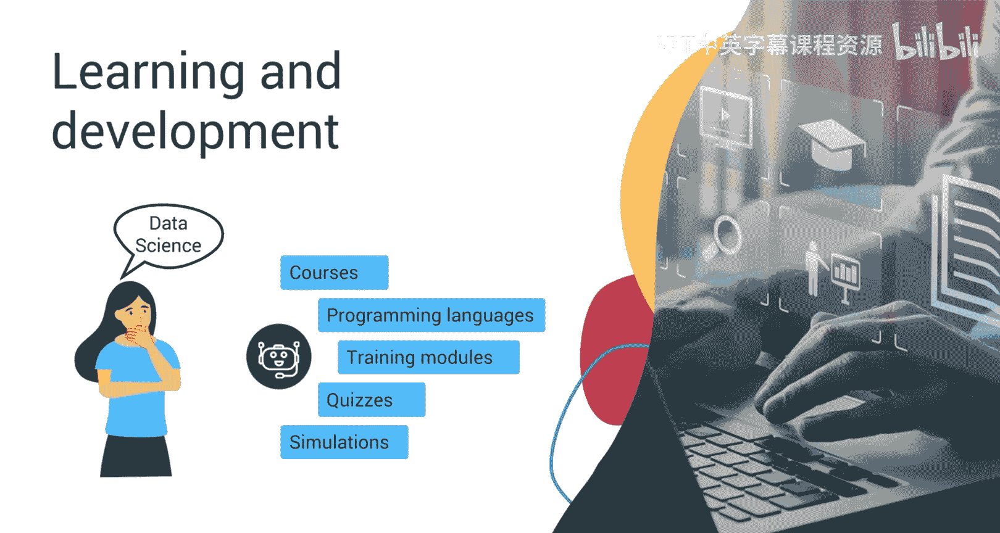

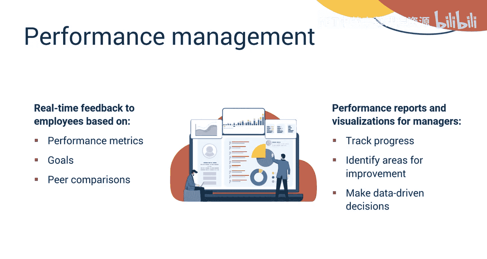

在帮助员工成长的同时，对其绩效进行有效管理也同样关键。下面我们来了解生成式AI在绩效管理中的应用。

### 绩效管理

生成式人工智能也可应用于绩效管理。它可以根据绩效指标、目标和同事比较，为员工提供实时反馈。它可以为管理者生成绩效报告和可视化图表，以跟踪进度、识别需要改进的领域并做出数据驱动的决策。

员工的积极性和敬业度是组织健康度的晴雨表。生成式AI如何帮助我们更好地了解并提升员工敬业度呢？

### 员工敬业度

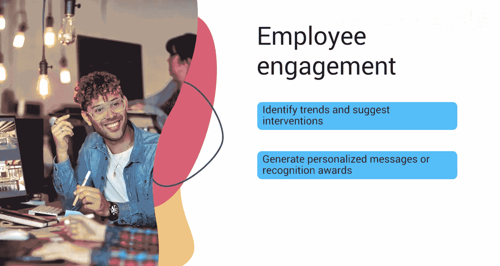

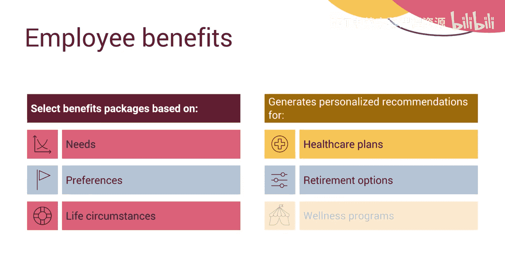

对于员工敬业度，您可以使用生成式人工智能来分析来自调查、绩效评估和社交媒体的员工反馈，以识别趋势并提出改善敬业度的干预措施。它可以根据员工的贡献和成就，生成个性化的信息或认可奖项。

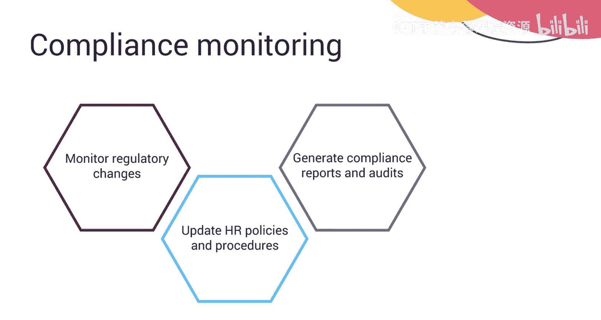

为员工提供合适的福利是留住人才的重要手段。生成式AI如何让福利选择更个性化？

### 员工福利

生成式人工智能可以帮助员工根据他们的需求、偏好和生活状况选择最合适的福利套餐。它可以为医疗保健计划、退休选项和健康计划生成个性化推荐。

确保企业运营符合法律法规是HR的重要职责。最后，我们来看看生成式AI如何辅助合规监控。

### 合规监控

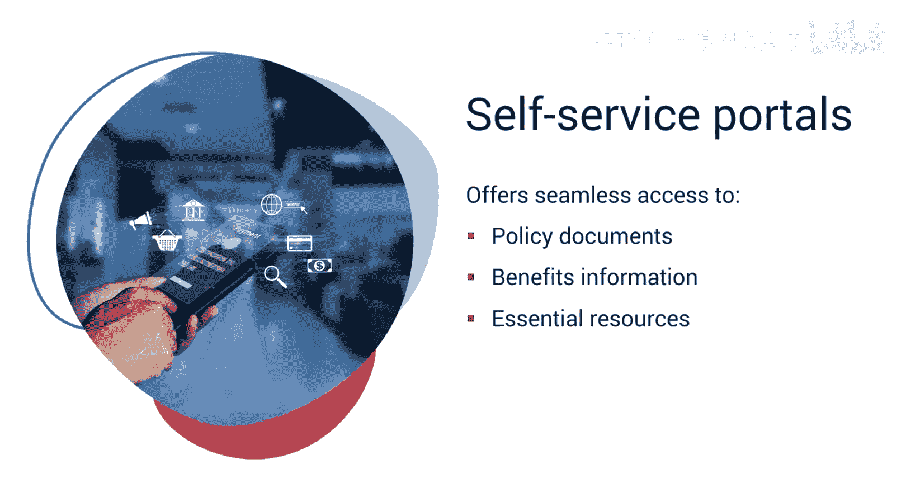

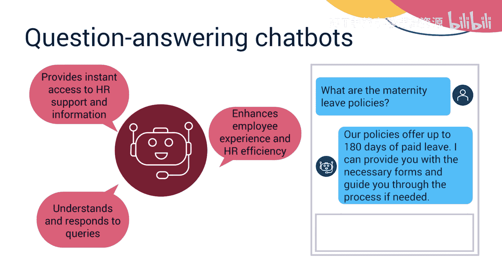

生成式人工智能还可用于监控合规性。它可以监控法规变化并相应更新人力资源政策和程序以确保合规。它可以生成合规报告和审计报告，标记任何差异或风险以供进一步处理。

此外，生成式人工智能还支持创建自助服务门户和问答聊天机器人，为员工提供便捷的信息获取渠道，从而提升整体人力资源效率。

## 总结 📝

本节课中，我们一起学习了生成式人工智能如何改变人力资源运营的各个方面，提高了效率、准确性和员工体验。

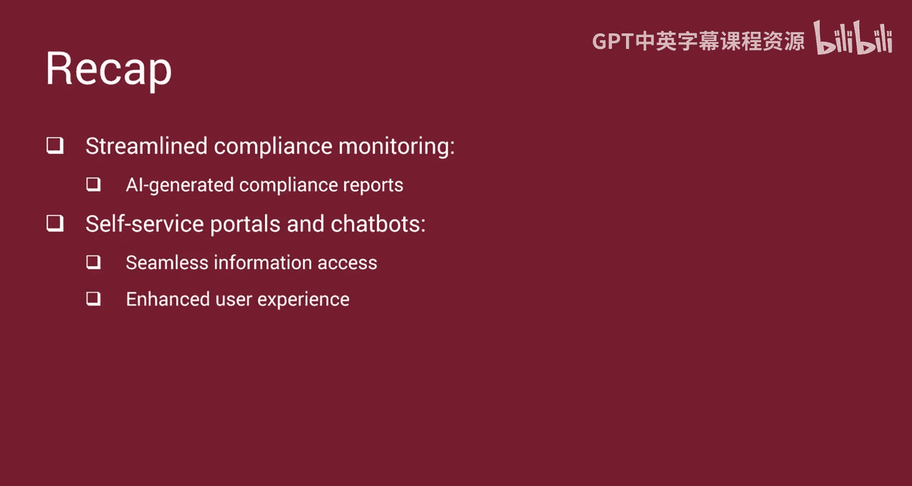

*   在招聘中，它自动化了简历筛选，匹配候选人资料与职位要求，并生成个性化面试问题。
*   在入职环节，它为新人制定个性化计划。
*   安排面试和管理文档等行政任务通过AI生成的模板得到简化。
*   薪酬流程可以实现自动化，确保计算精度并标记异常。
*   学习与发展计划受益于个性化培训计划和交互式模块，以提升参与度。
*   绩效管理通过实时反馈得到丰富，而AI驱动的分析可以预测未来趋势和挑战。
*   生成式人工智能通过分析反馈和促进个性化沟通来支持员工敬业度。
*   合规监控通过AI生成的报告得以简化。
*   最后，生成式人工智能可以支持自助服务门户和聊天机器人，实现无缝的信息访问和增强的用户体验。