# 034：3_推动人力资源用例的生成式AI能力 🚀

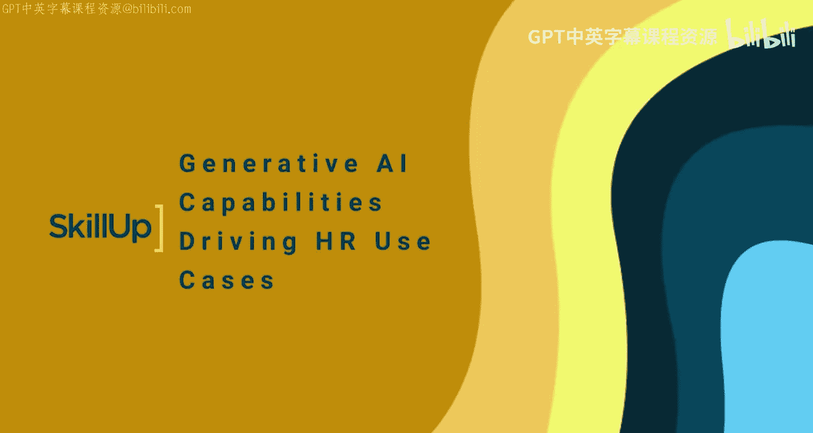

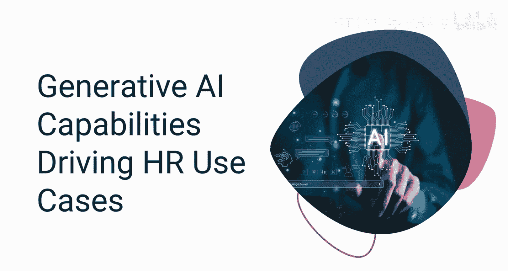

在本节课中，我们将要学习生成式人工智能的核心能力，以及这些能力如何通过特定的模型和技术实现，从而变革人力资源领域。

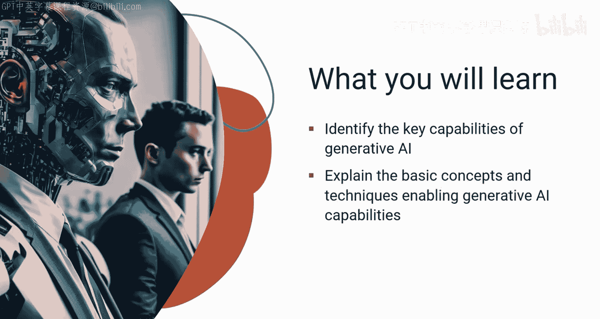

## 概述 📋

生成式AI具备一系列关键能力，包括内容生成、类人对话、情感分析和预测分析。这些能力在人力资源领域拥有巨大潜力，可以自动化任务、改善员工体验并增强决策制定。本节将探讨支撑这些能力的底层模型和AI技术。

## 核心能力与实现技术

上一节我们介绍了生成式AI的潜力，本节中我们来看看实现这些能力的具体技术。

### 内容生成能力 ✍️

生成式AI的核心优势在于其生成逼真且相关内容的能力，范围涵盖文本、图像和视频。在人力资源领域，这一能力极具价值。例如，它可以用于撰写引人注目的职位描述、生成真实的面试和培训场景，以及创建根据员工角色和背景定制的个性化内容。

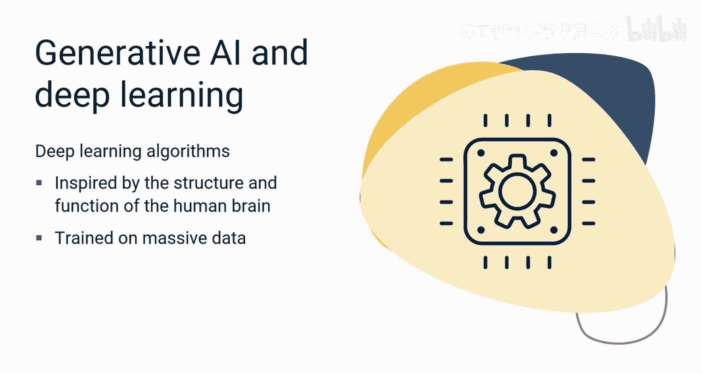

那么，生成式AI如何实现这些内容生成和创作技能呢？这主要通过生成式AI模型完成。

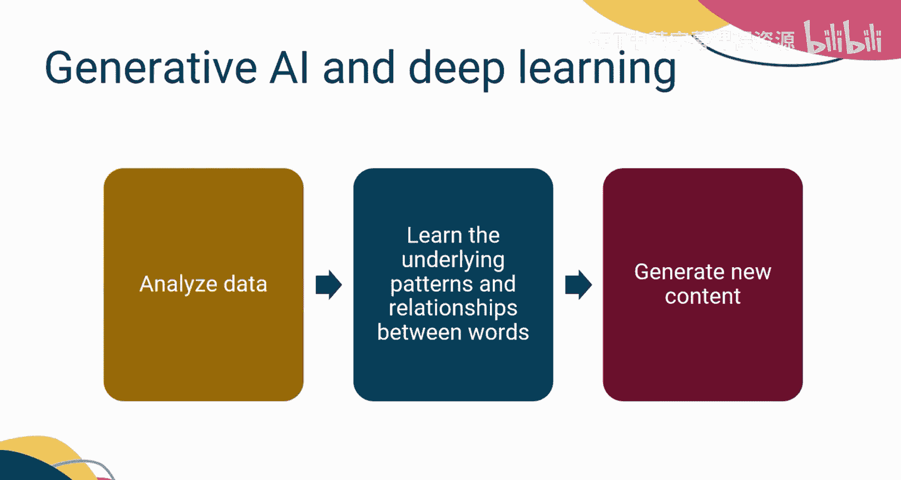

以下是几种关键的生成式AI模型：

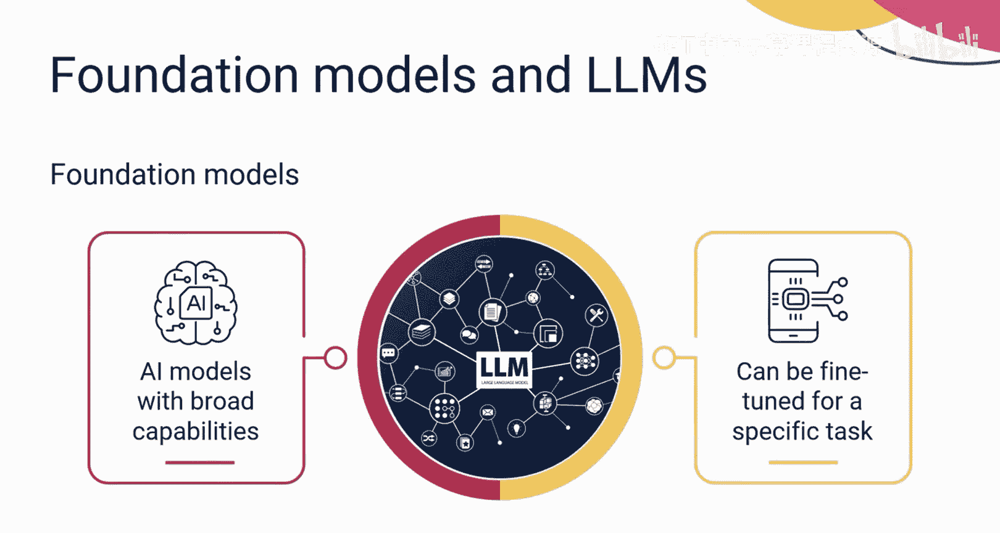

*   **生成对抗网络**：一种通过“生成器”和“判别器”相互博弈来学习数据分布的模型。
*   **变分自编码器**：一种通过学习数据的潜在空间分布来生成新数据的模型。
*   **Transformer模型**：一种基于自注意力机制的模型，擅长处理序列数据，是当前大语言模型的基础。

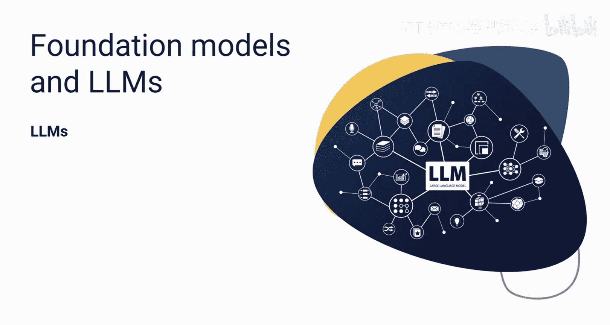

这些模型可以被视为生成式AI的构建模块。它们利用深度学习技术从海量数据集中学习并生成新数据。深度学习算法受人脑结构和功能的启发，通过分析数据，算法学习单词之间的底层模式和关系，从而使模型能够生成语法正确、语义通顺且风格恰当的新文本。

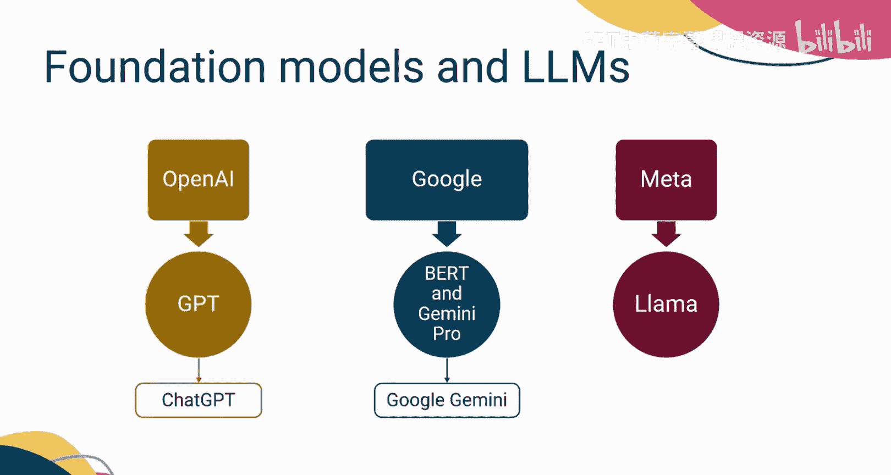

### 基础模型与大语言模型 🤖

进一步，我们拥有**基础模型**。基础模型是具备广泛能力的AI模型，可以针对任何特定任务进行微调，例如摘要或翻译。

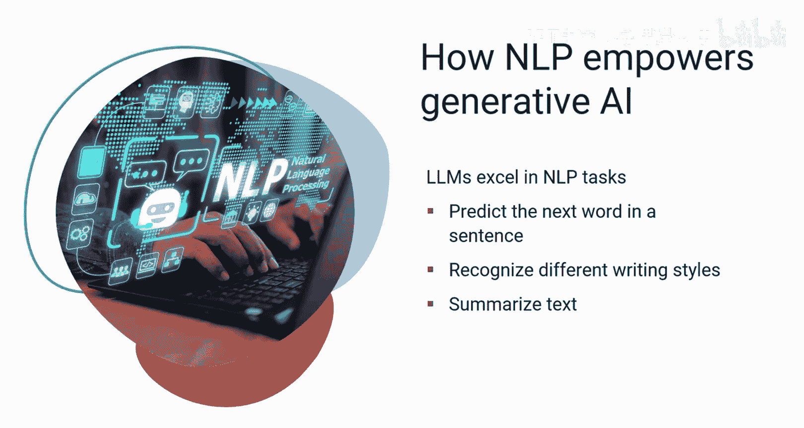

一种特定类型的基础模型被称为**大语言模型**。LLM经过训练，能够理解和生成基于上下文的文本。

以下是一些LLM的示例：

*   OpenAI的 **GPT**
*   谷歌的 **BERT** 和 **Gemini Pro**
*   Meta的 **Llama**

这些LLM构成了许多流行的生成式AI工具和应用的基础。例如，ChatGPT基于GPT，而Google Gemini基于Gemini Pro。

LLM在自然语言处理任务中表现出色。NLP是AI的一个领域，专注于计算机与人类使用自然语言的交互。它使生成式AI模型能够理解其训练数据，生成基于上下文的内容，并促进类人交流。

在人力资源领域，基于NLP的生成式AI模型可以分析员工反馈、调查和评论，以评估情感并识别关注点或满意领域。通过分析沟通模式和内容，它们可以提供关于员工敬业度和士气的见解。

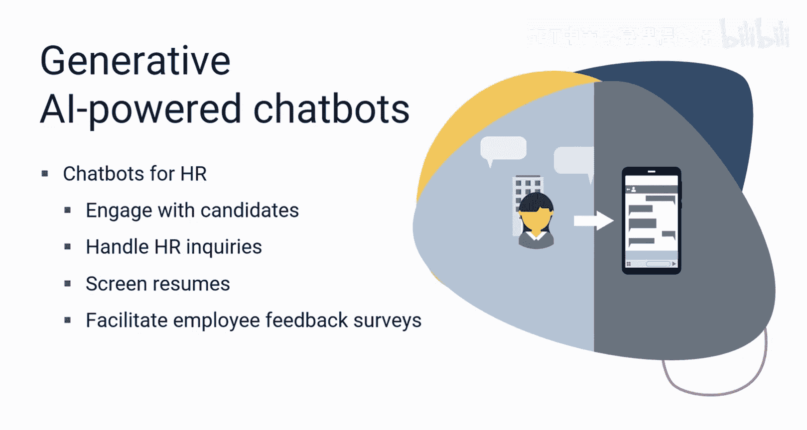

### 对话与预测分析 💬📊

生成式AI驱动的聊天机器人正在改变人力资源互动方式。这些聊天机器人利用NLP和**强化学习**来实现自然而动态的对话。强化学习是一种机器学习技术，通过与环境交互来训练模型或软件做出决策。聊天机器人与模拟用户交互，并根据其回复获得反馈。基于此反馈，模型学习随时间优化其回复，变得更擅长理解用户查询并提供有用信息。

生成式AI聊天机器人可以针对特定领域进行定制，提供专业知识。人力资源领域可以利用NLP驱动的聊天机器人与候选人互动、处理人力资源咨询、筛选简历以及促进员工反馈调查。

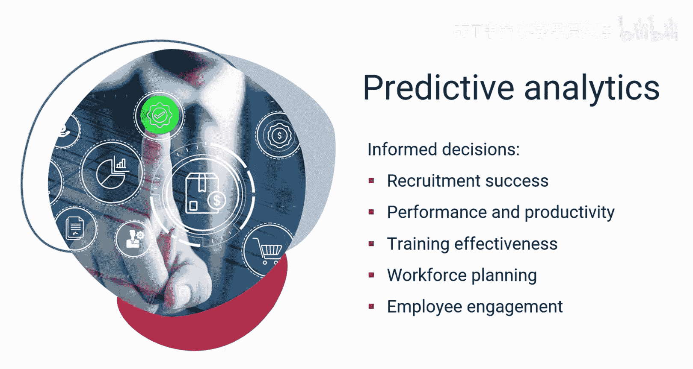

生成式AI另一个吸引人的能力是通过分析大型数据集、发现模式和识别相关性来执行**预测分析**。LLM经过训练，能够识别趋势、提取相关特征并生成准确预测。通过提供数据驱动的预测，这些模型增强了决策过程。在人力资源领域，生成式AI为招聘成功率、绩效与生产力、培训效果、劳动力规划和员工敬业度等方面的决策提供了宝贵的见解。

## 未来展望：多模态模型 🔮

生成式AI模型和其他AI进步正在革新人力资源领域。像Google Gemini这样的**多模态模型**不仅可以处理文本，还可以处理图像和音频，以实现更丰富的内容生成和分析。

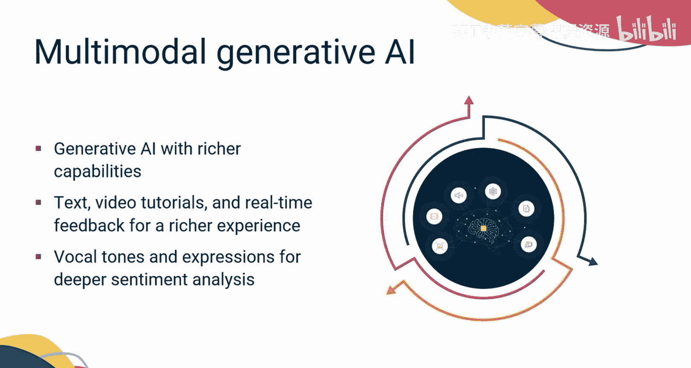

多模态模型为生成式AI赋予了更强大的能力。例如，想象一下将文本、视频教程和实时反馈整合起来，以获得更有效的学习体验。或者超越基于文本的情感分析，多模态AI可以分析语音语调和面部表情，以揭示员工的情感和压力。

随着生成式AI的持续发展，我们可以预期在人力资源领域会出现更多创新应用，塑造工作的未来。

## 总结 🎯

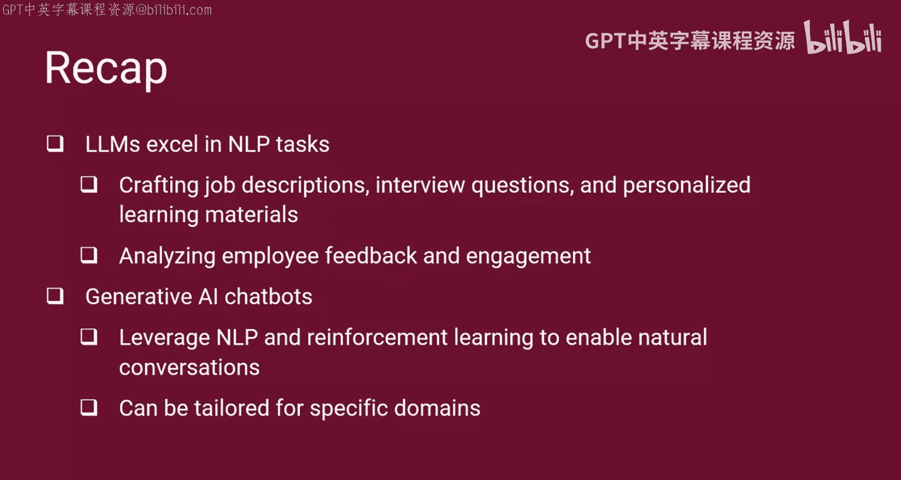

本节课中我们一起学习了生成式AI的关键能力，包括基于上下文的内容生成、类人对话、情感分析和预测分析。这些能力由LLM等生成式AI模型实现，这些模型在大型数据集上训练，以理解和生成基于上下文的文本。LLM擅长NLP任务，对于各种人力资源职能非常有价值，例如撰写职位描述、面试问题和个性化学习材料，以及分析员工反馈和敬业度。生成式AI聊天机器人利用NLP和强化学习来实现自然而动态的对话，它们可以针对包括人力资源在内的特定领域进行定制。