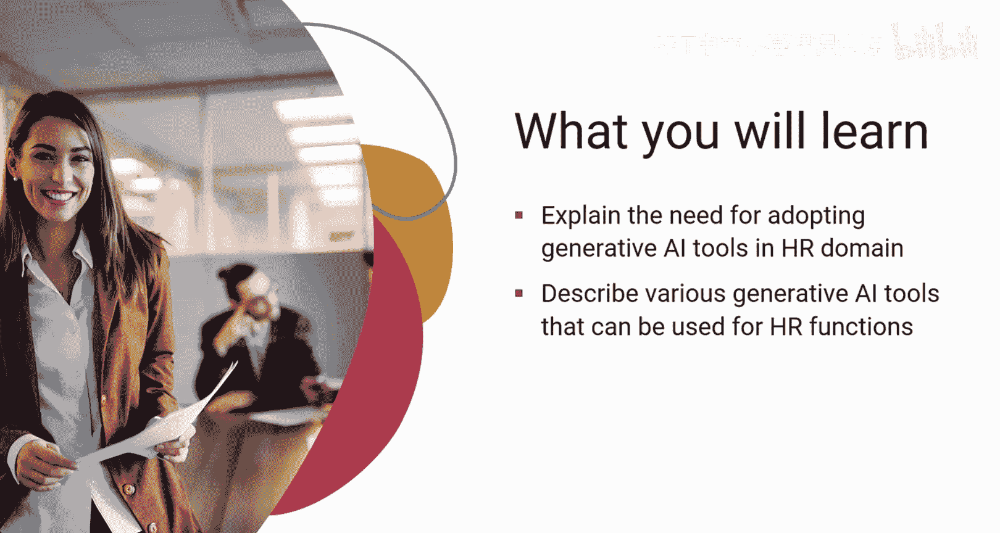
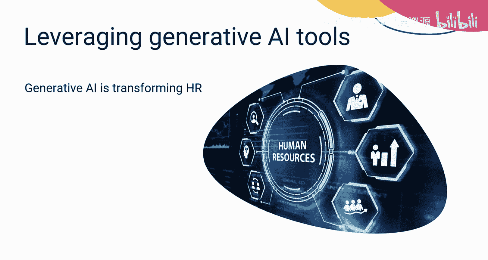
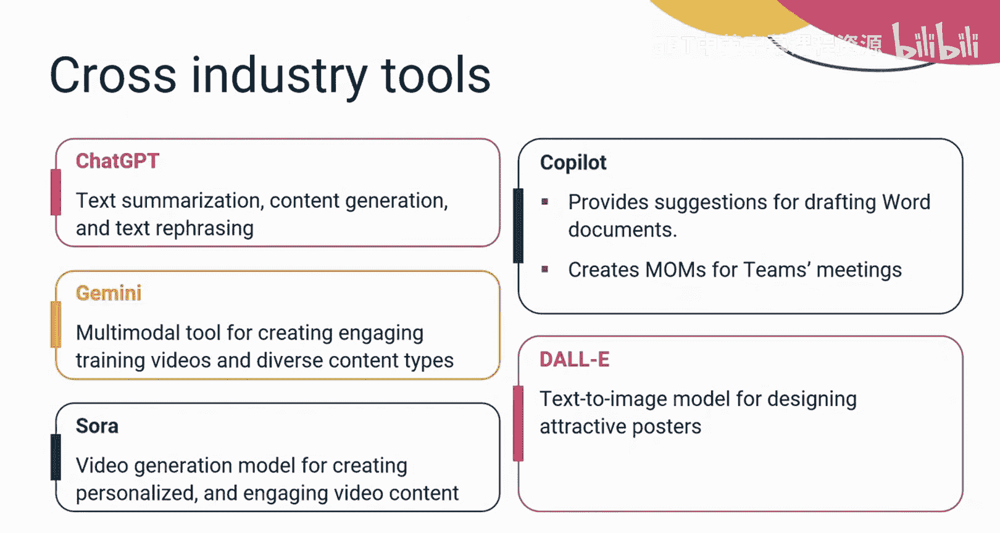
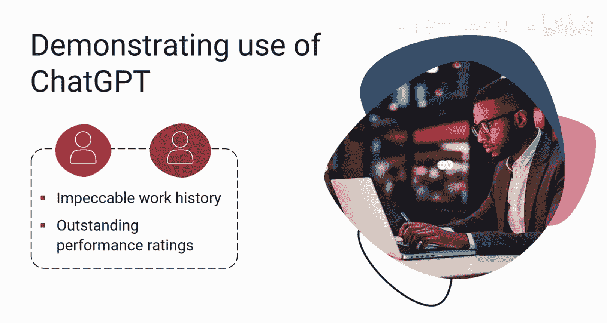
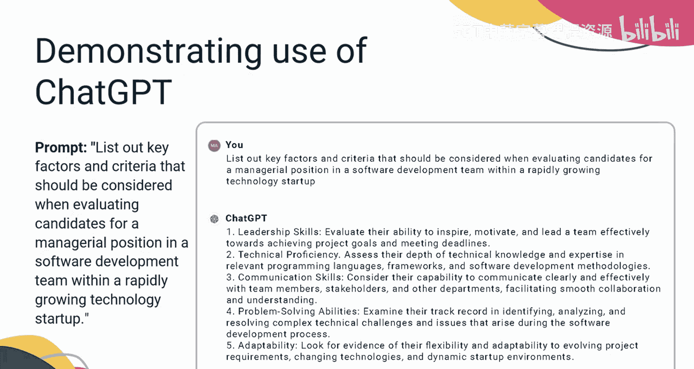
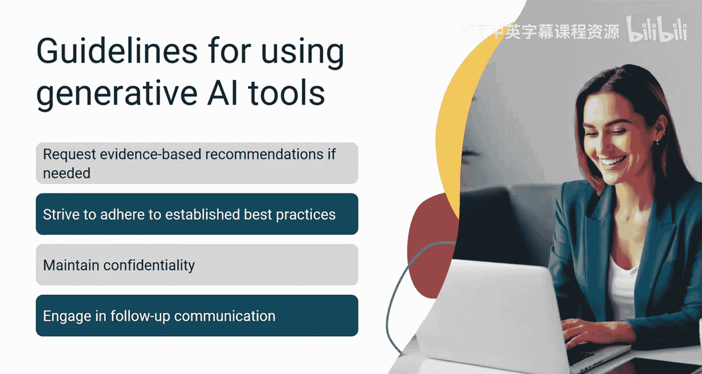
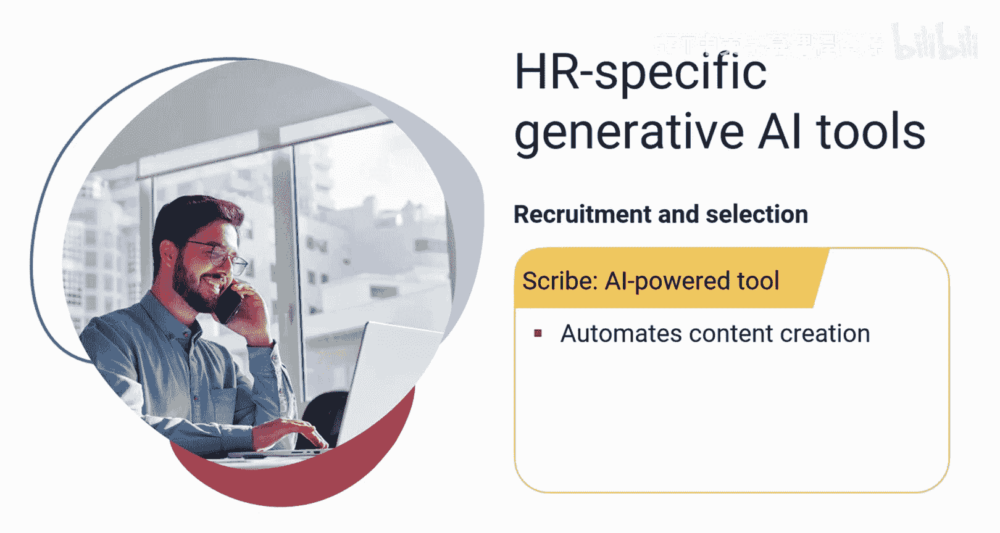
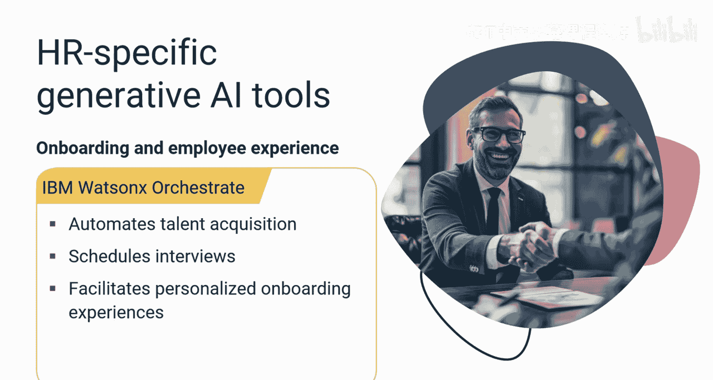
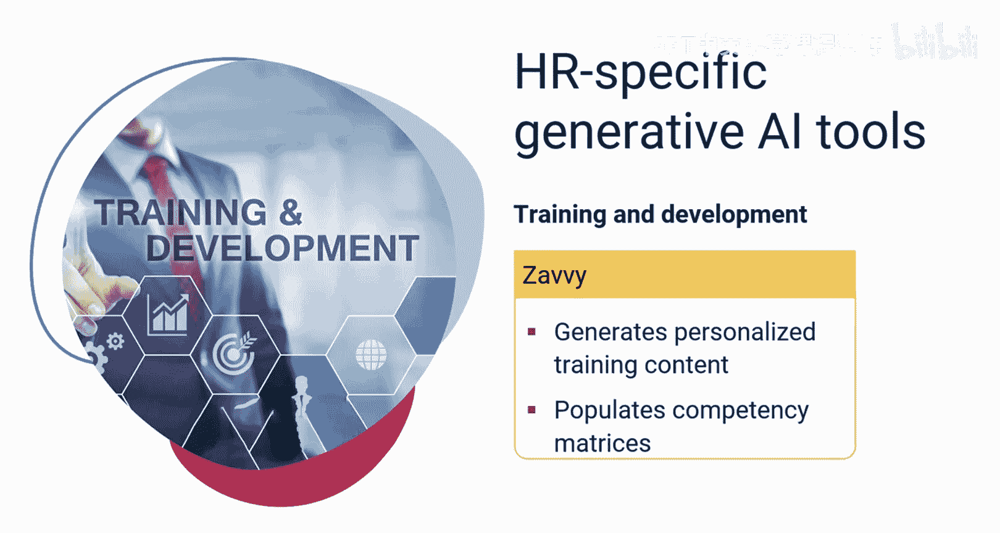
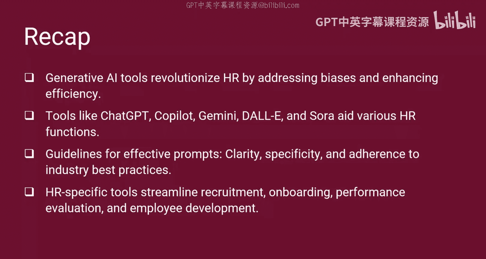

生成式AI用于人力资源：P35：4_面向人力资源的生成式AI工具 🛠️

在本节课中，我们将学习生成式AI工具在人力资源领域的应用。我们将探讨采用这些工具的必要性，并介绍可用于不同HR职能的各种工具。

---

生成式AI正在变革人力资源领域，使其更高效、数据驱动且个性化。生成式AI工具的快速发展正鼓励各公司将生成式AI能力整合到包括人力资源在内的不同职能中。

先进的生成式AI工具非常复杂，可用于情感分析和预测分析等功能，在HR职能中拥有广泛的应用。这些工具用户友好且价格合理，使得各种规模的组织都能更容易地采用并将其集成到HR工作流程中。

跨国公司越来越多地在其人力资源部门中使用生成式AI工具来管理海量的职位申请。通过利用这项技术，他们可以识别并解决职位描述中存在的偏见，最终获得更多样化的候选人群体。

初创公司正迅速安装AI驱动的聊天机器人用于入职，以减轻HR人员的行政负担。此外，财富500强公司正利用生成式AI工具进行绩效评估，试图消除传统评估过程中固有的主观偏见。

---

可用于人力资源领域的生成式AI工具分为两大类：通用跨行业工具和HR专用生成式AI工具。

跨行业工具可被HR专业人员用于一般目的，例如撰写详细的职位描述、总结员工反馈用于绩效评估，以及制作引人入胜的培训视频。以下是其中一些工具：

*   **ChatGPT**：可以帮助HR专业人员创建有意义的职位描述，并在绩效评估期间总结员工反馈。
*   **Copilot**：可集成到所有微软产品中，为起草Word文档提供建议，并能从Teams的录音中创建会议纪要。
*   **Google Gemini**：一个强大的多模态工具，可用于创建引人入胜的培训视频和多样化的内容材料，以增强员工学习体验。
*   **DALL-E**：可用于为员工参与活动和组织内的视觉传达设计有吸引力的海报。
*   **Sora**：OpenAI的视频生成工具，可用于为各种HR举措和内部沟通创建个性化和引人入胜的视频内容。

---

上一节我们介绍了通用工具，本节中我们来看看如何实际使用它们。让我们尝试演示如何使用像ChatGPT这样的通用工具，为以下场景生成相关输出。

作为一名快速发展的科技初创公司的HR专业人员，你的任务是为软件开发团队选择下一任经理。这项任务具有挑战性，因为有两位杰出的候选人被提名担任同一职位，他们都拥有出色的工作经历和上级的绩效评级。为了确保做出最佳选择，你应该考虑额外的参数进行彻底评估。

为了增强你的评估，你可以构建以下提示，要求提供相关参数的建议：
`列出在快速发展的科技初创公司中，评估软件开发团队管理职位的候选人时应考虑的关键因素和标准。`

在响应此提示后，你可以在屏幕上看到相应的输出。

---

为了从生成式AI工具中获得理想的响应，构建有效的提示非常重要。以下是创建有效提示以协助HR各项职能任务的指南：

*   **明确领域**：清晰定义你正在处理的人力资源管理具体领域，例如招聘、多元化或绩效管理。
*   **提供背景**：包含关于你的行业、公司规模、地区或任何相关具体政策的详细信息。
*   **术语精确**：通过使用精确和标准的术语来避免歧义。
*   **陈述目标**：清楚说明你希望实现的目标或你正在寻求的建议。
*   **要求证据**：如果你需要经过证实的信息，请要求提供支持性证据、研究或引用。
*   **遵循最佳实践**：尽可能遵循行业内已确立的最佳实践。
*   **保护隐私**：避免分享有关员工或组织的敏感或个人身份信息。
*   **追问澄清**：如有必要，提出后续问题以澄清或获取更多信息。

---

HR专用的生成式AI工具服务于特定的HR职能。让我们探索一些此类工具：

*   **Textio**：利用AI审查职位描述，识别并纠正偏见，使其更具包容性。
*   **Scribe**：一个AI驱动的工具，旨在为招聘目的自动化内容创建。它能生成职位描述、能力指南和学习大纲。
*   **LISer**：帮助开发AI驱动的聊天机器人，定制用于指导新员工完成入职流程。
*   **IBM Watsonx Orchestrate**：简化HR流程，自动化从安排面试到跟进候选人等人才招聘任务。此外，它还能为员工提供个性化的入职体验，包括定制化的说明和培训内容。
*   **FE**：为绩效评估提供全面的解决方案，提供360度反馈以从多个角度评估员工绩效。
*   **Cohere Generate**：一个平台，使HR团队能够创建针对特定任务（如简历筛选或情感分析）定制的自定义语言模型。
*   **Zavvy**：专门用于生成个性化培训内容和填充能力矩阵。

---

本节课中我们一起学习了人力资源领域面临决策过程中的主观性和偏见问题。生成式AI工具通过解决偏见和提高效率，正在彻底改变HR领域。

像ChatGPT、Copilot、Gemini、DALL-E和Sora这样的工具服务于各种HR职能。撰写有效提示的指南包括清晰性、具体性和遵循行业最佳实践。HR专用工具有助于简化招聘、入职、绩效评估和员工发展。这些工具促进了人力资源的公平性、效率和个性化体验。