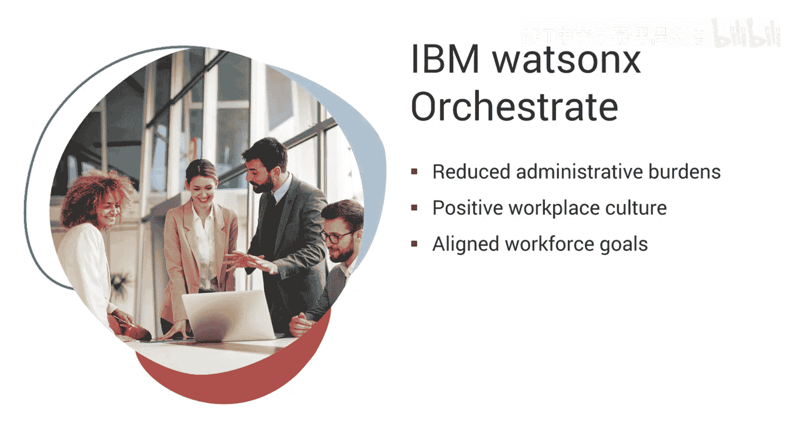
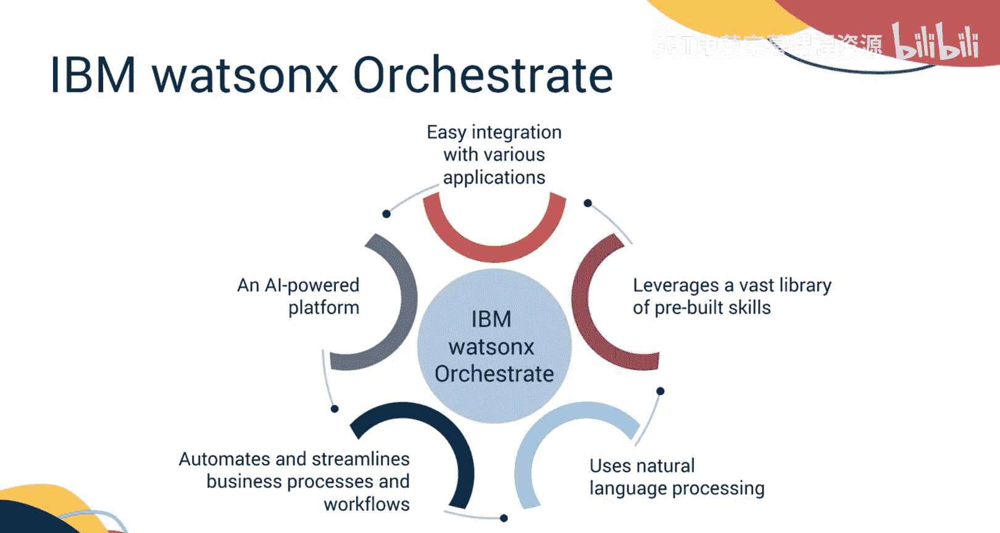
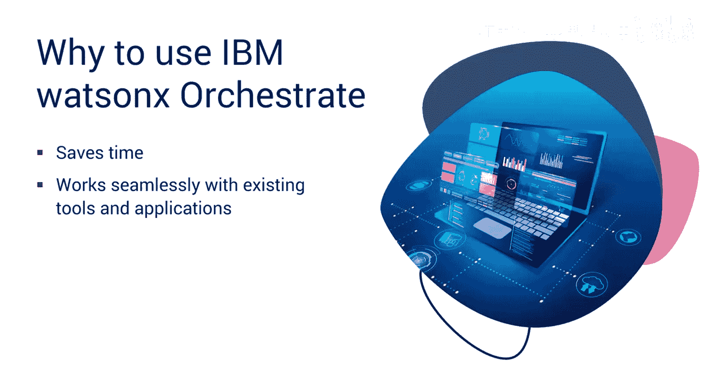
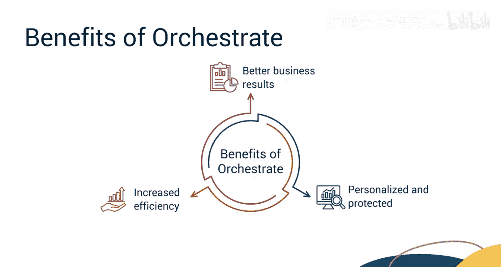
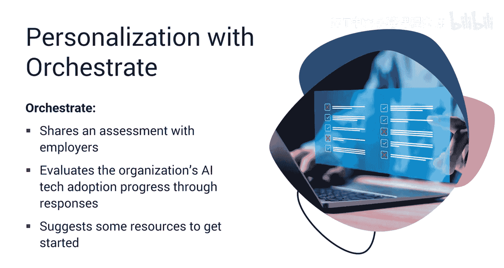
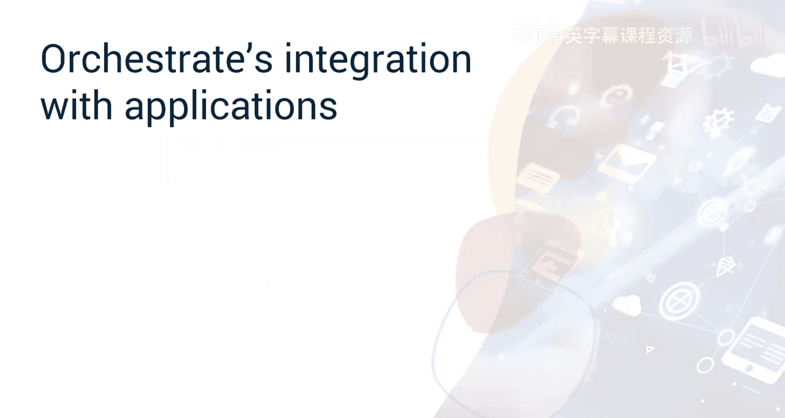
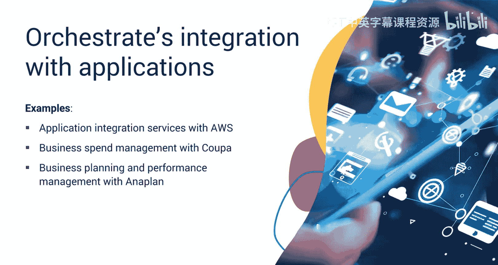
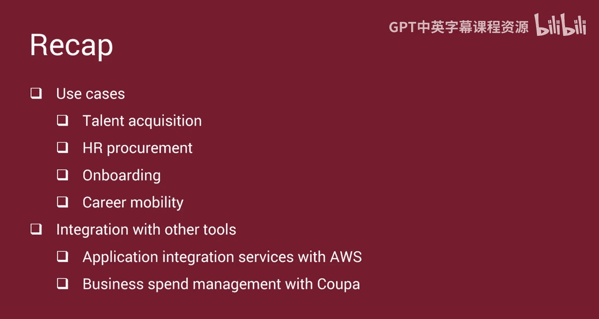

# 036：IBM WatsonX Orchestrate工具 🚀

在本节课中，我们将学习IBM WatsonX Orchestrate工具。这是一个由AI驱动的平台，旨在自动化和简化业务流程与工作流。我们将探讨其用例、优势，以及它如何与日常应用程序集成，从而为人力资源专业人员节省时间并提升效率。

## 什么是IBM WatsonX Orchestrate？🤖

上一节我们介绍了课程概述，本节中我们来看看IBM WatsonX Orcheste究竟是什么。

IBM WatsonX Orcheste是一个由AI驱动的平台，旨在自动化和简化业务流程与工作流。它利用生成式AI和自动化技术，通过自动化复杂、重复的任务来解放人力资源部门的时间。它使用自然语言处理来理解请求，并利用一个庞大的预构建技能库来完成这些请求。Orcheste可以与Salesforce和Gmail等各种应用程序集成，实现跨不同工具的自动化任务，从而让HR有更多时间专注于战略性工作。

## 为何使用IBM WatsonX Orchestrate？💡

了解了其基本定义后，你可能会想，为什么要使用IBM WatsonX Orcheste呢？

原因在于，使用IBM WatsonX Orcheste可以节省大量时间。过去需要数小时的工作现在只需几分钟。只需分配你想要Orcheste处理的任务，例如发送电子邮件、安排会议或面试、或加快请求处理，剩下的工作它将自动完成。此外，它能与你已经使用的工具和应用程序（如Outlook、LinkedIn、SAP SuccessFactors等）无缝协作。你们合作得越多，它就越智能，你的体验也就越个性化。

## IBM WatsonX Orchestrate的优势 ✨

现在，让我们具体分析一下使用Orcheste处理人力资源职能的几大好处。

以下是其主要优势：

*   **提升效率**：Orcheste自动化复杂、重复的任务，使人力资源部门能够专注于战略计划。
*   **改善业务成果**：它运用自然语言与人互动，并通过创建智能助手来完成任务，从而简化工作流程。
*   **个性化与安全性**：它可以根据组织的需求进行定制，并在高度安全的环境下运行。

## 如何为组织进行个性化定制？🎯

你可能会好奇Orcheste如何根据组织的需求进行个性化定制。

为此，Orcheste会提供一项评估。订阅了Orcheste的雇主将收到一组问题，包括技术性和非技术性问题。进行这项评估是为了检查组织在采用最新AI技术方面的进展。根据问卷的回复，Orcheste将建议一些资源来帮助开启这段旅程。

## IBM WatsonX Orchestrate的用例 📋

上一节我们探讨了其优势，本节中我们来看看Orcheste可以成功应用的一些具体用例。

以下是几个关键的应用场景：

*   **人才招聘**：Orcheste可以处理面试安排和后续沟通，不懈地确保人才招聘流程顺利进行。
*   **人力资源采购**：Orcheste可以根据不断变化的业务优先级，自动化手动采购任务。
*   **员工入职**：它可以设置账户、标准化每位新员工的体验、确保每位新员工获得同等程度的关注和信息，并安排培训课程和发送欢迎邮件，从而为你节省时间去与新团队成员互动。
*   **职业发展**：它简化了分析晋升机会以及哪些员工最能从晋升中受益的繁琐工作。

更重要的是，你可以轻松地将IBM WatsonX Orcheste与你当前的工具集成，以获得无缝体验。

## 与其他工具的集成示例 🔗

我们已经了解了Orcheste的独立应用，现在来看看它与其他工具集成的具体例子。

以下是一些集成示例：

*   **与AWS的应用程序集成服务**
*   **与Coupa的业务支出管理**
*   **与Anaplan的业务规划与绩效管理**
*   **与Microsoft Power BI的数据可视化**

让我们看一个具体案例，其中ThisWay Global和IBM WatsonX Orcheste结合了数字员工的价值与一个引擎，帮助你增加人才库的多样性并识别合格的候选人。

IBM Watson Orcheste和ThisWay Global将你的Watson Orcheste数字员工（或称Digi）的能力与ThisWay Global的多元化人才搜寻和匹配引擎相结合，使你能够从多元化人才库中找到合格的候选人。工作流程如下：首先，为职位寻找合格候选人。例如，职位描述存放在Box中。只需选择你需要招聘的职位，你的Digi就会连接ThisWay Global的候选人搜寻技术，为你提供可能数百个匹配项。你还可以按特定地点筛选。在这里，我们通过ThisWay Global的Discover服务从科罗拉多州丹佛市提取候选人。获得列表后，你可以轻松保存文件以供将来参考。现在，你可以使用保存的数据联系选定的候选人，鼓励他们申请这个机会。请注意，电子邮件是从你的邮箱地址发出的，因此邮件被垃圾邮件过滤器标记的可能性较小。你甚至可以使用自定义模板并为你的受众进行个性化设置。你的Digi会整理并向选定的候选人发送电子邮件，其中包含申请链接。

## 总结 📝

本节课中，我们一起学习了由AI驱动的平台——IBM WatsonX Orcheste，它旨在自动化和简化业务流程与工作流。我们了解到它使用自然语言处理来理解请求。我们还探讨了它的一些优势，例如提高效率、改善业务成果以及提供个性化且受保护的服务。我们进一步探讨了它在人才招聘、人力资源采购、员工入职和职业发展方面的用例。最后，我们还了解了一些可以轻松与Orcheste集成的应用程序，例如与AWS的应用程序集成服务、与Coupa的业务支出管理等。