# 037：人力资源领域的AI智能体 🤖

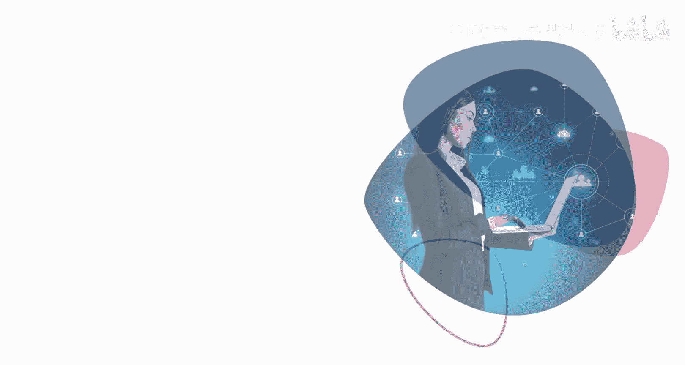

在本节课中，我们将要学习人工智能智能体在人力资源领域的应用场景、优势以及具体实例。我们将了解这些虚拟助手如何通过自动化任务来提升HR工作效率，并探讨它们如何与HR专业人员协作，实现“人在回路”的工作模式。

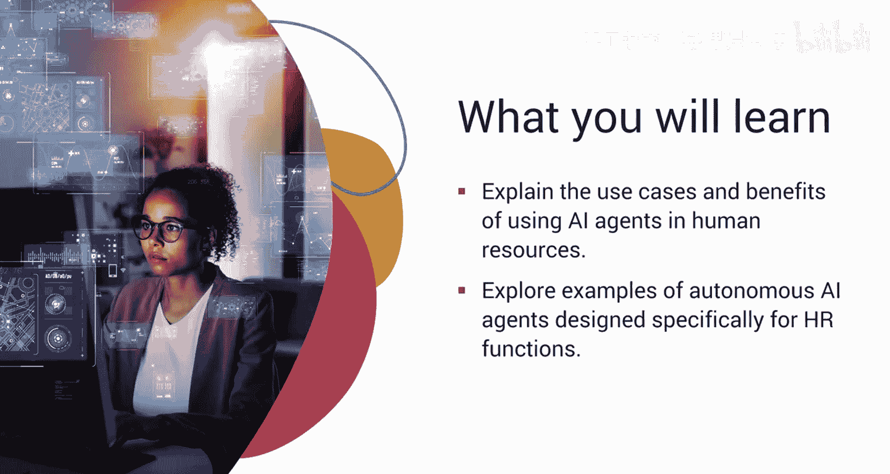

---

## 什么是HR领域的AI智能体？

想象一下，作为一名人力资源专业人员，你需要同时处理上百项任务，从筛选候选人到回答他们层出不穷的疑问。

现在，想象有一位全天候的助手，能够不知疲倦地7x24小时工作，回答候选人的问题，同时高效地完成入职文书工作。这就是AI智能体在HR领域的力量。

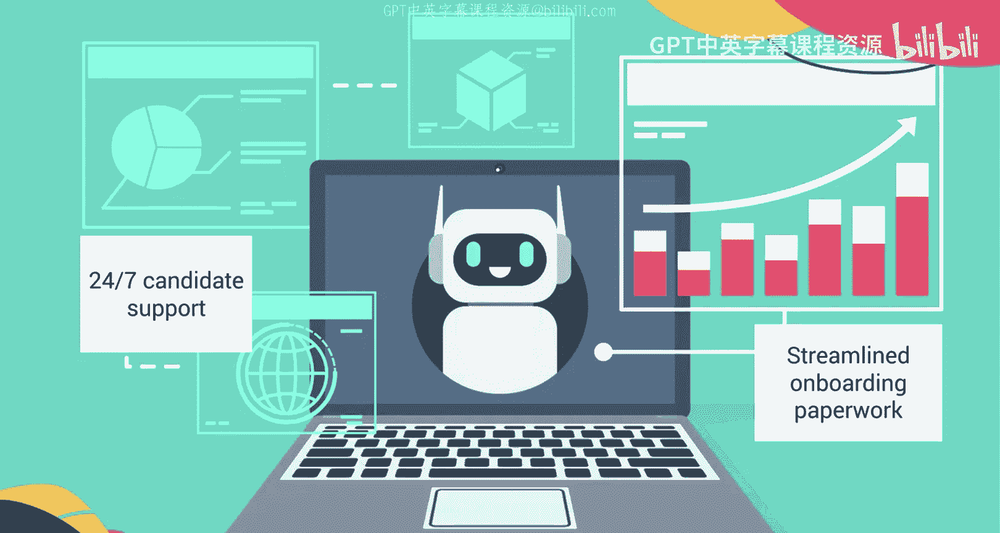

那么，这些AI智能体究竟是什么？你可以将它们视为你的虚拟助手。它们由生成式AI创建，其使命是自动化HR工作中那些永无止境的循环任务。

无论是筛选简历、安排面试，还是为新员工起草入职文件，AI智能体都利用**自然语言处理（NLP）**和**深度学习**来简化你所有的HR流程。

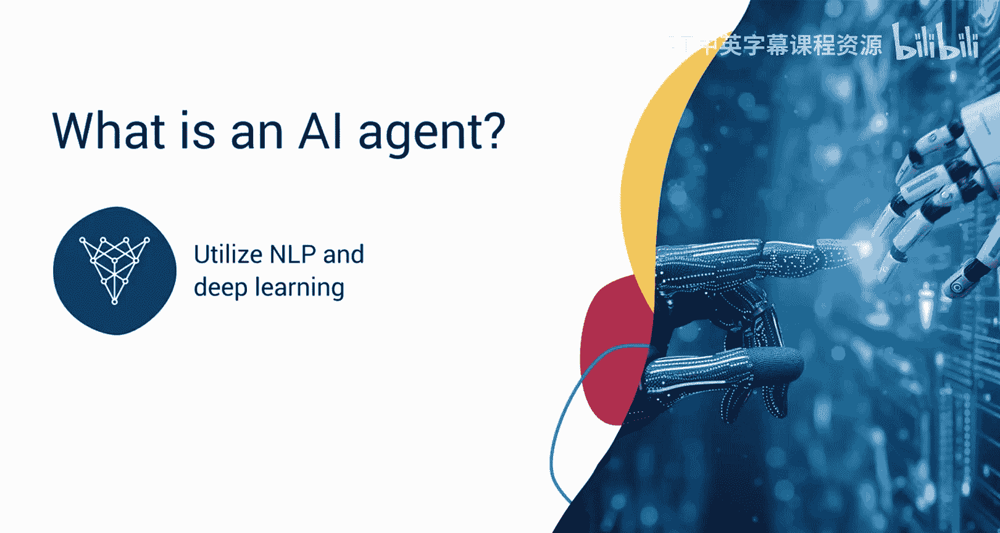

---

## AI智能体的核心能力

上一节我们介绍了AI智能体的基本概念，本节中我们来看看它们具备哪些核心能力。

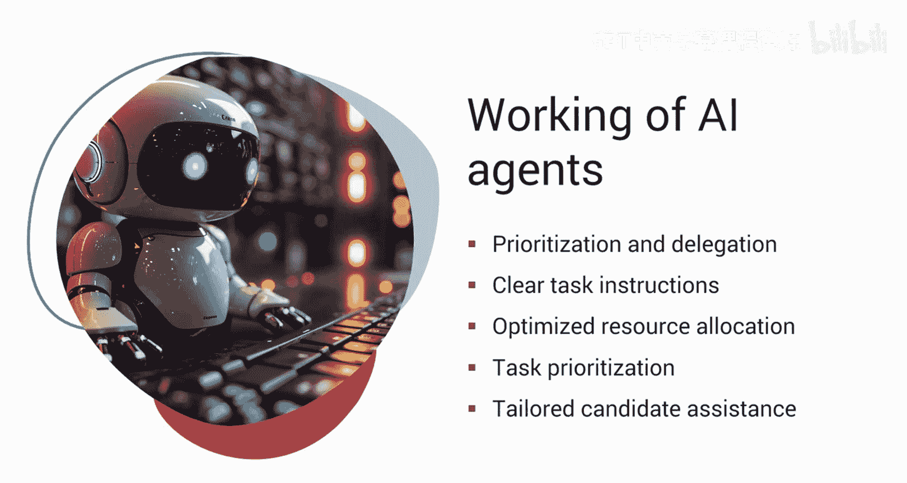

AI智能体不仅仅是任务执行者，它们还被设计用于**优先排序**和**任务委派**。它们将复杂的指令分解为定义清晰、明确的步骤，帮助你高效地达成预期截止日期。它们使用先进的AI算法来优化资源分配，并根据任务的紧急性和重要性来确定优先级。

此外，AI智能体还具备专业能力，能够为每位候选人提供个性化的定制体验，在整个入职旅程中为他们提供支持和协助。

---

## AI智能体的具体应用场景

了解了核心能力后，接下来我们探索AI智能体在HR中的一些具体应用场景。以下是几种常见的AI智能体类型：

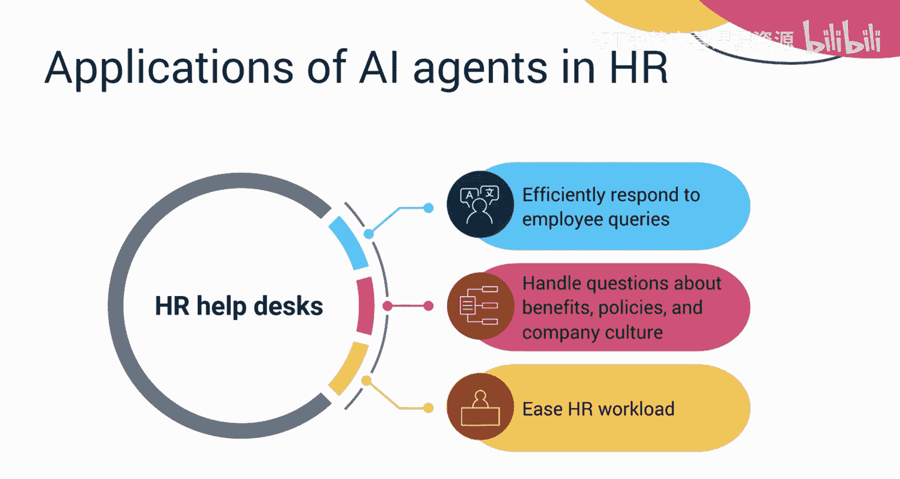

*   **招聘聊天机器人**：作为最受欢迎的虚拟助手，它们管理申请人提出的咨询，并根据收集到的必要信息安排面试。
*   **虚拟面试助手**：这类AI工具通过组织与申请人的视频面试，评估候选人的技能并判断其是否与组织文化契合，从而大幅简化招聘流程。
*   **员工入职工具**：这些工具引导新员工完成入职流程，并在需要时为他们提供必要的资源和帮助。它们解决了新员工通常存在的众多疑问，确保平稳过渡。
*   **HR服务台**：它们充当虚拟HR经理，处理员工关于福利、政策和公司文化的查询。这为HR团队成员减轻了巨大负担。

---

## 认识几位“AI超级英雄”

现在，让我们来熟悉几位这样的“AI超级英雄”。

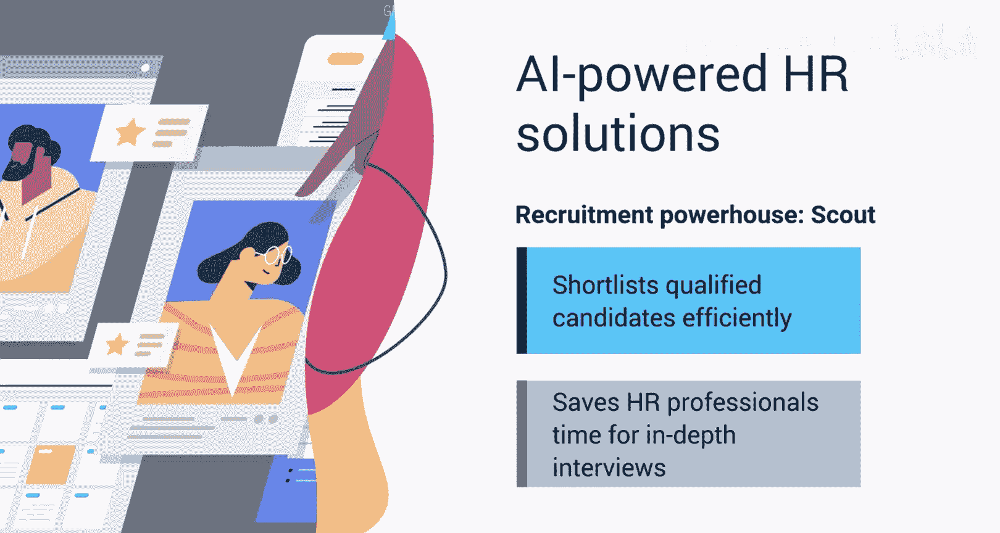

*   **Scout（侦察员）**：招聘领域的强大助手，能快速筛选简历。它根据技能、经验和关键词分析候选人，充分筛选出合格人选，从而为HR专业人员节省大量时间。
*   **Willow（柳树）**：你的入职伙伴，通过7x24小时在线回答新员工可能有的所有问题，使每位新员工的过渡尽可能顺利。
*   **Sage（智者）**：绩效分析专家，不仅通过员工绩效分析帮助HR，还通过推荐相关培训计划、识别趋势和改进领域来帮助员工。
*   **Retain（留任者）**：AI留任代理，警惕地监控员工情绪以防止人员流失。它还主动解决问题，以确保员工满意度。

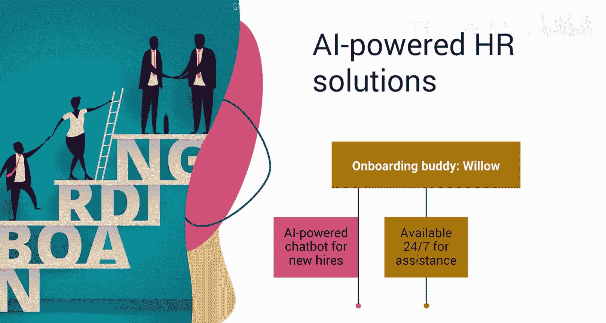

拥有这些AI智能体，不仅仅是更好地处理HR任务，更是为了创造一个更快乐、更高产的员工队伍。

---

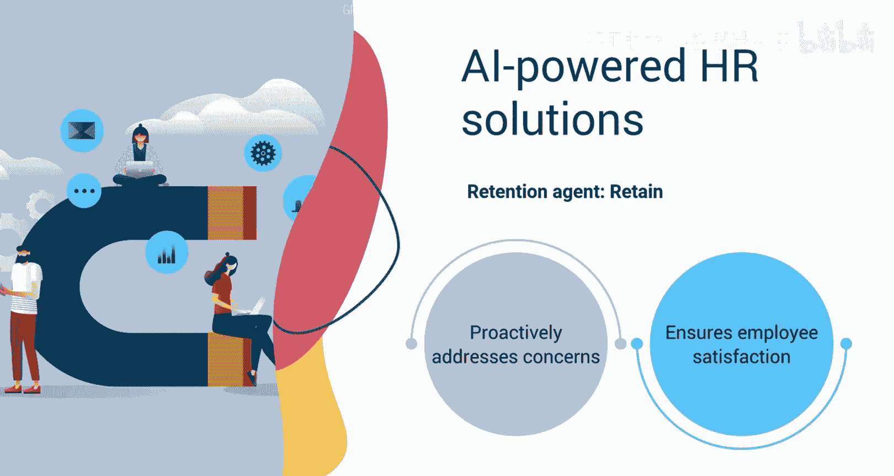

## AI智能体与“人的作用”

但一个经常被问到的问题是：人情味怎么办？虽然这些智能体不能取代人，但它们是一种增强工具，旨在提升效率并减轻HR专业人员的工作量。

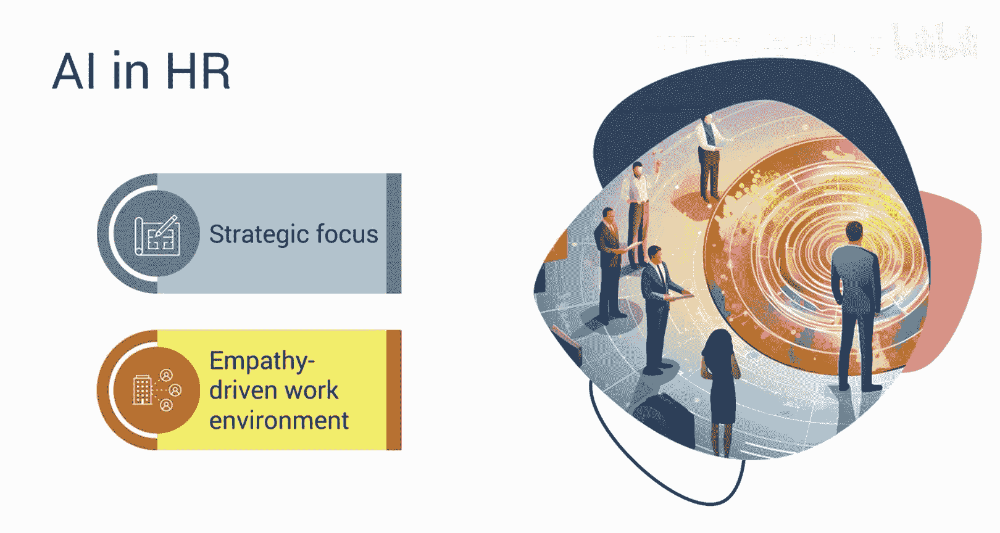

这些智能体就像可信赖的超级英雄，使HR专业人员能够将更多时间投入到战略性倡议中，并创造一个建立在同理心基础上的工作环境。这体现了 **“人在回路”** 的方法，即AI辅助决策，但最终由人类进行监督和做出关键判断。

---

## 课程总结

本节课中，我们一起学习了AI智能体的兴起如何改变了HR世界。

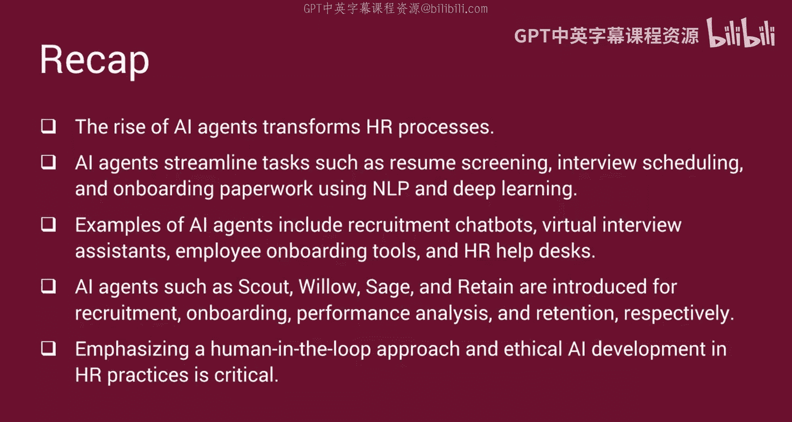

我们了解到，这些AI智能体通过NLP和深度学习，简化了筛选简历、安排面试和创建入职文书等HR流程。此外，我们探索了AI智能体的具体例子，如招聘聊天机器人、虚拟面试助手、员工入职工具和HR服务台。我们还认识了像Scout（招聘）、Willow（入职）、Sage（绩效分析）和Retain（留任）这样的AI智能体。最后，我们学习了“人在回路”流程以及在HR实践中进行符合伦理的AI开发的重要性。