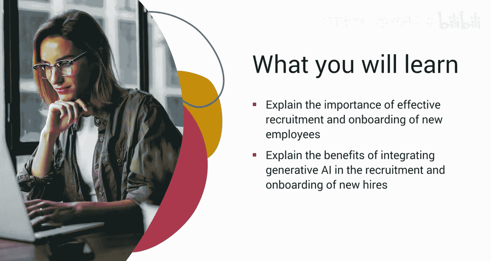
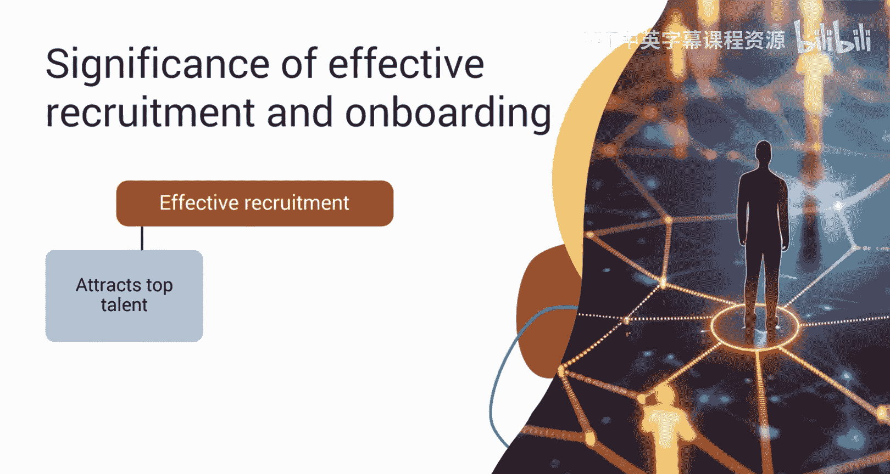
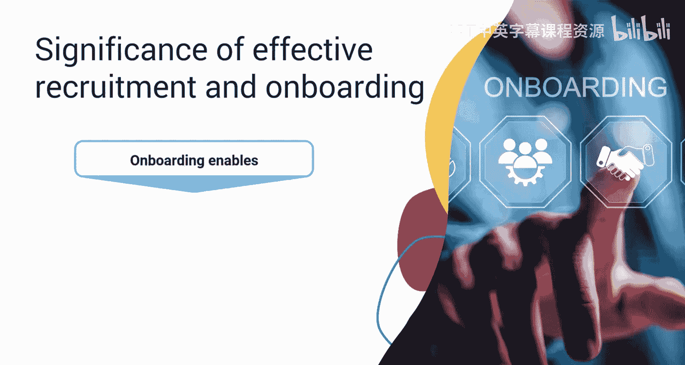
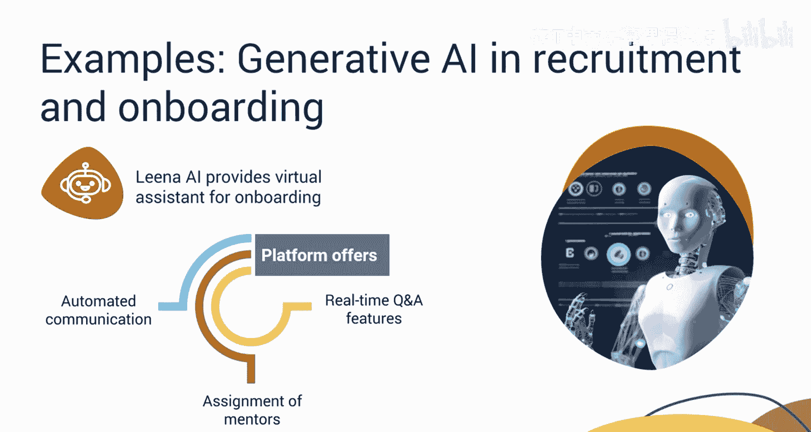
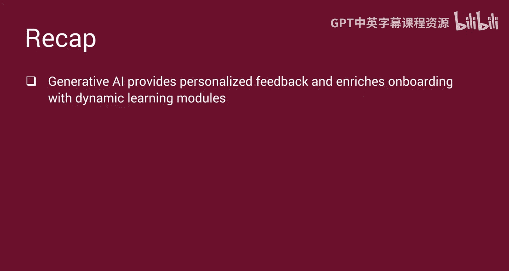

# 039：新员工招聘与入职管理 🚀

在本节课中，我们将要学习如何将生成式人工智能整合到新员工的招聘与入职管理流程中。我们将探讨有效招聘与入职的重要性，并详细说明生成式AI如何在此过程中提升效率与员工体验。

## 概述

在当今竞争激烈的商业环境中，有效的招聘至关重要，因为它有助于吸引市场上的顶尖人才。它能确保组织获得合格且技能娴熟的候选人库，从而获得相对于竞争对手的优势。

接下来是员工入职，这是一个广泛的过程，旨在促进新员工融入组织并适应其角色。入职使新员工能够适应工作环境、融入公司文化，并成为团队中富有成效的成员。根据一项盖洛普民意调查，**70%** 拥有积极入职体验的员工认为他们的工作是最好的。然而，只有 **12%** 的员工认为他们的公司有效地完成了新团队成员的入职。因此，公司必须努力使其入职流程尽可能顺畅和有效。

生成式AI正在改变招聘和入职体验，确保效率、参与度和即时适应性。接下来，让我们探索招聘和入职流程中涉及的各种活动或任务，并了解如何将生成式AI整合到这些任务中。

## 整合生成式AI的步骤

以下是招聘与入职流程中整合生成式AI的关键步骤。

### 创建精确的职位描述

在发布职位空缺之前，人力资源部门需要与招聘团队合作，了解该职位的要求，包括技术技能和软技能。这些信息可以输入到如 **ChatGPT**、**Gemini** 和 **Copilot** 等工具中。借助大型语言模型的协助，人力资源团队可以生成详细的职位描述。这些描述提供了公司的简要概述，并概述了对候选人的经验、技能和期望。

### 筛选与评估候选人

从大量的申请中评估候选人可能既繁琐又耗时。为了简化这一过程，人力资源部门可以利用像 **SeekOut** 这样的人才搜寻工具，这些工具利用了生成式AI技术。这些工具会根据职位描述中预定义的标准，自动筛选数据库中的简历，并分析候选人在 **LinkedIn**、**Stack Overflow** 和 **GitHub** 等平台上的社交媒体资料。它们评估候选人的技术熟练程度和协作技能，然后为最符合所需资格的档案分配分数。

在初步筛选之后，人力资源团队可以评估顶尖候选人以进入下一轮。

### 进行AI驱动的面试评估

在确定合适的候选人后，下一步是使用像 **HireVue** 这样的AI代理进行评估。这些代理可以发布与特定用例相关的技术问题，以评估候选人的问题解决能力、分析思维和压力管理技能。

人力资源部门还可以使用像 **Wordtune** 这样的生成式AI工具，向选定的候选人发送个性化的电子邮件，传达面试反馈并概述选拔流程。此外，这些工具还可以为未进入下一轮的候选人生成个性化反馈，确保在整个招聘过程中沟通清晰、体验积极。

### 提供动态入职学习模块

在入职培训期间，可以为新员工提供自助服务门户的访问权限。这些门户配备了问答聊天机器人，可提供有关公司政策、组织结构、薪酬福利和团队成员等各个方面的信息。

人力资源部门可以运用文本转音频和文本转视频的生成式工具，如OpenAI的 **GPT** 和 **Sora**，来制作动态和个性化的入职学习模块。这些模块集成了模拟、虚拟现实体验和游戏化元素，并根据员工的技能组合、学习偏好和工作需求进行定制。

### 促进团队融合与持续改进

进一步地，新员工可以通过参与虚拟团队建设活动，无缝地与他们的团队融合。

最后，还可以利用生成式AI来检查绩效数据，以发现模式和需要改进的领域。通过建立明确的目标、反馈机制和持续监控系统，人力资源部门可以提出对入职计划的调整建议。

## 实际应用案例

以下是一些在招聘和入职新员工的不同阶段使用的生成式AI平台实例。

*   **埃森哲（Accenture）**：埃森哲的人才招聘团队开发了一个AI驱动的平台，能够与申请职位空缺的候选人进行个性化的电子邮件沟通。该平台整合了AI驱动的功能，如F评分、候选人匹配和单向面试。它还提供自动化的AI日程安排，消除了安排面试时耗时的来回沟通。自实施这个全面的AI驱动平台以来，埃森哲观察到各种招聘指标都有显著改善。例如，申请转化率提高了 **84%**，招聘时间减少了 **9%**，并且通过进行单向面试节省了 **20%** 的招聘时间。
*   **Aon Global**：Aon Global推出了 **Aon Assist**，这是一个AI驱动的聊天助手，旨在处理员工咨询。Aon Assist精通管理各种流程，包括员工入职和培训。
*   **Leena AI**：Leena AI专门为入职流程提供虚拟协助。该平台提供自动化沟通、导师分配和实时问答功能，为现场和远程招聘的新员工都提供了顺畅的入职体验。

## 总结

本节课中我们一起学习了有效招聘对于组织成功、吸引市场顶尖人才至关重要。入职在员工适应和生产力方面发挥着至关重要的作用，然而许多公司难以提供积极的体验。生成式AI简化了招聘和入职流程，提高了效率和参与度。它协助制作精确的职位描述、筛选候选人、进行面试并提供个性化反馈。此外，它还通过动态学习模块和虚拟团队建设活动丰富了入职体验。