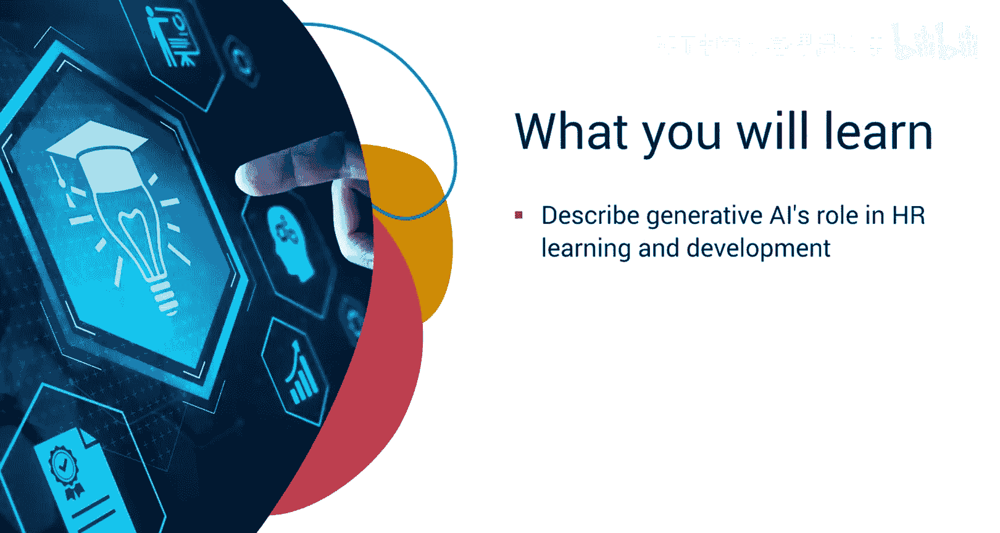
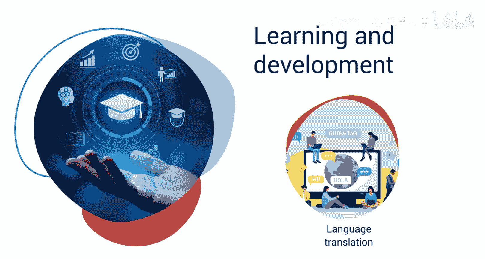
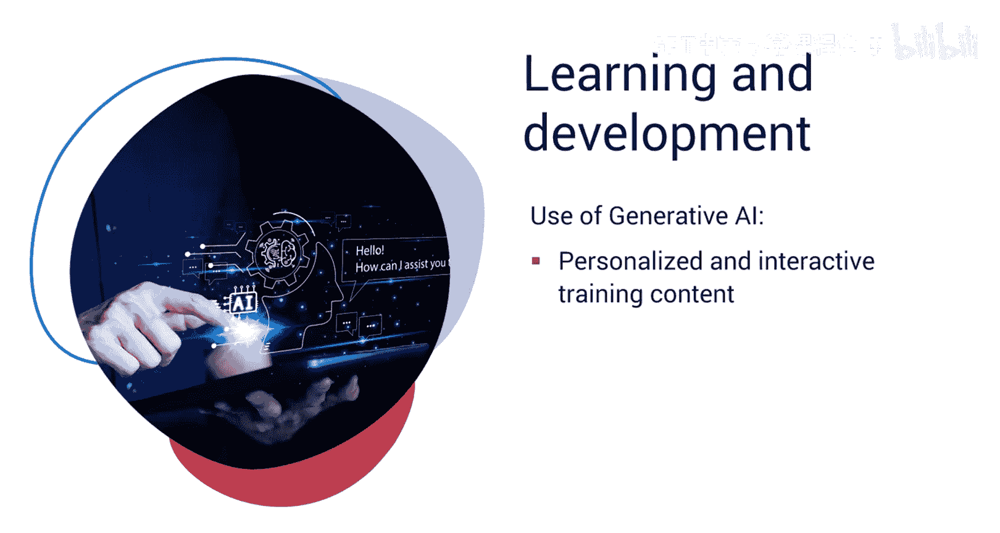
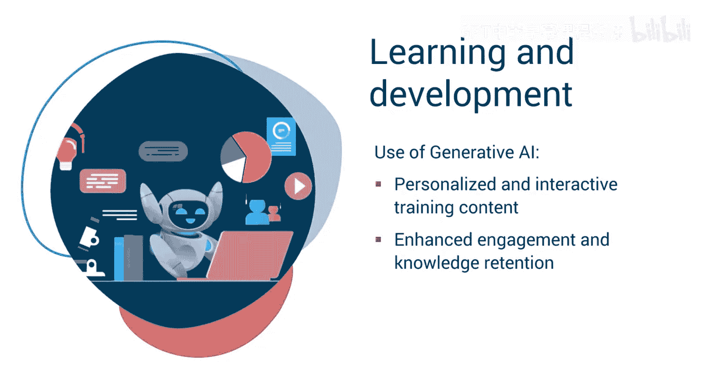
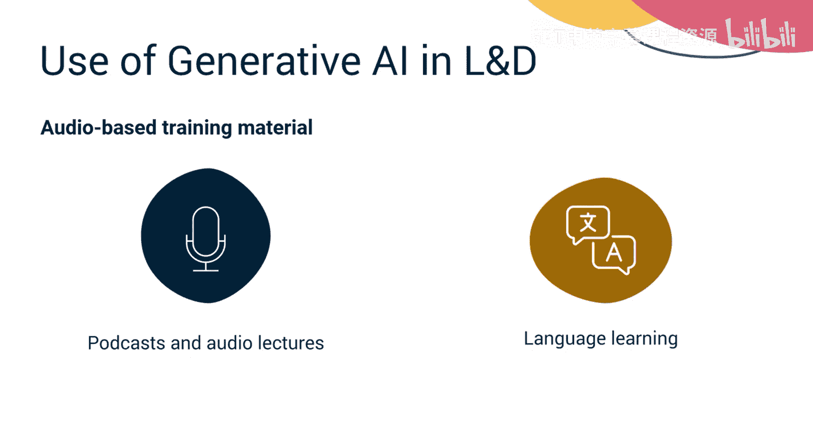
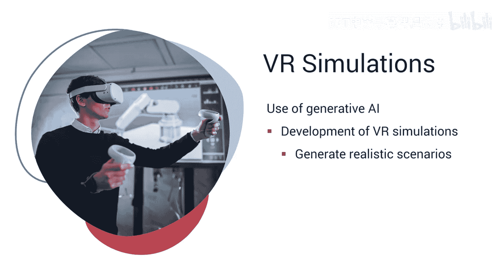
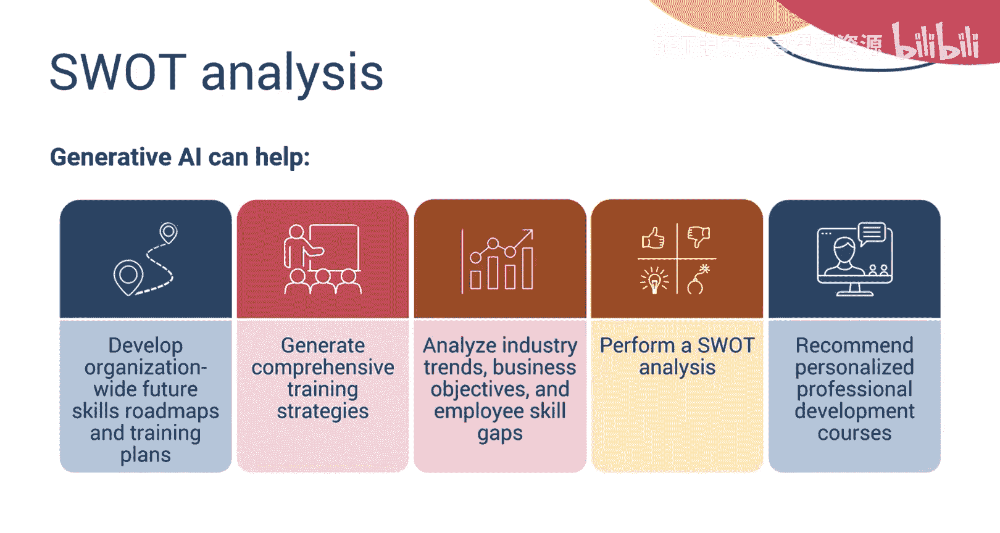
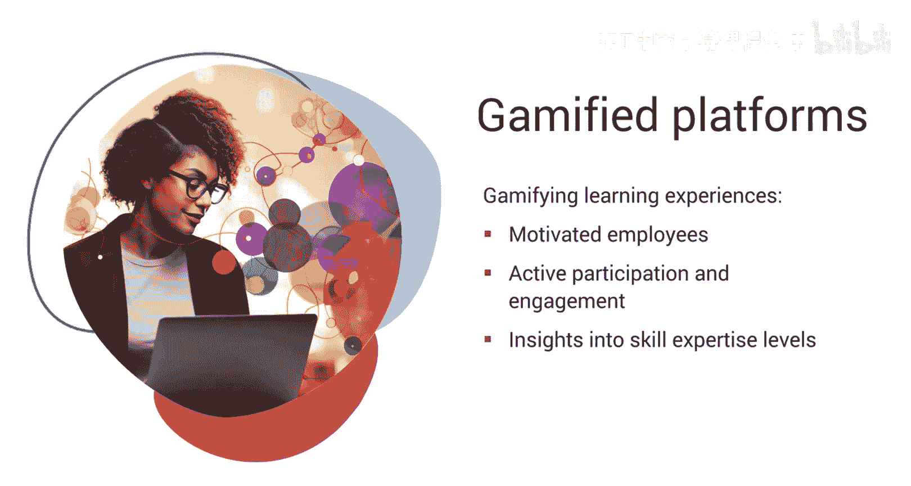
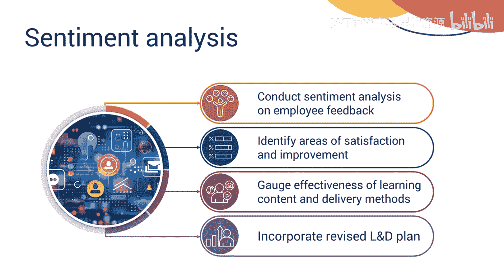
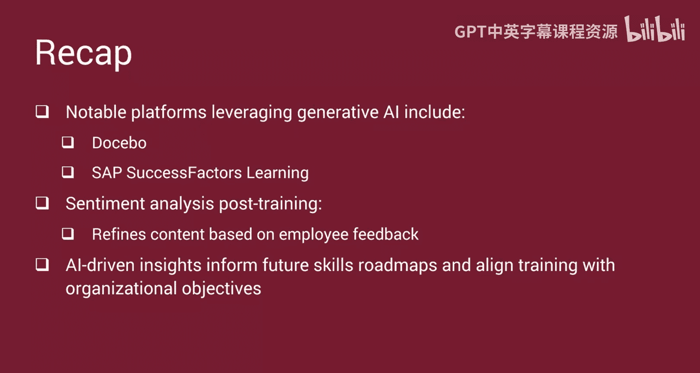

# 040：促进学习与发展 🎯

在本节课中，我们将要学习生成式AI在人力资源学习与发展（L&D）领域的关键作用。我们将探讨AI如何创建个性化培训内容、设计学习路径，并最终提升员工技能与组织竞争力。

## 概述

生成式AI正在重塑企业赋能员工学习与成长的方式。它能够根据个人需求和偏好，创建个性化、互动式的培训内容，从而提升员工参与度与知识留存率。在当今快速变化的职场环境中，保持领先至关重要，而学习与发展职能正是培养高技能、高适应性员工队伍的“秘密武器”。

上一节我们介绍了生成式AI在人力资源中的宏观价值，本节中我们来看看它如何具体赋能学习与发展。

## 生成式AI如何创建多元化培训内容 📚

生成式AI能够跨越文本、图像和音频等多种格式，创建引人入胜且高效的培训材料。

以下是生成式AI在内容创作方面的主要应用：

*   **文本生成**：利用生成式AI的文本生成能力，可以创建基于文本的电子学习内容，包括教学材料、测验和评估。它同样适用于技术技能培训，例如创建手册、教程和各种类型的文档。此外，生成式AI还能为软技能或特定领域（如销售和客户服务）培训创建场景与案例研究。例如，AI可以生成模拟客户互动的脚本，让销售和客服团队练习有效处理各种情况。它还能创建针对特定客户的场景，培训员工如何处理异议和掌握产品知识。
*   **图像生成**：除了文本，你还可以利用生成式AI的图像生成能力来创建视觉辅助工具，例如信息图、图表和产品插图，用以解释新产品特性或在具体产品培训中提供说明。
*   **音频与沉浸式体验生成**：如果需要为学习者提供逼真的模拟场景以进行实践训练，利用生成式AI是最佳解决方案。基于音频的培训材料，如播客、音频讲座或语言学习内容，也可以利用生成式AI的音频生成能力来创建。不仅如此，生成式AI还能帮助设计虚拟现实（VR）或增强现实（AR）模拟来开发培训模块。例如，一家制造公司使用生成式AI开发VR模拟，培训员工操作设备和安全规程。这些模拟能精确复制工厂环境，并生成逼真的场景供员工进行实践学习。

## 生成式AI如何实现个性化学习与发展路径 🧭

生成式AI通过分析员工数据（如绩效评估、技能测评和职业目标），为每位员工推荐个性化的学习路径。

例如，一位市场经理希望提升数字营销技能。使用生成式AI，她完成了一项初步评估，该评估识别出她偏好视觉学习和动手实践。随后，AI策划了一份个性化学习计划，推荐视频教程、互动模拟和案例研究。它安排简短的每日学习模块，并整合实时反馈和自适应测验以确保理解。她的进度被持续监控，AI动态调整内容的难度和类型，提供符合其独特风格和目标的定制化高效学习体验。

作为人力资源专业人士，生成式AI在为员工提供个性化职业建议的同时，也能协助你制定组织层面的未来技能路线图和培训计划。AI算法通过分析行业趋势、业务目标和员工技能差距，可以生成全面的培训策略，确保组织保持竞争力并为未来做好准备。这是通过对每位员工进行自动化的优势、劣势、机会、威胁（SWOT）分析来实现的，从而识别出需要改进的领域和增长机会。基于此分析，AI算法还能规划出个性化的职业发展课程，以弥补已识别的差距并发挥优势。

现在，想象一个能够根据你的需求定制学习方案、实时调整问题并生成个性化奖励的学习平台。生成式AI正将游戏化机制引入学习与发展领域，帮助将枯燥的内容转化为引人入胜的互动挑战，从而使学习变成一场激动人心的冒险。游戏化的技能评估与测评平台增强了学习者的主动参与，同时人力资源部门也能获得关于个人和集体技能专业水平的宝贵洞察。

## 生成式AI如何提升学习参与度与效果 📈

为了鼓励员工完成指定课程，生成式AI使你能够自动化推送提醒和通知。

AI算法通过分析员工参与模式和学习进度，可以发送及时的提醒和消息，从而提高课程完成率和整体学习效果。

多种平台利用生成式AI创建个性化学习路径、推荐相关课程并跟踪员工进度，其中一些平台包括：Docebo、Cornerstone Learning Experience平台、Degreed、SAP SuccessFactors Learning 和 Workday Learning。

在培训完成后，你可以使用生成式AI对员工关于已完成课程的反馈进行情感分析，识别出满意之处和待改进领域。通过分析情感，你可以评估学习内容和交付方法的有效性。基于反馈，AI算法可以建议修订学习与发展计划，使其更紧密地贴合员工更新后的目标和偏好。这个迭代过程确保了学习与发展计划始终保持相关性，并能有效达成组织目标。

## 总结

本节课中我们一起学习了生成式AI如何革新培训内容的创建，涵盖文本、图像、音频和沉浸式体验。文本生成可用于制作电子学习材料、技术文档以及销售模拟等软技能场景；图像生成有助于制作信息图和产品插图；而音频生成则支持播客和语言学习。此外，它还能设计用于实践培训的VR和AR模拟（如工厂环境）。通过分析员工数据，它能定制个性化学习路径和职业建议，促进技能发展。游戏化机制通过AI自动化推送课程完成提醒，提升了参与度。知名的平台包括Docebo和SAP SuccessFactors Learning。培训后，情感分析能根据反馈优化内容，确保持续的相关性和有效性。AI驱动的洞察还为未来技能路线图提供信息，使培训与组织目标保持一致。