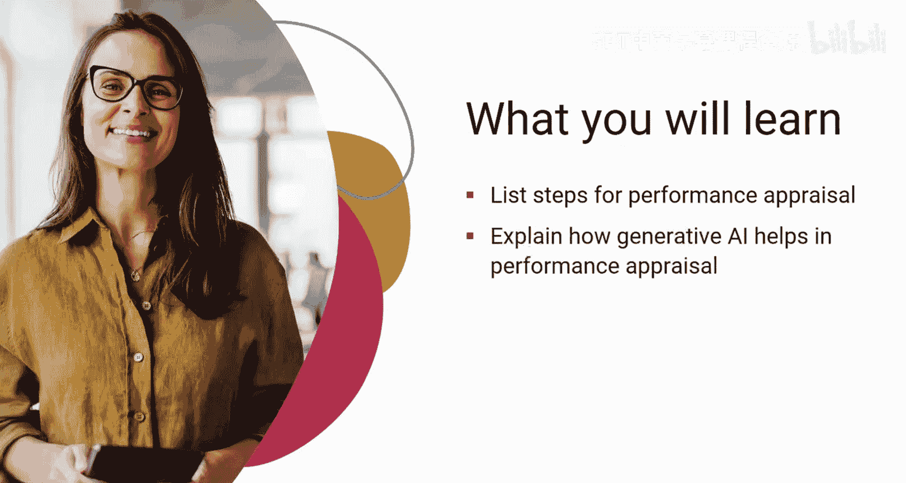
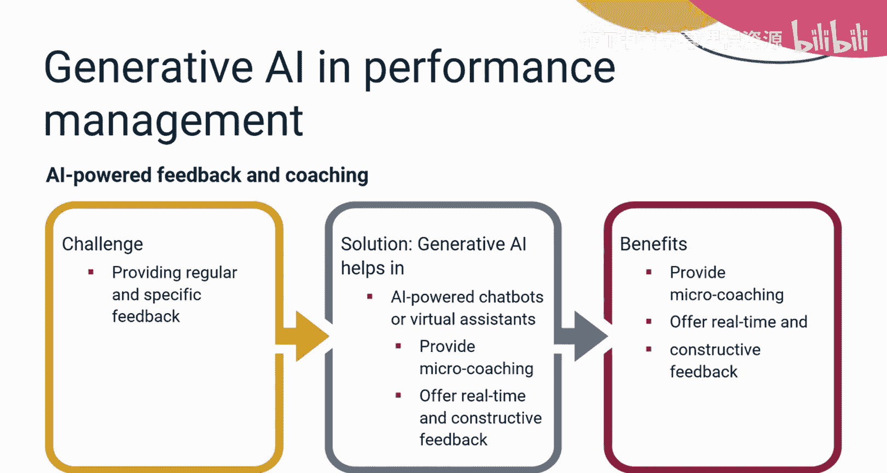
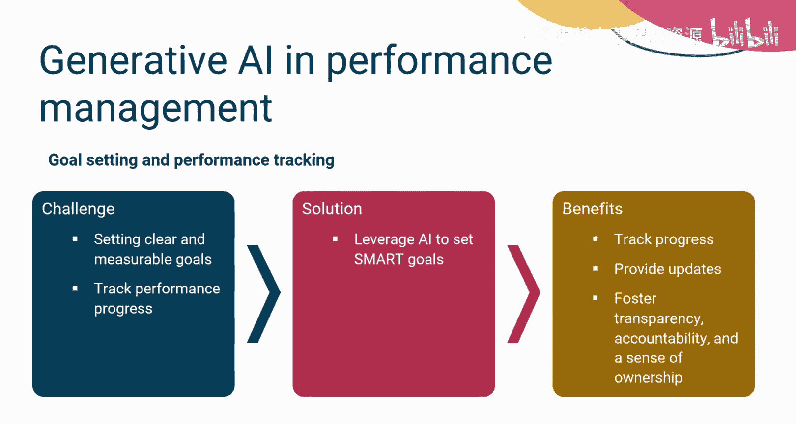
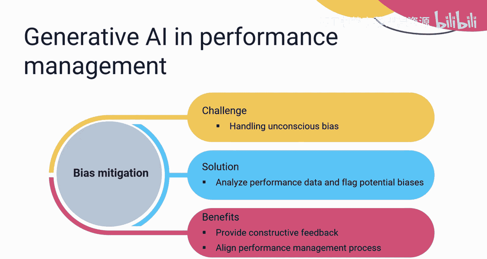
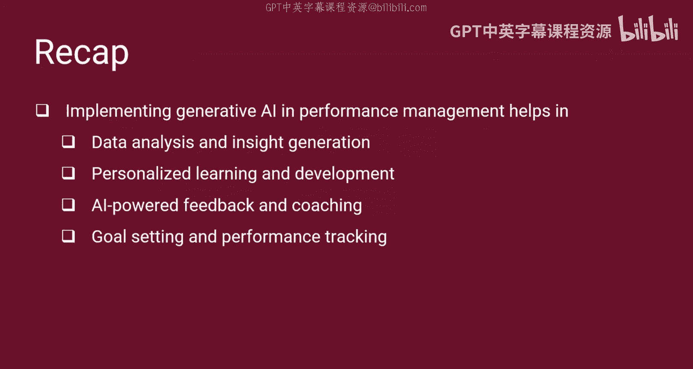

# 041：绩效评估实施

在本节课中，我们将要学习绩效评估的具体活动，并了解生成式人工智能如何帮助人力资源专业人员更高效地实施这一流程。

## 概述

研究发现，经理们平均为每位员工花费约17小时来准备绩效评估报告。这个时间非常庞大。为了减少这一耗时，许多组织已开始实施生成式人工智能来支持人力资源部门。将生成式AI用于绩效评估，既能节省经理的时间，又能帮助为员工创建更清晰、更具可操作性的反馈。

## 绩效评估活动

首先，我们来探讨人力资源专业人员在绩效评估职能中执行的活动。这些活动为员工设定了明确的期望，并规划了职业发展路径。

以下是绩效评估的关键步骤：

1.  **定义并传达绩效标准**：绩效标准对于确保员工绩效满足业务要求至关重要。例如，成为团队协作者、具备技术和软技能、有责任心、注重细节、时间管理以及遵守项目截止日期。绩效标准必须清晰且可衡量。定义明确的绩效标准有助于人力资源专业人员识别员工的能力和需要改进的领域，以实现预期成果。此外，人力资源部门应向员工传达绩效标准，以确保他们理解业务要求。这为员工提供了讨论其关键绩效指标以及实现方法的机会。

2.  **衡量绩效进展**：在向员工传达绩效标准后，定期通过审查其目标来分析他们的绩效非常重要。

3.  **与标准进行比较**：将绩效进展与绩效标准进行比较，以识别员工绩效的障碍，并找出需要改进的领域。

4.  **讨论绩效反馈**：现在是讨论绩效反馈的时候了。人力资源专业人员提供建设性反馈，奖励员工的成就，并指导他们利用各种学习和发展的机会来提升技能。

## 生成式AI在绩效评估中的作用

那么，生成式人工智能在这些活动中扮演什么角色呢？让我们来了解一下。

生成式AI有助于实现以下益处：**数据分析与洞察生成**、**个性化学习与发展**、**AI驱动的反馈与辅导**、**目标设定与绩效追踪**以及**偏见缓解**。

以下是每一项的详细说明：

*   **数据分析与洞察生成**：手动分析大型数据集、其模式以及员工的优势与劣势可能非常耗时。然而，生成式AI有助于分析包括绩效评估、项目指标和员工反馈在内的大型数据集，以发现隐藏的模式并预测潜在的挑战。这有助于经理专注于需要改进的具体领域，并为每位员工量身定制发展计划。
*   **个性化学习与发展**：创建单一类型的培训计划可能无法满足每个部门的需求。为应对这一挑战，生成式AI有助于执行培训需求分析，分析员工绩效数据，识别技能差距，并通过推荐个性化的培训计划来帮助有抱负的员工。这些培训计划还会推荐最佳课程和学习材料，并提供指导。这有助于提高员工敬业度，并让他们充分发挥潜力。
*   **AI驱动的反馈与辅导**：经理们在向员工提供定期和具体的反馈方面可能面临挑战。在这种情况下，AI也被证明是改变游戏规则的因素。利用AI驱动的反馈和辅导工具，例如提供微辅导、实时且一致反馈的AI聊天机器人或虚拟助手，可以提高员工的积极性和绩效。
*   **目标设定与绩效追踪**：在目标设定和绩效追踪方面，为经理设定清晰、可衡量的目标并追踪绩效进展可能相当具有挑战性。生成式AI可以帮助设定**SMART**目标，即具体的、可衡量的、可实现的、相关的和有时限的目标。这样的目标与个人角色和业务目标保持一致。这进一步使项目经理和员工能够追踪进度、提供更新，并培养透明度、责任感和主人翁意识以实现目标。
*   **偏见缓解**：无意识偏见会影响绩效评估的公平性和准确性。使用生成式AI分析绩效数据并标记潜在偏见，有助于提供建设性反馈，并使绩效管理流程与员工保持一致。

## 总结

本节课中，我们一起学习了全球各行业已开始采用生成式AI执行各种任务，其中之一就是绩效评估。组织执行多项绩效评估活动，例如为员工设定和传达绩效标准、衡量绩效进展并将其与绩效标准进行比较，然后讨论反馈。在绩效评估中实施生成式AI可以帮助实现多项益处，例如数据分析与洞察生成、个性化学习与发展、AI驱动的反馈与辅导、目标设定与绩效追踪以及偏见缓解。