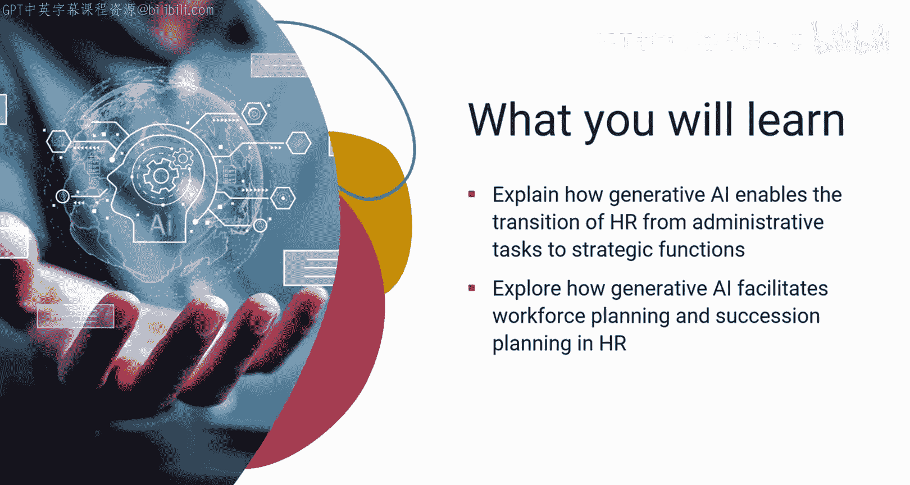
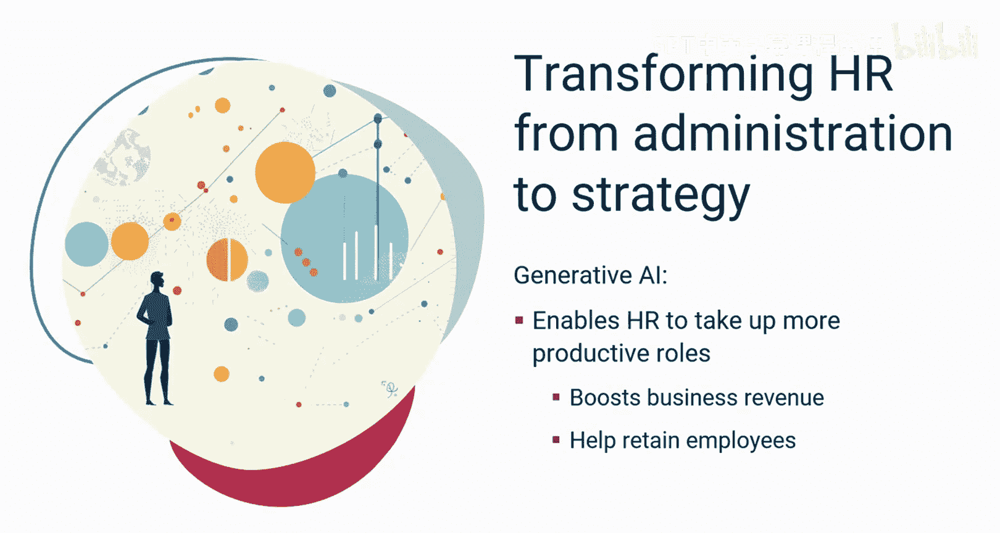
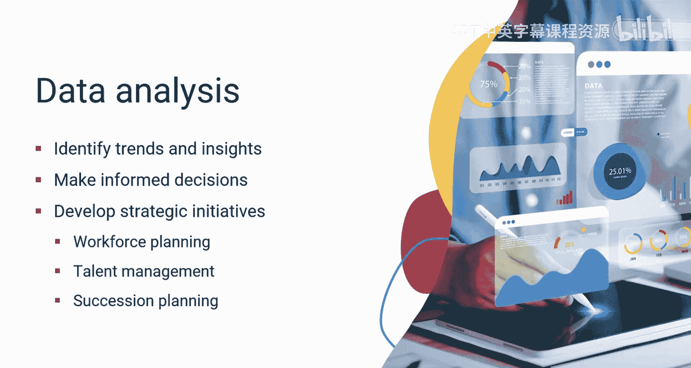
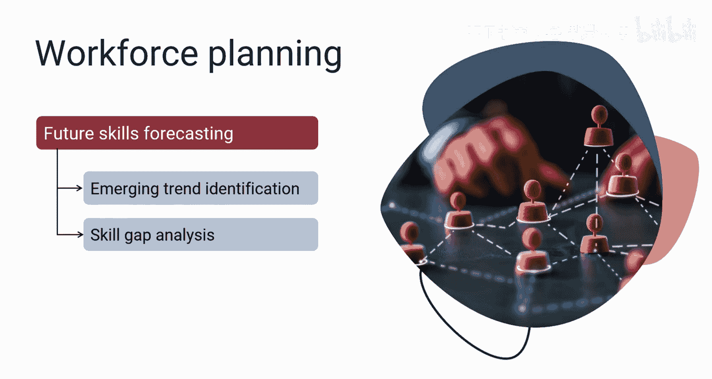
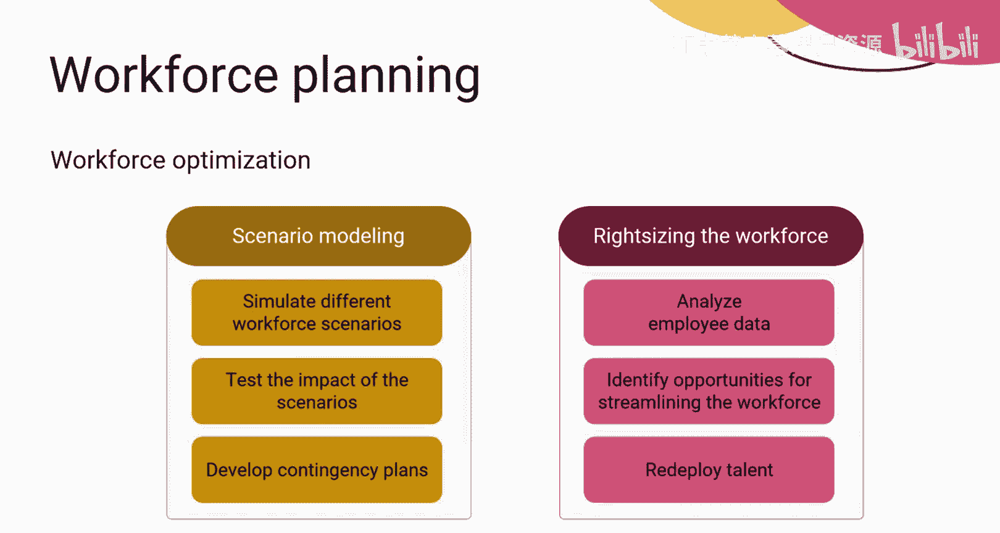
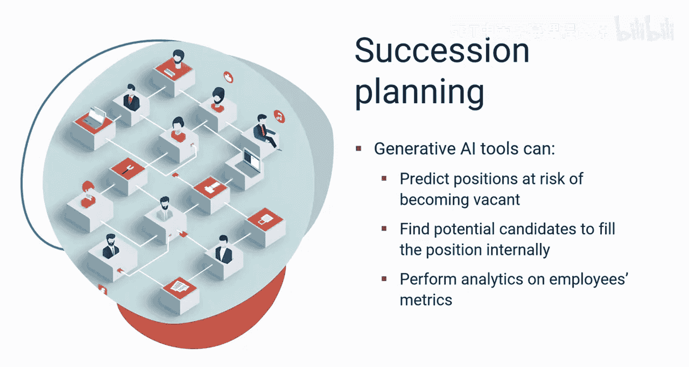
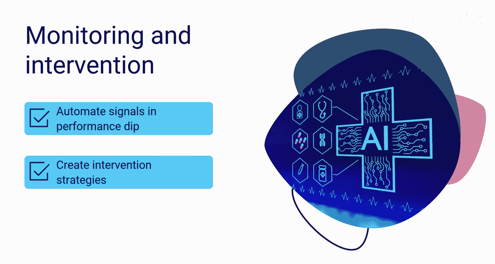
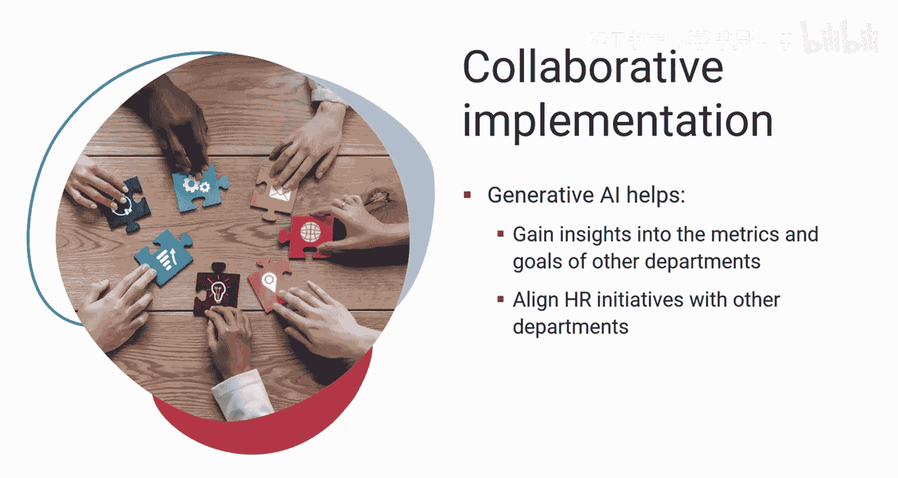
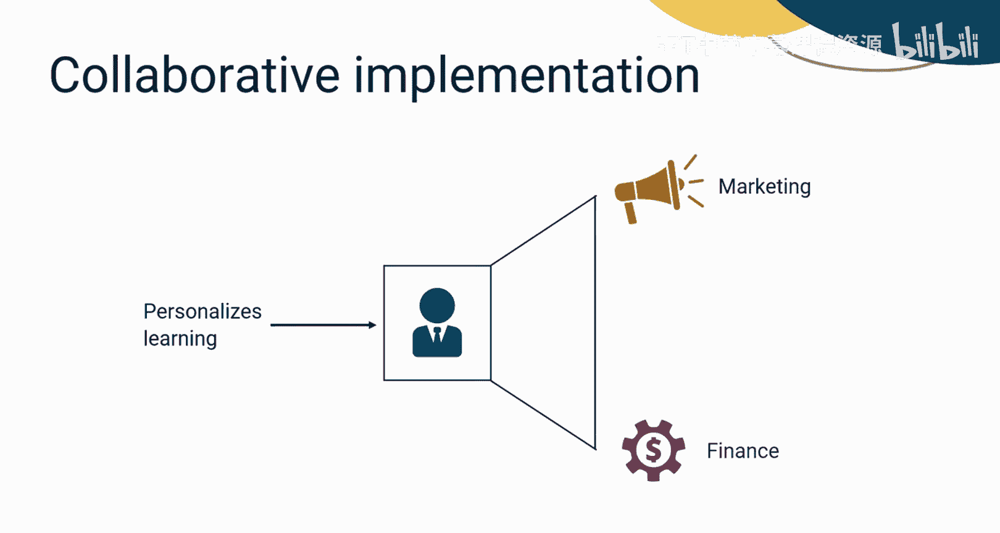
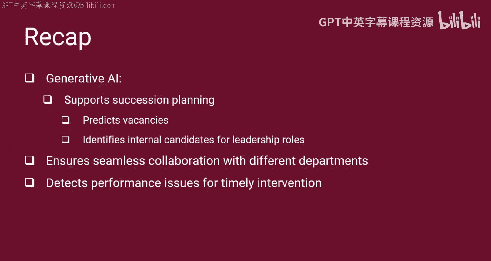

# 042：生成式AI助力人力资源向战略转型 🚀

在本节课中，我们将学习生成式AI如何帮助人力资源部门从繁琐的行政事务中解放出来，转型为驱动组织绩效的战略伙伴。我们将探讨其在劳动力规划、继任计划以及跨部门协作中的具体应用。

想象一下，如果人力资源部门不再需要整天安排面试和发送重复性邮件会怎样？生成式AI可以接管这些任务，让你能够专注于制定人力资源战略，例如如何利用AI根据相关数据设计个性化方案来招聘顶尖人才。这听起来或许不可思议，但生成式AI正赋予人力资源这种能力，使其从常规的行政工作转向更具战略性的、数据驱动的计划，从而推动组织的绩效、创新与增长。

借助生成式AI的力量，人力资源现在可以成为企业顺畅运营的战略伙伴。它可以承担更具生产力的角色，旨在提升业务收入并帮助留住员工。接下来，让我们看看生成式AI如何使人力资源职能对公司更具价值。

## 从数据分析到战略决策 📊

想象一下被堆积如山的数据所淹没，需要花费大量时间进行分析和解读的情景。生成式AI可以分析人力资源数据，识别与员工绩效、留任率和满意度相关的趋势与洞察。这有助于人力资源部门做出明智决策，并制定战略举措，以应对与劳动力规划、人才管理和继任计划等各种战略方面相关的挑战与机遇。

## 赋能劳动力规划

人力资源的另一项关键职责是劳动力规划，包括未来技能预测、劳动力优化和改进资源分配。生成式AI同样可以处理这些任务。

以下是生成式AI在劳动力规划中的具体应用方式：

*   **未来技能预测**：生成式AI不仅能改进未来技能预测，还能分析大量数据（包括行业报告、职位发布和社交媒体趋势），以识别未来将需求旺盛的技能。这使你能够预见职场需求的变化，并主动在员工队伍中培养或获取必要技能。
*   **识别技能差距**：此外，生成式AI还可以将员工队伍当前的技能组合与预测的未来需求进行比较。这有助于识别潜在技能差距，并使你能够制定有针对性的培训计划和技能提升计划，在这些差距演变成关键问题之前予以弥补。
*   **模拟劳动力场景**：如果你想基于市场波动、并购或公司战略变化等因素模拟不同的劳动力场景，可以探索生成式AI。它允许你测试这些场景对劳动力的影响，并制定应急预案，以确保组织保持适应力和竞争力。
*   **优化劳动力配置**：它还可以分析员工绩效、工作量和自动化潜力数据，以识别优化劳动力配置的机会。这不一定意味着裁员，而是战略性地将人才重新部署到最需要的领域。

## 优化资源分配与决策

在项目管理中，资源分配始终是一项艰巨的任务，为合适的任务或项目找到合适的资源，并在分配前检查其可用性和能力并不容易。

以下是生成式AI如何优化相关流程：

*   **高效招聘**：生成式AI可以分析过去的招聘工作数据，以确定吸引具备所需技能人才的最有效渠道。这使你能够优化招聘策略和资源分配，从而实现更高效的招聘流程。
*   **数据驱动决策**：生成式AI还可用于分析与不同劳动力规划决策（如招聘新员工、外包特定任务或投资培训计划）相关的成本和收益。这使你能够做出数据驱动的决策，从而最大化投资回报。

生成式AI实现了从被动到主动的劳动力规划的转变。这意味着你可以预见未来需求并做出战略决策，确保组织拥有合适的人才来实现其目标。数据驱动的洞察有助于消除劳动力规划中的猜测，从而实现与整体业务战略相一致的明智决策。生成式AI还能帮助你快速适应不断变化的市场条件和劳动力需求。

## 强化继任计划

人力资源中的继任计划也能受益于生成式AI。它可以捕获全面的数据，并轻松预测未来几个月内有空缺风险的职位。

凭借生成式AI模型的力量，你可以在职位空缺后的几天内轻松找到内部潜在的填补人选，因为生成式AI工具允许你对员工的技能、关键特质、跨职能团队合作情况以及多年来的稳定绩效进行分析。这些分析结果有助于你找到最适合接任领导职位的人选。

更重要的是，生成式AI工具允许你查看候选人的过往表现。当员工绩效出现下滑时，这些工具可以发出信号。信号可能基于项目完成延迟、未按时完成指定课程、负面员工反馈或工作出勤不规律等情况。人力资源部门随后可以制定干预策略，以解决任何个人或职业问题。

## 促进跨部门战略协作

生成式AI可以带来变革的另一个领域是与其他部门的战略伙伴关系。生成式AI可以提供对其他部门及组织指标和目标的洞察，并帮助人力资源部门将其举措与其他部门及更广泛的组织目标对齐。

例如，如果人力资源专业人员希望根据个人需求定制学习计划，他们需要与营销和财务等不同部门联系，以了解其目标和绩效指标。生成式AI可以促进这种数据共享和协同分析，使个性化方案的设计更加高效和有据可依。

## 总结

本节课中，我们一起学习了生成式AI如何使人力资源部门从行政事务转向战略职能。我们探讨了生成式AI如何促进数据分析，从而在劳动力规划、未来技能预测和资源分配等领域实现明智决策。此外，它还通过预测职位空缺和识别领导角色的内部候选人来支持继任计划。与其他部门的协作确保了人力资源举措与组织目标的一致性，而AI支持的监控则能检测绩效问题以便及时干预。总体而言，生成式AI通过优化流程、促进协作和推动组织成功，提升了人力资源的价值。