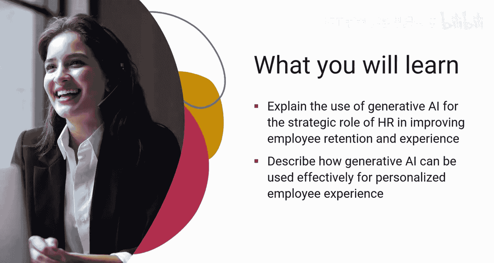
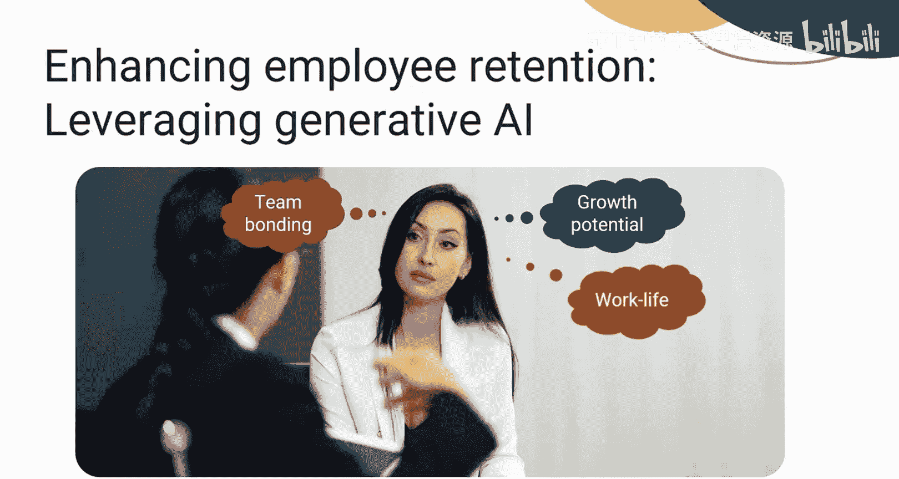
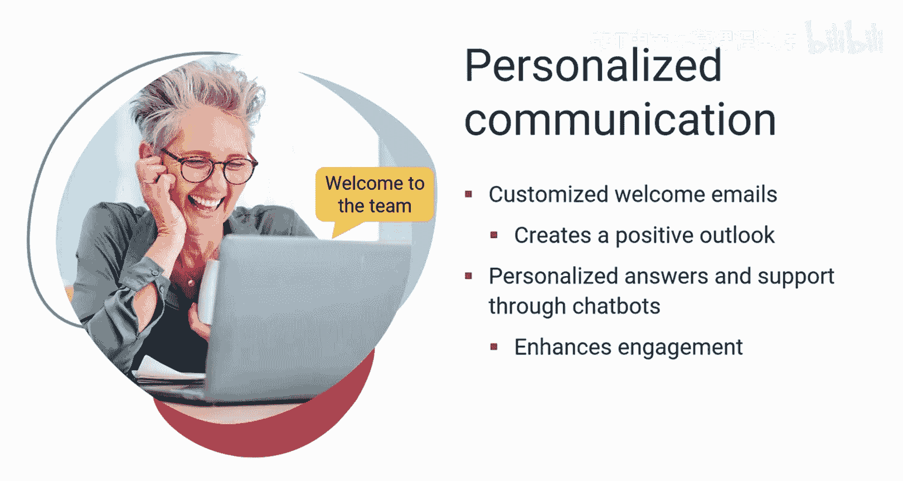
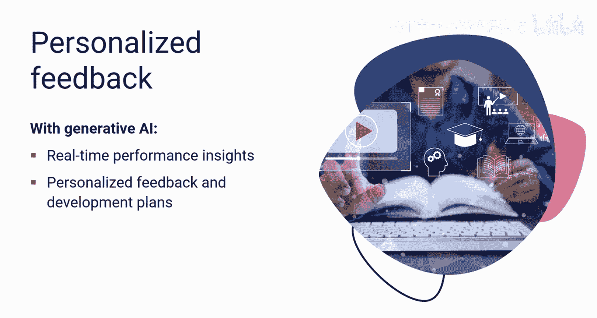
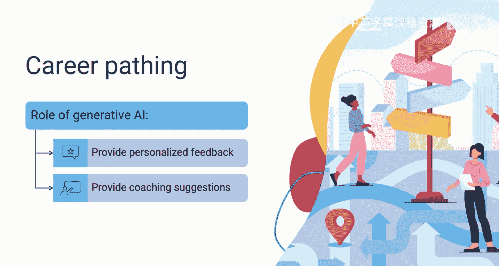
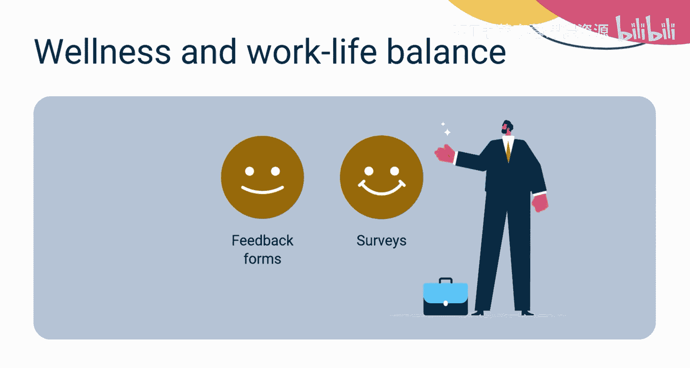
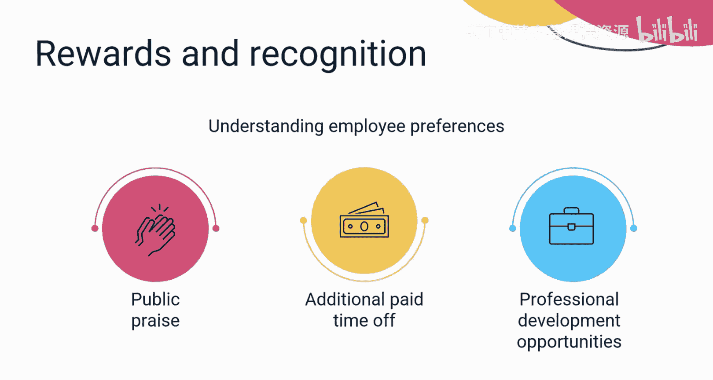
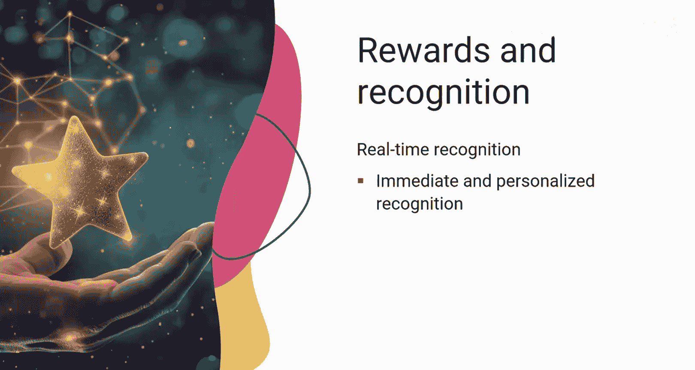
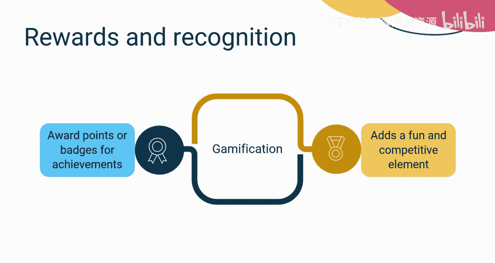
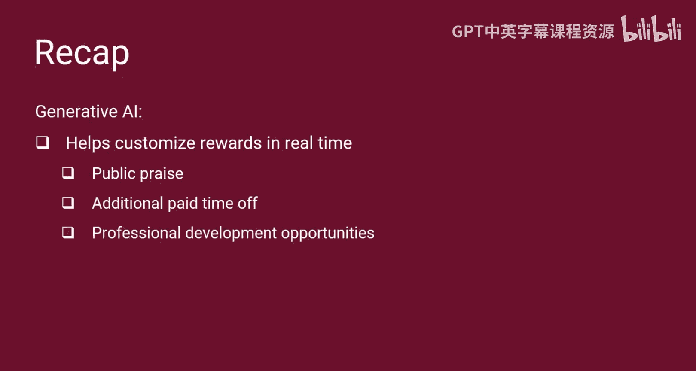

# 043：员工参与度与个性化管理 🧑‍💼

在本节课中，我们将学习生成式人工智能如何赋能人力资源部门，通过提升员工参与度和打造个性化体验来改善员工保留率与整体工作体验。

## 概述

员工保留与整体工作体验密切相关。员工离职的原因可能涉及对成长潜力的考量、工作与生活的平衡，或是团队融入的挑战。生成式AI可以帮助应对并改善这些问题。接下来，我们将深入探讨如何利用生成式AI提升员工参与度，并创造更个性化的员工体验。

## 个性化入职与沟通

从员工的入职流程开始，选拔和欢迎环节的沟通就可以通过生成式AI实现个性化。

以下是具体应用方式：

*   **个性化欢迎邮件**：借助生成式AI，可以定制电子邮件，包含使该员工被公司选中的积极特质。即使是最微小的改变，也能为新员工营造对公司的积极印象。
*   **智能聊天机器人支持**：由生成式AI驱动的聊天机器人可以为员工提供个性化的答案和支持，从而简化沟通并保持他们的参与度。

## 绩效管理与反馈

上一节我们介绍了入职沟通的个性化，本节中我们来看看生成式AI在绩效管理中的应用。

以下是具体应用方式：

*   **生成客观绩效报告**：生成式AI可以通过分析项目成果、同行评审和生产力指标，生成详细、客观的绩效报告。
*   **提供实时绩效洞察**：生成式AI驱动的反馈机制可以提供实时的绩效洞察。它还能分析员工互动和绩效数据，以提供个性化的反馈和发展计划。

## 个性化学习与发展

你是否希望能根据员工的职业抱负和公司目标，为他们规划和策划个性化的学习路径？生成式AI可以做到。

以下是具体应用方式：

*   **创建定制化学习路径**：生成式AI帮助创建定制的提醒，督促员工按时完成分配的课程。
*   **提供个性化反馈与辅导建议**：它随后会分析员工绩效数据，提供个性化的反馈和辅导建议。这有助于员工了解自己的优势和改进领域，从而获得更充实的工作体验。

## 预测分析与工作生活平衡

生成式AI提供了通过分析员工情绪（通过调查、反馈表甚至社交媒体活动）进行保留率预测分析的能力。

以下是具体应用方式：

*   **识别压力与倦怠风险**：AI算法可以分析历史数据，检查员工工作量、生产力、参与度和绩效指标，以识别潜在的工作相关压力或倦怠来源。
*   **主动调整与提供支持**：你可以利用这些洞察，主动调整工作负荷分配、实施灵活的排班选项，或为可能面临工作生活失衡风险的员工提供额外支持。
*   **提供针对性资源**：你还可以使用AI驱动的工具来提供有针对性的资源、活动和支持服务，以满足员工的具体需求和偏好，从而为所有员工培养更健康的工作生活平衡。

## 个性化奖励与认可

由于奖励和认可对于创造积极的工作环境和激励员工至关重要，生成式AI可以分析员工数据（包括过去的认可计划和反馈调查），以了解个人对奖励和认可的偏好。

以下是具体应用方式：

*   **定制实时奖励**：这允许你根据每位员工的动机来定制奖励，无论是公开表彰、额外的带薪休假还是专业发展机会，并且可以实时进行。
*   **实时识别成就**：生成式AI还可以监控员工绩效数据并实时识别成就。这使得即时和个性化的认可成为可能，这比延迟的认可更具影响力。
*   **创建游戏化认可程序**：此外，生成式AI可用于创建游戏化的认可程序，为成就奖励积分或徽章。这可以为认可增添趣味和竞争元素，进一步激励员工追求卓越。

## 总结

本节课中我们一起学习了生成式AI如何转变并个性化员工的入职和沟通过程。它还能通过分析项目成果、同行评审和生产力指标生成详细、客观的绩效报告，并提供实时绩效洞察。我们还了解了生成式AI如何通过分析相关数据来帮助维持员工的工作生活平衡，以及如何通过分析绩效数据，根据员工的动机（无论是公开表扬、额外带薪休假还是专业发展机会）实时定制奖励。