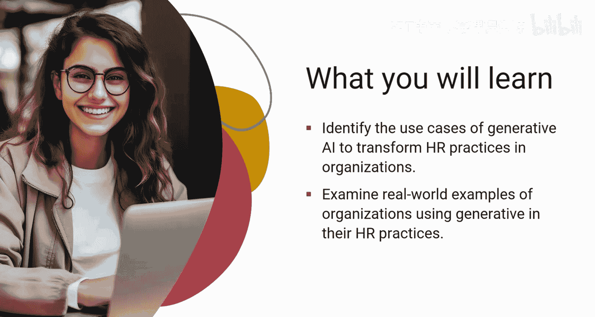
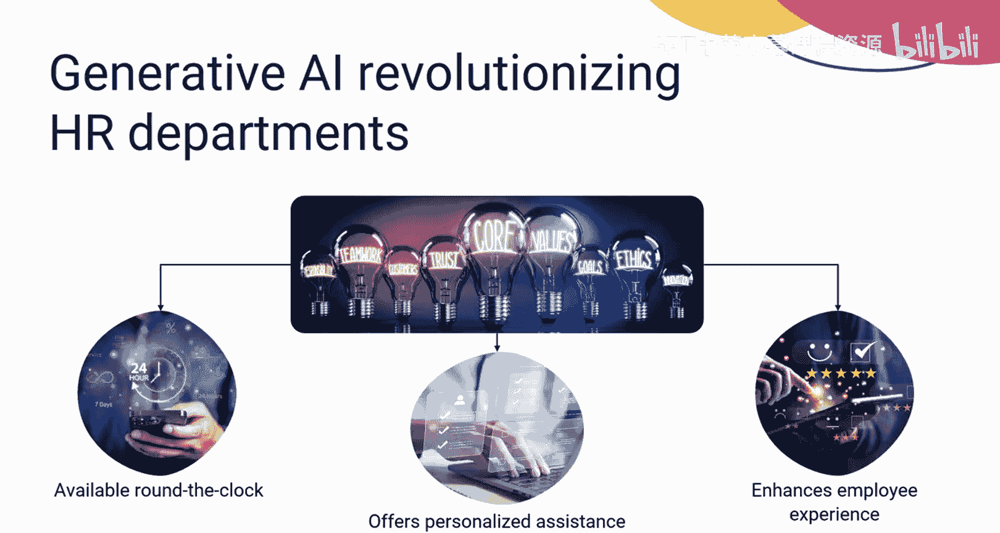
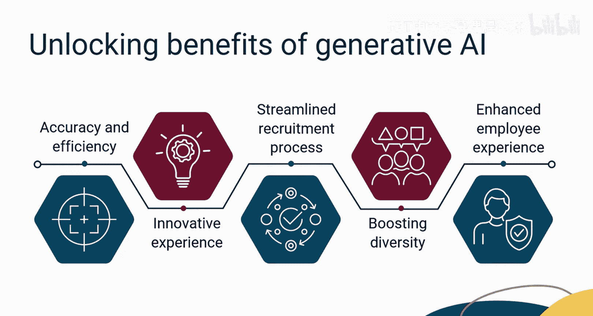
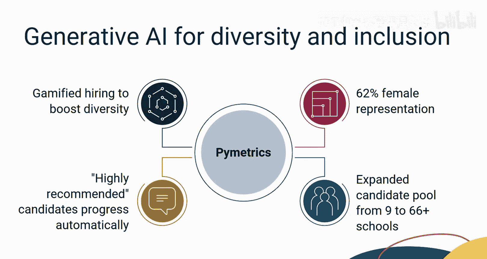
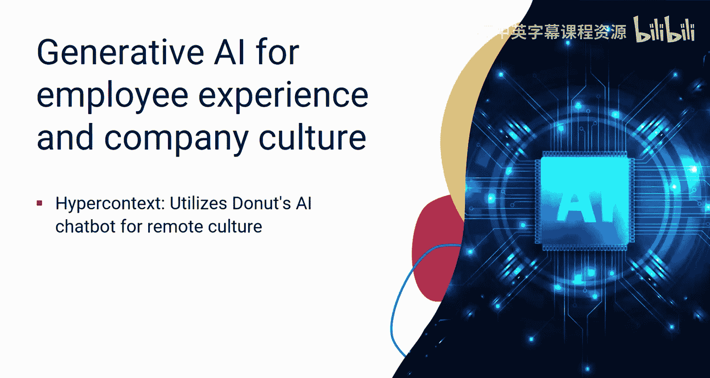
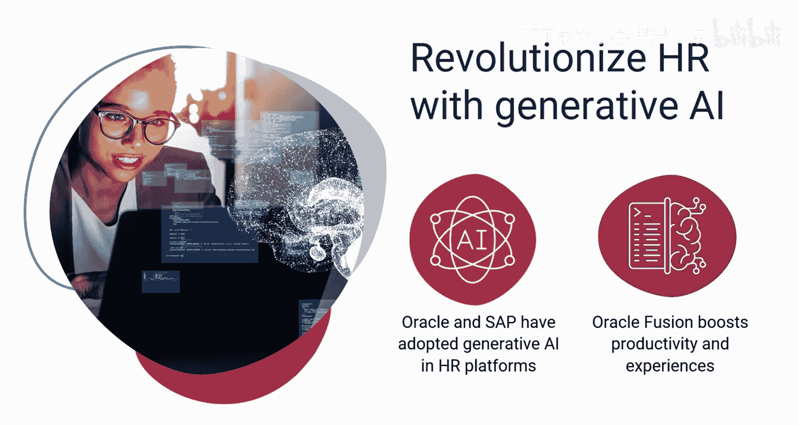
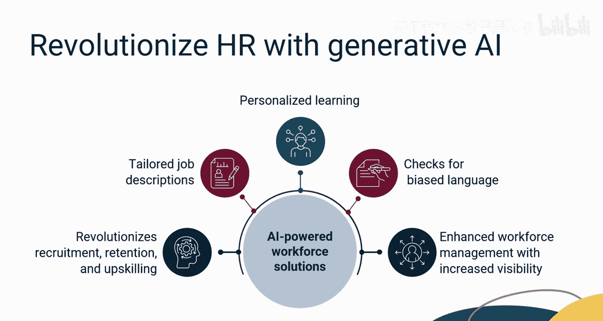
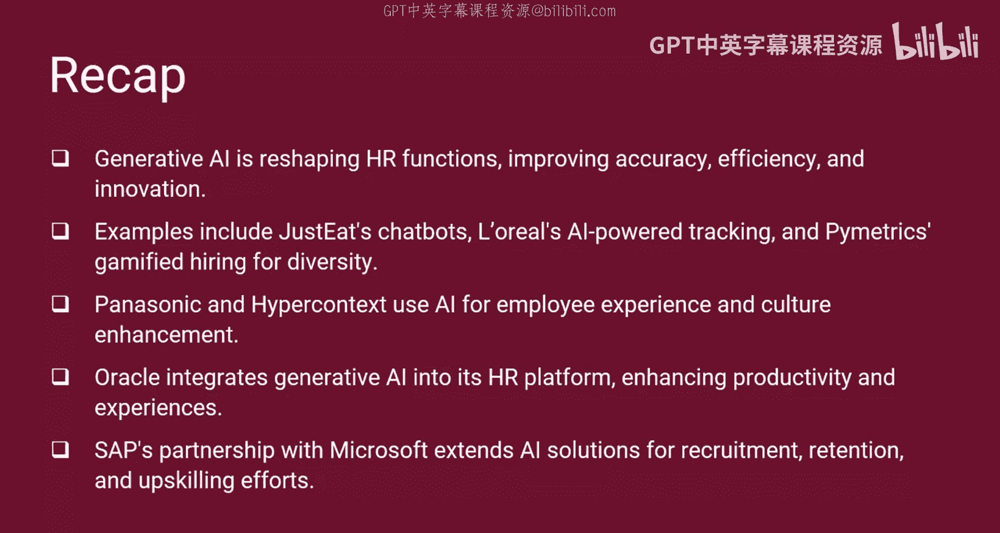

# 044：13_人力资源中应用生成式AI的组织实践

## 概述

在本节课中，我们将学习组织如何在人力资源（HR）领域应用生成式AI。我们将分析其应用方式和原因，并评估生成式AI在招聘、人才获取、多样性、包容性、员工体验以及企业文化方面的影响。同时，我们也将了解将生成式AI集成到Oracle和SAP等公司HR平台的重要性。

## 生成式AI如何重塑人力资源

想象一下，一个人力资源部门能够7x24小时不间断工作，提供个性化协助，并在提升员工体验和塑造企业文化方面发挥关键作用。这听起来似乎不可能。然而，借助生成式AI的应用，这正是全球范围内人力资源部门正在经历的变革。

如今，众多组织转向在人力资源中使用生成式AI，原因有很多。从提升准确性到提高效率，从创造创新体验到优化招聘流程，从促进多样性到增强员工体验，生成式AI都能发挥作用。

## 在招聘与人才获取中的应用案例

上一节我们介绍了生成式AI重塑人力资源的潜力，本节中我们来看看它在招聘与人才获取方面的具体应用案例。

以下是几个组织利用生成式AI优化招聘流程的例子：

*   **Just Eat**：这家知名的快餐巨头告别了传统的简历筛选方式，转而采用由生成式AI驱动的聊天机器人与候选人进行有意义的对话。这一举措使其招聘时间大幅缩短了50%。
*   **行业巨头案例**：包括L'Oréal、PitchBook和FIG Loans在内的行业巨头，倾向于实施由AI驱动的申请追踪系统（ATS）来扫描简历，并为空缺职位识别最合适的候选人。
*   **Pymetrics**：这个AI平台通过游戏化的方式为一家领先的投资公司优化招聘流程，使其女性员工比例提升了62%。根据评估工具，候选人被自动分组为“高度推荐”和“推荐”类别，并相应进入下一阶段。在采用Pymetrics之前，该公司主要从9所大学招聘人才；采用AI解决方案后，该公司向来自66所以上学校的候选人发出了录用通知。这种方法还将少数族裔的代表性提高了9%。

## 在提升员工体验与塑造文化中的应用

了解了生成式AI在招聘中的应用后，我们再来看看它如何帮助提升员工体验和塑造企业文化。

以下是相关组织的实践：

*   **松下北美公司**：该公司实施了Visier People Insight平台，这是一个由AI驱动的解决方案。该平台通过分析数据，为人力资源部门提供有价值的见解，以制定员工体验策略。
*   **Hypercontext公司**：该公司使用Donut的AI支持聊天机器人工具来培养远程办公文化。该公司在疫情前已逐步转向居家办公，现在已实现100%远程办公。Donut工具依赖于每两周在新配对的员工之间设置一对一咖啡聊天，使团队成员能够建立牢固的联系，并强化连接文化。

## 集成到主流HR平台：Oracle与SAP的实践

除了独立应用，生成式AI也被集成到主流的人力资源管理软件中。接下来，我们看看Oracle和SAP是如何做的。

*   **Oracle**：Oracle已将生成式AI功能嵌入到Oracle Fusion Cloud人力资本管理（HCM）中。这提供了更高的生产力、增强的候选人和员工体验，以及更流畅的人力资源流程，从而减少了核心HR职能中的摩擦。
*   **SAP**：SAP与微软扩展的合作关系将生成式AI带入工作场所。将SAP SuccessFactors解决方案与Microsoft 365 Copilot及Viva Learning集成，正在彻底改变组织招聘、保留和提升员工技能以弥补技能差距的方式。这种合作使员工能够获取量身定制的工作描述、面试准备和个性化学习课程，所有这些都内置了偏见语言检查。此外，SAP的Talent Intelligence Hub利用AI为每位员工创建和维护技能档案，为学习课程、导师和内部工作机会提供个性化推荐。增强的总体劳动力管理功能结合了SAP SuccessFactors、SAP Fieldglass和SAP S/4HANA Cloud，提高了对内部员工和外部工作者的可见性。

## 总结

本节课中，我们一起学习了生成式AI如何通过提高准确性和效率、创新日常任务执行方法来重塑人力资源部门的功能。

我们研究了Just Eat、L'Oréal和Pymetrics等组织的案例，它们分别将生成式AI集成为聊天机器人、招聘追踪器和游戏化招聘工具。此外，我们还了解了松下和Hypercontext如何通过集成Visier People Insight平台和Donut的AI聊天机器人来使用AI增强员工体验和企业文化。

最后，我们学习了Oracle和SAP等成熟组织如何将生成式AI集成到其HR平台中以提升生产力和员工体验。Oracle的AI功能集成在Oracle Fusion Cloud人力资本管理中，优化了HR流程；同时，SAP与微软的合作将AI和SAP SuccessFactors与Microsoft 365 Copilot集成，正在彻底改变劳动力管理、招聘和技能发展。