# 045：制定人力资源AI采用路线图 🗺️

在本节课中，我们将学习如何为人力资源部门制定一个全面的人工智能采用路线图。我们将探讨其重要性、关键步骤以及确保成功实施的策略。

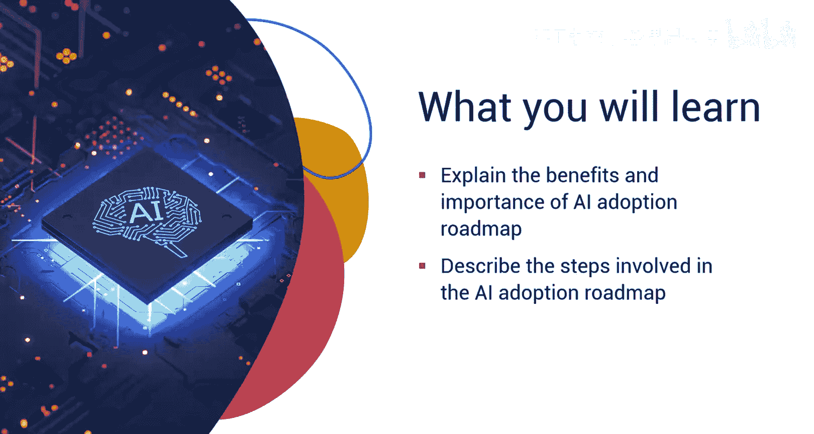

---

生成式AI已进入人力资源领域，早期采用的组织正在获得最大收益。但您的组织如何才能有效地将生成式AI整合到人力资源职能中，并释放其全部潜力？制定一个全面的路线图可以指导您完成采用过程，并应对出现的挑战。

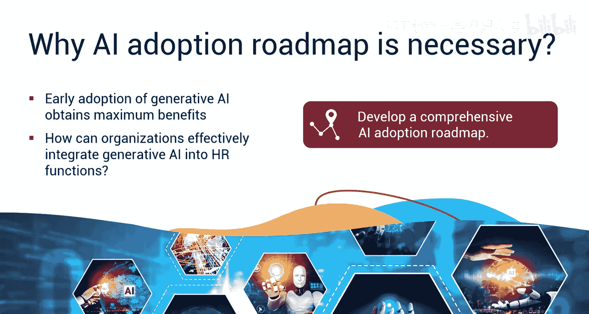

这个路线图是一个蓝图，它突出了从评估组织准备度和利益相关者参与到试点测试、集成和持续监控的关键步骤。遵循此路线图，您的组织可以平稳过渡到由生成式AI驱动的、高效且数据驱动的人力资源运营。

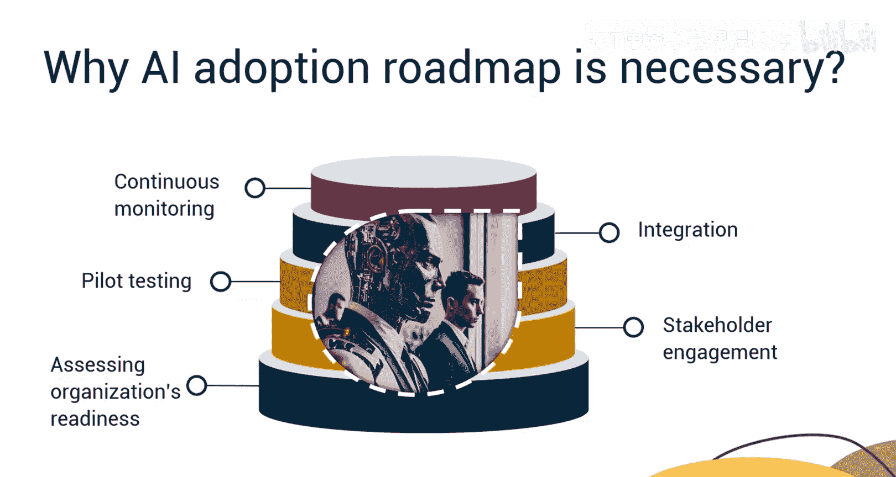

为人力资源制定AI采用路线图涉及战略规划、与组织目标对齐以及结构化的方法。接下来，我们来探索创建有效AI采用路线图的关键步骤。

---

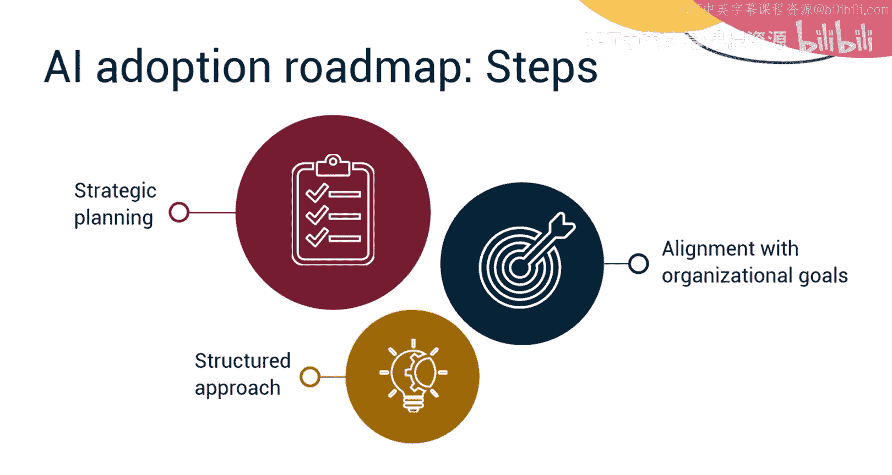

## 理解AI格局与变革管理

在采用AI之前，人力资源领导者需要对AI格局有透彻的理解。AI采用不仅仅是技术问题，还涉及人员和变革管理。员工可能担心AI会取代他们的工作。人力资源专业人员必须通过清晰的沟通和培训来解决这些担忧，帮助员工掌握与AI工具有效协作的技能。他们必须强调，AI旨在增强而非取代人类能力。

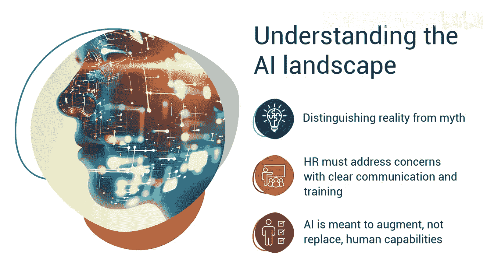

人力资源团队必须与以下专家合作：
*   **数据科学团队**：用于模型训练。
*   **DevOps团队**：用于在生产环境中扩展应用程序。
*   **法律团队**：以确保合乎道德和负责任地使用AI。
*   **合规团队**：以确保应用程序符合GDPR等当地法律。
*   **行业专家**：以评估AI技术的真正潜力。

---

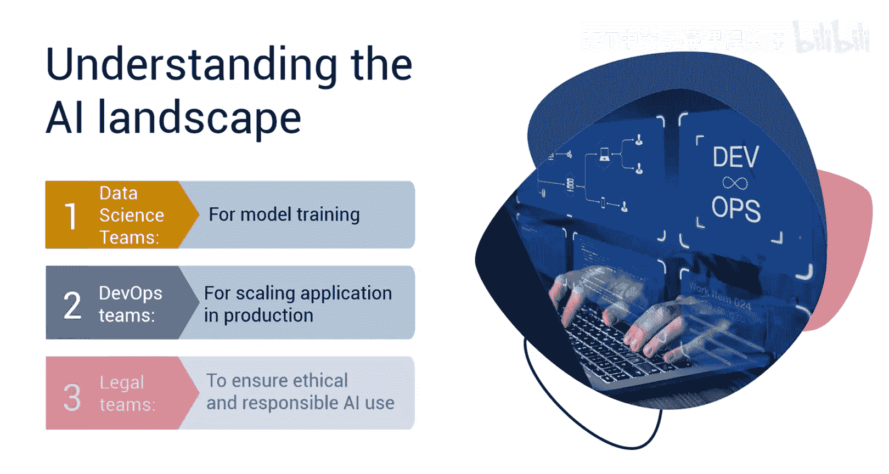

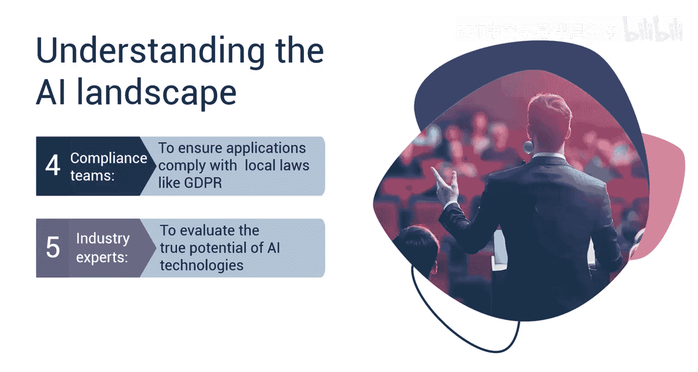

## 评估组织准备度

下一步是评估您组织的准备度。这可以通过评估以下关键领域来完成：
*   **领导层支持**：确保高管支持AI计划，并且这些项目与整体业务目标保持一致。
*   **数据基础设施**：评估从数据源到其在AI模型开发中使用的数据质量、可用性和安全性。**公式：可靠AI结果 = 稳健数据**。
*   **技能与培训**：识别各业务部门的技能差距，并规划针对员工角色的全面AI相关培训计划。

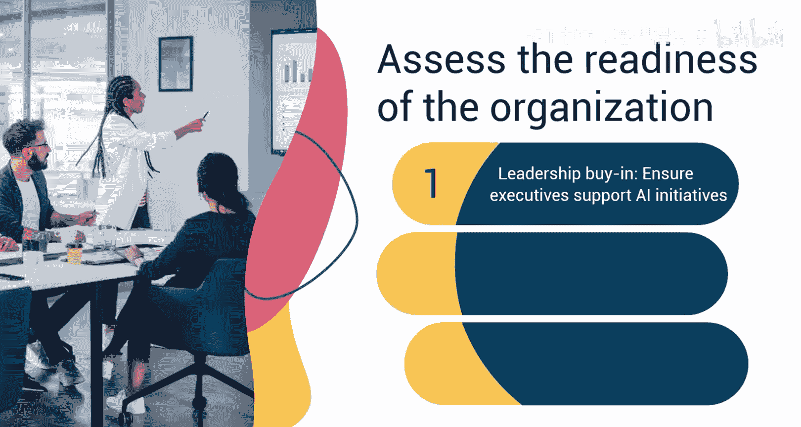

---

## 设定目标与确定用例

在评估了组织准备度之后，您必须为人力资源的AI采用设定具体目标。确定AI可以简化重复性任务的目标领域，突出将提升员工敬业度的活动（例如使用AI驱动的聊天机器人或提供个性化推荐），并概述用于劳动力规划或评估流失风险的预测分析用例。

并非所有AI应用都能带来相同程度的影响。因此，根据以下标准优先考虑生成式AI的用例至关重要：
*   评估每个用例的潜在收益和投资回报率，以检查其对业务的影响。
*   评估技术可行性、数据可用性和实施的复杂性。
*   检查紧迫性，并优先解决关键痛点。

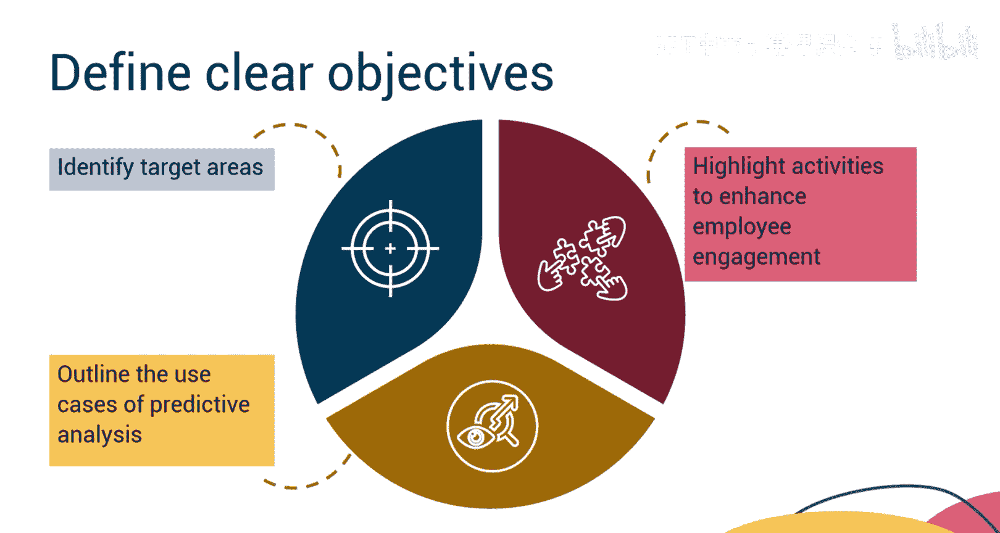

---

## 制定分阶段实施计划

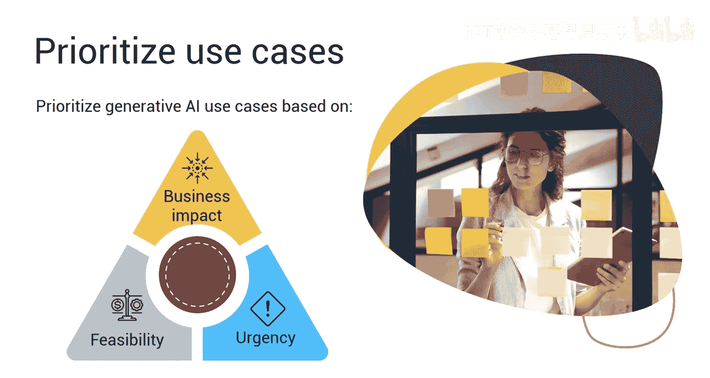

识别各个阶段并制定一个可以分阶段实施的计划至关重要。从易于实现的项目开始，以获得快速成功并建立势头。随着员工逐渐适应与AI技术协作，逐步实施更复杂的AI解决方案。同时，要有长远眼光，确保组织对AI的战略愿景朝着正确的方向对齐，为未来的发展奠定基础。

---

## 选择合适的AI工具与平台

选择合适的AI工具和平台非常重要。在筛选过程中考虑以下方面：
*   决定是构建定制解决方案还是使用现有的AI产品。**代码逻辑：if (长期战略需求高) { 考虑定制开发 } else { 考虑现有产品 }**。
*   与供应商合作可以加速进展并减少工作量。因此，根据功能、可扩展性和支持来评估供应商。
*   确保所选的AI工具能与您现有的人力资源系统无缝集成。

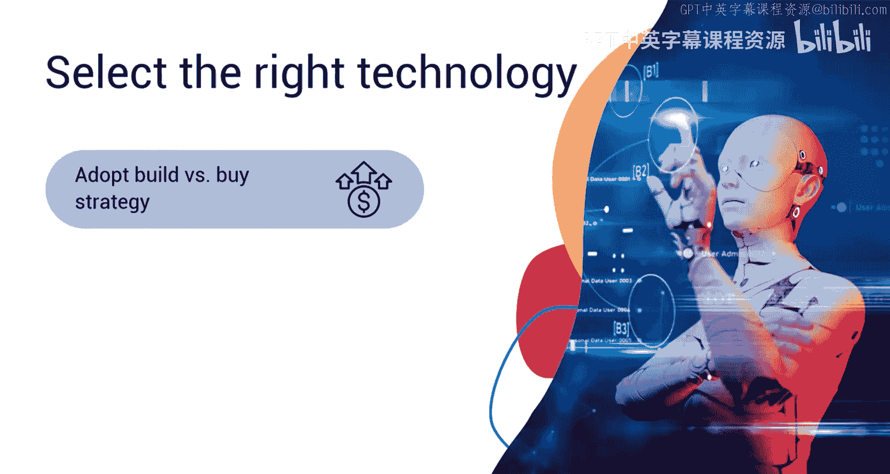

---

## 开展试点项目

从小规模试点项目开始，以完善您的AI解决方案。这可以通过以下方式完成：
*   在受控环境中测试AI解决方案，以验证其有效性。
*   收集用户反馈，并根据实际使用情况进行改进。
*   制定计划，将成功的试点项目推广到整个组织。

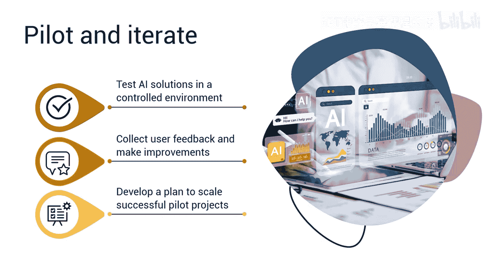

---

## 培训员工与推广采用

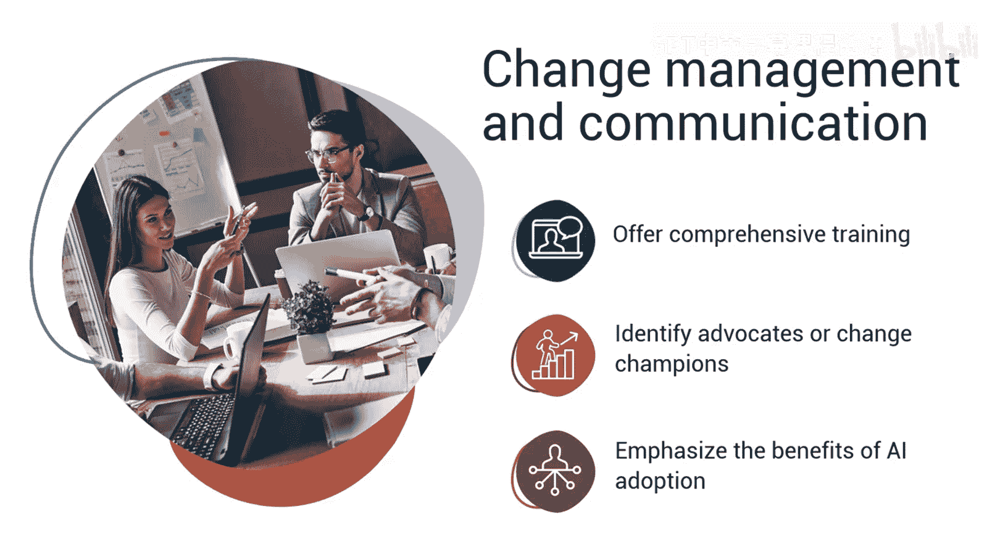

一旦试点项目成功，通过采用有效策略为员工做好AI采用准备。
*   提供关于AI工具采用及其对不同员工角色影响的全面培训。
*   识别并赋能能够在组织内推动和促进AI采用的倡导者。
*   公开解决员工的担忧，并强调AI采用的好处，以培养他们的理解和接受度。

---

## 系统监控与持续优化

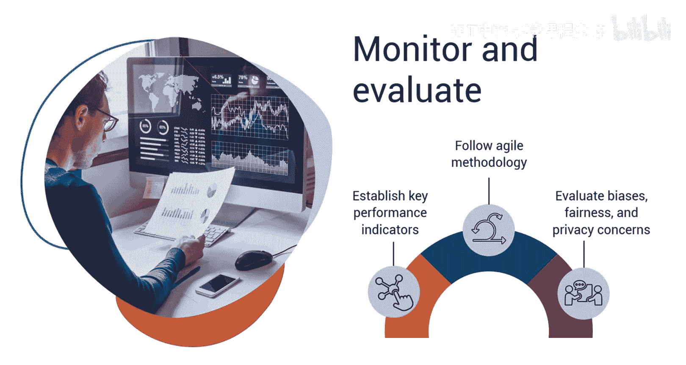

最后，通过系统监控检查AI采用的有效性。
*   建立关键绩效指标（如效率提升和用户满意度）来衡量AI实施的影响。
*   遵循敏捷方法，根据持续监控的结果和反馈，必要时调整实施路线图。
*   定期评估偏见、公平性和隐私问题，以维护AI使用中的道德标准。

---

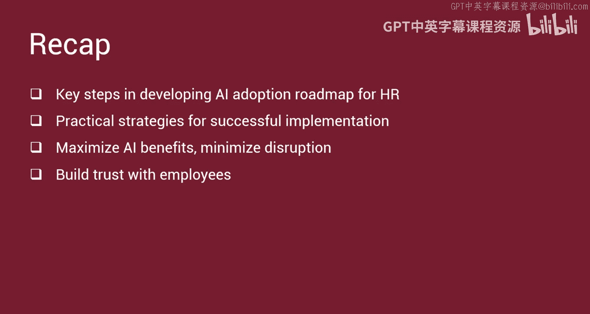

本节课中，我们一起学习了为人力资源部门制定AI采用路线图的关键步骤，概述了成功实施的实用策略和注意事项。总的来说，人力资源领域的AI采用路线图为AI的成功整合铺平了道路，在最大限度地发挥其益处的同时，最大限度地减少干扰，并与员工建立信任。