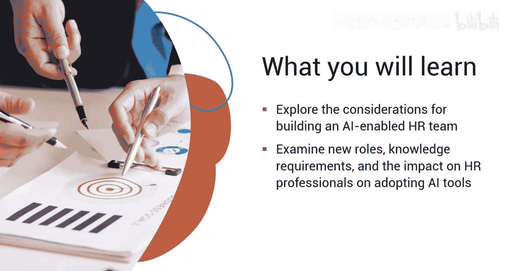
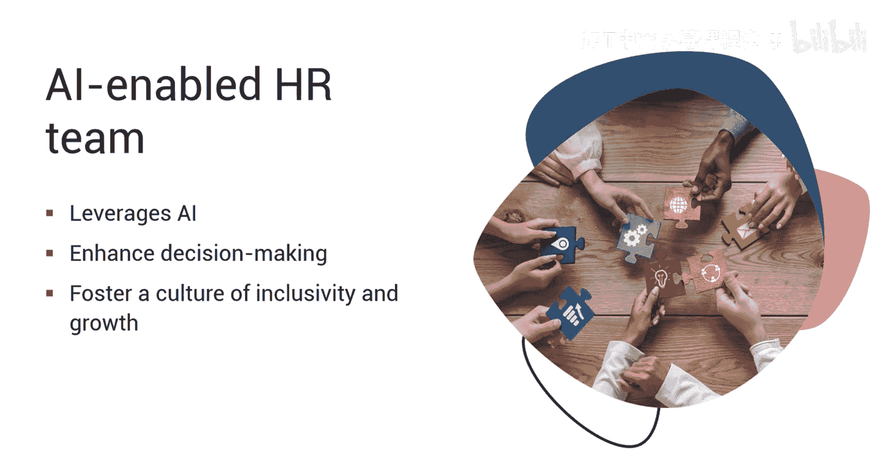
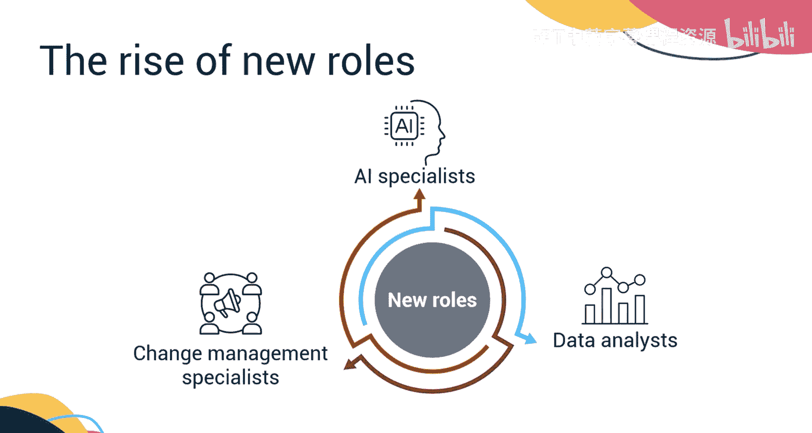
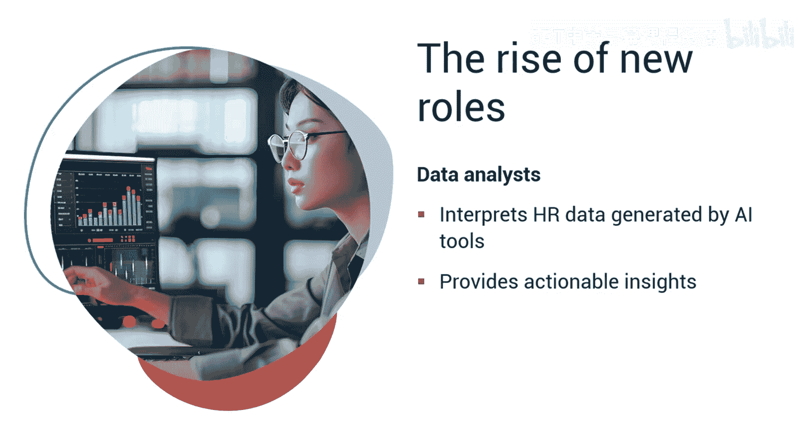
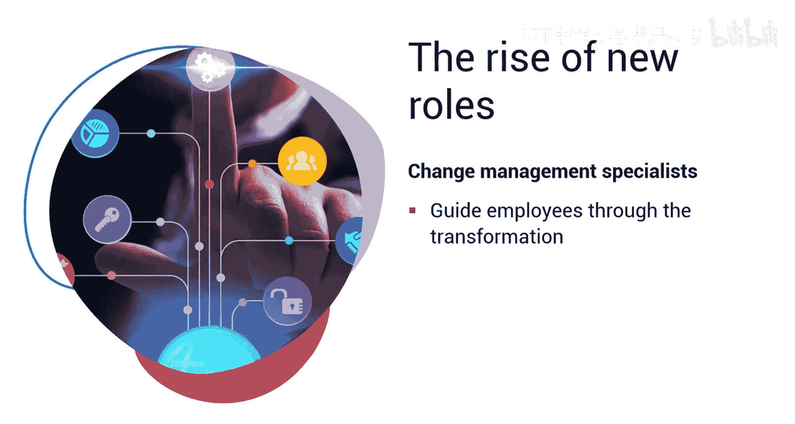
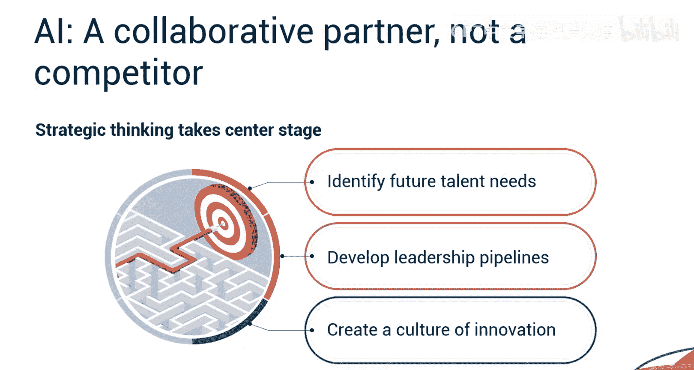
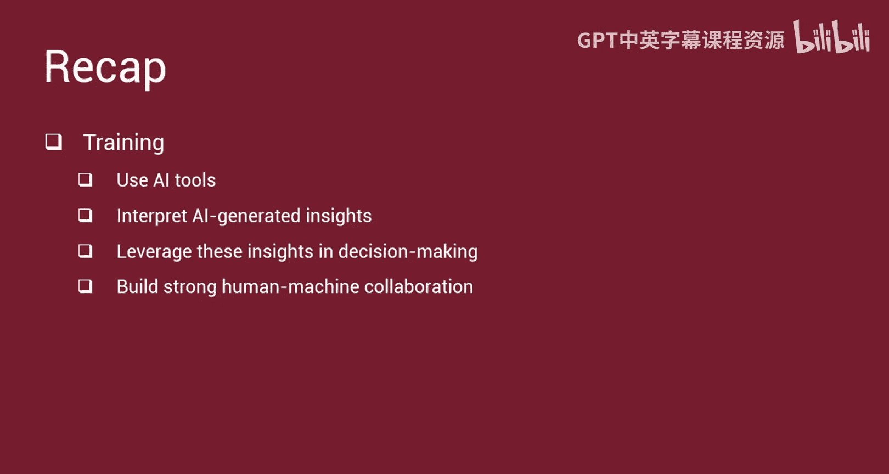

# 046：建设AI赋能的人力资源团队 🏗️🤖

在本节课中，我们将学习如何构建一支由人工智能赋能的人力资源团队。我们将探讨构建过程中的关键考量、新的角色与知识要求，以及AI工具对人力资源专业人员的影响。

---

## 概述

传统的人力资源团队依赖于手动流程和主观评估。人工智能正在简化任务，并为人力资源职能带来客观性。根据Gartner最近的一项调查，38%的人力资源领导者正在试点、计划实施或已经部署了生成式AI。虽然某些角色会减少，但AI也为人力资源团队内部创造了新的专业机会。

上一节我们介绍了AI在人力资源中的潜力，本节中我们来看看如何具体建设一支AI赋能的团队。

---

## 构建AI赋能团队的策略

建立一个由AI赋能的人力资源团队需要一个深思熟虑的策略。这不仅仅是实施AI工具，更要在人力资源部门内培育创新、团队合作和持续学习的文化。该策略涉及采用技术、发展技能、管理变革以及考虑伦理影响。

以下是构建过程中的核心考量：

*   **采用技术**：选择与人力资源流程和战略目标相匹配的AI工具。
*   **发展技能**：为团队提供必要的培训，以理解和使用AI技术。
*   **管理变革**：引导员工适应新的工作方式，确保平稳过渡。
*   **考虑伦理影响**：确保AI工具的使用符合道德标准，保持透明和公平。

---

## 人力资源团队的新兴角色

随着AI的引入，人力资源团队内部将涌现出新的专业角色。虽然一些传统角色可能发生变化，但AI创造了新的专业领域。

以下是三个关键的新兴角色：

*   **AI专家**：负责在人力资源部门内选择、实施和管理AI工具。他们需要对人力资源实践和AI能力都有扎实的理解。
*   **数据分析师**：随着人力资源团队越来越依赖数据做出明智决策，数据分析师对于解读AI工具生成的人力资源数据并提供可操作的见解至关重要。
*   **变革管理专家**：实施AI需要一个平稳的过渡。变革管理专家将引导员工完成转型，促进理解并最大化收益。

---

## 人力资源专业人员的新知识要求

在AI驱动的人力资源团队中取得成功，获取新的知识和技能是关键。让我们探讨人力资源专业人员需要掌握哪些内容。

以下是需要拥抱的几个核心领域：

1.  **理解AI基础**：人力资源专业人员必须对机器学习（`Machine Learning`）和自然语言处理（`Natural Language Processing`）等AI概念有基本的掌握。这些知识有助于评估AI工具并就其实施做出明智决策。
2.  **掌握数据分析**：数据分析正成为人力资源决策的核心。学习解读数据并将其转化为可操作的见解，对人力资源专业人员至关重要。
3.  **秉持以人为本的设计**：人力资源专业人员应专注于与员工建立牢固的关系，并确保AI工具的使用符合道德且透明。

---

## 技能提升与培训

建设AI赋能人力资源团队的一个非常关键的要求是技能提升和培训。

以下是培训工作的两个重点方向：

*   **培训人力资源团队**：对人力资源团队进行使用AI工具和解读AI生成见解的培训至关重要。这包括使他们能够利用这些见解进行决策，并建立强大的人机协作。为此，需要识别AI驱动的人力资源团队所需的具体技能，并创建培训计划来弥补任何差距。
*   **教育全体员工**：向员工介绍AI在人力资源中的应用方式也很重要。这有助于解决潜在的担忧，促进透明度，并建立对AI驱动流程的信任。

---

## AI会取代人力资源专业人员吗？

很多时候，团队成员可能会担心自己的职位被AI取代。然而，一个更准确的观点是将AI视为一个可以增强人力资源专业人员能力的强大工具。

以下是AI不会取代人力资源专业人员的原因：

*   **人的接触无可替代**：AI擅长自动化和数据分析，但它缺乏理解员工情绪、建立信任和培养积极工作环境的人类能力。熟练的人力资源专业人员将继续在员工敬业度、绩效管理和冲突解决中发挥关键作用。
*   **转向战略思维**：随着AI处理常规任务，人力资源专业人员可以将更多时间投入到战略思考上，例如识别未来人才需求、发展领导力管道以及创建创新文化。

---

## 总结

本节课中，我们一起学习了构建AI赋能人力资源团队的考量。我们探讨了将AI集成到人力资源流程中可以简化任务并实现客观评估，同时为AI专家、数据分析师或变革管理专家创造了新的工作机会。我们还了解到，建设AI驱动的团队需要对人力资源人员进行培训，教会他们如何使用AI工具、解读AI生成的见解、在决策中利用这些见解并建立强大的人机协作。此外，我们还深入了解到，将AI集成到人力资源中并不是要取代人类的专业知识，而是要创建一个更强大、更高效的人力资源生态系统。