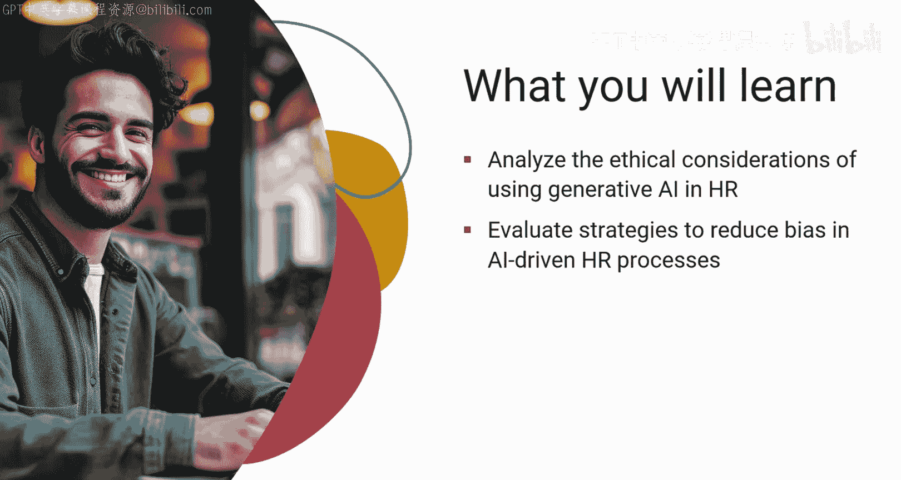
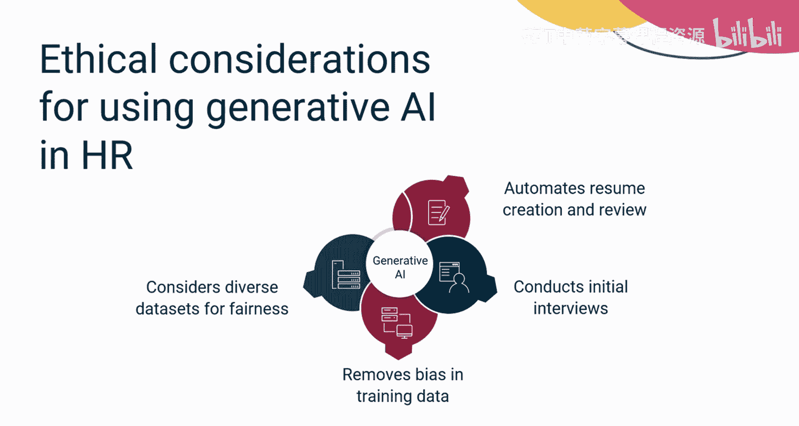
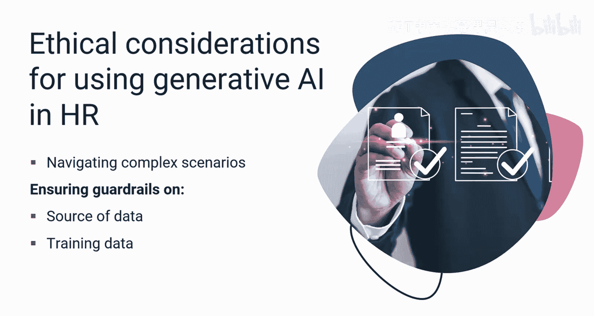
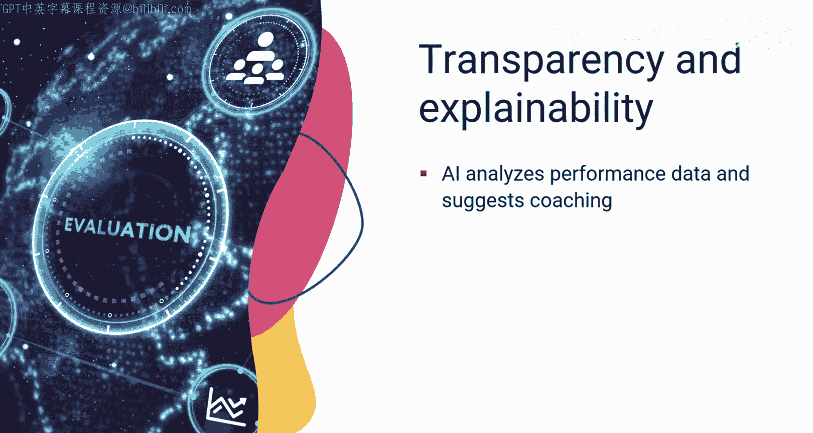
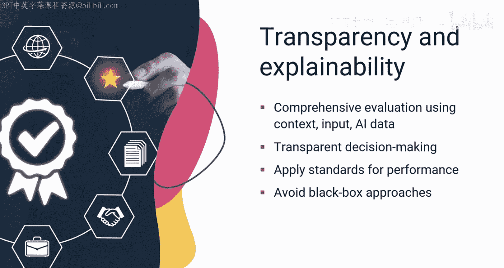
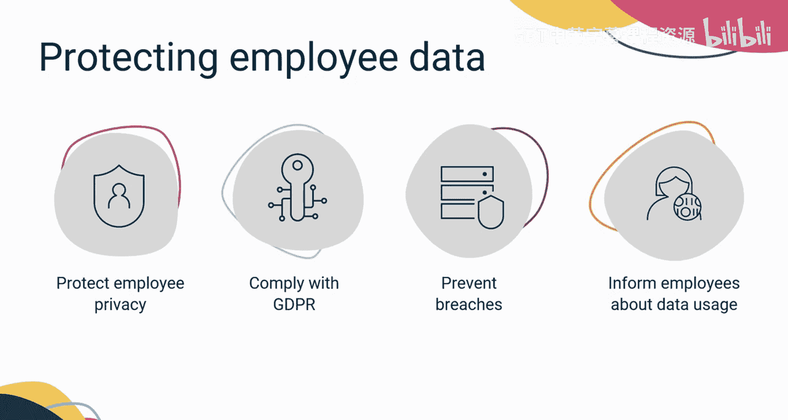
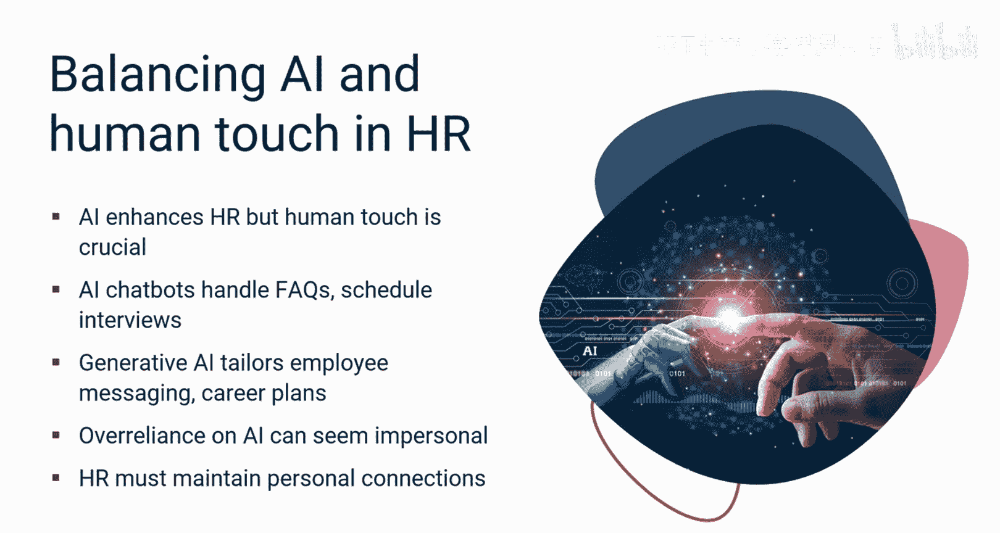
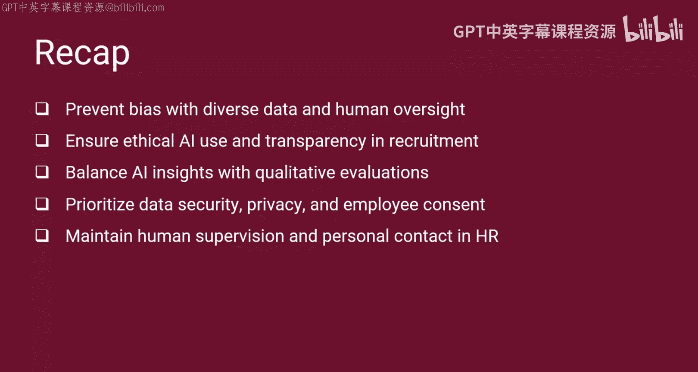

# 047：人力资源中应用生成式AI的伦理考量 🧭

在本节课中，我们将学习在人力资源领域应用生成式人工智能时需要考虑的关键伦理问题。我们将探讨如何减少偏见、确保透明度、保护数据隐私，并找到人工智能与人类协作的平衡点。

---

## 课程目标 🎯

观看本节课程后，你将能够：
*   分析在人力资源中使用生成式人工智能可能引发的伦理考量。
*   评估有助于减少人工智能驱动的人力资源流程中偏见的策略。
*   在人工智能模型中应用数据隐私和安全原则。
*   制定一种平衡的方法，将人工智能与人类整合到人力资源系统中。

---

## 引言：人力资源中的AI挑战

想象一下，在快节奏的人力资源世界中忙碌一天。你的收件箱里充斥着大量可能优秀的简历和人工智能生成的推荐。但如何确保这些推荐是公平和准确的呢？

生成式人工智能可以自动化许多任务，例如根据职位描述定制简历、根据所需特定技能筛选简历。人工智能助手可以进行初步面试，让人力资源主管能专注于更具战略性的职责。

然而，训练数据中的偏见可能导致歧视性筛选，例如偏爱包含特定关键词、性别或种族的简历。人力资源部门必须确保数据集的多样性，并在最终选拔过程中加入人工智能辅助决策，以减轻这种影响。

人力资源伦理与人工智能是一个不断发展的领域，包含许多复杂场景，从无偏见招聘到公平的绩效评估，再到负责任地使用员工数据。

---

## 核心伦理考量

上一节我们介绍了人力资源中应用AI的普遍挑战，本节中我们来看看几个具体的核心伦理考量。

### 偏见与公平性 ⚖️

有效的数据来源和用于训练模型的数据护栏，对于建立用于人力资源实践的生成式人工智能模型的可信度至关重要。

以下是减少偏见的关键策略：
*   **使用多样化数据集**：确保训练数据代表广泛的人群，避免历史偏见被固化。
*   **人类监督**：在最终决策环节保留人类判断，对AI的推荐进行审核。
*   **定期审计**：持续监控AI系统的输出，检查是否存在歧视性模式。

### 透明度与可解释性 🔍

现在，让我们考虑透明度和可解释性方面。生成式人工智能可以为不同的用例分析海量数据，包括识别绩效趋势、建议个性化的辅导或培训计划。

这种数据驱动的方法可以提供有价值的见解。然而，仅仅依赖人工智能指标可能会忽略绩效的定性方面。

那么，正确的思路是什么？人力资源部门必须确保评估是全面的，并考虑背景、员工意见和人工智能生成的数据。考虑使用能够解释其决策过程的生成式人工智能模型。

人力资源部门还应保持透明，并清楚传达人工智能系统如何在人力资源流程中发挥作用。他们应该能够向候选人和团队成员解释人工智能模型是如何做出各种决策的，例如简历是如何筛选的，或晋升决定是如何做出的。

“黑箱”方法——即人工智能系统的内部运作不透明或难以理解——可能会引发问题，并助长人力资源员工与员工之间的不信任。

### 数据隐私与安全 🔒

接下来，想象一下生成式人工智能系统所需的大量员工数据（包括个人数据）面临风险。你如何保护这些数据？

人力资源部门负责管理这些数据，以保护员工隐私并遵守《通用数据保护条例》（GDPR）等隐私规则。人力资源部门还必须确保采取强有力的数据安全程序，以防止任何数据泄露。

此外，员工也有权知道他们的信息是如何被使用的，因此，获得他们的同意并实施清晰的数据隐私实践至关重要。

---

## 人机协作的平衡 🤝

在探索人工智能辅助带来的机遇时，请记住，人类仍然是人力资源世界的核心和灵魂。虽然人工智能可以自动化工作，但人类的监督和规划是基础。那么，两者如何有效协作呢？

人工智能驱动的聊天机器人可以回答常见问题并安排面试。生成式人工智能还可以定制员工沟通信息、收集合适的学习材料并创建个性化的职业发展计划。

然而，过度依赖人工智能沟通可能会显得缺乏人情味，并造成疏离感。人力资源部门必须在整个过程中保持人际接触，特别是在面试确认或拒绝等关键阶段。

人力资源部门还应保持与员工的定期互动和反馈会议，开放沟通渠道，并为员工提供直接表达问题的机会。

此外，人力资源专业人员必须监控人工智能系统，在需要时进行干预，并对其结果承担责任。人工智能可以补充人力资源流程，但不能完全取代人力资源任务。

---

## 总结 📝

本节课中我们一起学习了在人力资源中应用生成式人工智能的伦理框架。

让我们回顾一下。在本视频中，你了解到：
*   训练数据中的偏见可能导致人工智能推荐中的歧视性筛选，因此在最终选拔过程中使用多样化数据集和人类监督是必要的。
*   人力资源伦理与人工智能领域涉及确保公平招聘、绩效评估和负责任的数据使用，这可以通过有效的数据源护栏和人工智能决策的透明度来实现。
*   平衡人工智能的数据驱动见解与定性绩效评估的重要性，以及人力资源部门需要清晰传达人工智能系统的使用方式以建立信任。
*   采取强有力的数据安全措施、遵守隐私法规以保护员工数据的必要性，以及获得员工同意和维护清晰数据隐私实践的重要性。
*   虽然人工智能可以增强人力资源流程，但人类的监督、人际接触和定期互动对于维持平衡有效的人力资源环境至关重要。