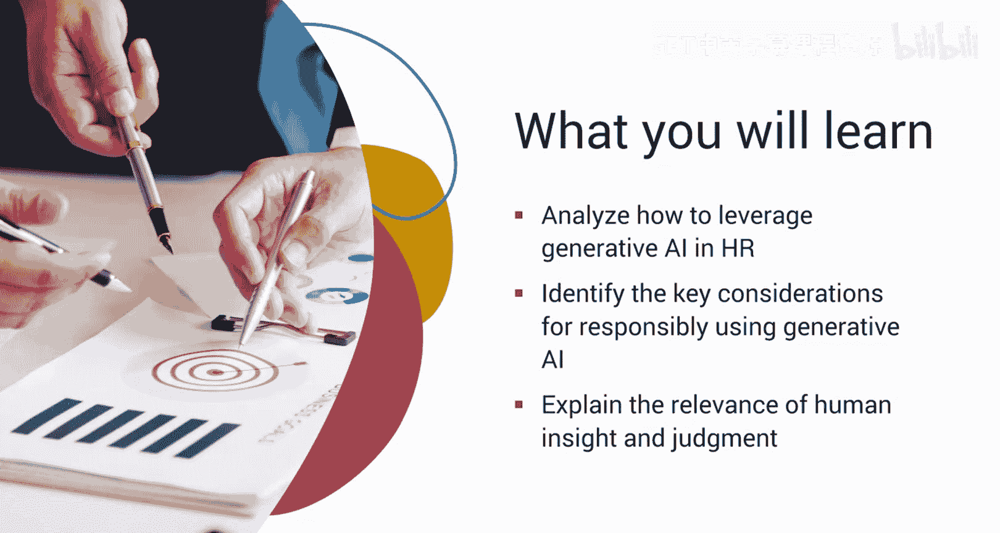
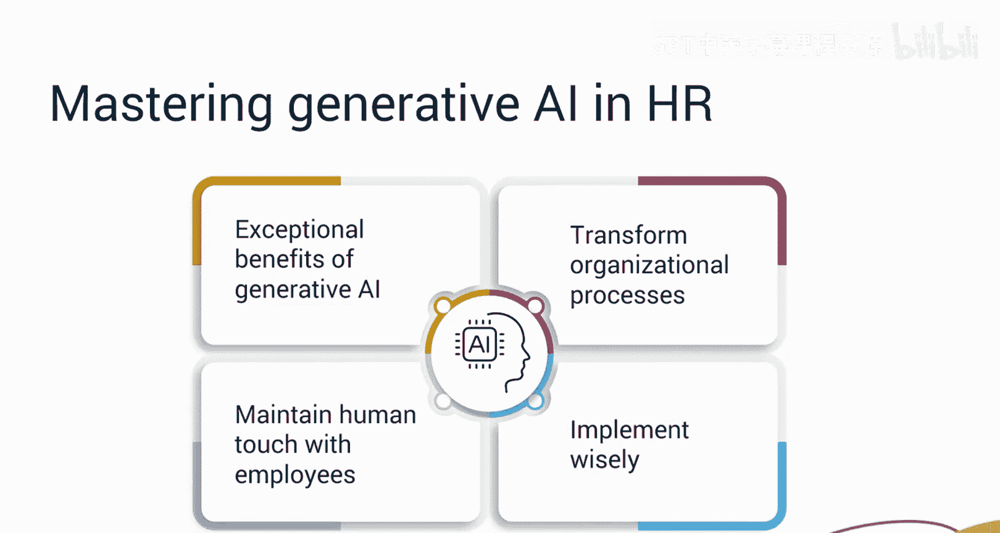
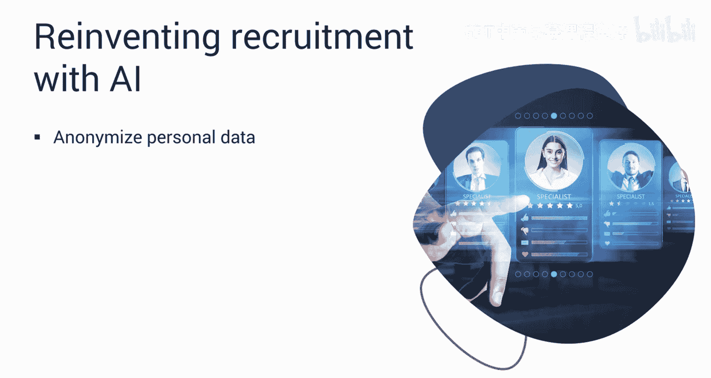
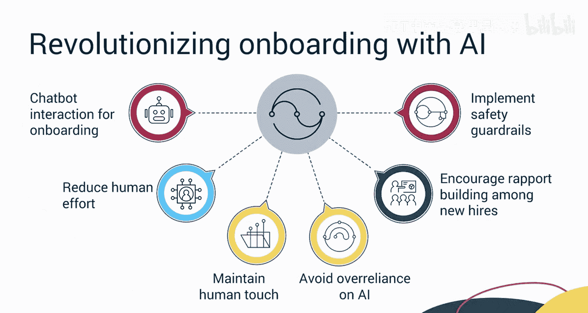
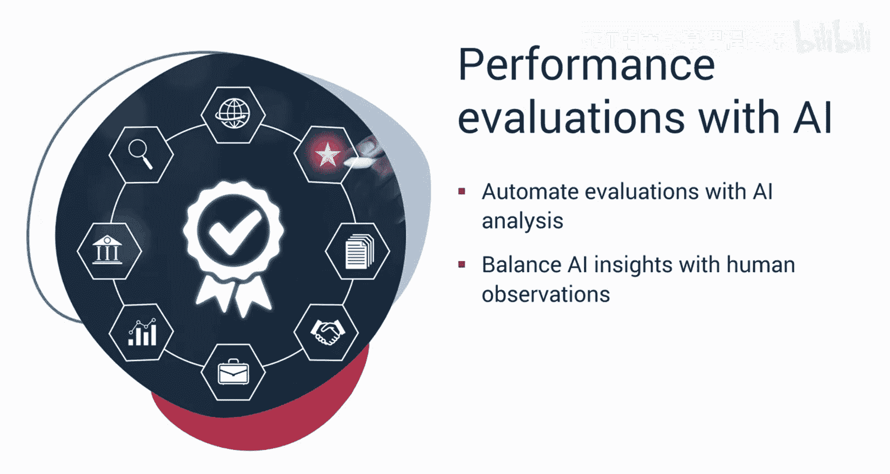
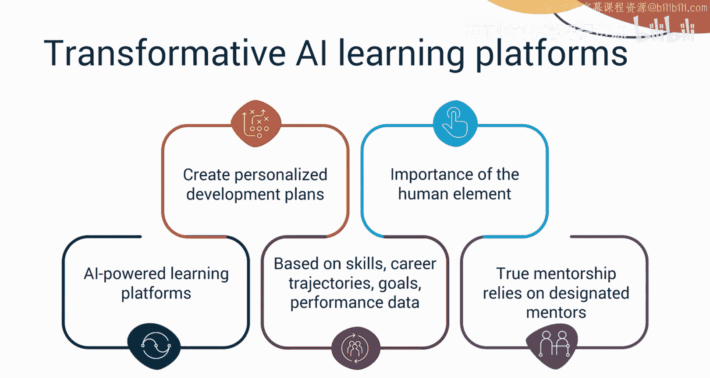
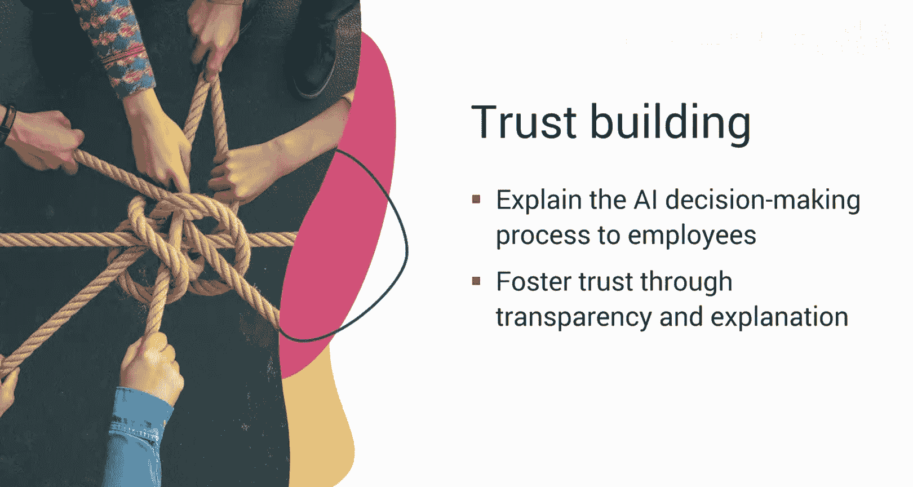
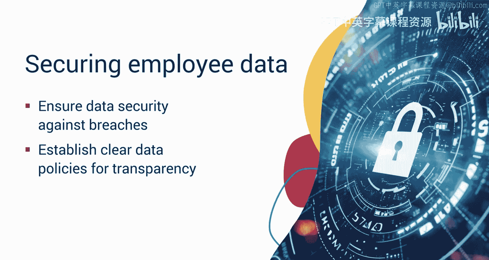
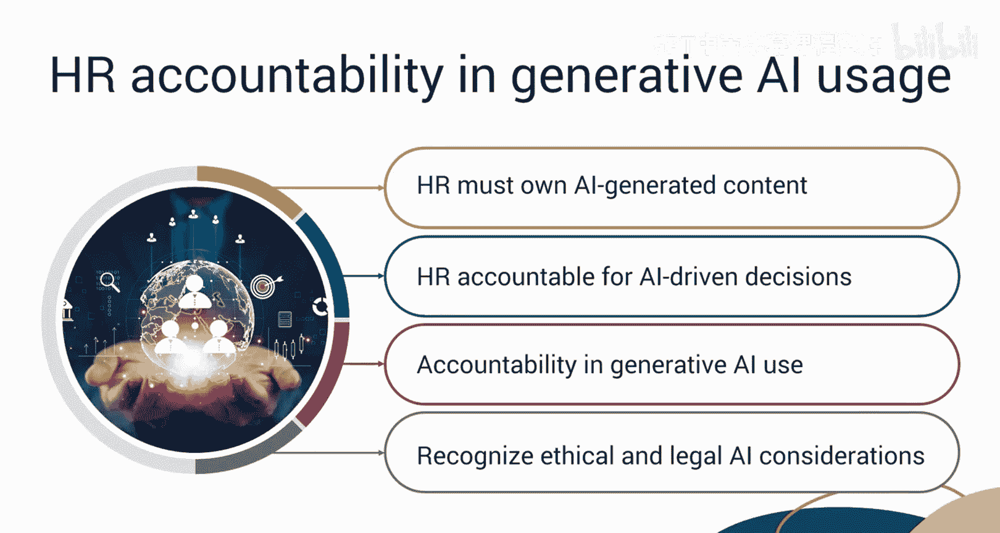
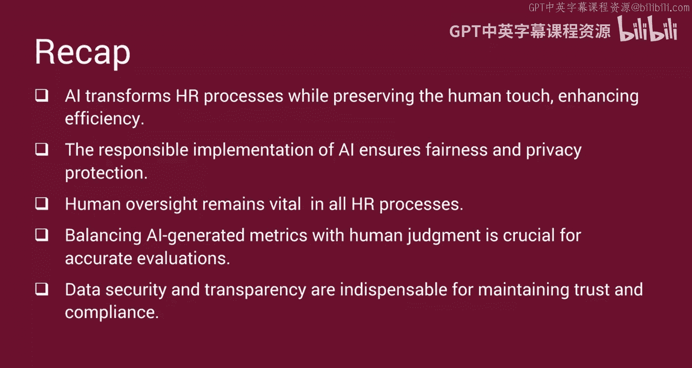

# 048：生成式AI在人力资源中的负责任使用 🧑‍💼

在本节课中，我们将学习如何在人力资源领域负责任地使用生成式AI。我们将分析其应用方式，探讨关键考量因素，并理解人类洞察与判断在AI驱动的人力资源流程中不可或缺的作用。

---

生成式AI能带来卓越且无与伦比的优势，足以改变任何组织。但其应用必须明智，以确保不会消除与员工之间的人际互动。

## 工作描述撰写 ✍️

上一节我们提到了生成式AI的潜力，本节中我们来看看它在具体场景中的应用。假设你是一名人力资源专业人士，希望撰写一份能吸引多元化人才库的工作描述。

以下是利用AI实现此目标的方法：
*   **AI功能**：生成式AI可以被训练来识别关键词，并根据过去成功招聘案例，撰写能引起理想候选人共鸣的描述。
*   **人类监督**：为确保公平并消除偏见，训练数据需要由人工进行审核和审查。
*   **必要实践**：人力资源部门向未入选的候选人提供反馈始终是最佳实践。
*   **隐私保护**：必须尽可能对个人数据进行匿名化处理，以保护员工隐私。

## 简历筛选与入职流程 📄

在了解了工作描述撰写后，我们进一步探讨招聘流程中的筛选环节。

生成式AI可以根据预设标准筛选简历并选择最佳候选人。这使得人力资源专业人士能将精力重新投入到与顶尖候选人的深度面试中。

然而，筛选候选人不能仅仅依赖关键词匹配。作为人力资源专业人士，还应建立流程来审查相关经验和才能的实际应用。

接下来，让我们更进一步，看看入职流程。

与聊天机器人互动可以显著减少入职所需的人力投入。但不应完全失去人际接触。过度依赖AI可能会阻碍新员工与同事建立融洽关系。

在入职过程中使用AI时，实施安全防护措施（如访问控制）以确保安全使用至关重要。

## 绩效分析与学习发展 📊

在招聘和入职之后，生成式AI在员工发展方面也大有可为。

生成式AI可以分析绩效数据，并提供改进建议以及个性化的培训计划。基于指标评估的分析确实能帮助管理者提供有针对性的反馈。

但统计数据是绩效评估的唯一依据吗？显然不是。

人力资源部门的责任在于平衡AI生成的绩效分析与管理者的观察以及员工的自我评估。他们应考虑创建论坛，让员工可以进行评估讨论，而主管的绩效分析有时可能是基于情感的。

让我们谈谈AI驱动的学习平台。它们是游戏规则的改变者，能够根据个人技能、职业轨迹、目标和绩效数据创建个性化发展计划。

然而，在这个领域，人的因素同样至关重要。真正的导师指导感通常依赖于有一位指定的导师，你可以向其寻求指导和帮助。

## 建立信任与数据安全 🔒

但如果员工不相信你做出了正确的决定呢？这就是建立信任至关重要的原因。

人力资源人员必须向员工解释生成式AI是如何被训练来执行某些决策过程的。透明度往往能在组织内培养信任感和接受度。

最后，让我们转向数据安全。人力资源部门必须确保AI所使用的员工数据免遭任何数据泄露。

应制定清晰的数据政策，概述数据如何被收集、使用和存储。员工有权询问他们的数据是否被负责任地存储。

无论生成式AI扮演什么角色，人力资源专业人士都必须对使用生成输出所生成的内容和做出的决策负责并承担问责。生成式AI中的问责制要求人力资源专业人士认识到他们的所有权，并考虑围绕其使用的伦理和法律问题。

---

本节课中，我们一起学习了生成式AI在人力资源领域的变革潜力，并强调了在技术进步的同时保持人际接触的重要性。

我们学习了AI如何在确保公平和隐私的同时，革新工作描述撰写、简历筛选和入职流程。我们还深入了解了在筛选候选人和促进入职融洽关系时进行人工监督的必要性。

此外，我们认识到平衡AI驱动的绩效分析与人类判断的重要性，以及对伦理和法律后果承担责任的意义。最后，我们探讨了数据安全这一关键方面，强调了在处理员工数据和AI应用时，清晰的政策和透明度的重要性。