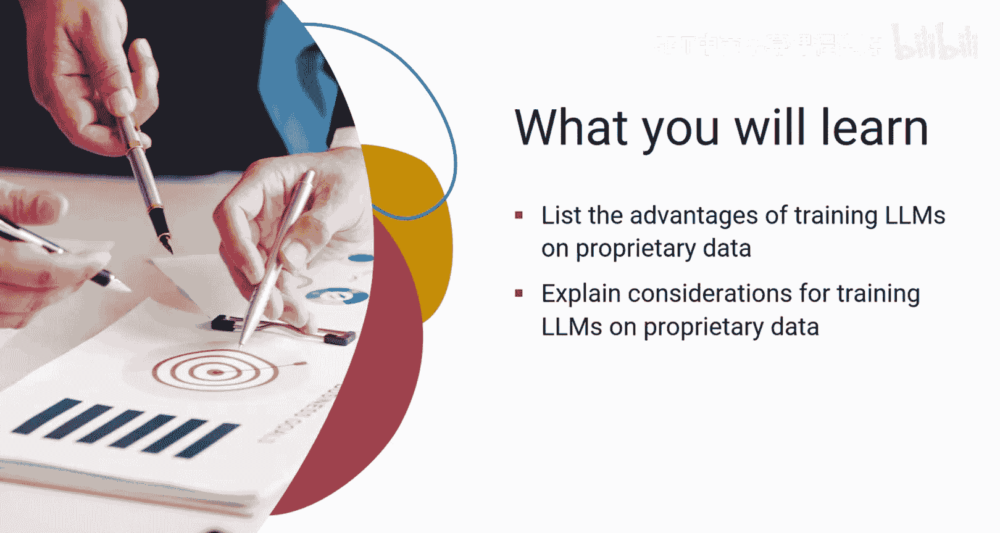
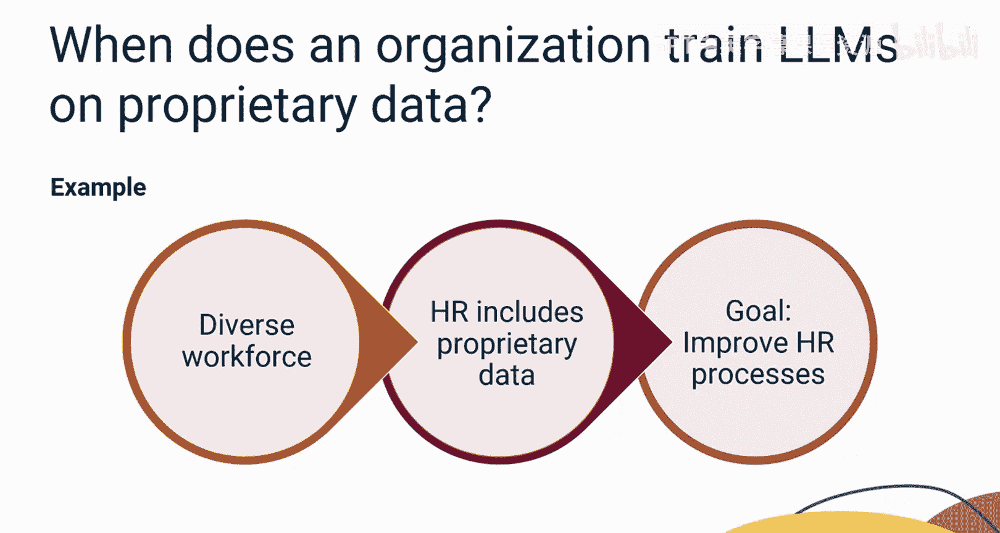
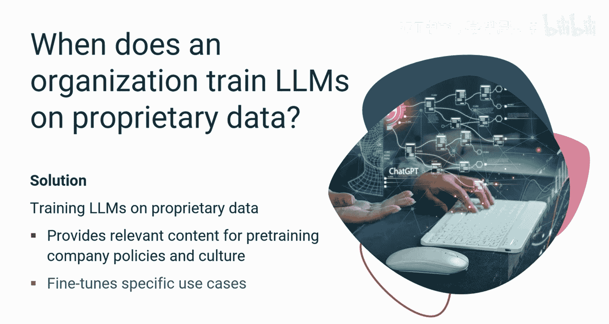
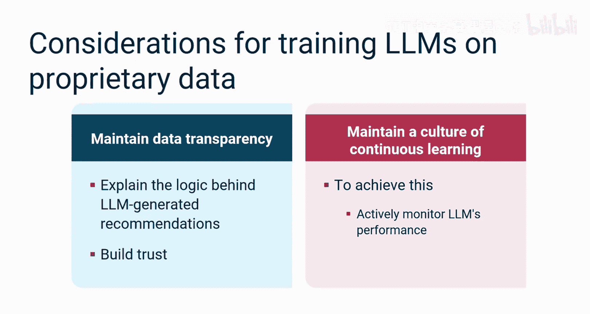
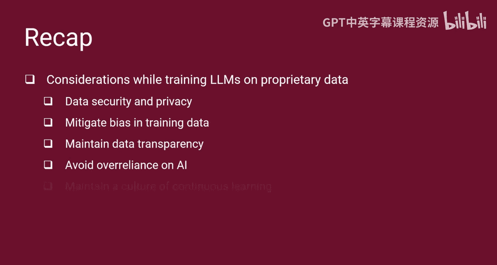

# 049：为组织定制的生成式AI模型 🏢🤖

在本节课中，我们将学习如何为您的组织构建定制的生成式AI模型。我们将探讨利用专有数据训练大型语言模型（LLM）的过程、其带来的好处，以及在实施过程中需要考虑的关键因素。

---

## 概述

大型语言模型（LLM）是强大的AI工具，但通用模型可能无法完全理解您组织的独特需求和文化。通过使用您自己的专有数据（如内部文档、绩效评估和沟通记录）来训练LLM，可以显著提升其在特定领域的知识水平和应用价值。本节将详细介绍构建LLM训练流程的步骤，并分析其优势与注意事项。

---

## 构建LLM训练流程

上一节我们介绍了定制化LLM的概念，本节中我们来看看如何具体构建一个LLM训练流程。这个过程是一个系统化的管道，旨在将原始专有数据转化为一个功能强大、贴合业务需求的AI模型。

以下是构建LLM训练管道的五个核心步骤：

1.  **数据收集与整理**：LLM从各种内部资源（如内部文档、电子邮件、聊天记录、绩效评估和公司政策）中收集相关的专有文本数据。在整理数据时，需要移除个人信息以保护敏感信息。使用匿名化数据有助于确保符合隐私法规。
2.  **数据预处理**：接下来，对数据进行预处理，清除噪声、特殊字符和无关内容，确保数据质量。
3.  **模型选择**：数据分析师选择一个新的模型或一个预训练的LLM模型作为基础。
4.  **模型微调**：然后，使用专有数据对选定的模型进行微调，使其适应组织的特定语境和需求。
5.  **评估与迭代**：最后，数据分析师评估和审查LLM模型及其能力，确保人力资源（HR）专业人员能够顺畅使用。这个过程通常需要多次迭代以优化模型。

---

## 检索增强生成（RAG）技术

在模型训练和应用的范畴内，检索增强生成（RAG）是一项非常有用的技术。它能够使LLM从组织特定的数据库中获取相关数据。

RAG具备微调数据模型的能力，可用于在特定数据上训练LLM。它的优势在于能为LLM提供最新信息，同时避免可能阻碍微调过程的偏见。然而，RAG需要良好的外部知识源访问权限才能高效运行。

---

## 使用专有数据训练LLM的好处

了解了构建流程后，我们来看看这样做能为组织带来哪些具体好处。使用专有数据训练LLM能带来多方面的显著优势。

以下是主要的五个益处：

*   **增强领域特定知识**：使LLM能够深入理解组织独特的文化、术语和流程。
*   **通过定制化训练对抗偏见**：组织可以整理反映其多元化员工队伍的数据集，从而帮助识别和减轻LLM中潜在的偏见，促进组织内的公平性和包容性。
*   **个性化员工体验**：例如，可以定制入职流程，分析内部沟通渠道以识别员工关切，并建议个性化的培训计划。
*   **从内部数据中发掘隐藏洞察**：HR部门通常拥有来自绩效评估、内部调查和员工反馈的宝贵数据。训练LLM分析这些数据可以提取有用的见解和隐藏模式，例如识别技能差距并推荐相应的学习材料。
*   **简化重复性任务**：LLM可以帮助HR简化诸如简历筛选、进行筛选面试和生成个性化职位描述等重复性任务。这使HR能够专注于人才管理和员工关系等其他战略性工作。

---

## 实施过程中的关键考虑因素

到目前为止，您已经了解了使用专有数据训练LLM的好处。然而，为了确保成功实施，必须解决几个关键的考虑因素。

以下是四个必须关注的核心考虑点：

*   **数据安全与隐私**：在实施LLM和处理训练数据时，组织应采取强有力的措施，例如构建数据匿名化技术并严格遵守数据隐私法规。
*   **减轻训练数据中的偏见**：即使使用看似无偏见的数据集，微妙的偏见也可能存在。因此，HR必须进行彻底的数据审计，以识别并最小化训练数据中的这些偏见。
*   **保持透明度**：HR专业人员应合理解释数据，并对LLM生成的建议保持透明度，以建立信任。
*   **保持持续学习的文化**：组织应保持持续学习的文化，以跟上LLM培训及其应用的最新发展。为此，他们可以与AI专家合作，参加LLM培训相关的会议，并积极监控LLM的性能。

---

## 总结

本节课中我们一起学习了LLM如何帮助HR专业人员做出数据驱动的决策。

要构建一个LLM训练管道，数据分析师需要整理和预处理数据，选择和微调模型，然后评估并完善它。检索增强生成（RAG）是一项能使LLM从组织特定数据库中获取相关数据的技术。

使用专有数据训练LLM有多项好处：它有助于增强领域特定知识、通过定制训练对抗偏见、个性化员工体验、从内部数据中发掘隐藏洞察以及简化重复性任务。

然而，在专有数据上实施LLM时，必须遵循有关数据安全、隐私和偏见缓解以及保持数据透明度的某些考虑因素，以充分发挥LLM的潜力。同时，应避免过度依赖AI生成的数据，并保持持续学习的文化。