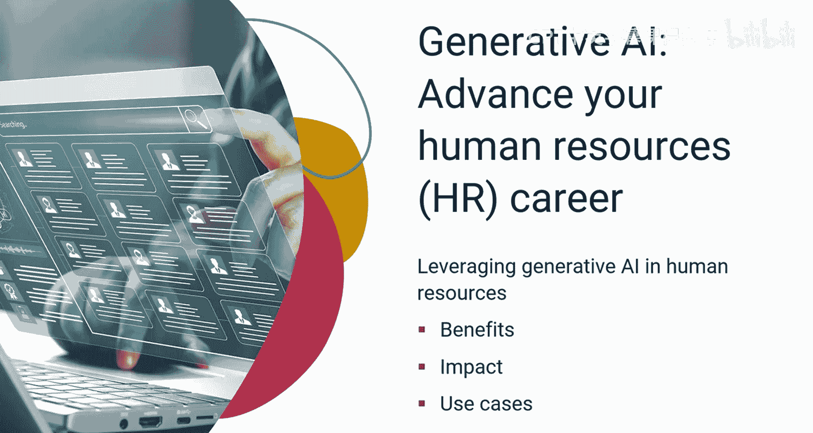
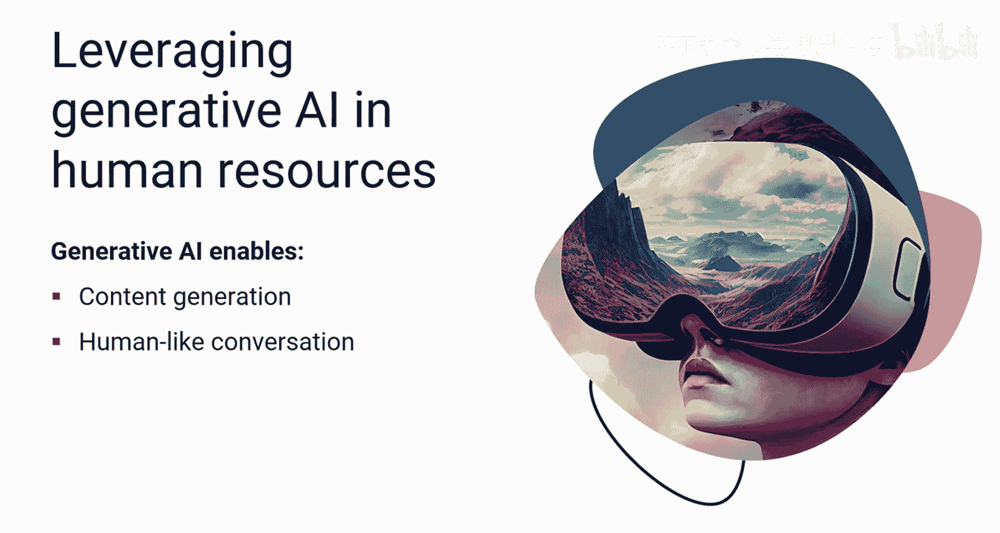
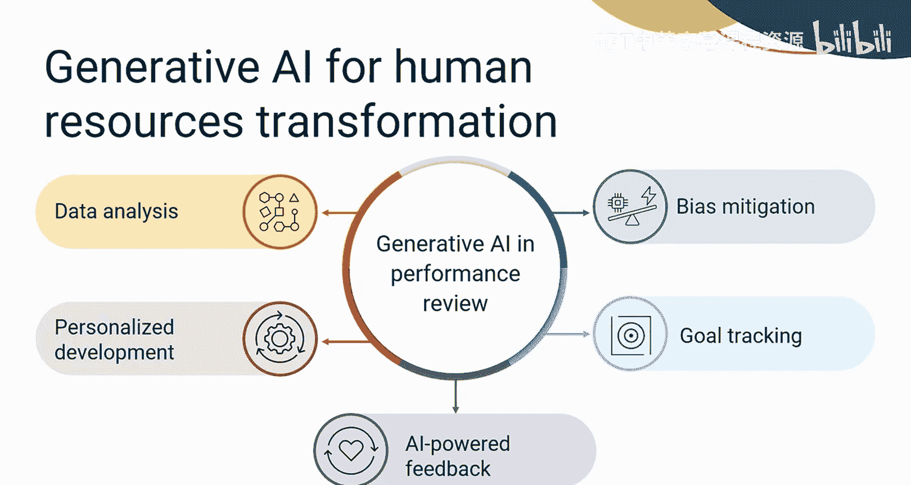
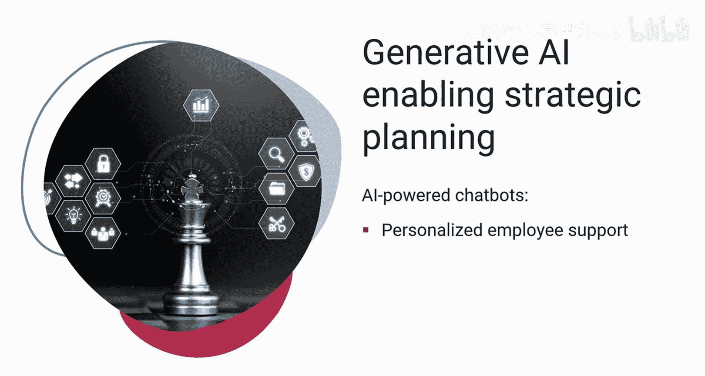
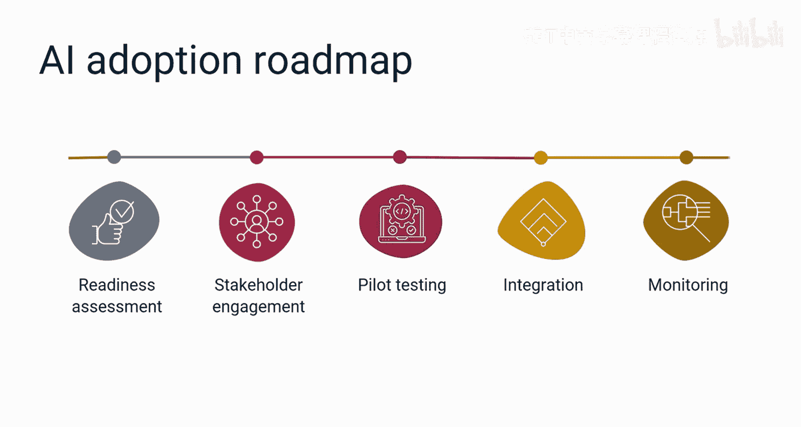
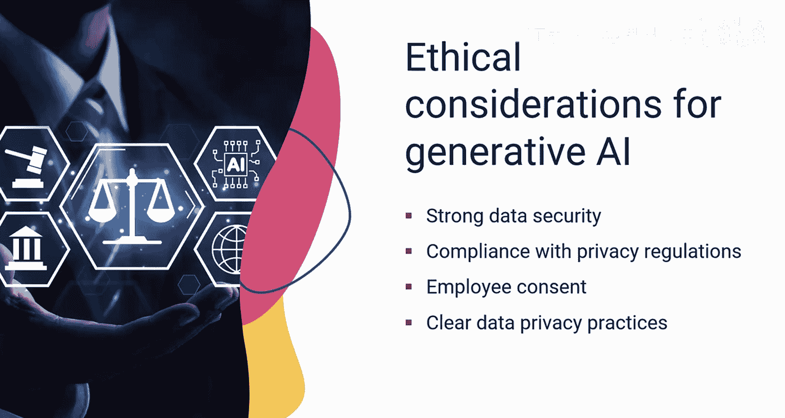
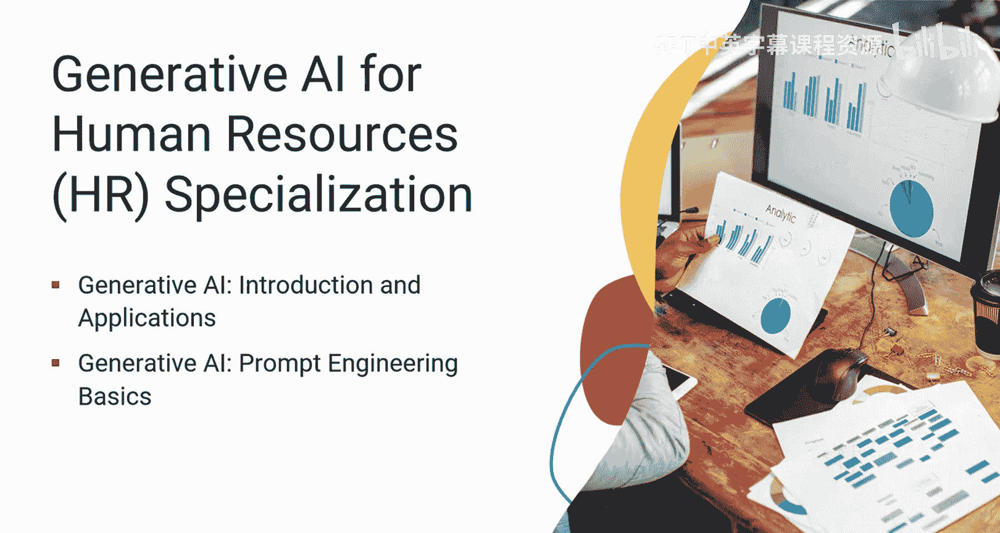

# 050：19_课程总结 🎓

在本节课中，我们将回顾并总结整个课程的核心内容，梳理生成式AI在人力资源领域的关键应用、工具、实施步骤以及伦理考量。

---

恭喜你完成本课程。现在你已经掌握了在人力资源领域使用生成式AI的基础知识，可以运用这些技能来推动你的职业发展。

让我们花点时间回顾一下这段学习旅程。你获得了关于在人力资源中利用生成式AI的优势、影响和用例的重要知识。

## 生成式AI在人力资源中的核心价值 💡

上一节我们介绍了课程的整体目标，本节中我们来看看生成式AI能为人力资源工作带来的具体价值。

生成式AI可以帮助你简化各种人力资源职能，自动化重复性任务，并做出数据驱动的明智决策，以确保在招聘、晋升和绩效管理方面实现公平的结果。

生成式AI支持一系列能力，包括：
*   **内容生成**
*   **类人对话**
*   **情感分析**
*   **预测分析**

## 关键工具与应用场景 🛠️

了解了核心价值后，我们来看看有哪些具体工具可以实现这些功能，以及它们应用的场景。

以下是本课程中介绍的一些关键工具：
*   **通用AI工具**：如 `ChatGPT`、`Copilot`、`Gemini`、`DALL-E`，可用于内容创作与对话。
*   **企业级平台**：如 `IBM Watsonx Orchestrate`，用于自动化工作流和轻松集成。
*   **专用AI代理**：如 `Scout`、`Willow`、`Sage` 和 `Retain`，分别处理招聘、入职、绩效分析和员工保留。
*   **数字员工**：能够自主管理端到端的工作流程。

在招聘与入职方面，生成式AI有助于撰写精确的职位描述、筛选候选人、进行面试并提供个性化反馈，从而简化招聘和入职流程。

在培训与发展方面，你可以利用生成式AI创建个性化和互动式的培训内容，这些内容根据个人需求和偏好量身定制，从而促进参与度提升和知识留存。

在绩效评估中实施生成式AI能带来诸多好处，例如数据分析、个性化发展计划、AI驱动的反馈、目标跟踪和偏见缓解。

## 战略规划与员工支持 📊

除了具体的职能应用，生成式AI在战略规划和日常员工支持方面也扮演着重要角色。

生成式AI辅助数据分析、劳动力规划、技能预测和资源分配。它还能驱动聊天机器人，提供个性化的员工支持、实时奖励和互动参与。

## 实施路线图与人员培训 🗺️

要将这些潜力转化为现实，需要一个周密的实施计划。

在组织中采用AI需要制定一个路线图，涵盖准备度评估、利益相关者参与、试点测试、集成与监控。

对人力资源员工进行AI工具和洞察方面的培训，能促进有效的人机协作。

## 伦理、合规与数据安全 ⚖️

在享受技术红利的同时，我们必须关注其带来的责任。

引入生成式AI需要强大的数据安全措施、遵守隐私法规、获得员工同意以及明确的数据隐私实践。

平衡AI驱动的绩效分析与人类判断及问责制，对于确保符合伦理和法律后果至关重要。

## 课程资源与后续学习建议 📚

现在，你已经回顾了本课程提出的一些基本概念，请记住使用课程术语表和关于常见人力资源用例的生成式AI工具提示速查表。你可以利用这些资料快速查阅所学的大部分内容。

你可以通过最终项目来展示你在人力资源用例中应用生成式AI的技能。

我们鼓励你注册“人力资源专业人士生成式AI”专业课程，本课程是其一部分。除了本课程，该专业课程还包括以下两门课程：
1.  生成式AI简介与应用
2.  生成式AI提示工程基础

每门课程需要四到六小时完成。

恭喜你完成本课程，感谢你参与这段学习旅程。

作为下一步，我们建议你继续你的学习之旅，并不断应用你的新技能。

在此祝你一切顺利。

---

本节课中，我们一起学习了生成式AI在人力资源领域的全面应用。从提升招聘、培训、绩效管理等具体职能的效率，到辅助战略决策和员工支持，生成式AI正成为人力资源转型的强大驱动力。同时，我们也强调了成功实施所需的技术工具、战略规划、人员培训，以及至关重要的伦理与数据安全考量。希望你能将所学知识付诸实践，在人力资源领域开创更智能、更高效、更公平的未来。