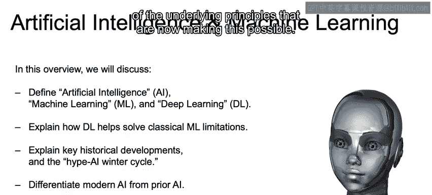
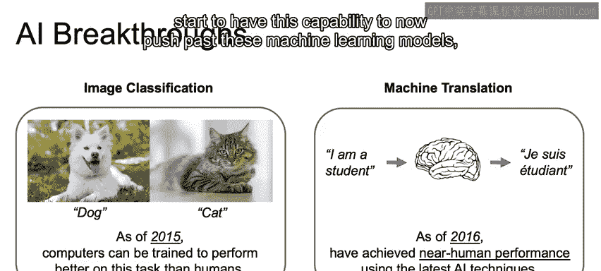
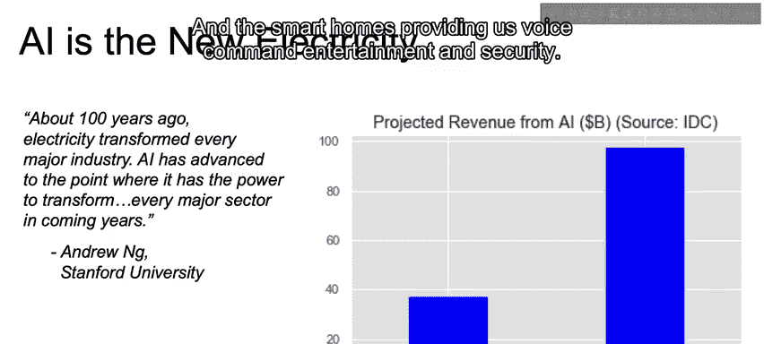
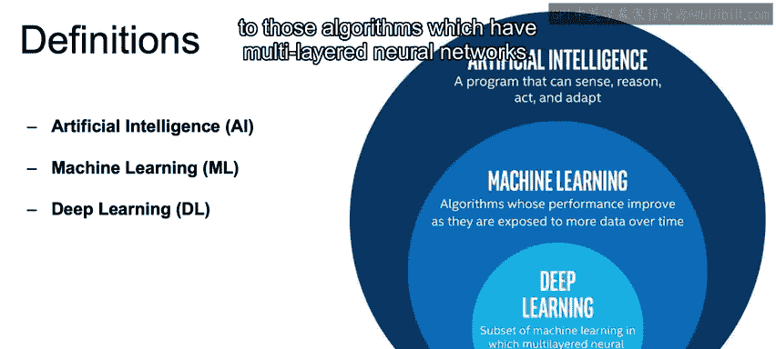
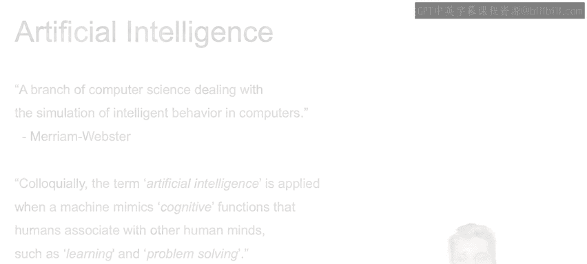

# 002：人工智能与机器学习概述 🧠

在本节课中，我们将学习人工智能、机器学习与深度学习的基本概念，了解它们之间的关系与区别，并回顾人工智能的发展历程及其现实应用。

---

## 人工智能、机器学习与深度学习的关系

上一节我们介绍了本课程的主题。本节中，我们来看看人工智能、机器学习与深度学习三者之间的层次关系。

一个重要的提示是：**深度学习是机器学习的一个子集，而机器学习又是人工智能的一个子集**。我们将解释深度学习如何突破经典机器学习技术的诸多限制，引领我们进入人工智能的新时代。

达到这个时代的过程并非一帆风顺。我们将回顾人工智能领域投资与热情起伏的历史，这段历史最终促成了今天的人工智能热潮。

考虑到这一点，我们将讨论当前人工智能的发展状态与轨迹，与过去的人工智能进步有何不同。

---

## 人工智能的重大突破与应用潜力

为了理解人工智能近期带来的深刻影响，我们将聚焦于两项重大突破：图像处理与机器翻译。

以下是理解图像分类的一个例子：假设我们需要识别哪张图片是狗，哪张是猫。自2015年起，计算机在将此类图像分类到不同类别上的表现已经超越了人类。

对于机器翻译，我们的目标是将一种语言（例如“I am a student”）的短语或句子，翻译成另一种语言（例如法语“Je suis un étudiant”），同时考虑到目标语言的词序、恰当的表达方式等所有复杂细节。目前，机器翻译已能达到接近人类的水平。

这些任务对经典机器学习模型而言曾非常困难。对于图像，难点在于识别有用的特征；对于自然语言处理，翻译并非简单的逐词对应，而需考虑词序、语法结构和不同语言的习惯用法。

如今，深度学习领域的进步，以及数据存储和处理能力的创新，使我们能够突破这些经典机器学习模型的壁垒。

人工智能的影响及其未来潜力是巨大的。这并非夸张。正如吴恩达（Andrew Ng）所言，人工智能将对每个主要行业产生的影响，堪比一百年前电力带来的变革。吴恩达是人工智能领域的领军人物之一，曾任职于斯坦福大学，是Coursera的联合创始人，目前负责deeplearning.ai。

我们可以通过以下主要领域的突破来理解这种影响：

*   **定向广告**：人工智能正在深刻影响广告业的精准营销。
*   **供应链优化**：实体商店通过人工智能优化供应链管理。
*   **自动驾驶**：交通运输领域正在研发自动驾驶汽车。
*   **智能家居**：提供语音控制的娱乐与安防系统。

---

## 核心概念定义

现在，让我们更精确地定义这些核心概念。

正如之前提到的，**深度学习是机器学习的一个子集，机器学习是人工智能的一个子集**。

具体定义如下：
*   **人工智能**：指任何能够**感知、推理、行动并适应**的程序。本质上，它是机器表现出任何形式的智能行为。
    *   *公式化描述*：`AI = {程序 P | P 能感知环境，进行推理，并采取适应性行动}`
*   **机器学习**：人工智能的一个子集。这些程序能够复制智能行为，并且**随着接触更多数据而学习改进**。
    *   *公式化描述*：`ML ⊂ AI，且 性能(P) ∝ 数据量(D)`
*   **深度学习**：机器学习的一个子集。它同样随数据增多而改进，但特指那些使用**多层神经网络**的算法。
    *   *代码描述*：`DeepLearningModel = Sequential([Dense(units=128, activation='relu'), Dense(units=64, activation='relu'), Dense(units=10, activation='softmax')])`

---

## 深入理解人工智能

让我们更深入地探讨人工智能的含义。

*   **韦氏词典定义**：计算机科学的一个分支，涉及在计算机中模拟智能行为。这与我们之前的描述非常相似——任何模拟智能行为的方式。
*   **维基百科定义**：通俗地说，当机器模仿人类与其他人类心智相关的认知功能（如学习和解决问题）时，就会应用“人工智能”这个术语。

在日常使用中，“人工智能”通常指模拟人类智能。这个术语的起源与历史背景有关，我们将在回顾人工智能历史时讨论。

为了明确概念，以下是一个属于人工智能但不一定属于机器学习或深度学习子集的例子：
> 一个基于规则的系统，它不会随着数据输入而学习。

---

## 总结

本节课中，我们一起学习了：
1.  **人工智能**、**机器学习**和**深度学习**三者之间的包含关系。
2.  人工智能发展史上的关键突破，特别是在**图像识别**和**机器翻译**领域。
3.  人工智能在广告、零售、交通、家居等众多行业的巨大应用潜力与影响。
4.  这些核心概念的准确定义，并通过公式或代码进行了描述。

理解了这些基础概念后，在接下来的章节中，我们将深入探讨机器学习和深度学习的具体内涵与原理。