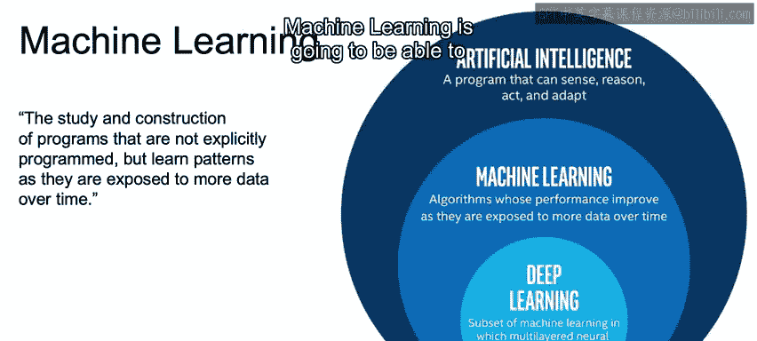
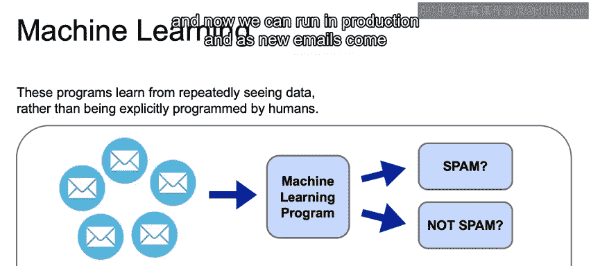
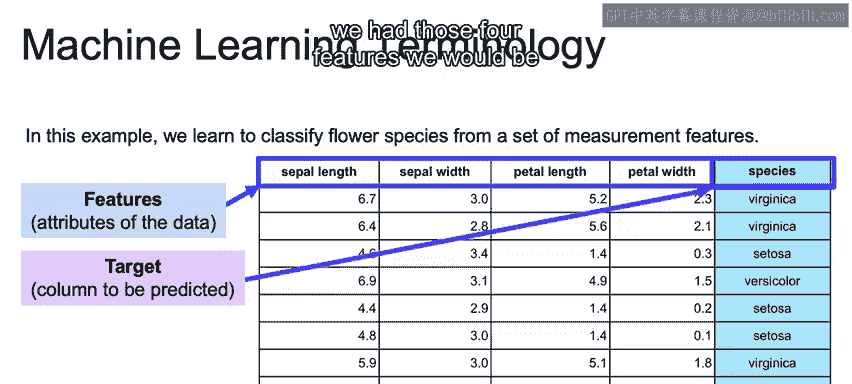
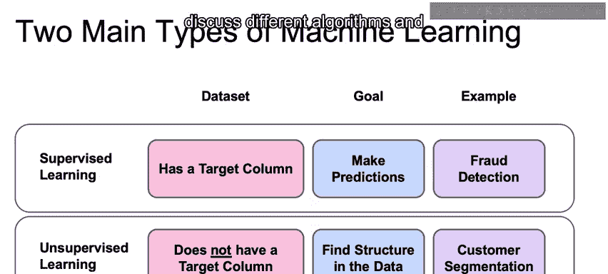
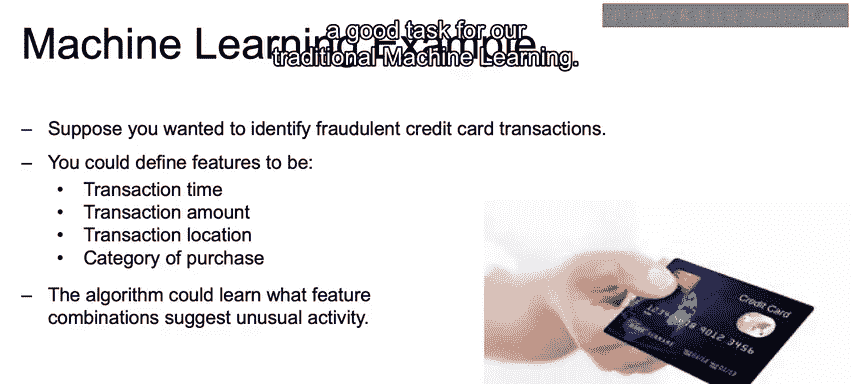
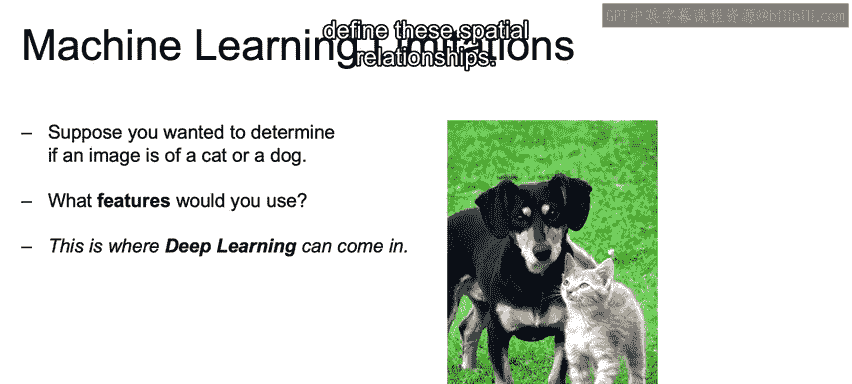
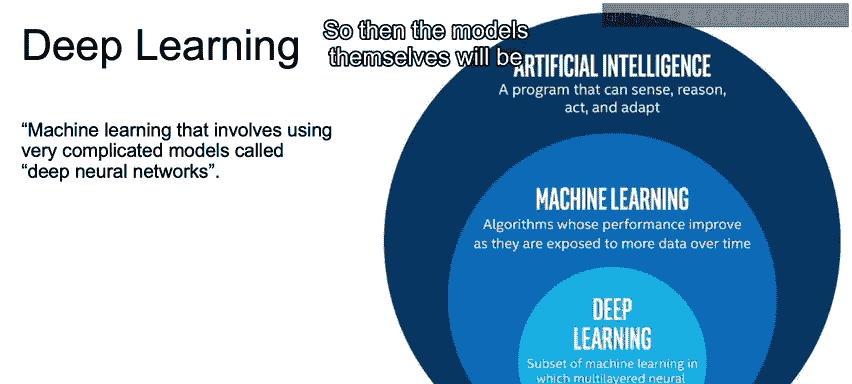
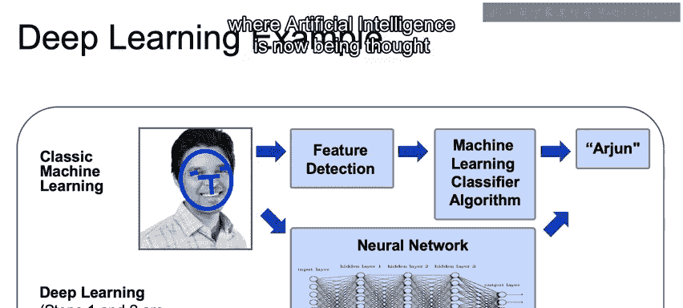

# 003：机器学习和深度学习 🧠

在本节课中，我们将要学习机器学习和深度学习的基本概念。我们将探讨它们的定义、核心区别、应用场景以及各自的特点。通过具体的例子，我们将理解机器学习如何从数据中学习模式，以及深度学习如何通过神经网络自动提取特征来解决更复杂的问题。

---

## 什么是机器学习？🤔

机器学习是研究和构建那些并非被明确编程，而是随着时间推移、接触更多数据来学习模式的程序。正如我们之前所见，机器学习是人工智能的一个子集。这个子集通过观察数据来学习，数据越多，算法就越能学习到潜在的模式。需要注意的是，这些算法的性能会达到一个平台期，即在一定量的数据之后，收益会递减。但总体而言，随着我们获得更多数据，机器学习将能更好地理解潜在模式。

这些程序通过反复处理数据来学习，而不是由人类明确编程。因此，它不是一套由人类编程的、用于决策的规则集。

---

## 机器学习示例：垃圾邮件分类 📧

例如，假设我们正在处理判断电子邮件是否为垃圾邮件的问题。我们会从一个数据集开始，其中包含许多标记为垃圾邮件或非垃圾邮件的电子邮件。这些电子邮件将被预处理，并输入到一个机器学习算法中，该算法学习垃圾邮件与非垃圾邮件的模式。它学习的电子邮件越多，模型就会变得越好。

一旦机器学习算法训练完成，我们就可以用它来预测新收到的电子邮件。因此，我们在这个带标签的数据集上进行训练，现在可以在生产环境中运行，当新邮件到来时，我们可以预测其是否为垃圾邮件。

---

## 理解特征与目标 🎯

我们将使用一个简单的数据来强调什么是特征，什么是目标。特征和目标是我们要理解的重要术语。不要被数据本身分散注意力，因为本幻灯片的主要目的只是帮助定义这些术语。

鸢尾花数据是一个常用于介绍机器学习基本概念的流行数据，但随着课程的深入，我们将转向更现实、更复杂的数据集。这里的鸢尾花是一种花，分为三个物种：弗吉尼亚鸢尾、山鸢尾和变色鸢尾。这就是我们要预测的目标。

我们的数据集包含四个特征：萼片长度、萼片宽度、花瓣长度和花瓣宽度。这些将是我们用来进行预测的特征。如前所述，目标变量是我们要预测的列。其思路是使用这四个特征来预测物种。之后，如果我们有这四个特征，我们就能在没有标签的情况下预测物种。

---

## 机器学习的类型：监督学习与无监督学习 📊

一般来说，机器学习有两种类型：监督学习和无监督学习。首先，我们来看看每种类型所需的数据集。对于监督学习，我们将有一个目标列或标签，类似于我们刚才看到的垃圾邮件分类和鸢尾花分类的例子。另一方面，对于无监督学习，我们将没有目标列，这一点稍后会更加清晰。

接下来，我们讨论监督学习和无监督学习各自的目标。监督学习的目标是能够预测那个标签：是垃圾邮件还是非垃圾邮件？是变色鸢尾还是其他花种？无监督学习的目标是在没有任何标签的情况下，发现数据的底层结构。这一点将通过我们的例子变得清晰。

监督学习的一个例子是欺诈检测。我们可能有一个大型数据集，其中标记了某些交易是欺诈，某些不是。我们将从与欺诈检测相关的所有特征中学习，并能够在新信用卡交易到来时预测它们是否为欺诈。无监督学习的一个例子是客户细分。你可以将客户细分为在数据中找到相似的群体，以便进行营销活动。你拥有这些电子商务数据，并希望将它们分成不同的组，以便有针对性地进行营销。对于无监督学习，没有正确或错误的答案。因此，用户需要测试不同的模型，看看哪些结果最合理。我们将在整个讲座中讨论实现这一任务的不同算法和技术。

---

## 传统机器学习的应用：欺诈检测 💳

假设你想识别欺诈性信用卡交易。欺诈检测是一个常见的机器学习问题。你可以将特征定义为交易时间、交易金额、交易地点、购买类别。结合所有这些特征，我们应该能够在未来根据交易时间、金额、地点和购买类别，预测是否存在异常活动，以及该交易是欺诈还是非欺诈。一般来说，这种具有直观特征的结构化数据是传统机器学习的一个良好任务。

---

## 深度学习的兴起：图像分类难题 🐱🐶

另一方面，在图像中定义特征是一项更加困难和复杂的任务，这也是传统机器学习技术局限性的一个典型问题，而深度学习现在已经很好地解决了这个问题。假设你想确定一张图片是猫还是狗。那么我们应该使用什么特征呢？对于图像，数据被当作数值数据来处理，以表示图像中每个单独像素的颜色。因此，一个像素可以作为一个特征。我们之前在数据中看到过特征，但想象一下，即使是一张小图像，也可能有256x256像素，这相当于超过65,000个像素。65,000个像素意味着65,000个特征，这是一个巨大的特征数量。

另一个问题是，将每个像素单独使用，会丢失其与周围像素的空间关系。换句话说，一个像素的信息是相对于其周围像素才有意义的。例如，构成鼻子的不同像素，或者构成眼睛的不同像素，然后根据它们在脸上的相对位置来分离它们，等等。这就是深度学习可以发挥作用的地方。深度学习技术将赋予你能力，使其能够自行学习这些特征，并通过不同的复杂组合将这些像素结合起来，定义这些空间关系。

---

## 什么是深度学习？🔍

让我们简要探讨一下什么是深度学习。深度学习是一种机器学习，涉及使用非常复杂的模型，称为深度神经网络。正如所讨论的，这就像我刚才说的，是机器学习的一个子集。

这些模型本身将能够确定我们原始数据的最佳表示。在经典机器学习中，人类必须事先提出这些特征。而深度学习将使我们能够解决复杂的问题，例如我们刚才看到的图像分类。深度学习是前沿技术，也是大多数机器学习研究的焦点。在处理大型数据集时，它的性能已经超越了其他算法。

但非常重要的一点是，你经常会处理较小的数据集，而标准的机器学习算法通常比使用深度学习技术表现更好。此外，如果数据随时间变化很大，并且你没有稳定的数据集，那么机器学习可能在实际性能上做得更好。

---

## 经典机器学习与深度学习的区别 ⚖️

让我们简要讨论一下经典机器学习技术与深度学习之间的一些区别。如前所述，在经典机器学习模型中，我们必须先验地自己定义这些特征，然后再将数据输入到我们的实际模型中。例如，确定构成鼻子、眼睛等的特征。然后，我们可以使用这些特征，并将它们包含在机器学习算法中。如果数据科学家幸运的话，他们可能能够猜出好的特征，但这确实很难做好。然后，他们可以用它来预测这是一张猫的图片。

深度学习将结合这两个步骤。神经网络接收图像的这些像素作为输入。神经网络通过学习如何从图像中提取有意义的特征，通过不同的复杂组合将它们结合在一起。现在，当我们试图解释这些中间层的特征时，它们可能并不总是很有意义。但理想情况下，它们会首先突出边缘，然后将这些边缘组合起来，形成像鼻子、眼睛、嘴唇这样的形状。但无论中间步骤是否可解释，它们对于完成诸如图像分类等任务都非常有用，并最终预测出我们的目标。

---

## 总结 📝

本节课中，我们一起学习了机器学习和深度学习的基本概念。我们了解了机器学习如何通过数据学习模式，以及深度学习如何利用神经网络自动提取特征来解决图像分类等复杂问题。我们还探讨了监督学习与无监督学习的区别，以及传统机器学习与深度学习在不同场景下的适用性。在下一节中，我们将开始回顾人工智能的历史，深入了解我们是如何达到今天这个人工智能被视为“新电力”的历史节点的。