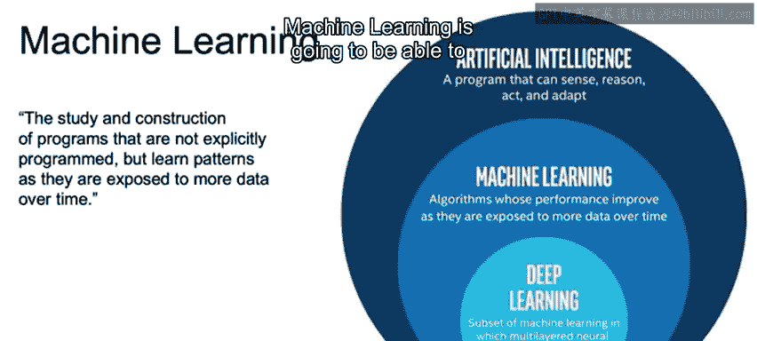
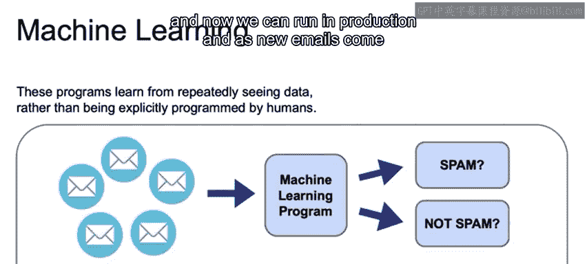
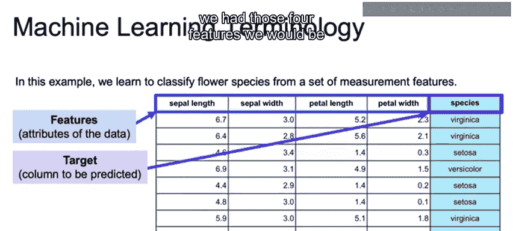
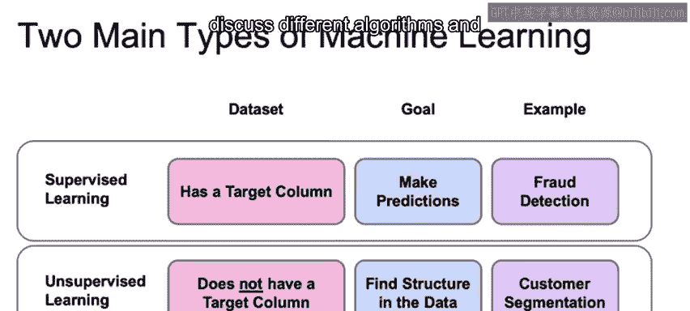
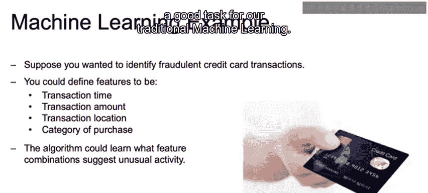

# 004：机器学习与深度学习基础（第一部分）🧠

在本节课中，我们将要学习机器学习的核心概念，包括其定义、基本组成部分、主要类型以及一个实际应用案例。我们将通过简单的例子和清晰的解释，帮助初学者理解机器学习是如何工作的。

---

## 什么是机器学习？🤔

机器学习是研究和构建那些并非被显式编程，而是随着时间推移暴露于更多数据时学习模式的程序。

正如我们之前所见，机器学习是人工智能的一个子集。这个子集通过观察数据来学习。数据越多，算法就越能学习到潜在的模式。

需要注意的是，这些算法的性能会达到一个平台期，这意味着在数据量达到一定程度后，收益会递减。但总体而言，随着我们获得更多数据，机器学习将能更好地理解潜在模式。

这些程序通过反复接触数据来学习，而不是由人类进行显式编程。因此，决策并非基于人类编程的一套固定规则。

---

## 一个例子：垃圾邮件过滤 📧

例如，假设我们正在处理判断电子邮件是否为垃圾邮件的问题。

我们会从一个数据集开始，其中包含大量被标记为“垃圾邮件”或“非垃圾邮件”的电子邮件。这些电子邮件经过预处理后，被输入到一个机器学习算法中。该算法学习区分垃圾邮件与非垃圾邮件的模式。它用于学习潜在模式的电子邮件越多，模型就会变得越好。

一旦机器学习算法训练完成，我们就可以用它来预测新收到的电子邮件。我们在已标记的数据集上进行训练，然后就可以在生产环境中运行。当新邮件到来时，我们可以预测其是否为垃圾邮件。

---

## 理解特征与目标 🎯

我们将使用一个简单的数据来阐明什么是特征，什么是目标。特征和目标是需要我们理解的重要术语，请不要被数据本身分散注意力，因为本部分的主要目的只是帮助定义这些术语。

鸢尾花数据集是一个常用于介绍机器学习基本概念的流行数据集，但随着课程的深入，我们将转向更现实、更复杂的数据集。

这里的鸢尾花是一种花卉，分为三个物种：弗吉尼亚鸢尾、山鸢尾和变色鸢尾。**预测物种**就是我们的**目标**。

我们的数据集包含四个**特征**：萼片长度、萼片宽度、花瓣长度和花瓣宽度。这些将是我们用于进行预测的特征。

如前所述，**目标变量**是我们试图预测的列。其核心思想是使用萼片长度、萼片宽度、花瓣长度和花瓣宽度这四个特征来预测物种。之后，如果我们有了这四个特征，即使没有标签，我们也能够预测物种。

---

## 机器学习的两种主要类型 🔄

总的来说，机器学习有两种类型：**监督学习**和**无监督学习**。

首先，我们来看看每种类型所需的数据集。对于监督学习，我们将有一个目标列或标签，类似于我们刚才在垃圾邮件分类和鸢尾花分类例子中看到的那样。另一方面，对于无监督学习，我们将没有目标列。这一点稍后会更加清晰。

接下来，我们讨论监督学习和无监督学习各自的目标。

监督学习的目标是能够预测那个标签：是垃圾邮件还是非垃圾邮件？是变色鸢尾还是其他不同种类的鸢尾花？

无监督学习的目标是在没有任何标签的情况下，发现数据的底层结构。通过我们的例子，这一点将变得清晰。

---

### 监督学习示例：欺诈检测 🕵️

监督学习的一个例子是欺诈检测。我们可能有一个大型数据集，其中包含“此交易是欺诈”和“此交易不是欺诈”的标签。我们将从与欺诈检测相关的所有特征中学习，并能够在新信用卡交易到来时，预测它们是否为欺诈。

### 无监督学习示例：客户细分 👥

无监督学习的一个例子是客户细分。你可以将客户细分为在营销活动中寻找数据内的相似分组。你拥有这些电子商务数据，并希望将它们分成不同的组，以便进行相应的目标营销。

对于无监督学习，没有正确或错误的答案。因此，用户需要测试不同的模型，看看哪些结果往往最有意义。我们将在专门讨论不同算法和技术以完成此任务的整个讲座中深入探讨这一点。

---

## 应用案例：识别欺诈性信用卡交易 💳

假设你想识别欺诈性信用卡交易。检测欺诈是一个常见的机器学习问题。

你可以将特征定义为：交易时间、交易金额、交易地点、购买类别。将这些特征组合在一起，未来我们应该能够根据交易时间、金额、地点和购买类别，预测是否存在异常活动，以及该交易是欺诈还是非欺诈。

一般来说，这种具有直观特征的结构化数据，是我们传统机器学习的一个良好任务。

---

## 总结 📝

本节课中，我们一起学习了机器学习的核心定义：它是通过数据学习模式，而非显式编程的程序。我们理解了**特征**（用于预测的输入变量）和**目标**（我们试图预测的输出变量）的概念。我们探讨了机器学习的两种主要类型：**监督学习**（有标签数据，用于预测）和**无监督学习**（无标签数据，用于发现结构）。最后，我们通过垃圾邮件过滤和欺诈检测等例子，看到了这些概念在实际问题中的应用。