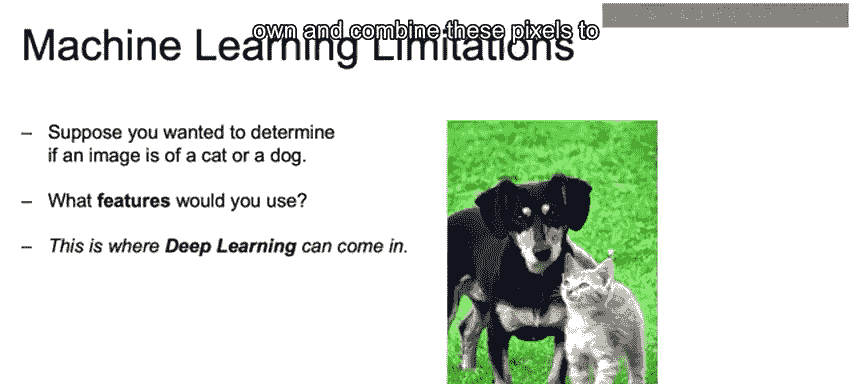
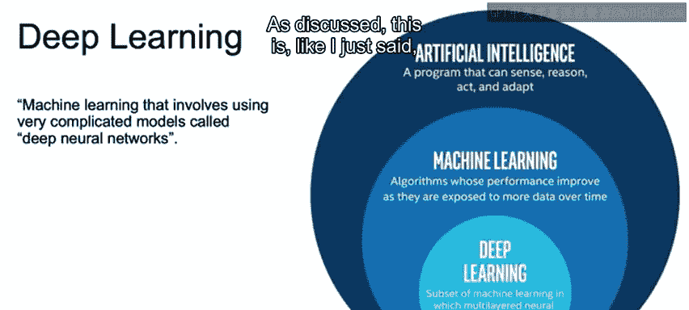
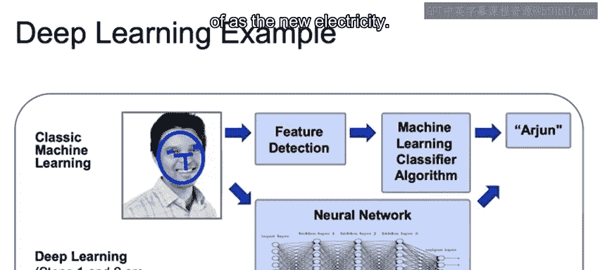

# 005：机器学习与深度学习基础（第2部分） 🧠

## 概述

在本节课中，我们将学习深度学习的基本概念，并探讨它与传统机器学习在图像识别等复杂任务上的核心区别。我们将重点理解为什么深度学习在处理图像数据时具有优势，以及它在特征提取方面的独特能力。

---

## 图像特征定义的挑战 🖼️

上一节我们介绍了传统机器学习中特征工程的重要性。本节中我们来看看，当处理图像数据时，定义特征会变得异常复杂。

在图像中定义特征是一项困难且复杂的任务。这曾是传统机器学习技术的主要限制之一，而深度学习目前已能较好地解决这个问题。

假设你想判断一张图片是猫还是狗。我们应该使用什么特征？

对于图像，数据被视为数值数据，代表图像中每个独立像素的颜色。因此，一个像素可以被视为一个特征。

但即使是一张小图像，也可能有 `256 x 256` 像素，总计超过 65,000 个像素。这意味着有 65,000 个特征，这是一个巨大的数量。

另一个问题是，将每个像素单独使用，会丢失其与周围像素的空间关系。换句话说，一个像素的信息需要结合其周围的像素才有意义。

例如，构成鼻子的不同像素，或构成眼睛的不同像素，需要根据它们在脸部的位置关系来区分和组合。

---

## 深度学习的介入 🤖

这正是深度学习可以发挥作用的地方。深度学习技术能够自动学习这些特征，并通过组合像素来定义这些空间关系。

以下是深度学习的一个简要图示：

让我们简要了解一下什么是深度学习。深度学习是机器学习的一个分支，它涉及使用被称为深度神经网络的复杂模型。

正如之前提到的，深度学习是机器学习的一个子集。

因此，模型本身将能够确定原始数据的最佳表示方式。

在经典机器学习中，人类必须手动设计这些特征。而深度学习使我们能够解决复杂问题，例如我们刚才看到的图像分类。

深度学习是前沿技术，也是当前大多数机器学习研究的焦点。在处理大型数据集时，它的性能远超其他算法。

但必须注意，你通常处理的是较小的数据集，此时标准机器学习算法的表现往往显著优于深度学习技术。

此外，如果数据随时间变化很大，且没有稳定的数据集，机器学习可能在实际应用中随时间推移表现出更好的性能。

---

## 经典机器学习与深度学习的区别 ⚖️

让我们简要讨论一下经典机器学习技术与深度学习之间的一些区别。

在经典机器学习模型中，我们需要在将数据输入模型之前，自行优先定义这些特征。例如，确定构成鼻子、眼睛等的特征。

然后，我们可以使用这些特征，并将其包含在机器学习算法中。如果数据科学家幸运，他们或许能猜出好的特征，但这很难做好。然后他们可以用它来预测这是一张Arn的图片。

而深度学习则将这两个步骤结合起来。

神经网络接收图像的像素作为输入。神经网络通过学习如何以不同的复杂组合方式提取图像中有意义的特征。

当我们试图解释这些中间层的特征时，它们可能并不总是有明确的意义。但理想情况下，它们会首先突出边缘，然后组合这些边缘以构成形状，如鼻子、眼睛、嘴唇。

无论中间步骤是否可解释，它们对于完成图像分类等任务、进行中间特征工程步骤，并最终预测我们的目标Z，都非常有用。

---

## 总结

本节课中，我们一起学习了深度学习如何解决图像特征提取的难题。我们了解到，深度学习通过神经网络自动学习特征和空间关系，从而在图像识别等复杂任务上超越了需要手动设计特征的传统机器学习方法。同时，我们也认识到两种方法各有其适用的场景。

---

## 下节预告

本节的讲解到此结束。在下一节中，我们将回顾人工智能的历史，深入了解我们是如何走到今天这个人工智能被视为“新电力”的历史节点的。

